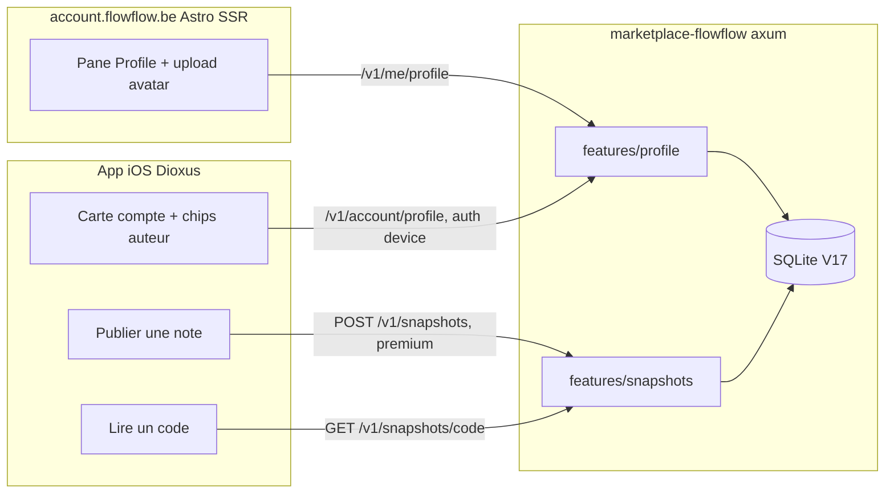
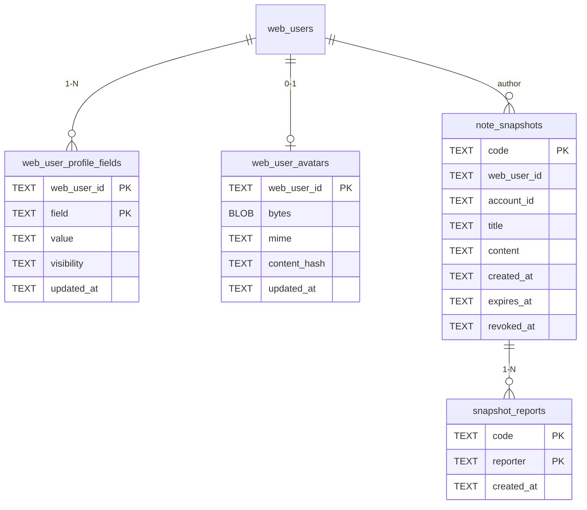
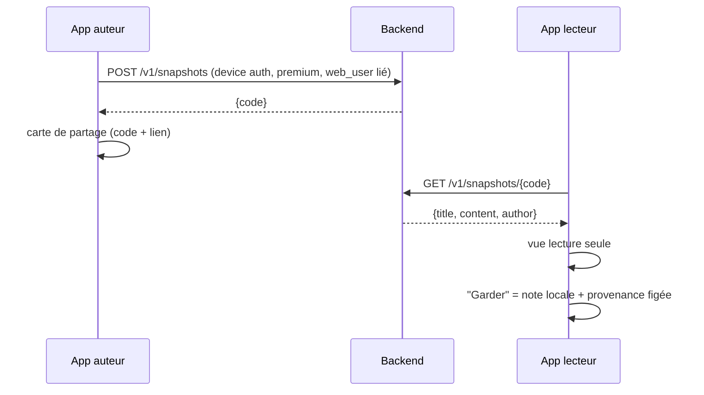
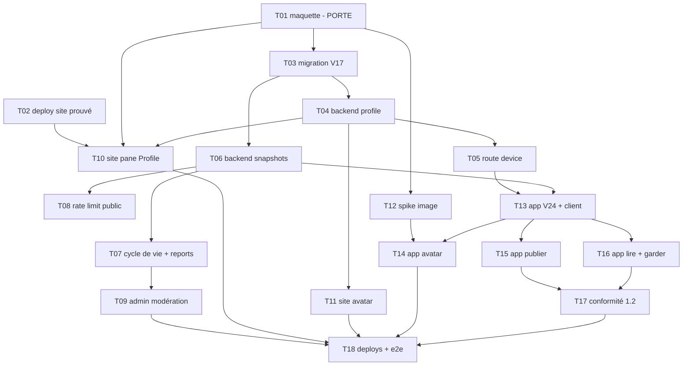

# 0001 : Person profiles: avatar, identity fields, public note snapshots

## 1. Résumé

**Problème:** le compte va devenir visible par d'autres (shared
folders) alors qu'une personne n'a ni visage ni identité contrôlable
dans le produit, et qu'aucune note ne peut être lue hors du compte.

**Recommandation:** profil serveur à visibilité par champ (table KV
chiffrement-ready, clair en v1, e2e en v2 avec les groupes) +
snapshots de notes publics par code court, en clair serveur car
publics par intention et modérables. Maquette HTML sur les vrais
tokens du site, validée AVANT tout code. Confiance haute (profils) /
moyenne (snapshots, première surface publique).

**Impact:** deux repos, ~19 modules, aucune route cassée (tout est
additif), migration backend V17 + migration app V24, 18 tâches,
9-10 jours d'ingénierie hors review App Store. Revue adversariale:
7 bloquants et 14 majeurs détectés puis absorbés (section 11).

## 2. Contexte et code existant

Deux dépôts. Rien n'existe pour les profils ni les snapshots publics:
greenfield sur ces deux surfaces, mais le socle identité est en prod.

### Backend (`marketplace-flowflow`, Rust axum)

- `src/features/accounts/routes.rs` (21 Ko): lectures dashboard
  `/v1/me/*` (devices, entitlements, connections, requests,
  login-events, agents), toutes derrière l'extracteur `WebUser`;
  compte non lié = réponse vide, jamais une erreur.
- `src/features/` est organisé par feature (accounts, admin, agents,
  auth, catalog, connectors, entitlements, mcp_admin, requests):
  le futur `features/profile/` suit ce moule.
- `src/db/migrations.rs`: `web_users` (V8: id, email, display_name,
  role), `webauthn_credentials`, `web_user_accounts` (lien
  web_user -> account cluster), `web_sessions`, `login_events`,
  `devices.name` (V16, poussé par `POST /v1/device/name`).
- Passkeys épinglées `RP_ID=flowflow.be`, multi-origine
  (admin.flowflow.be + account.flowflow.be).

### Site account (`flowflow/account/`, Astro SSR, account.flowflow.be)

- `src/components/Dashboard.astro` (365 lignes): 5 panes (overview,
  devices, services, billing, security), candidat naturel pour un
  pane Profile.
- `src/components/Avatar.astro`: monogramme pur (initiale du nom),
  aucun support photo.
- `src/lib/api.ts`: fetchers typés sur `/v1/me/*` via cookie SSR.
- Design system: Tailwind v4 + `src/styles/tokens.css` (warm-white,
  échelle stone, accent orange oklch, Clash Grotesk + Instrument
  Serif), classes pane dans `styles/beta.css`, i18n EN/FR dans
  `src/i18n/*/account.json`.

### App iOS (`flowflow`, Rust Dioxus)

- `src/ui/settings/account.rs` (570 lignes): carte compte; le slot
  avatar est un monogramme en attente d'une photo.
- `src/application/authorship.rs`: `author_label()` retourne le nom
  de l'auteur seulement si la note vient d'un AUTRE device
  (`note.author_device`, V23); les chips auteur en découlent.
- `src/domain/note.rs:118`: `author_device: Option<String>`.

### Antériorité

- Issue marketplace#86: brief d'entrée de cette proposal (problème,
  hypothèse v1/v2, critères de vérification).
- RFC 0025 (identity and customer account site): socle passkey +
  `/v1/me/*` + site account, shipped.
- RFC 0026 (premium account spread): premium se propage au pairing,
  shipped.
- RFC 0027 réservé informellement aux shared themes; cette proposal
  est sa jumelle et doit atterrir AVANT le membership.
- Exploration design du 2026-08-22 (artifact Claude): modèle de
  visibilité par champ, deux mockups (page profil à pills de
  visibilité, carte de partage public). À régénérer si perdu.

## 3. Problème et motivation

### État actuel

Le compte est sur le point de devenir visible par d'autres personnes
(les shared folders sont le prochain grand chantier), et une personne
n'a ni visage ni identité contrôlable nulle part dans le produit:

- Le dashboard et l'app affichent devices et auteurs en monogrammes
  ou en ids base64 tronqués (`Avatar.astro` = initiale pure,
  `author_label()` = nom de device). Le slot avatar de la carte
  compte (`src/ui/settings/account.rs`) a été dessiné pour recevoir
  une photo plus tard.
- Une personne ne peut rien présenter d'elle-même: pas de photo, pas
  de bio, pas de liens sociaux (X, LinkedIn, Instagram, email public,
  site), et aucun choix de qui voit quoi.
- La connaissance ne sort pas du compte: aucune note ne peut être lue
  par un autre utilisateur de l'app via un code court ou un lien.

### Douleur

Tout utilisateur qui s'apprête à partager: face à un futur membre de
groupe, il n'est qu'un id de device. Et tout utilisateur qui veut
montrer une note à quelqu'un doit copier-coller le texte hors de
l'app, sans lien vivant vers la source.

### Pourquoi maintenant

Cette RFC doit atterrir AVANT que le membership (shared folders) ne
soit livré: si les groupes arrivent sans identité, l'UX de partage
naît infirme (des ids en face de chaque note partagée) et le schéma
profil risque d'être bricolé après coup, sans la visibilité par
champ qui conditionne le passage au chiffrement.

### Signaux

- Pas de métrique: le manque est structurel (la capacité n'existe
  pas), observable dans le code cité en section 2.

## 4. Objectifs et non-objectifs

### Objectifs

- Une personne se présente: photo, nom d'affichage, bio, liens
  sociaux, avec une visibilité PAR CHAMP (private / my groups /
  public) choisie par elle, éditée dans un pane Profile du
  dashboard. En v1, la seule surface où `public` est réellement
  servi à un tiers est l'identité de l'auteur sur un snapshot
  publié; le pill `groups` est visible mais marqué "à venir".
- L'app affiche la photo d'avatar à la place du monogramme sur la
  carte compte, avec repli monogramme. Les chips auteur gardent le
  nom de device en v1 (un avatar unique par cluster les rendrait
  toutes identiques); la photo y viendra avec les shared folders.
- Une note publiée s'ouvre en lecture seule depuis un code court
  dans un autre compte, et peut être gardée dans la base locale du
  lecteur (copie définitive, avec provenance affichée); publication
  révocable, expiration OBLIGATOIRE avec plafond par défaut.
- Le schéma est additif pour le chiffrement v2: visibilité par
  champ dès le premier schéma, champs en table clé-valeur où un
  ciphertext remplace une valeur sans reshape. Dette actée en
  section 7: l'avatar blob et le rendu SSR restent à traiter en v2.
- Maquette HTML validée avant toute ligne de code, construite sur
  les vrais tokens du site: page profil, avatar dans l'app, carte
  de partage public.

### Non-objectifs

- On ne LIVRE PAS le chiffrement e2e des profils en v1: il exige le
  canal de distribution de clés des shared folders, qui n'existe pas
  encore. On le prépare, on ne l'implémente pas.
- On ne construit PAS de graphe social: pas de follow, pas d'amis,
  pas de feed, pas de découverte de profils.
- On ne construit PAS de modération au-delà de report + revoke
  admin (raison du premium-gating des snapshots publics).
- On ne livre PAS les shared folders ici: chantier frère, RFC à lui.
- Pas d'édition collaborative ni de partage live: un snapshot est
  figé à la publication, par sémantique.
- Pas de page profil publique en v1: le profil d'un tiers ne se
  consulte pas; seuls le nom et la photo marqués `public`
  accompagnent un snapshot.
- Pas de mot de passe optionnel sur un snapshot en v1: l'entropie
  du code porte l'accès (un mot de passe humain exigerait un KDF
  dédié pour une protection marginale).

## 5. Alternatives envisagées

Deux axes indépendants: où vit le profil (A), comment une note
devient lisible par un autre compte (B).

### Axe A : stockage du profil

#### Alt A0 : statu quo

**Résumé:** rien ne change, monogrammes et ids partout.
**Coût de l'inaction:** les shared folders arrivent avec des ids de
device en face de chaque note partagée; le profil sera bricolé après
coup, sous pression, sans le modèle de visibilité.
**Pour:** zéro effort. **Contre:** la douleur de la section 3 reste
entière, et le coût du bricolage tardif est supérieur.

#### Alt A1 : profil serveur en clair, visibilité par champ (v2 chiffre)

**Résumé:** `features/profile/` côté backend; les champs vivent en
clair côté serveur, chacun porte `private|groups|public`; avatar en
blob borné servi par l'API. La v2 chiffre les champs `groups` façon
Signal quand le canal des shared folders existe.
**Comment ça résout:** le site édite et affiche le profil, l'app
récupère l'avatar, les champs publics sont servables au monde.
**Pour:**
- Simple, livrable maintenant, aucune dépendance au chantier groupes.
- Les champs `public` doivent de toute façon être en clair serveur:
  un profil public ne se chiffre pas pour le monde entier.
- La visibilité par champ dès le jour 1 rend la migration v2
  additive (colonnes ciphertext), pas destructrice.
**Contre:**
- Un champ marqué `private` ou `groups` est quand même lisible par
  le serveur en v1: promesse de confidentialité = politique, pas
  cryptographie.
- Si la v2 tarde, cet état provisoire devient l'état permanent.
**Coût:** M (schéma + routes + pane + app). **Réversibilité:**
facile, la v2 est prévue par construction.
**Références:** Signal décrit exactement ce modèle comme le
"straightforward way" et ses limites
(signal.org/blog/signal-profiles-beta).

#### Alt A2 : chiffrement e2e façon Signal dès le jour 1

**Résumé:** profile key générée sur le device, champs chiffrés
AES-GCM, serveur = ciphertext seulement; la clé est distribuée aux
membres via le canal de messagerie (Signal Private Group System,
eprint 2019/1416).
**Pour:**
- Confidentialité maximale immédiate, état de l'art.
**Contre:**
- Le canal de distribution de la clé N'EXISTE PAS: c'est le chantier
  shared folders. Construire le canal ici = avaler l'autre RFC.
- Les champs `public` restent en clair de toute façon: le e2e ne
  couvre que `groups`, pour des groupes qui n'existent pas encore.
- Le site account (SSR) devrait déchiffrer en navigateur: clé en
  session web, surface d'attaque nouvelle, effort XL.
**Coût:** XL, bloqué par une dépendance externe. **Réversibilité:**
sans objet, c'est la cible v2 de toute façon.
**Références:** signal.org/blog/signal-profiles-beta,
eprint.iacr.org/2019/1416.

#### Alt A3 : les champs privés ne quittent jamais le device

**Résumé:** seuls les champs `groups` et `public` sont uploadés; un
champ `private` vit en SQLite local, point.
**Pour:**
- Le serveur ne détient RIEN qui ne soit pas destiné à être partagé:
  promesse simple et vraie, sans crypto.
- Compatible avec A1 pour ce qui est uploadé.
**Contre:**
- Le pane Profile du site ne peut ni afficher ni éditer les champs
  privés: édition scindée entre app et site, UX incohérente.
- Un champ qui passe de `private` à `groups` doit être poussé par
  le device: état divergent si le device est hors ligne.
**Coût:** M, plus la synchronisation d'états. **Réversibilité:**
facile.

### Axe B : snapshots publics de notes

#### Alt B0 : pas de snapshots (profils seulement)

**Résumé:** on coupe la moitié du brief.
**Coût de l'inaction:** la connaissance reste enfermée; le critère
de vérification de l'issue #86 n'est pas atteignable.

#### Alt B1 : snapshot en clair serveur + code court

**Résumé:** publier fige le contenu de la note côté serveur; un code
court (entropie forte) l'ouvre en lecture seule; revoke + expiry +
mot de passe optionnel; premium-gated.
**Pour:**
- Le lecteur dans l'app ET un navigateur peuvent lire sans magie.
- La modération est POSSIBLE: le serveur peut lire ce qu'on lui
  signale, l'admin peut vérifier puis révoquer. C'est la raison du
  premium-gating énoncée dans le brief.
- "Garder dans ma base" = simple fetch du contenu.
**Contre:**
- Le serveur détient du contenu de notes en clair: changement de
  posture pour un produit local-first.
- Un code qui fuite expose le contenu jusqu'au revoke.
**Coût:** M. **Réversibilité:** facile (delete = gone).
**Références:** W3C capability URLs
(w3.org/TR/capability-urls) pour les règles d'URL non devinables.

#### Alt B2 : capability URL, clé dans le fragment (serveur aveugle)

**Résumé:** le device chiffre le snapshot (AES-GCM, clé fraîche),
uploade le ciphertext; la clé voyage dans le fragment `#k=` que le
navigateur n'envoie jamais au serveur. Pattern Excalidraw /
Firefox Send / Bitwarden Send.
**Pour:**
- Zero-knowledge: un serveur compromis ne révèle rien.
- Cohérent avec la posture local-first et la cible e2e v2.
**Contre:**
- La modération devient impossible: le serveur ne peut pas vérifier
  un signalement (il ne voit que du ciphertext), l'argument même du
  premium-gating tombe mais l'abus reste (héberger du ciphertext
  illégal sans pouvoir le constater).
- Le "code court" tapé dans l'app doit transporter code ET clé:
  soit une URL longue, soit un code qui n'est plus court.
- Lecture web = déchiffrement navigateur (Web Crypto), pas de SSR.
**Coût:** L. **Réversibilité:** moyenne (le schéma blob reste, la
sémantique d'accès change).
**Références:** plus.excalidraw.com/blog/end-to-end-encryption,
irq5.io (Firefox Send), reapps.eu (snapshots zero-knowledge,
96 bits slug + 256 bits clé).

#### Alt B3 : P2P sans hébergement serveur

**Résumé:** le device du lecteur va chercher le snapshot chez le
device de l'auteur.
**Contre (rédhibitoire):** iOS n'autorise pas de serveur inbound
persistant (contrainte déjà actée pour l'agentique); auteur hors
ligne = lien mort. Écarté comme non viable, mentionné pour mémoire.

## 6. Conception retenue

Base déclarée: **A1 pour les profils** (clair serveur, visibilité
par champ, schéma additif pour le chiffrement v2) + **B1 pour les
snapshots** (clair serveur + code court): un snapshot est PUBLIC
par intention, le clair serveur y est sémantiquement juste et c'est
ce qui rend la modération possible, raison du premium-gating. B2
(clé en fragment) reste la voie documentée si la posture change.
Conception révisée après la revue adversariale (section 11): tous
les BLOCKER et MAJOR y sont absorbés.

### Vue d'ensemble

### Modèle de données (migration V17, backend)

Les champs de profil vivent en table clé-valeur, pas en colonnes:
c'est le terrain du chiffrement. En v2, chiffrer un champ = remplir
`ciphertext` et vider `value`, migration additive, aucun reshape.

- FK réelles avec `ON DELETE CASCADE` depuis `web_users` sur les
  quatre tables (contrairement à `web_user_accounts`, historique):
  la suppression du web user emporte profil, avatar et snapshots.
  La dissolution d'un account (`leave` du dernier device) révoque
  ses snapshots et nettoie le lien `web_user_accounts` mort, pour
  que le relink ne retombe pas en 409.
- `field` est un enum Rust fermé: `display_name`, `bio`,
  `public_email`, `website`, `x`, `linkedin`, `instagram`, `avatar`
  (la ligne `avatar` ne porte que la visibilité; les octets vivent
  dans `web_user_avatars`). URLs sociales validées et normalisées
  côté serveur.
- `visibility` CHECK `private|groups|public`. Sémantique v1:
  `groups` se comporte comme `private` tant que les shared folders
  n'existent pas; le serveur ne sert `groups` à personne. Le pill
  est visible mais inerte ("à venir"). Le jour où les groupes
  arrivent, seule l'autorisation change, pas le schéma.
- Avatar: envoyé en JSON base64 borné (pas de multipart, moule JSON
  existant), 256 Ko max re-vérifiés serveur, mime
  `image/jpeg|png|webp` vérifié par magic bytes, re-encodé via
  crate image (strip EXIF/GPS). `content_hash` sert
  l'invalidation de cache côté app.
- Publier EXIGE un web_user lié au cluster: l'auteur d'un contenu
  public a une identité (email connu). `web_user_id` est l'auteur,
  `account_id` le cluster publieur.
- `expires_at` OBLIGATOIRE, plafond par défaut; un job de purge
  efface le contenu expiré (la ligne reste pour répondre). Au plus
  UN code actif par note: republier remplace, supprimer la note
  localement propose le revoke.
- Quota par compte: nombre de snapshots actifs et octets cumulés
  bornés à la publication (valeurs en Q2).
- `code` = 16 caractères base64url (96 bits, `crypto rand`), règles
  W3C capability URLs: jamais séquentiel, HTTPS, `Referrer-Policy:
  no-referrer`, `Cache-Control: no-store`, codes masqués des logs.
- `content` est un SNAPSHOT figé (titre + texte au moment de la
  publication), jamais une vue live de la note.
- `snapshot_reports` remplace l'usage d'`admin_audit` pour les
  signalements (dont `actor` est NOT NULL côté admin): un report
  est authentifié (device ou session web), dédupliqué par
  signalant, et ne masque JAMAIS automatiquement.

### Contrats API (tous nouveaux, aucun breaking change)

Plan web (session `WebUser`, moule `/v1/me/*` existant):

| Route | Corps / retour |
| --- | --- |
| `GET /v1/me/profile` | tous les champs + visibilités du user |
| `PUT /v1/me/profile` | upsert partiel `{field: {value, visibility}}`, CSRF `x-csrf-token` comme toute mutation `/v1/me` |
| `GET /v1/me/profile/avatar` | octets + mime (affichage du pane) |
| `PUT /v1/me/profile/avatar` | `{data_base64, mime}`, 256 Ko max |
| `DELETE /v1/me/profile/avatar` | retire la photo |

Plan device (auth Ed25519 existante, moule `POST /v1/device/name`):

| Route | Corps / retour |
| --- | --- |
| `GET /v1/account/profile` | champs `groups|public` + `avatar_hash` du web user lié au cluster; 404 propre si compte non lié (l'app affiche alors un chemin visible vers le link) |
| `GET /v1/account/profile/avatar` | octets si `avatar_hash` a changé |
| `POST /v1/snapshots` | `{title, content, expires_at}`, premium + web_user lié requis, quota vérifié, retourne `{code}` |
| `DELETE /v1/snapshots/{code}` | revoke par le compte auteur |
| `POST /v1/snapshots/{code}/report` | report authentifié device |

Plan public (aucune auth, seau de rate limit DÉDIÉ, distinct des
seaux auth existants):

| Route | Corps / retour |
| --- | --- |
| `GET /v1/snapshots/{code}` | `{title, content, author?, created_at}`; réponse UNIQUE indistinguable (404) pour inexistant, révoqué et expiré |

`author` est dérivé exclusivement des champs de profil marqués
`public` (display_name, avatar), repli anonyme sinon. Le report
côté web passe par la session `WebUser`.

Modération admin (vraie surface, pas "une action de plus"): routes
+ vue SPA listant les snapshots signalés, lecture auditée du
contenu, revoke unitaire et revoke global (arrêt d'urgence).

### Modules touchés

| Chemin | Changement | Pourquoi |
| --- | --- | --- |
| `marketplace/src/features/profile/` | nouveau (mod, routes, repo) | moule `features/accounts/` |
| `marketplace/src/features/snapshots/` | nouveau | publication + lecture + report + purge |
| `marketplace/src/db/migrations.rs` | V17 | 4 tables ci-dessus |
| `marketplace/src/lib.rs` | modifié | montage des routes |
| `marketplace/src/ratelimit.rs` | modifié | seau dédié au plan public |
| `marketplace/src/features/accounts/routes.rs` | modifié | `leave` révoque snapshots + nettoie le lien web_user |
| `marketplace/src/features/admin/` + `admin/src/` | modifié | file de reports, revoke unitaire et global |
| `marketplace/Cargo.toml` | modifié | crate image (re-encode, EXIF) |
| `account/src/components/Dashboard.astro` | modifié | pane Profile (6e pane) |
| `account/src/components/Profile.astro` | nouveau | champs + pills visibilité + upload |
| `account/src/components/Avatar.astro` | modifié | photo si présente, initiale sinon |
| `account/src/lib/api.ts` + `src/scripts/` | modifié | fetchers profile + CSRF |
| `account/src/i18n/*/account.json` | modifié | clés EN/FR du pane |
| `flowflow/src/infrastructure/persistence/` | modifié | migration app V24: code publié, expiry, provenance des notes gardées (backup + sync inclus) |
| `flowflow/src/infrastructure/backend/` | modifié | client profile + snapshots |
| `flowflow/src/ui/settings/account.rs` | modifié | photo sur la carte compte |
| `flowflow/src/ui/notes/detail/` | modifié | action Publier + carte de partage + revoke |
| `flowflow/src/ui/` + `state.rs` + `app/router.rs` | modifié | vue "ouvrir un code": navigation, lecture seule, garder |

Les chips auteur (`note_card.rs`, `authorship.rs`) ne bougent PAS
en v1 (finding 9): l'avatar y viendra avec les shared folders.

### Flux snapshot (publication -> lecture -> garde)

"Garder dans ma base" crée une note locale qui repasse par le
pipeline d'embedding existant, avec une provenance FIGÉE (nom
d'auteur, code source, date de capture) portée par la migration app
V24 et affichée sur la note. Si la source ne répond plus (auteur
supprimé, snapshot révoqué ou expiré), la provenance s'affiche en
GRISÉ: la copie reste, l'auteur est montré comme parti. Même
principe retenu pour les futurs groupes (membre parti = nom grisé),
à charge de la RFC shared folders.

### Transverse

- Avatar dans l'app: `avatar_hash` comparé au boot, octets
  téléchargés seulement s'il change, cache fichier local, repli
  monogramme hors ligne ou sans photo. L'affichage d'une image
  runtime dans la webview (data URI vs handler custom) est un
  terrain non éprouvé: spike dédié avant l'implémentation.
- Rate limiting: seau DÉDIÉ au plan public (l'existant est un seau
  global par IP qui serait partagé avec l'auth), et l'entropie du
  code reste la défense primaire contre l'énumération, pas le rate
  limit.
- `admin_audit` trace revoke admin et lectures de modération;
  les signalements vivent dans `snapshot_reports`.
- i18n EN/FR systématique (site et app).
- Conformité App Store 1.2 (contenu généré par les utilisateurs):
  signalement DANS l'app, blocage d'un auteur, CGU + contact,
  privacy labels mis à jour (photo, contenu utilisateur).
- Aucun feature flag: les routes sont additives, le pane n'apparaît
  qu'avec la feature livrée.

## 7. Inconvénients et risques

### Inconvénients (inhérents)

- Le serveur détient du contenu de notes en clair (snapshots): un
  produit jusque-là local-first se met à héberger du contenu
  utilisateur public. C'est voulu et assumé, mais c'est une
  responsabilité nouvelle (modération, signalements, retraits).
- En v1, un champ `private` ou `groups` est lisible par le serveur:
  la confidentialité est une politique, pas une garantie
  cryptographique, jusqu'à la v2.
- La préparation du chiffrement est un SCHÉMA ADDITIF, pas plus:
  l'avatar (blob hors KV) n'a pas de chemin ciphertext, et le rendu
  SSR du site devra être repensé quand la v2 chiffrera (déchiffrer
  en navigateur). Dette explicite, reprise par la RFC shared
  folders.
- Avatars en blob SQLite: la base backend grossit, les backups avec
  (quota par compte en garde-fou).
- Un seul avatar par cluster: l'identité est au niveau compte, pas
  device. Correct (un cluster = une personne) mais à savoir.
- Publier exige un compte web lié: l'utilisateur TOFU pur ne peut
  pas publier tant qu'il n'a pas créé son compte passkey. Assumé:
  c'est ce qui rend l'auteur identifiable.

### Risques (probabilistes)

| Risque | Probabilité | Impact | Mitigation |
| --- | --- | --- | --- |
| Énumération / scraping des codes snapshot | faible | moyen | 96 bits d'entropie (défense primaire), seau public dédié, réponse 404 indistinguable, no-referrer, no-store, codes hors logs |
| Contenu abusif ou illégal publié | moyenne | fort | web_user lié requis (auteur identifié), report authentifié dédupliqué, file de modération admin, revoke unitaire + global |
| Report utilisé comme censure | moyenne | moyen | report authentifié, dédupliqué par signalant, jamais de masquage automatique |
| La v2 chiffrement ne vient jamais, le provisoire devient permanent | moyenne | moyen | schéma KV prêt, `groups` servi à personne en v1, la RFC shared folders reprend la dette explicitement |
| Abus upload avatar (taille, mime, EXIF) | moyenne | faible | cap 256 Ko serveur, magic bytes, re-encode via crate image + strip EXIF/GPS |
| Snapshot énorme (note très longue) dégrade le plan public | faible | faible | cap taille contenu + quota par compte (valeurs en Q2) |

### Déploiement / retour arrière

- **Déploiement:** trois vagues indépendantes et additives:
  backend d'abord (routes inertes tant que rien n'appelle), puis
  site (pane Profile), puis app. La vague app se termine par une
  release App Store: son délai de review est HORS de la timeline
  d'ingénierie. Prérequis prouvé avant la vague site: le deploy
  Dokploy d'account.flowflow.be est vérifié joignable en prod.
- **Rollback:** backend = revert du deploy, la migration V17 est
  additive et peut rester en place; tout correctif de schéma se
  numérote V18, jamais d'édition de V17 en place. Site = revert.
  App = les monogrammes restent le repli permanent, une app qui ne
  trouve pas les routes se comporte comme aujourd'hui.
- **Point d'attention:** le revoke global est l'arrêt d'urgence si
  la modération déborde; les codes distribués meurent en 404.

## 8. Questions ouvertes

Q1 (pill `groups`: visible mais inerte) et Q4 (jamais de masquage
automatique, report authentifié) ont été tranchées pendant la revue.

| # | Question | Qui tranche | Échéance |
| --- | --- | --- | --- |
| 2 | Cap de taille du contenu d'un snapshot, quota par compte (nombre + octets), et sort des attachments (exclus en v1?) | Mirko | avant impl backend |
| 3 | Lecture d'un snapshot hors app: page web publique sur account.flowflow.be (préfixe proxy restreint + sanitisation) ou JSON app-only en v1 (un lien profond exigerait associated-domains + AASA + regénération des profils iOS)? | Mirko | validation maquette (T01); la réponse ajoute sa tâche au plan |

## 9. Recommandation et justification

**Recommandation:** adopter **A1 (profil serveur en clair,
visibilité par champ, table KV chiffrement-ready) + B1 (snapshots
en clair + code court)** tels que conçus en section 6, avec la
maquette HTML comme porte d'entrée obligatoire avant tout code.

**Confiance:** **haute** sur les profils (le moule
`features/accounts/` + `/v1/me/*` existe, le pattern est éprouvé
dans ce backend); **moyenne** sur les snapshots (première surface
publique non authentifiée du produit, la posture modération est
nouvelle).

### Comment les objectifs sont atteints

| Objectif | Mécanisme |
| --- | --- |
| Se présenter, visibilité par champ | table KV `web_user_profile_fields` + pane Profile à pills |
| Photo à la place du monogramme (carte compte) | `GET /v1/account/profile` + avatar_hash + cache local + repli monogramme |
| Note lisible par code, gardable avec provenance | `note_snapshots` + `GET /v1/snapshots/{code}` + migration app V24 |
| Schéma additif pour le chiffrement v2 | visibilité par champ jour 1, KV additif, `groups` servi à personne en v1 |
| Maquette avant code | tâche 1 du plan, bloquante |

### Pourquoi pas les autres

- **A0/B0 (statu quo):** le membership arrive; bricoler l'identité
  après les groupes coûte plus cher que la construire avant.
- **A2 (e2e jour 1):** le canal de distribution de la clé EST le
  chantier shared folders; le construire ici avale l'autre RFC, pour
  chiffrer des champs `groups` que personne ne peut encore voir.
- **A3 (privé jamais uploadé):** scinde l'édition du profil entre
  app et site et crée un état divergent device hors ligne, pour
  protéger des champs que la v2 chiffrera de toute façon.
- **B2 (clé en fragment):** rend la modération impossible (le
  serveur ne peut pas constater un abus signalé) alors qu'un
  snapshot est public par intention; le zero-knowledge protège une
  confidentialité que l'auteur vient précisément de lever.
- **B3 (P2P):** pas de serveur inbound persistant sur iOS, lien mort
  quand l'auteur est hors ligne.

### À réviser si

- Les shared folders livrent leur canal de clés: déclencher la v2
  (chiffrement des champs `groups`, schéma déjà prêt).
- Le partage de notes PRIVÉES à un destinataire précis devient un
  besoin: là B2 (clé en fragment) devient le bon outil, en
  complément de B1, pas à sa place.
- La modération déborde (volume de reports ingérable): revoir le
  premium-gating, le seuil auto-masquage (Q4), voire suspendre la
  publication.

## 10. Plan d'implémentation

T01 est une PORTE: rien d'autre ne démarre avant la maquette HTML
validée par Mirko. Elle se construit sur les vrais tokens du site
(`tokens.css`, `beta.css`, structure réelle du Dashboard), pas en
abstrait, et sa validation tranche Q3 (dont la réponse ajoute sa
tâche au plan avant tout chiffrage définitif de la vague app).

### Tasks

| ID | Title | Files | Depends on | Effort | Accept criteria |
| --- | --- | --- | --- | --- | --- |
| T01 | Maquette HTML: pane Profile, carte partage, avatar app | `docs/proposals/0001-*/mockups/` | none | M | Mirko valide visuellement; Q3 tranchée; rebudget du plan si Q3 ajoute une tâche |
| T02 | Prouver le deploy prod d'account.flowflow.be | `account/`, Dokploy | none | S | le site en prod répond, dernier fix runtime mergé et déployé |
| T03 | Migration V17: 4 tables + FK cascades + CHECK | `marketplace/src/db/migrations.rs` | T01 | S | migration passe sur base existante; cascades testées |
| T04 | Backend features/profile: routes web + avatar base64 + image | `marketplace/src/features/profile/`, `Cargo.toml` | T03 | M | GET/PUT champs, GET/PUT/DELETE avatar, 256 Ko refusé, magic bytes, re-encode + strip EXIF, URLs sociales validées, tests |
| T05 | Backend plan device: profile + avatar_hash | `marketplace/src/features/profile/routes.rs` | T04 | S | device lié reçoit champs groups/public + hash; non lié = 404 propre |
| T06 | Backend features/snapshots: publish, read, revoke, purge | `marketplace/src/features/snapshots/` | T03 | M | web_user lié + premium + quota à la publication; expiry obligatoire; 404 indistinguable; purge du contenu expiré; un code actif par note; no-referrer/no-store; codes hors logs; tests |
| T07 | Backend: cycle de vie compte + reports authentifiés | `features/accounts/routes.rs`, `features/snapshots/` | T06 | S | leave/suppression révoque snapshots, purge profil+avatar, nettoie web_user_accounts; report authentifié dédupliqué; tests |
| T08 | Backend: seau de rate limit du plan public | `marketplace/src/ratelimit.rs` | T06 | XS | seau dédié, l'auth n'est pas affectée par un flood public; test |
| T09 | Admin: file de modération + revoke unitaire et global | `marketplace/src/features/admin/`, `admin/src/` | T07 | M | liste des signalés, lecture auditée, revoke un + tous, i18n |
| T10 | Site: pane Profile (champs, pills, CSRF, i18n) | `account/src/components/`, `lib/api.ts`, `scripts/` | T01, T02, T04 | M | édition persiste; 403 sans x-csrf-token; pill groups inerte "à venir"; EN/FR |
| T11 | Site: avatar photo + upload | `account/src/components/Avatar.astro` | T04 | S | photo affichée via GET avatar, upload borné, initiale en repli |
| T12 | App: spike affichage image runtime (data URI vs handler) | scratch | T01 | XS | une image téléchargée s'affiche dans la webview iOS; approche tranchée |
| T13 | App: migration V24 + client backend | `src/infrastructure/persistence/`, `src/infrastructure/backend/` | T05, T06 | M | code publié + expiry + provenance persistés, backup + sync inclus; client typé profile + snapshots |
| T14 | App: avatar sur la carte compte | `src/ui/settings/account.rs` | T12, T13 | S | photo remplace le monogramme, cache par hash, repli hors ligne; chemin visible vers le link si 404 |
| T15 | App: publier une note + carte de partage + revoke | `src/ui/notes/detail/` | T13 | M | publier -> code + partage; republier remplace; supprimer propose le revoke |
| T16 | App: ouvrir un code, lecture seule, garder avec provenance | `src/ui/`, `state.rs`, `app/router.rs` | T13 | M | code d'un autre compte s'ouvre; garder crée une note embedée avec provenance; source morte = provenance grisée |
| T17 | App: conformité App Store 1.2 + privacy | `src/ui/`, docs App Store | T15, T16 | M | report in-app, blocage auteur, CGU + contact, privacy labels à jour |
| T18 | Deploys + e2e device: critères de l'issue #86 | tous | T09, T10, T11, T14, T17 | S | backend + site déployés; les 3 critères de l'issue passent sur iPhone |

### Graphe de dépendances

Parallélisable: T02 dès maintenant; T04 avec T06; T10/T11 (site)
avec T05-T08 (backend); T14/T15/T16 entre eux.

### Vérification

- Backend: tests d'intégration par route dans `tests/` (moule des
  ~250 tests backend existants), y compris 401/404 indistinguable,
  cascades de suppression, quota, cap avatar.
- Site: vérification visuelle contre la maquette T01.
- App: `make check` + build device; T18 = protocole manuel iPhone
  sur les 3 critères de l'issue #86 (pane profil avec visibilités,
  photo sur la carte compte, note lue par code depuis un autre
  compte et gardée avec provenance).
- Pas de nouveaux tests non demandés au-delà de ce moule.

### Timeline

Un seul implémenteur, donc en jours-personne séquentiels: 6 M + 6 S
+ 2 XS ≈ 9-10 jours d'ingénierie, maquette comprise; +2 si Q3
retient la page web publique. La review App Store est un délai
externe HORS budget. Rebudget explicite après validation de T01.

## 11. Conclusions de la revue

**Reviewers:** 2 subagents adversariaux indépendants (lacunes,
réalisme d'implémentation), contexte frais, code vérifié dans les
deux repos. **Date:** 2026-08-23. Findings dédupliqués entre les
deux tables.

**Statut: APPLIQUÉ.** Les 7 BLOCKER et les 14 MAJOR sont absorbés
dans les sections 4, 6, 7, 8 et 10 (mot de passe v1 coupé, chips
auteur reportées, plan recoté 18 tâches). Les MINOR/NIT sont
appliqués ou couverts par les critères d'acceptation. La table est
conservée telle quelle comme trace de revue.

| # | Sévérité | Section | Constat | Suggestion |
| --- | --- | --- | --- | --- |
| 1 | BLOCKER | §6 | Aucune route ne sert les champs `public`/`groups` à un TIERS: le web ne rend que son propre profil, le device son propre cluster. Deux niveaux de visibilité sur trois sont inertes, les pills ne font rien. | Ajouter `GET /v1/profiles/{handle}` public, ou assumer un modèle à deux états en v1 et le dire dans la maquette; étendre Q1. |
| 2 | BLOCKER | §6 §7 | `leave` supprime l'account au départ du dernier device sans toucher snapshots/profil/avatar: contenu public orphelin, sans propriétaire pour révoquer. Échec RGPD. | Définir la cascade de suppression (account dissous, web_user supprimé) et l'ajouter comme tâche testée. |
| 3 | BLOCKER | §6 | Le contrat web a PUT/DELETE avatar mais aucun GET: T07 ("photo affichée") n'a pas de route pour s'exécuter. | Ajouter `GET /v1/me/profile/avatar` au contrat et à T03. |
| 4 | BLOCKER | §7 §9 | "Premium-gated (auteur identifié)" est faux: `is_premium` teste une entitlement sur un account TOFU sans email ni web user lié. Un publieur premium peut être anonyme. | Exiger un web_user lié pour publier, ou remplacer la mitigation. |
| 5 | BLOCKER | §6 §10 | Le moule multipart n'existe pas (feature axum absente, aucun `DefaultBodyLimit`, aucune crate image): l'upload avatar est un pattern neuf, pas une reprise. | POST base64 borné sur le moule JSON existant, ou tâche dédiée multipart + décodeur + magic bytes. |
| 6 | BLOCKER | §6 §10 | Rien ne persiste le code publié côté app (schéma V23, aucune migration prévue): revoke depuis la note impossible, lien perdu au restore, sync cluster non traité. Idem provenance d'une note gardée. | Tâche "migration app V24 + repo snapshot + provenance externe + backup manifest + sync". |
| 7 | BLOCKER | §10 §4 | Contenu utilisateur public dans l'app = guideline App Store 1.2 (report in-app, blocage auteur, CGU, contact, 24 h) + privacy labels; rien au plan, et l'EU est déjà bloquée DSA. | Tâche conformité 1.2 + privacy policy/labels, en dépendance de T12; acter le délai de review. |
| 8 | MAJOR | §6 | La réponse publique renvoie `author?` depuis `web_users.display_name`, hors modèle de visibilité: publier une note peut exposer un nom jamais marqué public. | Dériver `author` des seuls champs `public`, repli anonyme; ajouter le nom d'affichage au modèle. |
| 9 | MAJOR | §6 | Chips auteur: `author_label` ne vise que les devices du MÊME cluster et §6 pose un avatar unique par cluster; toutes les chips montreront le même visage et perdront l'info device. | Sortir les chips de T09 (reportées aux shared folders), garder la carte compte; T09 passe S. |
| 10 | MAJOR | §6 §10 | Aucune UI d'affichage d'image à l'exécution dans l'app (tout est `asset!()` compilé): data URI ou scheme custom, terrain non éprouvé. | Spike d'une demi-journée avant T09; T09 requalifié tant que non tranché. |
| 11 | MAJOR | §6 | La modération admin "une action de plus" n'existe pas: ni route, ni file de reports, ni UI, ni revoke global. | Tâche backend + admin SPA: liste des signalés, lecture auditée, revoke unitaire et global. |
| 12 | MAJOR | §6 §8 | Report non authentifié + masquage au seuil (Q4) = vecteur de censure trivial. | Authentifier le report, dédupliquer par signalant, jamais de masquage sur compteur anonyme. |
| 13 | MAJOR | §6 §7 | Rate limit existant = un seau global par IP (exception `/v1/me` seulement), `x-real-ip` de confiance si trust_proxy: l'énumération viderait le seau partagé avec l'auth. | Seau dédié au plan public + compteur d'échecs par code; ne pas compter le rate limit comme défense primaire. |
| 14 | MAJOR | §6 | `password` snapshot sans KDF (le backend n'a que sha2 pour tokens): pas de tâche, pas de dépendance argon2. | Couper le mot de passe de la v1 (l'entropie du code suffit) ou tâche argon2. |
| 15 | MAJOR | §4 §6 | `expires_at` optionnel + aucune purge: le contenu en clair reste indéfiniment après expiration. | Expiration obligatoire avec plafond par défaut + tâche de purge (contenu effacé, code répond 410). |
| 16 | MAJOR | §6 | Le diagramme ER promet `accounts -> note_snapshots` mais migrations.rs n'a aucune FK sur `account_id`; leave/merge laisse des orphelins. `web_user_accounts` garde aussi des liens vers accounts morts (relink 409, device 404 permanent). | Traiter le cycle de vie account (repointer/révoquer) et l'unlink dans T05; corriger le diagramme. |
| 17 | MAJOR | §4 §10 | L'utilisateur TOFU par défaut n'a pas de web_user lié: la route device répond 404 et rien dans l'app ne pousse vers le link. | Chemin visible vers le link quand profil absent; critère T12. |
| 18 | MAJOR | §8 §10 | Q3 sans tâche dans les deux branches: page publique = préfixe proxy interdit à élargir + sanitisation; lien qui ouvre l'app = associated-domains + AASA + regénération des profils. | Trancher Q3 à T01 et créer la tâche correspondante avant de chiffrer T10/T11. |
| 19 | MAJOR | §4 §9 | "Terrain chiffrement prêt" surclame: l'avatar (donnée la plus personnelle) est un blob hors KV sans chemin ciphertext, et le vrai bloqueur v2 (SSR qui déchiffre en navigateur) reste entier. | Requalifier en "schéma additif" et inscrire la dette réelle en §7. |
| 20 | MAJOR | §7 §10 | Mitigation "re-encode si douteux" sans crate image ni tâche; photos stockées sans strip EXIF/GPS. | Tâche decode + re-encode + strip EXIF, ou retirer la mitigation et l'assumer. |
| 21 | MAJOR | §10 | Timeline: 11-12 jours-personne réels contre 7 annoncés (parallélisation à un seul implémenteur), T12 empile 2 deploys + build device; la vague site suppose un deploy account.flowflow.be encore non prouvé en prod (dernier fix runtime non mergé). | Recoter en séquentiel (9-12 j), scinder T12, tâche préalable "prouver le site déployé". |
| 22 | MINOR | §6 §7 | 401/410/404 distincts contredisent la mitigation "410 uniformes": révoqué visible = confirmation qu'un code a existé. | Une réponse indistinguable pour inexistant/révoqué/expiré, fixée en test. |
| 23 | MINOR | §6 | Codes dans le chemin d'URL: fuites Referer, historiques, logs proxy non traités (la référence W3C citée met en garde exactement là-dessus). | no-referrer, no-store, masquage des codes dans les logs, critères de T05. |
| 24 | MINOR | §6 | Avatar "fetch au boot + cache" sans invalidation (pas d'ETag, proxy force no-store sur `/v1/me`): retéléchargé à chaque boot ou jamais rafraîchi. | Exposer un hash/updated_at dans `GET /v1/account/profile` et conditionner le fetch. |
| 25 | MINOR | §6 | Republication non spécifiée: deux publications = deux codes, suppression locale ne révoque rien, restore d'un backup porte des codes morts. | Au plus un code actif par note, republish = remplacement, suppression locale propose le revoke. |
| 26 | MINOR | §6 §8 | Aucun quota par compte (nombre de snapshots, octets cumulés); Q2 ne couvre que la taille unitaire. | Quota par compte au contrat de publication. |
| 27 | MINOR | §6 | Champs sociaux sans validation/normalisation d'URL; un profil public n'a ni report ni revoke: surface spam/phishing. | Valider côté serveur; étendre report/revoke aux profils si `public` devient réel. |
| 28 | MINOR | §10 | T06 implique les premières mutations cookie sur `/v1/me/*`: CSRF `x-csrf-token` + plomberie session.ts non listées. T11 omet `state.rs`/`router.rs` (navigation enum + animations). Report anonyme incompatible avec `admin_audit.actor NOT NULL`. "945 tests" = chiffre de l'app, le backend en a ~250. | Compléter les modules touchés et les critères; sentinelle ou table `snapshot_reports` dédiée; corriger le chiffre. |
| 29 | MINOR | §7 | Rollback V17: une base restée en 17 ne rejouera jamais une V17 corrigée. | Tout correctif de schéma se numérote V18, jamais d'édition en place. |
| 30 | NIT | §6 | Cardinalités ER fausses (`||--o|` pour du 1-N) et cascades non déclarées. | `||--o{` pour les champs, FK + ON DELETE CASCADE dans le texte de T02. |

### Décomptes

- BLOCKER: 7
- MAJOR: 14
- MINOR: 8
- NIT: 1
