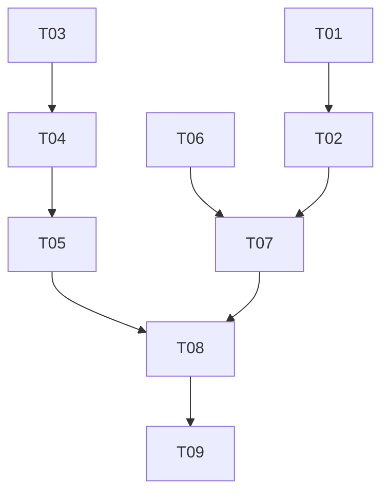

# 0003 : Pull des espaces : curseur et apply atomiques, publish idempotent

## 1. Résumé

**Problème :** le pull d'un espace avance son curseur même quand des lignes
n'ont pas été appliquées (perte définitive), crée une ligne puis la marque
en deux instructions (doublon après kill), et le publish d'une note n'a pas
d'id client (double création serveur, note fantôme sans retry).

**Recommandation :** une page de delta = une transaction SQLite qui porte
aussi le curseur ; l'id de note et de dossier est généré côté client et
accepté par le serveur ; une table locale de republication bornée rattrape
les notes non publiées à chaque pull. Confiance haute.

**Impact :** pull.rs, write.rs, les repos SQLite (handle transactionnel
`DbTx`), migration V27, deux routes serveur. Serveur à déployer avant le
client. Risque principal : une ligne définitivement inapplicable bloque
l'espace de façon visible, au lieu de la perte silencieuse d'aujourd'hui.

## 3. Problème et motivation

### État actuel

`pull_space` (`src/application/space/pull.rs`) lit une page, l'applique
avec `apply_delta`, puis appelle `set_space_cursor`. Trois défauts confirmés
par lecture du code, aucun incident device observé :

1. `apply_delta` avale chaque échec (`let _ =`, `else { continue }`) et le
   curseur avance quoi qu'il arrive. Un `SQLITE_BUSY` pendant une page saute
   des lignes que le serveur ne rejouera jamais. Le commentaire de
   `set_space_cursor` (`space_repo.rs:79`) documente l'invariant, le code ne
   le tient pas.
2. Créer une ligne puis la marquer (`create_note` puis
   `mark_note_in_space`, idem dossiers) sont deux instructions hors
   transaction. Un kill entre les deux laisse une ligne sans `remote_id` ;
   le pull suivant ne la reconnaît pas et la recrée.
3. `publish_local_note` (`write.rs`) poste sans id : le serveur génère
   l'UUID (`routes.rs:475`). Une réponse perdue après commit serveur donne
   une seconde note au retry. Un publish hors ligne laisse une note fantôme
   (`remote_id = NULL`), jamais repoussée. `write::create_note` et
   `create_folder` ont le même trou.

### Douleur

Tout membre d'un espace. Le doublon se voit ; la perte est silencieuse, le
membre croit avoir tout.

### Pourquoi maintenant

La 2.0.1 vient d'être soumise avec les espaces. Le curseur est la seule voie
par laquelle le contenu arrive et il n'existe aucun outil de réparation du
miroir local. Corriger avant que le volume ne rende les symptômes fréquents.

### Signaux

Aucune métrique. `tests/space_delta_test.rs` ne couvre que le chemin heureux.

## 4. Objectifs et non-objectifs

### Objectifs

- G1 : le curseur n'avance que si la page entière est appliquée.
- G2 : une ligne locale d'espace existe avec son `remote_id` ou pas du tout.
- G3 : rejouer une création (note ou dossier) ne crée jamais de second
  enregistrement serveur.
- G4 : une note locale d'espace non publiée finit publiée sans action de
  l'utilisateur, ou redevient visiblement une note locale si le serveur la
  refuse définitivement.

### Non-objectifs

- Pas de résolution de conflit locale ; le serveur gagne, comme avant.
- Pas de file d'attente pour les écritures de dossiers : elles restent
  synchrones, serveur d'abord, refusées hors ligne (proposal 0002 §6.5).
  Seule la note déjà sauvée par l'éditeur gagne une republication bornée ;
  c'est un amendement explicite de l'invariant « jamais mise en file » de
  0002, limité à ce cas, sans autorité partagée (le serveur reste seul juge).
- Pas de changement du format du delta ni de la pagination.
- Pas de rattrapage des doublons déjà présents sur un device.
- Pas de batching du fan-out `embed_note` post-pull (un thread par note
  aujourd'hui, inchangé).

## 5. Alternatives envisagées

### Alt 0 : statu quo

**Coût de l'inaction :** perte silencieuse à la première erreur SQLite,
doublons après kill, notes fantômes. **Contre :** l'invariant documenté est
faux ; le bug s'aggrave avec l'usage.

### Alt 1 : remonter l'erreur, sans transaction

**Résumé :** `apply_delta` rend `Result`, le premier échec arrête la page,
le curseur n'avance pas. **Contre :** une page à moitié appliquée reste à
moitié appliquée ; son rejeu recrée les lignes déjà créées sans `remote_id`.
G2 aggravé, rien pour G3 ni G4. **Coût :** S.

### Alt 2 : page transactionnelle + id client + republication bornée

**Résumé :** une page = une transaction `BEGIN IMMEDIATE` englobant apply et
curseur ; ids générés côté client et acceptés par le serveur ; table locale
`space_publish_pending` drainée en tête de chaque pull, avec plafond et
backoff. **Pour :** un mécanisme minimal par bug, sur des primitives déjà
en place. **Contre :** deux routes serveur changent ; le mutex de connexion
est tenu le temps d'une page ; les effets hors SQLite ne se rollbackent pas.
**Coût :** M-L. **Réversibilité :** facile côté client, serveur compatible
avec les anciens clients.

### Alt 3 : outbox générique

**Résumé :** table d'opérations pour toutes les écritures d'espace, un
worker la draine. **Contre :** second chemin d'écriture, ordonnancement des
ops, autorité partagée que 0002 refuse. **Coût :** L. **Réversibilité :**
dure.

## 6. Conception retenue

Alt 2. Trois changements client, un changement serveur.

### 6.1 Page transactionnelle

`Database::apply_space_page(space_id, next_seq, f)` (`space_repo.rs`)
verrouille la connexion, exécute `BEGIN IMMEDIATE`, appelle `f(&DbTx)`,
met le curseur à jour dans la même transaction, `COMMIT`. Toute erreur :
`ROLLBACK`, curseur intact, `Err` remonté ; `pull_space` s'arrête sans page
suivante et rend `SpaceError::Other`. Les pages déjà commitées restent.

`DbTx<'a>` est un newtype infrastructure autour de `&'a Connection`. Les
méthodes de repo qu'`apply_delta` utilise sont implémentées sur `DbTx`, et
`Database` y délègue (`DbTx(&self.conn()).m()`) : un seul corps par
requête, aucun type rusqlite ne remonte dans `application`. Celles qui
ouvrent aujourd'hui `unchecked_transaction` (`delete_note`,
`delete_folder`, `remove_note_from_folder`, `delete_audio`) passent à
`SAVEPOINT` / `RELEASE`, valides dans et hors transaction ; un `BEGIN`
imbriqué échouerait et un `Transaction` droppé annulerait la page.

`apply_delta(&DbTx, ..) -> Result<PullOutcome, String>` ; chaque `let _ =`
et `else { continue }` sur du SQL devient `?`. Le tombstone d'une ligne
inconnue reste un no-op. Une ligne définitivement inapplicable bloque
l'espace : visible dans l'écran de l'espace (qui affiche déjà l'erreur de
pull), préférable à la perte silencieuse. Le serveur valide le contenu
avant de le stocker, ce cas se réduit aux erreurs disque et FK. Plafond
assumé ; voie d'évolution : liste de lignes sautées.

Effets hors SQLite, exécutés après commit à partir des ids collectés par
`apply_delta` : suppression des fichiers audio et `delete_note_embeddings`
pour les notes supprimées ; `embed_note` pour les notes appliquées ;
`drain_purges`. Un crash entre commit et ces effets laisse des orphelins
que la purge rejouable et le prochain embed rattrapent.

Contention : `embed_note` et `drain_purges` ouvrent leur propre connexion
(`Database::open`, `busy_timeout` 5 s des deux côtés). Une page fait au plus
200 dossiers + 200 notes de SQL pur, bien sous 5 s ; un `BEGIN IMMEDIATE`
qui n'obtient pas le verrou aborte la page, rejouée au pull suivant.

Test d'échec en milieu de page : un trigger `BEFORE INSERT ON notes ...
RAISE(ABORT)` posé par le test sur une condition de titre, sans seam en
production.

### 6.2 Id client à la création

Serveur, routes `note` et `folder` : `id` fourni est cherché par clé
primaire, sans filtre `deleted_at` ni `space_id`. Absent : création avec
cet id (garde `MAX_NOTES` ici seulement), 201. Présent, vivant, même espace,
même auteur : update, comme avant. Tout autre cas (tombstone, autre espace,
autre auteur) : 404 uniforme. `id` absent : comportement actuel, gardé pour
les clients 2.0.1.

Client : `publish_local_note`, `write::create_note` et
`write::create_folder` génèrent `Uuid::new_v4()` et l'envoient. Une réponse
perdue est rejouée avec le même id : update serveur, pas de second insert.

Ordre : serveur déployé avant la soumission App Store du client ; la
fenêtre « client nouveau, serveur ancien » n'existe pas.

### 6.3 Republication bornée

Migration V27 : table locale `space_publish_pending(note_id PK, space_id,
attempts, next_try_at, last_error)`. Hors catalogue de sync P2P (état
device-local, comme `spaces`), donc jamais écrasée par un `INSERT OR
REPLACE` d'un pair. Les notes reçues des autres membres n'y entrent jamais.

`publish_local_note`, quand `remote_id` est NULL : génère l'id, écrit
`mark_note_in_space` et la ligne pending dans une même transaction, puis
appelle le réseau. Succès : ligne pending supprimée. Échec transitoire
(réseau, 5xx, 401, 429, `ReadOnly` espace gelé, `Refused`) : `attempts + 1`,
`next_try_at = now + min(1 min × 2^attempts, 1 h)`. Refus permanent confirmé
par le serveur (400, 404, 409) : ligne pending supprimée et note détachée
(`detach_note_from_space`) : elle redevient une note locale ordinaire,
visible comme telle. Le `guard` local ne détache jamais.

`republish_pending(db, space_id)` en tête de `pull_space` : au plus 20 lignes
dont `next_try_at <= now`, en série, chacune via `publish_local_note`. Le
pull continue quoi qu'il arrive.

Le hook UI (`ui/notes/detail/hooks/persistence.rs`) ne change pas.

### Modules touchés

| Fichier | Changement |
|---|---|
| `src/application/space/pull.rs` | `apply_delta(&DbTx) -> Result`, page transactionnelle, effets post-commit, `republish_pending` |
| `src/application/space/write.rs` | id client (note + dossier), issues du publish, pending |
| `src/infrastructure/persistence/space_repo.rs` | `apply_space_page`, `DbTx`, repo `space_publish_pending` |
| `src/infrastructure/persistence/{note,folder,settings}_repo.rs` | méthodes sur `DbTx`, `SAVEPOINT` au lieu de `unchecked_transaction` |
| `src/infrastructure/persistence/schema.rs` | V27 |
| `src/application/note_persistence.rs` | `create_note` sur `DbTx`, `delete_note` scindé SQL / fichiers |
| `marketplace-flowflow/src/features/spaces/routes.rs` | `note` et `folder` : id fourni à la création |

## 7. Inconvénients et risques

### Inconvénients

- Le mutex de connexion est tenu pendant toute la page : l'UI qui lit la
  base pendant un pull attend la fin de la page.
- `DbTx` double une quinzaine de signatures de repo, mécanique mais bruyant.
- Une ligne inapplicable bloque l'espace jusqu'à correction (voir 6.1).
- `IdResp.id` devient un écho pour les clients à jour.

### Risques

| Risque | Probabilité | Impact | Mitigation |
|---|---|---|---|
| Deadlock : un `db.conn()` oublié sous transaction | moyenne | élevé | `apply_delta` ne reçoit qu'un `DbTx` ; test d'une page complète sous transaction |
| `BEGIN` imbriqué via une méthode de repo non convertie | moyenne | élevé | `SAVEPOINT` dans les 4 méthodes listées ; test d'un delete sous transaction ouverte |
| Rollback après suppression de fichiers audio | faible | moyen | fichiers supprimés après commit seulement |
| Page abortée par `SQLITE_BUSY` (embed concurrent) | faible | faible | rejouée au pull suivant, curseur intact |
| Note détachée à tort | faible | moyen | détachement sur 400/404/409 serveur uniquement, jamais sur le `guard` local ni sur `ReadOnly` |
| Client 2.0.1 contre serveur nouveau | certaine | nul | branche sans id inchangée |

### Déploiement / retour arrière

- Serveur d'abord (Dokploy), puis client dans la build suivante. V27
  additive.
- Retour client : l'ancien code ignore `space_publish_pending` ; une note
  marquée avant réponse serveur redevient le comportement d'avant.
- Retour serveur seul : impossible sans casser les créations du client
  nouveau.

### Questions ouvertes

| # | Question | État |
|---|---|---|
| 1 | Indicateur UI « en attente de publication » ? | Ouverte, aucune tâche n'en dépend : la note est publiée au pull suivant (plancher 30 s). À revoir si des notes restent en attente longtemps. |

## 9. Recommandation et justification

**Recommandation :** adopter **Alt 2** telle que conçue en section 6.
**Confiance :** haute ; chaque bug reçoit son mécanisme minimal sur des
primitives existantes.

| Objectif | Mécanisme |
|---|---|
| G1 | curseur mis à jour dans la transaction de la page |
| G2 | create + mark dans la même transaction |
| G3 | id client + upsert serveur par clé primaire |
| G4 | `space_publish_pending` drainée en tête de pull, refus permanent = détachement visible |

### Pourquoi pas les autres

- **Alt 0 :** l'invariant de `space_repo.rs:79` est faux en production.
- **Alt 1 :** le rejeu d'une page à moitié appliquée génère des doublons.
- **Alt 3 :** second chemin d'écriture que 0002 exclut ; L d'effort pour un
  hors-ligne dossiers que personne n'a demandé.

### À revoir si

- Le mutex tenu bloque l'UI de façon visible : connexion dédiée au pull.
- Une ligne inapplicable bloque un espace réel : liste de lignes sautées.
- Un besoin hors ligne pour les dossiers apparaît : Alt 3 sur cette base.

## 10. Plan d'implémentation

| ID | Title | Files | Depends on | Effort | Accept criteria |
|----|-------|-------|------------|--------|-----------------|
| T01 | Server: accept client id on note and folder create | `marketplace-flowflow/src/features/spaces/{routes,repo}.rs` | none | M | unknown id creates (201, same id); replay updates, one row; tombstoned / other-space / other-author id 404; MAX_NOTES only on create branch; route tests |
| T02 | Deploy server | Dokploy | T01 | S | prod: 201 then echo on replay |
| T03 | `DbTx` handle + SAVEPOINT in nested-tx repo methods | `persistence/{space,note,folder,settings}_repo.rs`, `note_persistence.rs` | none | L | `Database` methods delegate to `DbTx`; `delete_note` under an open transaction commits with the outer tx; `cargo test` green |
| T04 | `apply_delta(&DbTx) -> Result`, existing tests migrated | `pull.rs`, `tests/space_delta_test.rs` | T03 | S | no swallowed SQL error; delta tests pass |
| T05 | `apply_space_page` + cursor in tx + post-commit effects | `space_repo.rs`, `pull.rs` | T04 | M | test: RAISE trigger mid-page, cursor unchanged, no partial row; test: full page, no deadlock |
| T06 | V27 `space_publish_pending` + repo | `schema.rs`, `space_repo.rs` | none | S | `space_schema_test` covers table; not in sync catalog |
| T07 | Client id + pending row + outcomes in publish/create paths | `write.rs` | T02, T06 | M | `remote_id` + pending row written in one tx before network; replay uses same id; 400/404/409 detaches; transient sets backoff; folder create sends id |
| T08 | `republish_pending` at pull start | `pull.rs` | T05, T07 | S | test: pending note published on next pull; cap 20; `next_try_at` honored |
| T09 | Device validation | iPhone | T08 | S | note saved in a collab folder while offline, back online, open folder: one server note, no duplicate; kill during pull: no duplicate after next pull |

### Vérification

`cargo test` (tous les tests dans `tests/`), tests de routes serveur pour
T01, T09 sur device validé par Mirko avant push.

Chemin critique : T03 → T04 → T05 → T08 → T09 ; T01 → T02 et T06 en
parallèle.
