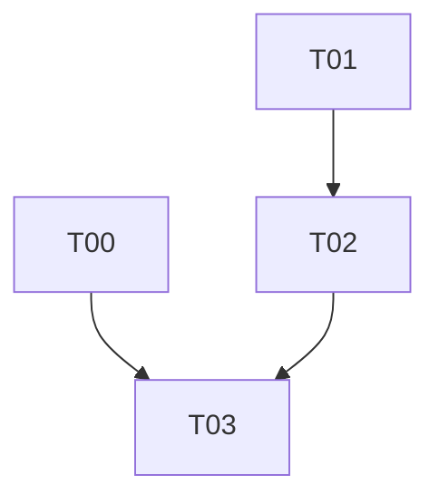

# 0004 : Un espace est une équipe : partager un thème dans un espace, pas en faire un

## 1. Résumé

**Problème :** « Partager ce thème » fabrique un espace par thème, nommé
comme lui. La section « Collab » de la sidebar contient un thème « Collab »,
le menu de la section propose « Renommer l'espace » pour ce qui ressemble à
un dossier, et une équipe déjà constituée ne peut pas recevoir un deuxième
thème. Les défauts de finition relevés le même jour (erreurs en anglais,
« Membre » inventé, panneau ouvert après la copie) ont leur propre document,
la 0005.

**Recommandation :** un espace est une équipe, nommée par l'utilisateur au
premier partage. « Partager ce thème » demande dans quelle équipe (une
existante que je possède, ou une nouvelle) et y dépose le thème. Le serveur
ne change pas. Confiance haute.

**Impact :** `adopt.rs` et `pull.rs`, le menu du thème et la section
d'espace dans la sidebar. Rien de nouveau côté
backend ; le déploiement de la 0003 T01 et de `ship/spaces-owner-actions`
reste un prérequis externe (T00) pour que les écrans déjà livrés répondent
autre chose que 404. Deux défauts découverts en revue sont pris au passage :
un thème imbriqué partagé restait sous son ancien parent, et renommer ou
supprimer un thème partagé ne touchait que la copie locale.

## 3. Problème et motivation

### État actuel

`share_existing_folder` (`src/application/space/adopt.rs`) crée un espace
via `create_space(db, &root.name)` : l'espace prend le nom du thème, puis le
thème devient sa racine. Le serveur (`marketplace-flowflow`) modélise
correctement un espace comme un groupe de membres contenant un arbre de
dossiers ; c'est le client qui l'aplatit en « un espace = un thème ».

Conséquences visibles, observées sur device le 2026-08-25 :

1. Sidebar : en-tête « Collab · 1 » puis thème « Collab » dessous. Deux
   lignes pour un objet, et le menu « … » de l'en-tête offre « Renommer
   l'espace » sur ce qui se lit comme un dossier.
2. Partager un deuxième thème avec les mêmes personnes est impossible sans
   les réinviter dans un nouvel espace : le menu du thème n'offre que
   « Partager ce thème », qui crée toujours un espace neuf.
3. Renommer l'espace et créer un thème ont répondu « space not found » :
   le serveur en production ne connaît pas encore les routes `rename` /
   `delete` ni l'`id` client. L'erreur était juste, le déploiement manque.

### Douleur

Le propriétaire, à chaque partage. Le point 2 est structurel : le modèle
proposé par 0002 (un espace = une équipe avec plusieurs thèmes) n'est
atteignable par aucun geste de l'interface.

### Pourquoi maintenant

La section par espace vient d'arriver dans la sidebar (branche
`ship/spaces-sidebar`) et rend le doublon visible à chaque ouverture. Avant,
il était caché dans Réglages.

### Signaux

Aucune métrique ; retour device du propriétaire.

## 4. Objectifs et non-objectifs

### Objectifs

- G1 : un espace porte un nom d'équipe choisi par l'utilisateur, jamais
  déduit d'un thème.
- G2 : un thème se partage dans un espace existant dont je suis
  propriétaire, ou dans un nouvel espace, en un geste depuis son menu.

### Non-objectifs

- Pas de changement de schéma ni de route serveur : `spaces.name` et les
  routes existantes suffisent.
- Pas de déplacement d'un thème d'un espace vers un autre, ni de retrait
  d'un thème d'un espace sans le quitter (à traiter à part si demandé).
- Pas de partage par un membre non propriétaire à la racine : la règle
  `can_write_in` (jamais à la racine pour un invité) reste.
- Pas de migration des espaces déjà créés avec le nom du thème : le
  propriétaire renomme l'espace depuis sa section, et le thème depuis son
  menu (ce renommage passera désormais par l'espace).
- Pas de correction de `is_owner` local au device : un espace créé sur un
  autre appareil du compte n'est pas proposé comme cible.

## 5. Alternatives envisagées

### Alt 0 : statu quo

**Coût de l'inaction :** doublon permanent dans la sidebar, une équipe par
thème, invitations à refaire. **Contre :** le modèle serveur est bon et le
client l'empêche.

### Alt 1 : masquer l'en-tête quand l'espace n'a qu'un thème du même nom

**Résumé :** la section d'espace se replie sur le thème quand ils portent
le même nom et que le thème est seul. **Pour :** aucun changement de flux.
**Contre :** cache le problème sans le résoudre ; le second thème reste
impossible ; deux apparences pour un même objet selon son contenu ; le menu
de l'espace doit alors se greffer sur le thème. **Coût :** S.

### Alt 2 : l'espace est l'équipe, on partage un thème dedans

**Résumé :** « Partager ce thème » ouvre un choix inline : les espaces dont
je suis propriétaire, plus « Nouvelle équipe » avec un champ nom. Le thème
devient une racine de l'espace choisi. L'en-tête de section montre le nom
de l'équipe, les thèmes dessous. **Pour :** aligne le client sur le modèle
serveur ; une équipe reçoit N thèmes ; le nom de la section a un sens ;
réutilise `share_existing_folder` avec une cible explicite.
**Contre :** un choix de plus au premier partage ; déposer un thème dans
une équipe existante ouvre d'un coup ses notes aux membres, d'où un choix
de mode dans le panneau ; les espaces existants gardent leur nom de thème
jusqu'à renommage. **Coût :** M.
**Réversibilité :** facile, tout est client.

### Alt 3 : un onglet « Équipes » séparé des thèmes

**Résumé :** la sidebar gagne un troisième onglet listant les équipes, et
chaque équipe ses thèmes. **Contre :** les thèmes partagés quittent la
liste des thèmes, là où l'utilisateur les cherche ; un onglet de plus pour
une fonction que la plupart des utilisateurs n'ont pas activée. **Coût :**
L. **Réversibilité :** moyenne.

## 6. Conception retenue

Alt 2, entièrement côté client.

### 6.1 Partager dans un espace

`share_existing_folder(db, local_folder_id, target: ShareTarget, mode)`
avec `enum ShareTarget { Existing(space_id), New(name) }`. `New` appelle
`create_space(db, &name)` ; `Existing` prend l'espace tel quel. `mode`
(`collab` ou `read`) s'applique à toute la sous-arborescence, comme
aujourd'hui `MODE_COLLAB` en dur. Le thème partagé est marqué avec
`parent_id = NULL` : il pend à la racine de l'espace côté serveur, et un
thème imbriqué qui garderait son parent local n'apparaîtrait jamais sous
sa section (il resterait sous `list_subfolders` de son ancien parent).

Reprise d'un partage interrompu : le menu ne peut pas la porter (un thème
déjà marqué `space_id` n'est plus « local », l'entrée disparaît). Elle
devient automatique : `resume_adoptions(db, space_id)` en tête de
`pull_space`, à côté de `republish_pending`, pousse les dossiers et notes
de la sous-arborescence d'un thème de l'espace qui n'ont pas encore de
`remote_id`. Même code que l'adoption, appelé sans cible.

Menu du thème (`FolderItem`), entrée « Partager ce thème », offerte sur un
thème local seulement : ouvre un panneau inline sous la ligne, dans le
même style que « Nouveau thème » (`bg-stone-100 rounded-xl`) :

- une ligne par espace dont `is_owner`, icône `IconUsersThree`, nom,
  nombre de membres (même appel `space::members` que la section) ;
- une ligne « Nouvelle équipe » avec un champ nom (coupé à
  `MAX_NAME_CHARS` = 100, bouton inactif tant qu'il est vide) ;
- le choix de mode crayon / cadenas, comme « Nouveau thème » : cadenas par
  défaut vers une équipe existante, crayon vers une nouvelle.

Aucun espace possédé : seul le champ « Nouvelle équipe » apparaît, avec le
nom du thème en placeholder, pas en valeur. Une erreur (hors ligne, pas
premium, cap) s'affiche sous la ligne du thème, avec les libellés de la
0005 ; aujourd'hui elle n'est qu'un `eprintln!`. `is_owner` est local au
device (proposal 0002) :
un espace créé depuis un autre appareil du même compte n'est pas proposé.
Limite connue, documentée, hors de ce document.

Renommer ou supprimer un thème partagé passe par l'espace
(`space::update_folder`, `space::delete_folder`) et non plus par la base
locale : un renommage local est écrasé au pull suivant, une suppression
locale voit le thème revenir. Le menu du thème garde ses entrées, elles
changent de chemin selon `folder.space_id`.

### Modules touchés

| Fichier | Changement |
|---|---|
| `src/application/space/adopt.rs` | `ShareTarget`, mode, `parent_id` effacé, `resume_adoptions` |
| `src/application/space/pull.rs` | appel de `resume_adoptions` en tête de pull |
| `src/application/space/mod.rs` | `error_key`, exports |
| `src/ui/sidebar/folders.rs` | panneau « Partager dans », ligne d'erreur, renommer / supprimer via l'espace |
| `src/application/i18n/locales/{fr,en}.ftl` | clés `space-share-into`, `space-share-new-team`, `space-team-name-placeholder` |

## 7. Inconvénients et risques

### Inconvénients

- Un geste de plus au premier partage (nommer l'équipe). C'est le prix
  d'un nom qui veut dire quelque chose.
- Les espaces créés avant restent nommés comme leur thème.

### Risques

| Risque | Probabilité | Impact | Mitigation |
|---|---|---|---|
| Partage dans un espace existant refusé par le serveur (cap, espace gelé, pas premium) | faible | faible | erreur affichée sous le thème ; rien n'est marqué avant la réponse du serveur |
| Serveur non déployé : `id` client et routes owner absents | certaine aujourd'hui | élevé | prérequis externe T00, message `Gone` qui le dit |
| Un thème déposé dans une équipe existante devient lisible ou modifiable par ses membres d'un coup | moyenne | moyen | choix de mode dans le panneau, cadenas par défaut vers une équipe existante, nombre de membres affiché |
| Partage interrompu à mi-chemin (réseau, kill) | faible | moyen | `resume_adoptions` au pull suivant finit le travail ; rien n'est dupliqué, les lignes déjà marquées sont sautées |

### Déploiement / retour arrière

Client seul. Retour : l'ancien geste (un espace par thème) revient avec
l'ancien binaire ; les espaces créés entre-temps sont des espaces normaux.

## 9. Recommandation et justification

**Recommandation :** Alt 2. **Confiance :** haute ; c'est le modèle que le
serveur implémente déjà et que 0002 décrivait.

| Objectif | Mécanisme |
|---|---|
| G1 | `ShareTarget::New(name)`, nom saisi, jamais `root.name` |
| G2 | panneau « Partager dans » sous le thème, `Existing` / `New` |

### Pourquoi pas les autres

- **Alt 1 :** un maquillage qui laisse le second thème impossible.
- **Alt 3 :** déplace les thèmes partagés hors de la liste des thèmes.

### À revoir si

- Des utilisateurs demandent à déplacer un thème d'un espace à un autre :
  route serveur `folder/move` entre espaces, hors de ce document.

## 10. Plan d'implémentation

| ID | Title | Files | Depends on | Effort | Accept criteria |
|----|-------|-------|------------|--------|-----------------|
| T00 | External prerequisite, owner Mirko: deploy `main` of marketplace-flowflow (0003 T01) + merge and deploy `ship/spaces-owner-actions` | Dokploy | none | S | `curl -s -o /dev/null -w '%{http_code}' -X POST https://<api>/v1/spaces/rename` answers 401 (route exists), not 404 |
| T01 | `ShareTarget` + mode in `share_existing_folder`, `parent_id` cleared on the shared root, `resume_adoptions` at pull start | `adopt.rs`, `pull.rs`, `space/mod.rs` | none | M | test: `Existing(id)` creates no local space row and the shared root has `parent_id = NULL`; `resume_adoptions` on a half-marked subtree pushes only unmarked rows (no network: nothing is marked, nothing is lost) |
| T02 | « Partager dans » panel under the theme, error line, rename / delete of a shared theme through the space | `folders.rs`, `fr.ftl`, `en.ftl` | T01 | M | owner spaces listed with member count + « Nouvelle équipe » field capped at 100 chars + mode icons; no owned space = field only, theme name as placeholder; after share a nested theme appears under the chosen section, not under its old parent; a refused share shows a line under the theme |
| T03 | Device validation | iPhone | T00, T02 | S | share a theme into a new team « Atlas » then a nested theme into « Atlas » in read mode: one section « Atlas » with two themes, lock on the second; rename a shared theme, pull: name kept |

### Vérification

`cargo test` (T01 : `ShareTarget`, `parent_id`, `resume_adoptions`),
`make check`, T03 sur device validé par Mirko avant PR.
