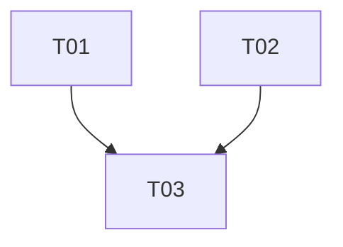

# 0005 : Finition des espaces : erreurs traduites, membre anonyme, copie qui ferme

## 1. Décision

`error_key(&SpaceError) -> &'static str` dans `application/space`, une clé
par variante, sans bras joker ; chaque écran affiche `t(&lang, error_key(&e))`.
Un membre sans nom public montre `IconUserCircle` et six caractères de son
handle, jamais « Membre ». « Copier le lien » ferme le panneau et pose une
ligne « Lien copié » que le prochain panneau ou menu efface.

## 5. Alternatives envisagées

- **Traduire dans `Display`** : `SpaceError` est en `application`, la
  langue est un état d'interface ; la couche se tromperait de sens.
- **Cacher les membres sans nom** : deux anonymes deviennent invisibles et
  « Retirer » ne sait plus qui viser. Rejeté.
- **Laisser le nom vide** (demandé) : deux lignes identiques, même problème
  de « Retirer ». Le handle court est le minimum qui distingue.

## 6. Conception retenue

- Clés : `space-error-offline`, `-refused`, `-gone`, `-read-only`,
  `-limit`, `-no-backend`, `-other`. `Gone` en français : « Cet espace
  n'existe plus, ou le serveur ne connaît pas encore cette action. » ;
  `Refused` : « Il faut un abonnement et un compte lié pour partager. »
- Appelants : `space_section.rs`, `settings/spaces.rs`, le menu du thème
  (`folders.rs`, ligne d'erreur ajoutée par la 0004). `join_link.rs` garde
  sa table propre : un code mort et un espace disparu sont la même variante
  `Gone` avec deux phrases.
- `MemberRow` : `display_name` absent, avatar `IconUserCircle`, nom =
  `author_ref[..6]` en gris ; « Vous » et « Propriétaire » inchangés.
- Copie : `panel.set(Panel::None)`, `status.set(Some(t("space-invite-link-copied")))` ;
  tout `panel.set(..)` et l'ouverture du menu remettent `status` à `None`,
  comme `error`.

## 7. Inconvénients et risques

- Un handle de six caractères n'est pas un nom ; il distingue, il ne
  présente pas. Le profil public reste le vrai remède.
- Un bras joker ajouté plus tard replierait une variante sur `-other` :
  le test de T01 l'interdit.

## 10. Plan d'implémentation

| ID | Title | Files | Depends on | Effort | Accept criteria |
|----|-------|-------|------------|--------|-----------------|
| T01 | `error_key` + keys, wired in every space screen | `space/mod.rs`, `space_section.rs`, `settings/spaces.rs`, `fr.ftl`, `en.ftl` | none | S | `grep 'e.to_string()' src/ui/sidebar src/ui/settings/spaces.rs` matches no `SpaceError`; test: no wildcard arm, one distinct key per variant, asserted pairwise |
| T02 | Anonymous member row, copy closes the panel, status cleared | `space_section.rs`, `fr.ftl`, `en.ftl` | none | S | member without name shows `IconUserCircle` + 6-char handle; copy closes the panel and shows « Lien copié »; opening any panel or the menu clears it |
| T03 | Device validation | iPhone | T01, T02 | S | rename against an undeployed server: message in French; members list with an unnamed member; copy the link: panel closed, « Lien copié » shown, gone after the next tap |

