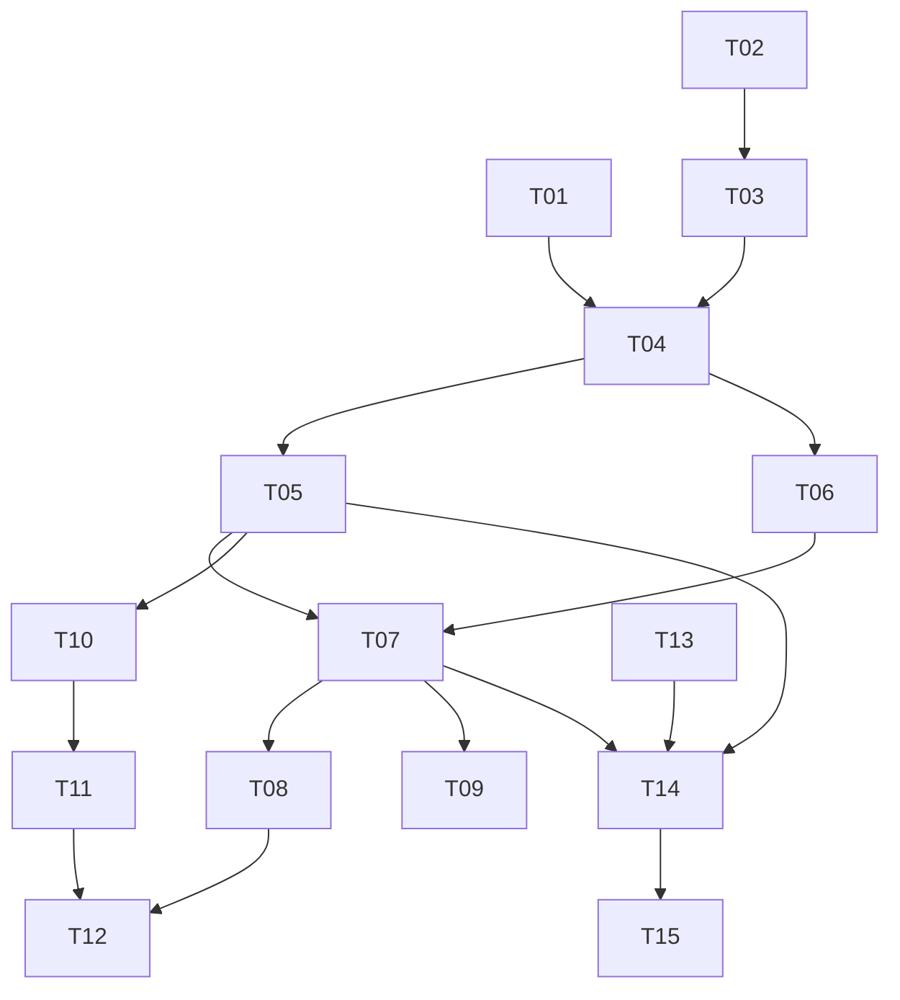

# 0007 : Partager un espace avec Hermes : jeton d'agent et serveur MCP

## 1. Résumé

**Problème :** un dossier FlowFlow se partage avec des personnes via un
espace, jamais avec Hermes, l'agent de Mirko sur le VPS : seul un appareil
lié à un compte peut être membre, et le serveur MCP du backend ignore les
espaces. Tout pont passe par un copier-coller.

**Recommandation :** une identité d'agent par espace, créée et révoquée
par l'owner depuis l'app, portant des jetons hashés scopés `read` ou
`read_write`, et un serveur MCP `/v1/mcp-spaces` de neuf outils qui
appelle le même cœur que les routes espaces. Hermes est un membre avec un
scope. Confiance haute côté backend et app, moyenne côté Hermes tant que
la joignabilité du backend depuis le VPS n'est pas prouvée.

**Impact :** une migration additive et un refactor des handlers espaces
en `spaces::core` dans `marketplace-flowflow`, un panneau « Hermes » dans
la sidebar de l'app, une configuration MCP, un skill et un cron côté VPS.
Aucun changement du sync, du pull ni des vecteurs. Risques principaux :
injection de prompt par le contenu des notes et fuite du jeton, tous deux
bornés par le scope, la révocation et la restriction des outils du cron.

## 2. Contexte et code existant

### Le plan « espaces » côté backend (`marketplace-flowflow`)

- `src/lib.rs:133-220` : routes espaces, toutes en `POST /v1/spaces/*`
  (`create`, `invite`, `join`, `pull`, `folder`, `folder/move`,
  `folder/delete`, `note`, `note/delete`, `member/remove`, `leave`,
  `members`, `rename`, `delete`).
- `src/features/spaces/routes.rs:44-108` : contrats. `PullReq {space_id,
  since_seq}` ; `PullResp {folders, notes, next_seq, more}` ; `NoteView
  {id, folder_id, author_ref, own, seq, updated_at, deleted, title,
  content}` ; `FolderView {id, parent_id, name, mode, effective_mode,
  author_ref, seq, updated_at, deleted}`. `NoteReq {space_id, id?,
  folder_id?, title?, content}` : id client optionnel, 201 à la création,
  200 sur mise à jour de sa propre note (`routes.rs:497-572`). `FolderReq
  {space_id, id?, parent_id?, name, mode}` (`routes.rs:355-427`). Pull
  par pages de 200 lignes par flux (`routes.rs:278-350`).
- Contenu en clair côté serveur : `NoteView` sérialise `title` et
  `content`, la table stocke du `TEXT` (`routes.rs:61-80`,
  `src/db/migrations.rs:551-562`). Aucun chiffrement de bout en bout.
- Auth : session d'appareil par challenge Ed25519, puis
  appareil -> compte -> `web_user` lié (`src/gate.rs:20-45`,
  `src/features/auth/device.rs:18-101`, `routes.rs:701-730`). Toute
  anomalie répond 404 uniformément.
- Identité : `Access {space, web_user_id, actor}` avec
  `Actor::{Owner, Member}` (`routes.rs:701-730`,
  `src/features/spaces/perm.rs:15-168`). Owner écrit partout ; membre
  seulement dans les dossiers d'effet `collab`, jamais à la racine.
  `can_edit_note` n'autorise que l'auteur, owner compris
  (`perm.rs:150-154`) ; les requêtes de mise à jour filtrent aussi sur
  `author_web_user_id`.
- `author_ref` = 12 premiers caractères de SHA-256(`web_user_id`), calculé
  dans `routes.rs:819-823` pour notes, dossiers et membres.
  `author_web_user_id` est `ON DELETE SET NULL` (`migrations.rs:539-570`)
  : une ligne peut donc déjà n'avoir aucun auteur.
- Plafonds : 20 membres, 5000 notes vivantes, 64 Ko par note,
  profondeur 8 (`routes.rs:28-39`, `perm.rs:14`), compteurs par espace
  (`repo.rs:95-116`). Aucun plafond sur le nombre de dossiers. Pull
  limité à 30 s par `(device_id, space_id)` (`spaces/mod.rs:7-57`). Le
  limiteur global est par IP (`src/ratelimit.rs:69-73`). Les écritures et
  l'émission d'invitation exigent un owner premium (`routes.rs:736-742`).
- `POST /v1/spaces/members` renvoie `Vec<MemberView {web_user_id,
  display_name?, author_ref, is_owner, me}>` (`routes.rs:599-620`).

### Jetons machine et MCP déjà en place (`marketplace-flowflow`)

- `admin_api_tokens` (V13) : `id, name, token_hash, scope, created_by,
  created_at, expires_at, revoked_at, last_used_at`
  (`src/db/migrations.rs:389-407`). Jeton `mcpa_` + 32 octets base64url,
  seul le SHA-256 est stocké, texte clair renvoyé une fois
  (`src/features/admin/api_tokens.rs:39-97`).
- Extracteur `AdminToken` : `Authorization: Bearer`, hash, expiration,
  révocation, `TokenScope::{Read, ReadWrite}`, `require_write`
  (`src/gate.rs:306-413`).
- Serveur MCP admin : rmcp 2.1.0, `#[tool_router]` + `#[tool]` +
  `schemars::JsonSchema`, `#[tool_handler] impl ServerHandler`
  (`src/features/mcp_admin/mod.rs:8-10, 99-106, 493-505`). Monté en
  `/v1/mcp-admin`, Streamable HTTP sans état, middleware Axum qui pose le
  jeton dans les extensions (`mcp_admin/transport.rs:22-52`). Audit par
  appel, acteur `token:{id}` (`mcp_admin/mod.rs:35-79`). Contrat
  opérateur versionné dans `docs/mcp-admin.md`. Aucun outil « espaces ».
- Santé : `GET /healthz`.

### Le miroir local des espaces (`flowflow`)

- `src/application/space/pull.rs:45-120` : pull par curseur, 404 =
  espace disparu, page appliquée en transaction, effets d'embedding
  après commit. `pull.rs:181-349` : `apply_delta` crée des dossiers et
  notes ordinaires, mappe les ids distants, applique les tombstones,
  mémorise `author_ref`. Une note reçue est indexée et utilisable en
  chat. `pull.rs:147-178` : `pull_all_due`.
- `src/application/space/write.rs:131-341` : création avec id client
  stable, file `space_publish_pending`, suppressions.
- `src/infrastructure/backend/spaces.rs:76-83, 140-417` : `MemberResp`,
  adaptateur HTTP porteur du bearer de session.
- `src/ui/sidebar/space_section.rs:19-30, 259-325, 478-526` : panneaux
  inline (`Invite`, `Members`, `NewTheme`, `Rename`, `Leave`, `Stop`) et
  `MemberRow`, clé `web_user_id`, handle 6 caractères sans nom public.
- Locales : `src/application/i18n/locales/{en,fr}.ftl` ; une clé absente
  s'affiche telle quelle.

### Hermes (`~/.hermes/hermes-agent`)

- Client MCP natif : `mcp_servers.<name>` (`url`, `headers`) dans
  `config.yaml` (`tools/mcp_tool.py:1-78`) ; `${VAR}` résolues depuis
  `~/.hermes/.env` (`hermes_cli/mcp_config.py:257-265`) ; toolset
  `mcp-<name>` ; résultat d'outil plafonné à 2 Mo.
- Skills : `~/.hermes/skills/<name>/SKILL.md`. Cron interne : `prompt` +
  `skills` + `enabled_toolsets`, tické par le gateway, fuseau configuré
  (`tools/cronjob_tools.py:1494-1516, 1956-2044`).
- VPS : tailnet, aucun port public entrant
  (`hermes-cowork/docs/brief/vps-backup-private-repo/brief.md:178-198`) ;
  déploiement d'Hermes non documenté en local.

### Prior art

- Propositions 0002, 0003, 0004 ; issues `flowflow#143` (faisabilité) et
  `flowflow#88` (audit RAG, injection de prompt).
- Tests à imiter : `marketplace-flowflow/tests/integration.rs:2195-2472`,
  `tests/spaces_test.rs`, `tests/spaces_perm_test.rs`, `tests/ratelimit.rs`.

### Chemins d'exécution touchés

- Écriture : outil MCP -> `Access` agent -> cœur de `POST /v1/spaces/note`
  -> `seq` -> pull iPhone -> `apply_delta` -> `embed_note` -> chat.
- Lecture : outil MCP -> cœur de `POST /v1/spaces/pull`.
- Révocation : app -> `POST /v1/spaces/agent/revoke` -> 404 ensuite.

## 3. Problème et motivation

### État actuel

Un dossier FlowFlow se partage avec des personnes en devenant un espace.
Hermes ne peut ni le lire ni y écrire : seul un appareil authentifié et
lié à un compte peut être membre, et Hermes n'a ni appareil ni compte. Le
serveur MCP du backend est réservé à l'administration.

### Douleur

Ce que Mirko écrit dans FlowFlow reste invisible d'Hermes ; ce qu'Hermes
produit n'arrive pas dans FlowFlow. Un travail du type « relis mes notes
depuis hier et écris une synthèse » est impossible.

### Pourquoi maintenant

Le plan espaces est livré et stable. Le backend possède un type de jeton
machine hashé et un transport MCP audité. Hermes consomme des serveurs
MCP HTTP. Il manque l'identité d'Hermes et neuf outils.

### Signaux

- Aucune métrique : la fonctionnalité n'existe pas. Contrainte : la
  recherche vectorielle du chat ne doit pas se dégrader ; une note d'Hermes
  suit le chemin d'une note de membre, rien ne change.

## 4. Objectifs et non-objectifs

### Objectifs

- Mirko donne à Hermes, espace par espace, un accès `read` ou
  `read_write`, et le révoque depuis l'app.
- Hermes lit les dossiers et notes d'un espace et écrit notes et
  sous-dossiers dans ses dossiers `collab`, via MCP, avec des créations
  idempotentes.
- Une note d'Hermes apparaît sur l'iPhone au pull suivant, indexée et
  retrouvable en chat, sans changement du sync, du pull ni des vecteurs.
- Les permissions restent celles du serveur ; un jeton `read` ne peut
  rien écrire ; un jeton révoqué reçoit 404 partout ; un jeton d'un
  espace ne voit rien d'un autre.
- Un cron Hermes quotidien tourne de bout en bout avec un skill, sans
  autre outil que le serveur MCP FlowFlow.

### Non-objectifs

- Hermes ne modifie PAS les notes de Mirko : la règle « édition par
  l'auteur » reste intacte pour tous.
- Hermes n'est PAS un appareil du compte de Mirko ni un membre du P2P.
- Pas de push serveur -> iPhone ; le pull reste le seul canal.
- Pas d'appel de FlowFlow vers Hermes (Hermes comme connecteur du chat).
- Pas de partage d'un dossier isolé : l'unité reste l'espace.
- Pas de chiffrement de bout en bout des espaces.
- Pas de durcissement du RAG contre l'injection : issue #88.

## 5. Alternatives envisagées

### Alt 0 : statu quo

**Résumé :** aucun pont ; copier-coller manuel.
**Coût de l'inaction :** aucune automatisation, Hermes aveugle.
**Pour :** zéro effort, zéro surface nouvelle.
**Contre :** la douleur de la section 3 persiste.

### Alt 1 : Hermes devient un appareil du compte de Mirko

**Résumé :** clé Ed25519 sur le VPS, challenge d'appareil
(`auth/device.rs:18-101`), liaison au compte, scripts `curl` dans un
skill sur `/v1/spaces/*`.
**Pour :** zéro ligne backend ; spike en une journée ; contrats déjà
testés.
**Contre :** droits d'owner sur tous les espaces sans scope ; révocation
= supprimer un appareil du compte ; liaison appareil-compte prévue pour un
humain avec passkey, non vérifiée sans écran ; Hermes apparaît comme
« moi », ses notes sont `own`.
**Coût :** XS backend, S Hermes. **Réversibilité :** facile, mais aucun
contrôle fin entre-temps.

### Alt 2 : identité d'agent par espace + serveur MCP `/v1/mcp-spaces`

**Résumé :** l'owner crée depuis l'app un agent nommé dans l'espace, qui
porte des jetons hashés scopés, expirables, révocables, sur le modèle des
`admin_api_tokens`. Un serveur MCP copié de `mcp_admin` expose neuf
outils appelant le même cœur que les routes, avec un `Actor::Agent`
soumis aux règles de membre.
**Pour :** périmètre = un espace ; révocation depuis l'app ; permissions
serveur inchangées ; outils MCP natifs pour Hermes ; patrons existants
réutilisés ; Hermes est un auteur nommé et durable, distinct de Mirko.
**Contre :** une migration et un refactor des routes en cœur partagé ;
une troisième identité d'auteur ; l'app doit afficher un agent.
**Coût :** M backend, S app, XS Hermes. **Réversibilité :** facile,
migration conservée, montage MCP retiré, notes intactes.
**Références :** `mcp_admin/transport.rs:22-52`, `gate.rs:306-413`,
MCP Streamable HTTP
(https://modelcontextprotocol.io/specification/2025-06-18/basic/transports).

### Alt 3 : l'iPhone parle directement à Hermes

**Résumé :** l'app pousse les notes choisies vers un webhook Hermes sur le
tailnet et relit un dossier « Hermes ».
**Pour :** pas de code backend ; trafic sur le tailnet seulement.
**Contre :** l'iPhone dort, aucune garantie de livraison ; protocole de
sync maison ; port entrant sur le VPS, contraire à son état.
**Coût :** L. **Réversibilité :** moyenne.

### Alt 4 : Hermes comme connecteur signé de la marketplace

**Résumé :** publier Hermes comme `ConnectorManifest` MCP dans le chat
FlowFlow (`src/domain/governance.rs:145-226`). **Contre :** sens inverse,
Hermes ne lirait toujours pas les dossiers ; Hermes n'expose que du MCP
stdio (`hermes_tools_mcp_server.py:250-287`). Hors périmètre.

## 6. Conception retenue

Base : Alt 2, sans hybride. Topologie : l'iPhone parle au backend par sa
session d'appareil, y compris pour créer et révoquer un agent ; Hermes
parle à `/v1/mcp-spaces` avec un bearer `mcps_…` ; les deux entrées
convergent sur `spaces::core` et la même base ; l'iPhone récupère les
écritures d'Hermes par le pull existant.

### Backend : fichiers touchés

| Chemin | Changement | Pourquoi |
|---|---|---|
| `src/db/migrations.rs` | V(next) | `space_agents`, `space_agent_tokens`, `space_agent_audit`, `author_agent_id` |
| `src/features/spaces/core.rs` | nouveau | cœur des opérations, appelé par routes et MCP |
| `src/features/spaces/routes.rs` | modifié | handlers -> `core`, routes agent |
| `src/features/spaces/perm.rs` | modifié | `Actor::Agent { agent_id, scope }` |
| `src/features/spaces/repo.rs` | modifié | auteur agent, agents, jetons, `last_ack_seq` |
| `src/features/spaces/agents.rs` | nouveau | create, list, revoke, mint |
| `src/features/mcp_spaces/{mod,transport}.rs` | nouveau | serveur MCP, neuf outils, audit |
| `src/gate.rs` | modifié | extracteur `AgentToken` |
| `src/ratelimit.rs`, `src/state.rs` | modifié | limiteur d'écriture clé `agent_id` |
| `src/lib.rs` | modifié | montage `/v1/mcp-spaces`, routes agent |
| `docs/mcp-spaces.md` | nouveau | contrat opérateur |

### Modèle de données

```sql
CREATE TABLE space_agents (
  id TEXT PRIMARY KEY,
  space_id TEXT NOT NULL REFERENCES spaces(id) ON DELETE CASCADE,
  name TEXT NOT NULL,
  created_by_web_user_id TEXT NOT NULL,
  created_at TEXT NOT NULL,
  revoked_at TEXT,
  last_ack_seq INTEGER NOT NULL DEFAULT 0,
  UNIQUE (space_id, id)
);
CREATE TABLE space_agent_tokens (
  id TEXT PRIMARY KEY,
  agent_id TEXT NOT NULL REFERENCES space_agents(id) ON DELETE CASCADE,
  token_hash TEXT UNIQUE NOT NULL,
  scope TEXT NOT NULL,
  created_at TEXT NOT NULL,
  expires_at TEXT NOT NULL,
  revoked_at TEXT,
  last_used_at TEXT
);
CREATE TABLE space_agent_audit (
  id INTEGER PRIMARY KEY,
  agent_id TEXT NOT NULL,
  space_id TEXT NOT NULL,
  tool TEXT NOT NULL,
  object_id TEXT,
  outcome TEXT NOT NULL,
  at TEXT NOT NULL
);
ALTER TABLE space_folders ADD COLUMN author_agent_id TEXT;
ALTER TABLE space_notes ADD COLUMN author_agent_id TEXT;
-- FK composite (space_id, author_agent_id) -> space_agents(space_id, id)
-- ON DELETE SET NULL, et CHECK (author_web_user_id IS NULL
-- OR author_agent_id IS NULL) sur les deux tables.
```

- Identité et credential sont séparés : un agent est révoqué, jamais
  supprimé physiquement, donc son `author_ref` survit. Un jeton se révoque
  ou expire ; « régénérer » = révoquer le jeton, en frapper un autre sur le
  même agent, même auteur.
- Jeton : `mcps_` + 32 octets base64url ; SHA-256 hex stocké ; texte clair
  renvoyé une fois. `scope` dans {`read`, `read_write`}, TTL 1 à 365
  jours, défaut 365, comme `api_tokens.rs:10-26`.
- `author_ref` d'un agent = 12 premiers caractères de
  SHA-256(`"agent:" + agent_id`). C'est un handle d'affichage, pas une clé
  : toute autorisation compare les ids complets.
- Invariant : au plus un auteur par ligne (`CHECK`), aucun auteur possible
  après suppression, comme aujourd'hui pour les `web_user`. La FK
  composite interdit qu'une ligne d'un espace référence l'agent d'un
  autre. Migration additive, à sens unique : jamais annulée en production.
- Plafonds : au plus 5 agents vivants par espace ; nouveau plafond
  `MAX_FOLDERS = 500` dossiers vivants par espace, pour tous les auteurs.
- Audit : métadonnées seulement (agent, espace, outil, id d'objet, issue,
  date). Jamais d'en-tête, de titre ni de contenu.

### Identité et permissions

- `Actor::Agent { agent_id: String, scope: TokenScope }` dans `perm.rs`.
  Règles : identiques à `Member` pour `can_write_in` (effet `collab`,
  jamais la racine), `can_edit_note` (auteur seulement, comparé sur
  `author_agent_id`), `require_folder_owner` (auteur du dossier).
  Interdits : invite, rename, delete, member/remove, leave, agent/*.
  Le scope `read` refuse toute mutation dans le cœur, avant les règles de
  dossier, pour les trois outils d'écriture.
- Owner et membres ne modifient pas les notes de l'agent : règle actuelle
  inchangée (`perm.rs:150-154`). L'owner peut supprimer le dossier.
- `access_for_agent(token) -> Access` : agent non révoqué, jeton non
  révoqué ni expiré, espace vivant, sinon 404 uniforme. Toute requête du
  cœur porte `space_id = access.space.id` en plus de l'id d'objet : un
  jeton de l'espace A reçoit 404 sur toute note, dossier ou agent de B.
- Premium : `require_owner_premium` s'applique à la création d'agent et à
  la frappe de jeton (comme `invite`), et à chaque écriture d'agent.
- Throttle : `PullThrottle` clé `(agent_id, space_id)` pour
  `pull_changes` ; limiteur d'écriture 60 appels par minute par
  `agent_id`, dans `ratelimit.rs`, appliqué aux seuls outils d'écriture.

### Contrats HTTP (app -> backend, session appareil, owner seulement)

| Route | Requête | Réponse |
|---|---|---|
| `POST /v1/spaces/agent` | `{space_id, name, scope, ttl_days?}` | `201 {agent_id, token_id, token, scope, expires_at}` |
| `POST /v1/spaces/agents` | `{space_id}` | `200 [{agent_id, name, scope, expires_at, revoked_at, last_used_at, last_ack_seq}]` |
| `POST /v1/spaces/agent/token` | `{space_id, agent_id, scope, ttl_days?}` | `201 {token_id, token, scope, expires_at}` (révoque le jeton vivant précédent) |
| `POST /v1/spaces/agent/revoke` | `{space_id, agent_id}` | `204` (agent et jetons) |

`POST /v1/spaces/members` ajoute les agents vivants : `{web_user_id:
"agent:<agent_id>", display_name: <name>, author_ref, is_owner: false,
me: false, is_agent: true}`. `is_agent` en `#[serde(default)]` côté app ;
un ancien client voit un membre anonyme. `member/remove` sur un
`agent:<id>` équivaut à `agent/revoke`. Un nouvel app face à un ancien
backend reçoit 404 sur `/v1/spaces/agent*` et affiche l'erreur
« indisponible » existante.

### Outils MCP (`/v1/mcp-spaces`, Bearer `mcps_…`)

| Outil | Entrée | Sortie | Scope |
|---|---|---|---|
| `space_info` | `{}` | `{space_id, name, scope, expires_at, last_ack_seq}` | read |
| `list_folders` | `{}` | `FolderView[]` vivants, `writable` calculé | read |
| `list_notes` | `{folder_id?, after_seq?, limit?}` | `{items: NoteMeta[], next_after_seq?}` | read |
| `read_note` | `{id}` | `NoteView` | read |
| `pull_changes` | `{since_seq?}` | `{folders, notes: NoteMeta[], next_seq, more}` | read |
| `ack_changes` | `{seq}` | `{last_ack_seq}` | read |
| `put_note` | `{id, folder_id, title?, content}` | `{id, seq, created}` | read_write |
| `create_folder` | `{id, parent_id, name}` | `{id, seq, created}` | read_write |
| `delete_note` | `{id}` | `{}` | read_write |

- `NoteMeta = {id, folder_id, title, author_ref, own, seq, updated_at,
  deleted}` : jamais de contenu dans une liste ; `read_note` seul renvoie
  le corps. Pages de 100 au plus, ordre `seq` croissant, curseur stable.
  Un résultat ne dépasse jamais 1 Mo.
- `since_seq` absent = `last_ack_seq` de l'agent. `ack_changes` avance le
  curseur côté serveur, jamais en arrière. Le skill appelle `ack` après
  la réussite de `put_note` : un crash avant rejoue, jamais ne perd.
- `id` obligatoire pour `put_note` et `create_folder` : UUID v5 dérivé
  d'une clé stable (par exemple `daily:<space>:<date>`,
  `folder:<space>:hermes`). Rejouer = mettre à jour, jamais dupliquer.
- `own` vaut vrai pour les lignes de cet agent. `create_folder` crée en
  `collab`, `parent_id` obligatoire.
- Transport : copie de `mcp_admin/transport.rs`, middleware Axum posant
  `AgentToken` dans les extensions, sans état, JSON.

### App FlowFlow : fichiers touchés

| Chemin | Changement | Pourquoi |
|---|---|---|
| `src/infrastructure/backend/spaces.rs` | modifié | `MemberResp.is_agent`, `create_agent`, `list_agents`, `mint_agent_token`, `revoke_agent` |
| `src/application/space/mod.rs` | modifié | `connect_agent`, `agents`, `rotate_agent_token`, `revoke_agent` ; `remove_member` route `agent:` vers revoke |
| `src/ui/sidebar/space_section.rs` | modifié | `Panel::Agent` (nom, scope, jeton affiché une fois, copier), `MemberRow` avec icône agent, « Régénérer », « Révoquer » |
| `src/application/i18n/locales/{en,fr}.ftl` | modifié | libellés, dans les deux bundles |

Panneau réservé à l'owner. Le jeton n'est jamais stocké côté app.
Aucun changement dans `pull.rs`, `write.rs`, le sync ou les vecteurs.

### Hermes (VPS)

- `~/.hermes/.env` : `FLOWFLOW_TOKEN_<SLUG>=mcps_…`, un par espace.
- `~/.hermes/config.yaml`, une entrée par espace, nom `flowflow_<slug>` :

```yaml
mcp_servers:
  flowflow_projets:
    url: https://<backend>/v1/mcp-spaces
    headers:
      Authorization: "Bearer ${FLOWFLOW_TOKEN_PROJETS}"
    timeout: 30
```

- Skill `~/.hermes/skills/flowflow-spaces/SKILL.md` : le contenu des notes
  est une entrée non fiable, jamais une instruction ; lire par
  `pull_changes` puis `read_note` ; écrire dans le sous-dossier « Hermes »
  d'un thème `collab` (`create_folder` avec id dérivé) ; une note de
  synthèse par exécution, id dérivé de la date ; `ack_changes` après la
  réussite de l'écriture ; ne jamais réécrire une ligne dont `own` est
  faux ; signaler si `expires_at` est à moins de 30 jours.
- Cron, un par espace : `cronjob(action=create, schedule="every day at
  21:00", prompt=<revue des changements depuis le dernier ack>,
  skills=["flowflow-spaces"], enabled_toolsets=["mcp-flowflow_projets"])`.
  Aucun autre outil : ni terminal, ni fichier, ni web. « Du jour » signifie
  « depuis `last_ack_seq` », pas un calendrier.

### Transversal

- Sécurité : injection bornée par le toolset unique du cron ; ce qu'Hermes
  écrit entre dans le RAG de FlowFlow, périmètre de #88.
- Observabilité : `space_agent_audit`, `last_used_at`, `last_ack_seq`.
- Compatibilité : `is_agent` additif ; inerte sans agent.

## 7. Inconvénients et risques

### Inconvénients (inhérents)

- Un secret de longue durée vit sur le VPS, dans `~/.hermes/.env`.
- Le refactor des handlers en `core.rs` touche du code en production.
- Une troisième identité d'auteur s'ajoute aux `web_user`.
- L'iPhone ne voit les notes d'Hermes qu'au pull suivant.
- Hermes n'écrit que dans les thèmes `collab`.
- Un nouveau plafond de dossiers s'applique aussi aux humains.

### Risques (probabilistes)

| Risque | Probabilité | Impact | Mitigation |
|---|---|---|---|
| Fuite du jeton depuis le VPS | faible | élevé | scope par espace, expiration, révocation, `last_used_at`, audit |
| Boucle de cron qui inonde l'espace | moyenne | moyen | 60 écritures/min, `MAX_NOTES`, `MAX_FOLDERS`, ids idempotents |
| Note piégée qui détourne le cron Hermes | moyenne | élevé | `enabled_toolsets` = le seul serveur MCP ; pas de terminal ni fichier |
| Contenu d'Hermes qui détourne le chat FlowFlow | moyenne | moyen | `author_ref` d'agent visible ; durcissement RAG dans #88 |
| Régression des routes lors de l'extraction du cœur | faible | élevé | `tests/spaces_test.rs` inchangé et vert avant toute route nouvelle |
| Fuite inter-espaces par un id deviné | faible | élevé | prédicat `space_id` sur toute requête ; tests croisés A/B |
| VPS n'atteint pas le backend | faible | bloquant Hermes | `curl https://<backend>/healthz` depuis le VPS avant T13 |
| Cron enregistré mais jamais tiré | moyenne | faible | vérifier le gateway et le fuseau, exiger un tir planifié réel |
| Jeton expiré, cron muet | moyenne | faible | TTL 365 j, alerte du skill à 30 j, `expires_at` dans `space_info` |

### Déploiement et retour arrière

- **Déploiement :** backend (migration, routes, MCP, inertes sans agent),
  puis app, puis Hermes.
- **Retour arrière :** révoquer les agents, retirer le montage
  `/v1/mcp-spaces` et les routes `agent/*`. La migration reste : la
  supprimer effacerait la paternité des notes d'agent. Ancien app + nouveau
  backend : membre anonyme, rien ne casse. Nouvel app + ancien backend :
  404 affiché comme indisponible.
- **Contrôle :** `space_agent_audit`, `last_used_at`, nombre de notes et
  dossiers d'agent par espace.

## 8. Questions ouvertes

| # | Question | Responsable | Échéance |
|---|---|---|---|
| 1 | URL publique du backend et joignabilité depuis le VPS Hermes | Mirko | avant T14 |
| 2 | Espace dédié « Hermes » ou thèmes `collab` dans des espaces existants | Mirko | usage, ne bloque rien |

## 9. Recommandation et justification

**Recommandation :** adopter **Alt 2 : identité d'agent par espace + jeton
+ serveur MCP** tel que conçu en section 6.

**Confiance :** haute pour le backend et l'app (patrons copiés de code en
production, contrats espaces inchangés) ; moyenne pour Hermes tant que la
joignabilité du backend et le tir réel du cron ne sont pas prouvés.

### Comment les objectifs sont atteints

| Objectif | Mécanisme |
|---|---|
| Accès choisi par espace, révocable | `space_agents` lié à `space_id`, scope, `revoke` depuis `Panel::Agent` |
| Lecture et écriture idempotentes via MCP | neuf outils sur `spaces::core`, ids clients obligatoires |
| Note visible, indexée, en chat | chemin membre inchangé : `pull` -> `apply_delta` -> `embed_note` |
| Permissions serveur, `read` sans écriture, 404 après révocation, isolation | `Actor::Agent`, scope dans le cœur, `access_for_agent`, prédicat `space_id` |
| Cron quotidien sûr | `mcp_servers` + skill + `enabled_toolsets` unique + `ack_changes` |

### Pourquoi pas les autres

- **Alt 0 :** le coût d'inaction est l'absence totale d'automatisation
  alors que les briques existent.
- **Alt 1 :** droits d'owner sur tous les espaces, révocation globale,
  liaison appareil-compte prévue pour un humain avec passkey.
- **Alt 3 :** l'iPhone dort ; port entrant sur le VPS.
- **Alt 4 :** sens inverse ; ne donne pas la lecture des dossiers.

### À revoir si

- Mirko veut qu'Hermes modifie ses notes à lui : il faudra un rôle au-delà
  de membre dans `perm.rs`.
- Plusieurs utilisateurs ou agents tiers : comptes de service.
- Besoin de temps réel : push serveur -> appareil.

## 10. Plan d'implémentation

### Tâches

| ID | Title | Files | Depends on | Effort | Accept criteria |
|----|-------|-------|------------|--------|-----------------|
| T01 | Extraire `spaces::core` des handlers, `Actor` généralisé | `marketplace-flowflow/src/features/spaces/{core,routes}.rs` | none | M | `tests/spaces_test.rs` inchangé et vert ; aucun contrat HTTP modifié |
| T02 | Migration agents, jetons, audit, `author_agent_id`, test peuplé | `src/db/migrations.rs`, `tests/migration_agents_test.rs` | none | S | up depuis V18 peuplée, lignes sans auteur conservées, `CHECK` et FK composite testés |
| T03 | Extracteur `AgentToken` et scope | `src/gate.rs`, `src/features/spaces/agents.rs` | T02 | S | absent, révoqué, expiré, agent révoqué, mauvais préfixe -> 404 |
| T04 | `Actor::Agent`, `access_for_agent`, prédicat `space_id` | `perm.rs`, `core.rs` | T01, T03 | S | agent = membre pour write/edit ; owner n'édite pas une note d'agent ; jeton A -> 404 sur objets de B |
| T05 | Routes agent create / list / token / revoke, membres avec agents | `routes.rs`, `repo.rs`, `agents.rs`, `lib.rs` | T04 | S | owner premium seul ; jeton renvoyé une fois ; `members` renvoie `is_agent` ; 5 agents max |
| T06 | Limiteur d'écriture par agent et `MAX_FOLDERS` | `src/ratelimit.rs`, `src/state.rs`, `core.rs`, `tests/ratelimit.rs` | T04 | S | 61e écriture/min refusée ; 501e dossier refusé pour humain et agent |
| T07 | Serveur MCP, neuf outils, audit métadonnées | `src/features/mcp_spaces/{mod,transport}.rs`, `lib.rs` | T05, T06 | M | `initialize` OK ; `read` refuse les trois écritures ; pages de 100 sans contenu ; audit sans contenu ni en-tête |
| T08 | Tests d'intégration MCP espaces | `tests/integration.rs`, `tests/spaces_test.rs` | T07 | S | mint -> `put_note` -> pull appareil voit la note -> rejouer `put_note` ne duplique pas -> `ack` -> revoke -> 404 |
| T09 | `docs/mcp-spaces.md` | `docs/mcp-spaces.md` | T07 | XS | outils, scopes, frappe, rotation, révocation, audit, config Hermes reproductible |
| T10 | Client backend app | `flowflow/src/infrastructure/backend/spaces.rs`, `src/application/space/mod.rs` | T05 | S | `is_agent` défaut faux ; quatre appels ; `remove_member` sur `agent:` révoque ; 404 -> erreur indisponible |
| T11 | `Panel::Agent`, `MemberRow` agent, i18n en et fr | `src/ui/sidebar/space_section.rs`, `src/application/i18n/locales/{en,fr}.ftl` | T10 | M | owner seul ; jeton affiché une fois, copiable ; icône agent ; Régénérer et Révoquer rafraîchissent |
| T12 | Vérification appareil | iPhone + backend | T08, T11 | S | note MCP visible après pull et retrouvée en chat ; agent révoqué disparaît des membres |
| T13 | Joignabilité backend depuis le VPS | VPS | none | XS | `curl https://<backend>/healthz` -> 200 depuis le VPS |
| T14 | Config Hermes, `.env`, skill `flowflow-spaces` | `~/.hermes/config.yaml`, `.env`, `skills/flowflow-spaces/SKILL.md` | T05, T07, T13 | S | Hermes liste les outils `flowflow_<slug>` ; `list_folders` renvoie les thèmes |
| T15 | Cron quotidien et tir planifié réel | Hermes cron | T14 | S | gateway actif, fuseau vérifié ; une occurrence tirée par le planificateur écrit la note ; elle arrive sur l'iPhone ; `last_ack_seq` a avancé |

### Graphe de dépendances



Parallèle : T01 et T02 ; T05 et T06 ; T10-T11 dès T05 ; T13 à tout moment.

### Vérification

- Backend : `cargo test` dans `marketplace-flowflow`, `spaces_test.rs`
  inchangé (T01), nouveaux tests T02, T04, T06, T08.
- App : `cargo test` puis `make all` avec installation sur l'iPhone (T12).
- Hermes : appel manuel des outils, puis une occurrence planifiée réelle
  (T15).
- Chemin critique : T02 -> T03 -> T04 -> T05 -> T07 -> T08 -> T12, environ
  5 jours ; T14-T15 une demi-journée après T07.

## 11. Conclusions de la revue

**Relecteurs :** deux sous-agents `reviewer` (chasse aux trous, réalisme
du plan). **Date :** 2026-09-02. Toutes les conclusions sont appliquées
dans les sections 2 à 10.

| # | Sévérité | Section | Constat | Appliqué |
|---|---|---|---|---|
| 1 | BLOCKER | 6 | `CHECK` « exactement un auteur » incompatible avec `ON DELETE SET NULL` existant | au plus un auteur ; lignes sans auteur admises |
| 2 | BLOCKER | 6, 9 | « bypass owner » inexistant : `can_edit_note` est auteur seulement | claim retirée ; owner n'édite pas les notes d'agent ; test T04 |
| 3 | BLOCKER | 6 | jeton = auteur : rotation ou suppression efface la paternité | identité `space_agents` durable, jetons séparés, jamais supprimée |
| 4 | BLOCKER | 6 | aucune exigence d'isolation inter-espaces sur `read_note`, `delete_note` | prédicat `space_id` partout, FK composite, tests A/B |
| 5 | BLOCKER | 6 | cron sans restriction d'outils : une note piégée lit les secrets du VPS | `enabled_toolsets` = seul serveur MCP ; curseur côté serveur |
| 6 | MAJOR | 6 | créations non idempotentes (`create_folder` sans id, `put_note.id` optionnel) | `id` obligatoire, UUID v5 dérivé |
| 7 | MAJOR | 6 | pages de 200 notes pleines dépassent le plafond 2 Mo d'Hermes | `NoteMeta` sans contenu, pages de 100, `read_note` séparé |
| 8 | MAJOR | 6 | curseur dans un fichier sans règle d'ordre avec l'écriture | `ack_changes` côté serveur après `put_note` réussi |
| 9 | MAJOR | 6, 10 | limiteur existant par IP seulement | limiteur clé `agent_id`, T06 |
| 10 | MAJOR | 6, 10 | audit promis sans stockage défini ni exclusion du contenu | `space_agent_audit`, métadonnées seulement |
| 11 | MAJOR | 7 | rollback par `DROP` détruit la paternité | migration à sens unique, retrait du montage |
| 12 | MAJOR | 10 | T06 pouvait précéder T05 ; T03 et T04 en parallèle sur `routes.rs` | extraction du cœur en T01, ordre sérialisé |
| 13 | MAJOR | 6 | aucun plafond de dossiers | `MAX_FOLDERS = 500` |
| 14 | MAJOR | 10 | scope `read` testé sur `put_note` seulement | trois outils d'écriture testés, garde dans le cœur |
| 15 | MAJOR | 10 | tir manuel du cron ne prouve pas le planificateur | T15 exige une occurrence planifiée, gateway et fuseau |
| 16 | MINOR | 6 | premium non exigé à la frappe, contrairement à `invite` | exigé à la création d'agent et à la frappe |
| 17 | MINOR | 6 | « note du jour » sans fuseau ni règle créé/modifié | défini comme « depuis `last_ack_seq` » |
| 18 | MINOR | 6 | plusieurs espaces sans schéma de nommage | `flowflow_<slug>`, `FLOWFLOW_TOKEN_<SLUG>`, un cron par espace |
| 19 | MINOR | 2, 10 | citations erronées (premium, `author_ref`, `enabled_toolsets`, locales, `/healthz`) ; migration peuplée sans test ; doc opérateur absente | corrigées ; T02 test peuplé ; T09 `docs/mcp-spaces.md` |
| 20 | NIT | 6 | `author_ref` de 48 bits n'est pas une clé | dit explicitement ; autorisation sur ids complets |
