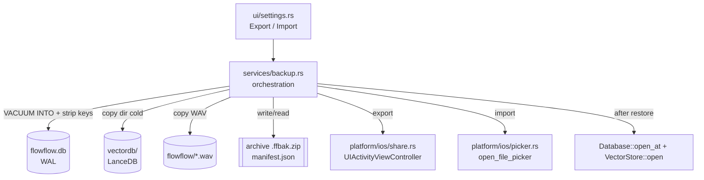
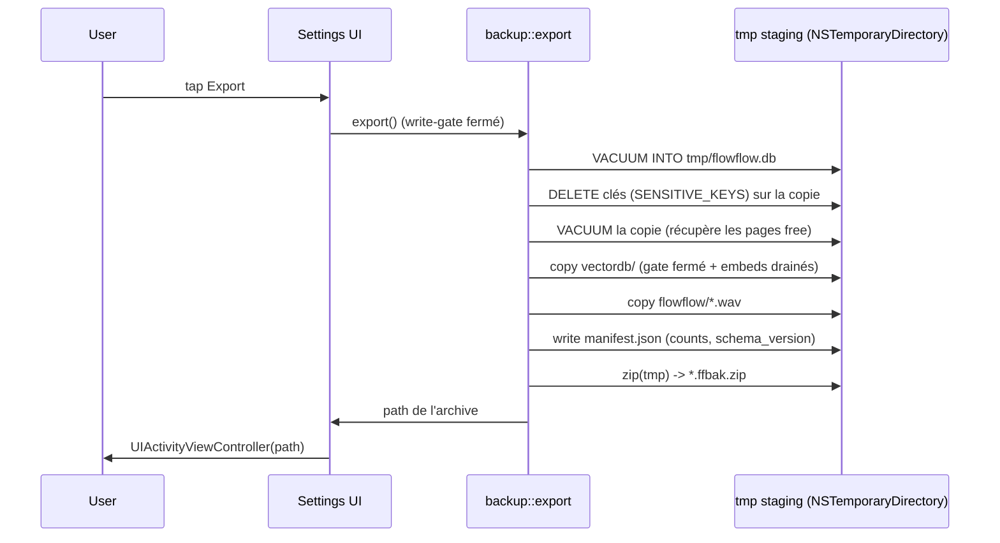
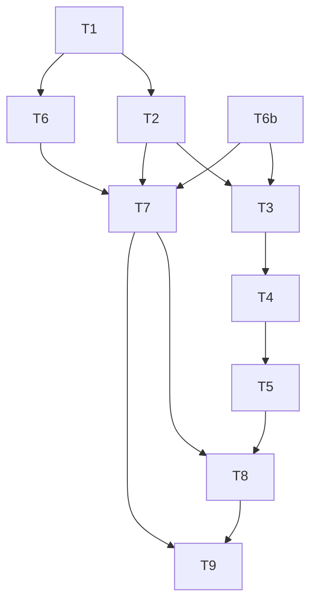

# 0001 — Backup, export & restore des données FlowFlow

## 1. Summary

FlowFlow n'a aucun mécanisme de sauvegarde interne : toutes les données (notes, dossiers,
tags, conversations, attachments, audio, vecteurs) vivent dans le conteneur de l'app, sans
recours en cas de perte du téléphone, de réinstallation ou d'un changement de signature.

Ce RFC recommande une **archive zip auto-portante** : snapshot SQLite consistant via
`VACUUM INTO` (clés API expurgées), copie du dossier LanceDB `vectordb/`, copie des WAV, le
tout décrit par un `manifest.json` versionné. Export via la feuille de partage native iOS,
import en **replace total** validé puis appliqué au **prochain cold launch** (staging hors
Documents → validation → swap per-store du trio db/vectordb/audio → réouverture). Aucune
dépendance cloud, aucune clé exposée.

Impact : une nouvelle couche `src/services/backup.rs` + un module de partage iOS, deux boutons
dans Settings, et l'ouverture des chemins de stores existants. Aucune migration de schéma
SQLite. La crate `zip` est déjà présente. Risque principal : la cohérence de l'aller-retour
sur trois stores hétérogènes, traité par la stratégie atomique et le manifest.

## 2. Context / Codebase

### Affected modules
- `src/services/backup.rs` — **nouveau** : orchestration export/import, archive, manifest, sanitization, swap atomique.
- `src/db/mod.rs` — `db_path()` → `Documents/flowflow.db`, ouverture WAL (`PRAGMA journal_mode=WAL`), `migrate()`. Cible pour le snapshot et la réouverture.
- `src/services/vectordb.rs` — `vectordb_path()` → `Documents/vectordb`, `VectorStore::open()` (async, `lancedb::connect`). Dossier Lance à copier/swapper.
- `src/services/audio.rs` — `output_dir()` → `Documents/flowflow/`, `recording_*.wav`. Chemins **relatifs** en DB depuis migration v4.
- `src/db/settings_repo.rs` — `get_setting`/`set_setting` sur table `settings` (key-value). Source des clés API à exclure.
- `src/platform/ios/mod.rs` + **nouveau** `src/platform/ios/share.rs` — `documents_dir()`, partage `UIActivityViewController` (à créer).
- `src/platform/ios/picker.rs` — `open_file_picker(extensions)` (UIDocumentPicker, copie le fichier choisi). Réutilisé pour l'import.
- `src/ui/settings.rs` — boutons Export / Import + dialogues de confirmation + états visuels.
- `Cargo.toml` — `zip = "2"` (deflate) **déjà présent** ; `sha2` optionnel pour checksums.

### Key symbols
- `db_path()` — `src/db/mod.rs:17` — utilisé par `Database::open()`.
- `Database::open_at(PathBuf)` — `src/db/mod.rs:43` — ouvre + WAL + FK + `migrate()`. Réutilisable pour rouvrir après restore.
- `note_audios.file_path` — schema V5, `src/db/note_repo.rs:162` — les WAV sont référencés par **filename seul** (résolus via `resolve_audio_path`, `audio.rs:229`) → portabilité OK. (NB : `migrate_audio_paths_to_relative`, `db/mod.rs:102`, est du code v4 mort — colonne `notes.audio_file_path` droppée en V7.)
- `vectordb_path()` — `src/services/vectordb.rs:34` ; `VectorStore::open()` — `:113`.
- `output_dir()` / `resolve_audio_path()` — `src/services/audio.rs:213` / `:229`.
- `delete_all_audios` / `cleanup_orphan_audio` — `src/db/note_repo.rs:262` / `:237` — primitives utiles pour un reset avant restore.
- `open_file_picker` — `src/platform/ios/picker.rs:77` — patron pour ajouter le share sheet.

### Prior art
- ADR/RFC : aucun (premier RFC du repo, `docs/rfcs/` créé pour ce document).
- PRD source : `docs/prd/data-backup-export/prd.md` (status: ready) + `tasks.md` (6 parents / 24 sous-tâches).
- Postmortem connexe : `docs/stories/2026-05-29-appstore-screenshots-stuck...md` (pattern iris API, non lié au backup).
- Tests existants pertinents : `tests/lancedb_ios.rs` (open_store, vector_search), `tests/attachment_test.rs` (migrations + CRUD + cascade).

### Execution flows touched
- `App → Documents_dir` / `App → Open` : init des stores au démarrage (handles `Database`, `VectorStore` posés dans l'état Dioxus). Restore doit reconstruire ces handles.
- `resolve_audio_path → Documents_dir` : lecture/écriture WAV.
- `embed_note → Open` / `embed_attachment → Open` : pipeline d'embedding (pertinent uniquement si on choisissait le re-embed à l'import — voir alternatives).

## 3. Problem & Motivation

### Current state
Trois stores hétérogènes coexistent sous `Documents/` :
1. `flowflow.db` (SQLite, **WAL**) — notes, dossiers, tags, conversations, attachments, settings.
2. `vectordb/` (dataset LanceDB on-disk : fragments + manifest + index) — vecteurs d'embeddings.
3. `flowflow/recording_*.wav` (audio brut).

Aucun chemin programmatique ne les sort de l'app. Le seul contournement (`Xcode → Download
Container`) exige une app **signée dev** et un Mac câblé : inutilisable par un utilisateur App Store.

### Pain (qui, fréquence, coût)
- **Mirko (maintenant)** : à chaque réinstallation / changement de signature dev → distribution, risque de perte totale. Déjà vécu (l'app dev-signée disparaît au bout de quelques jours).
- **Utilisateurs App Store (à venir)** : la valeur du produit est la mémoire personnelle ; une perte = perte de confiance définitive. Coût = churn + réputation.

### Why now (trigger)
v1.0 est en revue App Store. Le passage dev → distribution et la migration vers de vrais
utilisateurs rendent l'absence de backup un **risque produit bloquant** dès la première mise à jour.

### Signals
- 0 mécanisme d'export aujourd'hui (mesurable : aucune fonction dans le code).
- Incident réel documenté : disparition de l'app dev-signée → motivation directe du PRD.

## 4. Goals / Non-Goals

### Goals (mesurables)
1. Exporter 100 % des données dans **une archive unique** depuis Settings, sans Xcode ni câble.
2. Aller-retour fidèle : export → import restitue notes/audio/tags/conversations + recherche sémantique **identiques** (0 perte).
3. Partager l'archive via la **feuille de partage native iOS** (AirDrop, Fichiers, mail, cloud perso).
4. Import = **replace total atomique** : un échec laisse les données courantes **intactes** (0 corruption).
5. **0 clé API** dans l'archive (vérifiable par inspection).

### Non-Goals (explicitement hors scope)
- Pas de sync auto ni de backup cloud géré (iCloud/CloudKit, backend).
- Pas de backup planifié en arrière-plan (export = action manuelle).
- Pas de merge ni de résolution de conflits (import = remplace, pas fusion).
- Pas d'export sélectif (note par note) dans cette version.
- Pas de chiffrement par mot de passe (donc clés exclues, non incluses chiffrées).
- Pas de format interopérable avec d'autres apps (archive propre à FlowFlow).

## 5. Alternatives Considered

### Alt 0 — Status quo (Xcode Download Container)
- **Résumé** : ne rien construire ; s'appuyer sur l'extraction de conteneur via Xcode.
- **Résout** : un backup ponctuel pour le développeur uniquement.
- **Pros** : 0 code, déjà fonctionnel aujourd'hui.
- **Cons** : exige app **dev-signée** + Mac + câble + Xcode ; **inutilisable par un utilisateur App Store** (la cible du PRD) ; pas de restore in-app.
- **Coût** : nul. **Réversibilité** : n/a.
- **Verdict** : rejeté (ne résout pas le problème pour la cible).

### Alt 1 — Backup cloud géré (iCloud / CloudKit)
- **Résumé** : synchroniser automatiquement les stores vers iCloud.
- **Résout** : durabilité + multi-appareils, transparent.
- **Pros** : zéro action utilisateur, résilient à la perte d'appareil.
- **Cons** : **Non-goal explicite du PRD** (zéro cloud tiers) ; complexité majeure (conflits, sync deltas sur 3 stores, Lance non sync-friendly) ; entitlements + quotas ; surface de sécurité (données hors appareil).
- **Coût** : XL. **Réversibilité** : faible (couplage iCloud).
- **Verdict** : rejeté (contredit les contraintes produit).

### Alt 2 — Archive zip auto-portante, snapshot complet (RECOMMANDÉ)
- **Résumé** : zip contenant `manifest.json` + `db/flowflow.db` (snapshot `VACUUM INTO`, clés expurgées) + `vectordb/**` + `audio/*.wav`. Export → share sheet. Import → staging + validation + swap atomique + réouverture.
- **Résout** : durabilité + portabilité + restore offline complet, 100 % local.
- **Pros** : offline total ; aller-retour **exact** (vecteurs inclus, pas de re-calcul) ; pas de clé requise au restore ; `zip` déjà présent ; restore rapide (copie, pas d'embedding).
- **Cons** : archive plus volumineuse (WAV + vecteurs) ; couplage au format on-disk LanceDB/arrow entre versions d'app (atténué par manifest + même app) ; logique de swap atomique à écrire soigneusement.
- **Coût** : L. **Réversibilité** : élevée (format interne, modifiable).
- **Réfs** : SQLite `VACUUM INTO` (doc officielle), LanceDB dataset = répertoire copiable à froid, crate `zip` (déjà utilisée pour DOCX).

### Alt 3 — Archive métadonnées seules + re-embed à l'import
- **Résumé** : zip SQLite (sanitisé) + WAV, **sans** `vectordb/` ; reconstruire les vecteurs à l'import via OpenAI.
- **Résout** : durabilité + portabilité avec archive plus petite et auto-réparante (insensible au format Lance).
- **Pros** : archive minimale ; pas de couplage au format Lance ; vecteurs toujours « frais ».
- **Cons** : **chicken-and-egg** — les clés API sont exclues de l'archive, donc une app vierge restaurée n'a **pas de clé** → re-embed impossible avant que l'utilisateur ressaisisse sa clé OpenAI ; nécessite **réseau** ; **coût $** (ré-embedding de tout le corpus) ; lent (500 notes × chunks) ; viole partiellement le goal « restore offline qui marche immédiatement ».
- **Coût** : M (réutilise `embed.rs`). **Réversibilité** : élevée.
- **Verdict** : rejeté comme stratégie primaire ; conservé comme **fallback** futur (bouton « reconstruire l'index ») si le format Lance casse entre versions.

### Alt 4 — Dump SQL logique (texte) + vecteurs
- **Résumé** : exporter un `.sql` (INSERTs) au lieu du fichier binaire `.db`.
- **Pros** : lisible, robuste aux changements de page-format SQLite.
- **Cons** : plus lent, plus gros que `VACUUM INTO` pour des blobs ; toujours besoin de gérer `vectordb/` séparément ; aucun gain réel vs snapshot binaire pour un usage interne mono-app.
- **Coût** : M. **Verdict** : rejeté (complexité sans bénéfice ici).

## 6. Proposed Design

### Architecture overview



### Archive layout

```
flowflow-backup-YYYYMMDD-HHMMSS.ffbak.zip
├── manifest.json
├── db/
│   └── flowflow.db          # snapshot VACUUM INTO, lignes clés API supprimées
├── vectordb/                # copie intégrale du dataset LanceDB
│   └── ... (fragments, manifest Lance, index)
└── audio/
    └── recording_*.wav      # noms = filenames relatifs déjà stockés en DB
```

`.ffbak.zip` = zip standard avec extension custom (le picker filtre dessus ; le share sheet
l'expose tel quel). Reste un zip valide → inspectable.

### Data model — `manifest.json`

```json
{
  "format": "flowflow-backup",
  "archive_version": 1,
  "schema_version": 7,
  "app_version": "1.0.0",
  "lance_format": "lancedb-0.27.2 / arrow-57",
  "created_at": "2026-05-30T12:00:00.000Z",
  "counts": { "notes": 0, "folders": 0, "attachments": 0,
              "conversations": 0, "audio_files": 0, "vector_chunks": 0 },
  "excluded": ["openai_api_key", "anthropic_api_key", "soniox_api_key"],
  "entries": [ { "path": "db/flowflow.db", "crc32": "..." } ]
}
```

- `schema_version` = `MAX(version)` de `MIGRATIONS`, **calculé dynamiquement** (jamais hardcodé ; actuellement **7** — V7 droppe `notes.audio_file_path`/`duration_secs`). **Règle de compat** : refuser l'import si `manifest.schema_version > app`. Si `<`, l'import passe et `migrate()` upgrade au boot. Anti-tamper : après ouverture de la DB stagée, faire confiance à `MAX(_migrations.version)` **réel** de la DB ; refuser s'il diffère du champ manifest.
- `lance_format` : informatif ; un mismatch majeur déclenche un avertissement (cf. risques), pas un refus dur tant que LanceDB ouvre le dataset.
- CRC32 : déjà calculé par la crate `zip` par entrée → intégrité quasi gratuite ; pas de `sha2` requis en v1.

### Aucune migration SQLite
Le backup lit le schéma existant ; il n'ajoute pas de table. La seule « version » introduite est
`archive_version` dans le manifest (versionnement du **format d'archive**, distinct du schéma DB).

### Export flow



Détails :
- `VACUUM INTO 'tmp/flowflow.db'` produit une **copie consistante** (frames WAL committés inclus), sans toucher la DB live. Sur la copie : `DELETE FROM settings WHERE key IN (SENSITIVE_KEYS)` **puis `VACUUM`** pour récupérer les pages libérées (sinon les octets `sk-...` survivent dans les pages free). `SENSITIVE_KEYS` = **une seule const** dans `settings_repo.rs` (pas une liste manuelle dans le manifest). Test : scanner les octets du `db/flowflow.db` final pour les préfixes de clés connus → 0 occurrence.
- Staging dans `temp_dir`/`NSTemporaryDirectory`, **pas** dans `Documents/` (exposé par l'app Files). Cleanup garanti sur **tout** chemin de sortie (succès, échec, panic).
- Copie de `vectordb/` valide **uniquement** write-gate fermé + embeds en vol drainés (cf. concurrence). Après copie, **valider** en ouvrant la copie stagée (`lancedb::connect` + `open_table`) avant de zipper.
- Zip en **streaming** par entrée via `std::io::copy(File::open(wav), zip)` — jamais `fs::read` d'un WAV entier — pour tenir les gros volumes.

### Import / restore flow

```mermaid
sequenceDiagram
    participant U as User
    participant S as Settings UI
    participant P as ios::picker
    participant B as backup::import
    participant M as main()/boot
    Note over U,B: Phase 1 — app en cours d'exécution
    U->>S: tap Import
    S->>P: open_file_picker([UTType ffbak])
    P-->>B: archive path (copiée par iOS)
    B->>B: unzip -> tmp/staging ; lire manifest
    B->>B: VALIDATE avant écriture (format, schema<=app, crc zip,<br/>open staged DB+vectordb, counts == manifest)
    alt invalide
        B-->>S: refus + raison (données intactes)
    else valide
        S->>U: confirm "ceci écrase vos données actuelles"
        U->>S: confirme
        B->>B: écrit marqueur pending_restore -> tmp/staging
        B-->>S: "Import prêt — relancez FlowFlow"
    end
    Note over M: Phase 2 — prochain cold launch, AVANT tout handle
    M->>M: détecte pending_restore
    M->>M: checkpoint+close (aucun handle ouvert encore)
    M->>M: per-store move courant -> *.bak (trio db+wal+shm, vectordb/, flowflow/)
    M->>M: move staging -> Documents
    M->>M: Database::open_at (migrate) + VectorStore::open
    alt succès
        M->>M: purge *.bak ; clés NON restaurées
    else échec
        M->>M: rollback *.bak (3 stores, all-or-nothing)
    end
```

**Atomicité (per-store, corrigé post-review)** : `std::fs::rename` ne *remplace pas* un répertoire
non vide (POSIX `ENOTEMPTY`) et ne merge pas. On procède donc store par store : `move courant ->
*.bak` (rename vers un nom inexistant, toujours légal) puis `move staging -> nom`. Pas d'atomicité
inter-stores : un crash entre deux stores laisse un état mixte → le rollback au boot vérifie les
**trois** stores ensemble (all-or-nothing : tout `*.bak` résiduel ⇒ on restaure tout). Pas de risque
EXDEV (tout sous `Documents/`, même fs). **WAL** : déplacer le trio `flowflow.db` + `-wal` + `-shm`
comme une unité, après checkpoint+close ; ne jamais laisser un `-wal` périmé à côté d'une db
importée (SQLite rejouerait des frames de l'ancienne DB → corruption).

**Handles live (corrigé post-review)** : `Database` est partagé en `Arc<Database>` cloné via
`Signal<Arc<Database>>` sur 18+ composants ; `VectorStore` n'est **pas** dans l'état (chaque appelant
ouvre le sien). On ne peut donc pas fermer la connexion SQLite en plein vol, et iOS n'offre aucune
API publique de relaunch (`exit(0)` = risque de rejet App Store, écran noir). **Décision : le swap
se fait au prochain cold launch**, dans `main()`/boot, **avant** la création de tout handle. Phase 1
ne fait que valider + stager + poser le marqueur `pending_restore` ; Phase 2 (boot) effectue le swap
puis ouvre les stores. Jamais de swap sous handles vivants. (v2 possible : handle unique central
derrière un `OnceLock<Mutex<…>>` pour fermeture in-process et swap à chaud.)

### Modules / files affected

| Fichier | Action | Détail |
|---|---|---|
| `src/services/backup.rs` | **NEW** | `export() -> PathBuf`, `import(archive) -> Result`, manifest, sanitize, swap |
| `src/db/mod.rs` | edit | helper snapshot `VACUUM INTO` ; exposer `db_path()` (déjà pub) ; réouverture |
| `src/services/vectordb.rs` | edit | exposer `vectordb_path()` (pub) ; pas de logique réseau |
| `src/services/audio.rs` | none/edit | `output_dir()` déjà pub |
| `src/db/settings_repo.rs` | edit | const liste des clés sensibles à exclure |
| `src/platform/ios/share.rs` | **NEW** | `share_file(path)` via `UIActivityViewController` |
| `src/platform/ios/mod.rs` | edit | `pub use share::share_file` |
| `src/platform/ios/picker.rs` | edit | accepter l'extension/UTType de l'archive |
| `src/ui/settings.rs` | edit | boutons + confirm + états (progress/succès/échec/re-saisie clés) |
| `Cargo.toml` | none | `zip` déjà présent ; `sha2` non requis en v1 |

### Cross-cutting
- **Sécurité** : clés jamais écrites dans l'archive (DELETE **+ VACUUM** sur la copie) ; staging hors `Documents/` ; jamais de valeurs `settings` dans les logs `[backup]` (counts/paths/tailles seulement) ; consent flag — voir Q5.
- **Concurrence (corrigé post-review)** : un modal ne suffit pas — `embed.rs` fait `std::thread::spawn` + `Runtime::new` + `VectorStore::open` **détachés**, hors état Dioxus. Introduire un **write-gate global** (`AtomicBool`/semaphore lu dans `embed.rs` avant chaque open/write LanceDB) ; drainer les embeds en vol et refuser tout nouveau spawn pendant un backup. Sans gate : la copie de `vectordb/` peut courir contre un writer (manifest Lance copié sans son fragment → dataset illisible) et un thread périmé peut écrire dans le store fraîchement swappé.
- **iOS sandbox** : staging en `temp_dir` ; archive finale partagée par le share sheet ; import copié par le picker (`open_file_picker`).
- **Compat** : `archive_version` + `schema_version` dans le manifest ; refus si archive plus récente que l'app.
- **Observabilité** : logs `eprintln!("[backup] ...")` cohérents avec le style existant (`[db]`, `[vectordb]`).

## 7. Drawbacks & Risks

### Drawbacks (inhérents)
- Replace total : aucun merge ; un import écrase tout (assumé par le PRD).
- Archive non chiffrée : qui obtient le fichier lit les notes (clés exclues atténuent la fuite de secrets, pas du contenu).
- Taille : WAV non compressés + vecteurs → archive potentiellement lourde.

### Risques

| Risque | Probabilité | Impact | Mitigation |
|---|---|---|---|
| Swap sous handles vivants (`Arc<Database>` cloné 18×, `exit()` interdit iOS) | Élevée si in-process | **Critique** | Swap au **cold launch** avant tout handle ; jamais en plein vol |
| Embed détaché écrit pendant la copie (`vectordb` illisible / store swappé pollué) | Moyenne | Élevé | write-gate global dans `embed.rs` ; drainer + refuser les spawns pendant un backup |
| Clés survivent en pages free (DELETE sans VACUUM) | Élevée si oubli | Élevé | DELETE **puis `VACUUM`** sur la copie ; test byte-scan ; `SENSITIVE_KEYS` const unique |
| Sidecars WAL périmés (`-wal`/`-shm`) rejoués sur la db importée | Moyenne | Élevé | checkpoint+close ; déplacer le trio `db`+`wal`+`shm` comme une unité |
| Copie WAL incohérente (DB corrompue dans l'archive) | Moyenne si copie naïve | Élevé | `VACUUM INTO`, jamais de copie brute de `flowflow.db` |
| Staging plaintext visible dans l'app Files (`Documents` exposé) | Moyenne | Moyen | stager dans `temp_dir`/`NSTemporaryDirectory` ; cleanup sur tout chemin de sortie |
| `rename` ne remplace pas un dir non vide ; pas d'atomicité inter-stores | Élevée | Moyen | per-store `move->*.bak` puis `move staging` ; rollback all-or-nothing au boot |
| Format on-disk LanceDB diffère entre versions | Faible | Moyen | `lance_format` + smoke `vector_search` + compare `counts` ; fallback re-embed futur |
| Volume → export > 30 s / pression mémoire | Moyenne | Moyen | `io::copy` par entrée (jamais `fs::read` du WAV entier) ; progress UI ; Q1 |
| Archive plus récente que l'app | Faible | Moyen | Refus si `schema_version > app` + « mettez à jour FlowFlow » |

### Rollout / rollback
- Feature livrée **après** v1.0 App Store (non urgente, qualité prod).
- Rollback produit : la feature est additive (2 boutons) ; la retirer n'affecte pas les données.
- Rollback runtime (import raté) : `*.bak` restauré automatiquement.

### Gating metrics
- 0 perte sur aller-retour (test round-trip).
- 0 clé API dans l'archive (test d'inspection).
- 0 corruption sur import échoué (test fault-injection).

## 8. Open Questions

| # | Question | Owner | Deadline |
|---|---|---|---|
| 1 | Volume cible exact pour la métrique < 30 s (500 notes / 100 audios ?) | Mirko | avant impl 6.5 |
| 2 | Confirmation explicite « ceci écrase vos données » avant import — confirmé oui ? | Mirko | impl 5.3 |
| 3 | App plus ancienne face à une archive plus récente : refus dur (proposé) vs message dédié | Mirko | impl 4.2 |
| 4 | Swap au **cold launch** (retenu post-review) : UX du marqueur `pending_restore` + écran « relancez FlowFlow » — acceptable, ou viser le handle central in-process (v2) ? | Mirko | impl 4.5 |
| 5 | Le **consent flag** AI est-il restauré, ou re-consentement forcé (proposé : forcer) ? | Mirko | impl 4.5 |
| 6 | Chiffrement par mot de passe (autoriserait l'inclusion des clés) — backlog futur ? | Mirko | post-v1 |

## 9. Recommendation & Rationale

**Recommandation : Alt 2 — archive zip auto-portante, snapshot complet.** Confiance : **élevée**.

### Goals → mécanismes

| Goal | Mécanisme |
|---|---|
| Export complet en 1 archive | zip `manifest + db + vectordb + audio` |
| Aller-retour fidèle (0 perte) | snapshot binaire exact + vecteurs inclus (pas de recalcul) |
| Partage natif iOS | `UIActivityViewController` (`share.rs`) |
| Replace total atomique | staging → validate → `rename` swap → reopen → rollback `*.bak` |
| 0 clé API dans l'archive | `DELETE` des 3 clés sur la copie `VACUUM INTO` |

### Pourquoi pas les alternatives
- **Status quo** : ne marche que dev-signé + Xcode → exclut la cible App Store.
- **Cloud (iCloud)** : non-goal explicite + complexité de sync 3 stores.
- **Re-embed à l'import** : clés exclues ⇒ pas de clé au restore ⇒ re-embed bloqué ; + réseau + coût $ + lenteur ; casse le goal « restore offline immédiat ». Gardé comme **fallback** futur.
- **Dump SQL** : complexité sans bénéfice pour un usage mono-app interne.

### Revisit-if
- L'archive devient trop lourde pour le partage → ajouter export sélectif / compression audio.
- Le format LanceDB casse entre deux versions d'app → activer le fallback re-embed (Alt 3).
- Besoin de partager une archive avec les clés → introduire le chiffrement (Q6).

## 10. Implementation Plan

Aligné sur `docs/prd/data-backup-export/tasks.md` (6 parents), enrichi du « how » technique.

| ID | Titre | Fichiers | Deps | Effort | Acceptation |
|---|---|---|---|---|---|
| T1 | Format archive + `manifest.json` versionné | `backup.rs` | — | S | manifest sérialisé/désérialisé, `archive_version`+`schema_version` |
| T2 | Snapshot SQLite sanitisé (`VACUUM INTO` + DELETE clés) | `db/mod.rs`, `settings_repo.rs`, `backup.rs` | T1 | M | copie consistante, 0 clé, DB live intacte |
| T3 | Collecte vectordb/ + audio en staging | `vectordb.rs`, `audio.rs`, `backup.rs` | T2 | S | staging complet, écritures bloquées pendant la copie |
| T4 | Empaquetage zip streaming + écriture partageable | `backup.rs` | T2,T3 | S | `*.ffbak.zip` valide, CRC par entrée |
| T5 | Share sheet iOS (`UIActivityViewController`) | `platform/ios/share.rs`, `mod.rs` | T4 | M | feuille native s'ouvre, annulation propre |
| T6 | Import : picker + unzip staging + validation pré-écriture | `picker.rs`, `backup.rs` | T1 | M | refus net si invalide, données intactes |
| T6b | Write-gate global embed (drain + refus spawn pendant backup) | `embed.rs`, `backup.rs` | — | M | aucun embed concurrent pendant export/swap |
| T7 | Swap **cold-launch** per-store + rollback `*.bak` | `backup.rs`, `db/mod.rs`, `vectordb.rs`, `main.rs` | T6, T6b | L | swap au boot ; trio WAL déplacé ; échec → rollback all-or-nothing ; clés non restaurées |
| T8 | UI Settings : Export/Import + confirm + états | `ui/settings.rs` | T5,T7 | M | confirm replace, progress, succès/échec, invite clés |
| T9 | Tests & validation | `tests/` | T7,T8 | M | round-trip, exclusion clés, échec, appareil vierge, perf |

### Dependency graph



### Verification plan
- **Unit** : sérialisation manifest ; sanitization (asserts 0 clé) ; validation de version (refus si archive > app).
- **Integration** (`tests/`) : round-trip export→import sur base réaliste, asserts notes/audio/tags/conversations identiques + recherche sémantique fonctionnelle ; import d'archive corrompue → refus + DB intacte ; import sur store vierge → restitution complète.
- **Perf** : mesurer durée d'export sur le volume cible (Q1), viser < 30 s.
- **Fault injection** : tuer le process entre swap et reopen → vérifier rollback `*.bak` au lancement.

## 11. Review Findings

Revue adverse (subagent, code-grounded). Toutes les BLOCKERs ont été repliées dans les sections
6-10 ; ce tableau trace findings → disposition.

| # | Sév | Finding | Disposition |
|---|---|---|---|
| 1 | BLOCKER | `schema_version` hardcodé 6, mais `MIGRATIONS` va jusqu'à **V7** (droppe `notes.audio_file_path`/`duration_secs`) → off-by-one, compat mal calibrée | **Fixé** : §6 calcule `MAX(version)` dynamiquement, manifest = 7 |
| 2 | BLOCKER | Preuve de portabilité audio périmée : cite `migrate_audio_paths_to_relative` (code v4 mort, colonne droppée). Vrai chemin = `note_audios.file_path` (V5) | **Fixé** : §2 re-grounde sur `note_audios.file_path` + test round-trip à ajouter |
| 3 | BLOCKER | « modal bloque les writes » inapplicable : `embed.rs` `thread::spawn` + `Runtime::new` + propre `VectorStore::open` détachés | **Fixé** : §6 write-gate global + drain ; tâche T6b ajoutée |
| 4 | BLOCKER | Drop des handles impossible : `Database` = `Arc` cloné 18× via `Signal` ; `VectorStore` pas dans le state | **Fixé** : §6 swap au cold launch, pas de drop in-process |
| 5 | BLOCKER | « redémarrer l'app » non applicable iOS (`exit(0)` = rejet) → swap sous inodes renommés = corruption | **Fixé** : §6 Phase 2 swap au boot avant tout handle ; marqueur `pending_restore` |
| 6 | BLOCKER | `DELETE` post-`VACUUM INTO` laisse les octets clés en pages free | **Fixé** : §6 DELETE **puis** `VACUUM` ; test byte-scan ; `SENSITIVE_KEYS` const |
| 7 | MAJOR | Sidecars `-wal`/`-shm` non traités → rejoués sur la db importée | **Fixé** : §6 trio db+wal+shm déplacé comme unité après checkpoint+close |
| 8 | MAJOR | `std::fs::rename` ne remplace pas un dir non vide ; pas d'atomicité inter-stores | **Fixé** : §6 per-store `move->*.bak` + rollback all-or-nothing |
| 9 | MAJOR | Copie Lance « à froid » non prouvée tant qu'un handle/embed écrit ; valider la copie | **Fixé** : §6 gate+drain + validation `connect`+`open_table` sur la copie stagée |
| 10 | MAJOR | CRC zip ≠ cohérence dataset Lance ni `counts` ; « 0 perte » non prouvé par CRC | **Fixé** : §6 ouvrir DB+vectordb stagés et asserter `counts == manifest` avant swap |
| 11 | MAJOR | Risque mémoire si `fs::read` du WAV entier | **Fixé** : §6 `io::copy` par entrée |
| 12 | MAJOR | Staging plaintext dans `Documents/` (visible app Files) ; pas de cleanup-on-error | **Fixé** : §6 staging en `temp_dir` + cleanup sur tout chemin de sortie |
| 13 | MINOR | Logs `eprintln!` ne doivent jamais imprimer les valeurs `settings` | **Fixé** : §6 whitelist counts/paths/tailles |
| 14 | MINOR | `lance_format` soft-warn peut succeed-but-misread (vecteurs faux silencieux) | **Fixé** : §6/§7 smoke `vector_search` + compare counts |
| 15 | MINOR | Trou compat : faire confiance au `MAX(_migrations.version)` réel, pas qu'au manifest | **Fixé** : §6 anti-tamper |
| 16 | NIT | `counts` lus sur la DB live (drift possible) | **Fixé** : §6/§10 counts calculés sur le snapshot sanitisé |
| — | OK | `VACUUM INTO` supporté (rusqlite 0.34 → SQLite 3.49.1) | conservé |
| — | OK | Pas de chemins absolus dans un dataset Lance → portable si copié quiescent | conservé |
| — | OK | Pas de risque EXDEV (même fs `Documents/`) | conservé |

**Résultat** : 6 BLOCKERs + 6 MAJORs corrigés dans le design avant acceptation. Aucune BLOCKER
ouverte. La nature du swap a changé (cold-launch, pas in-process) — c'est le changement le plus
structurant et il conditionne T7.
