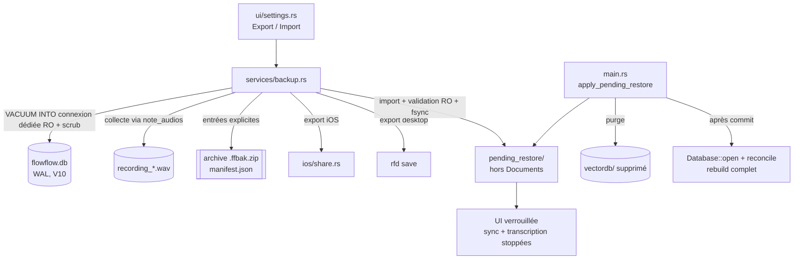
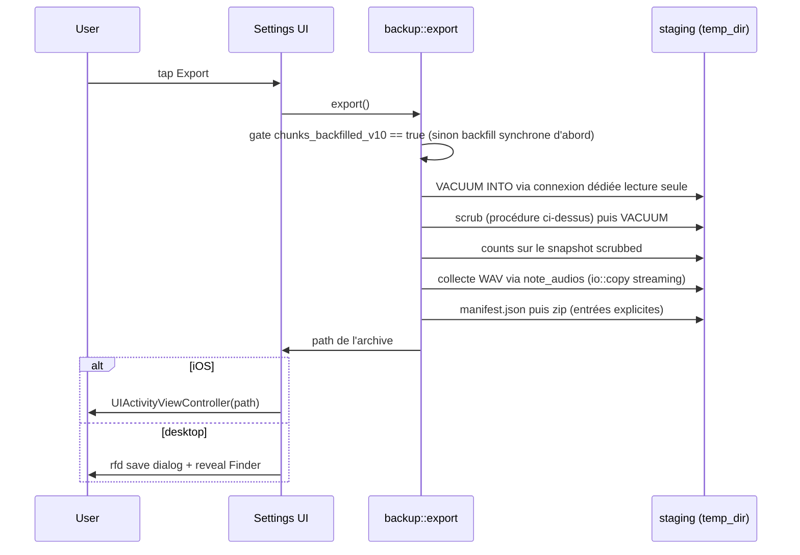
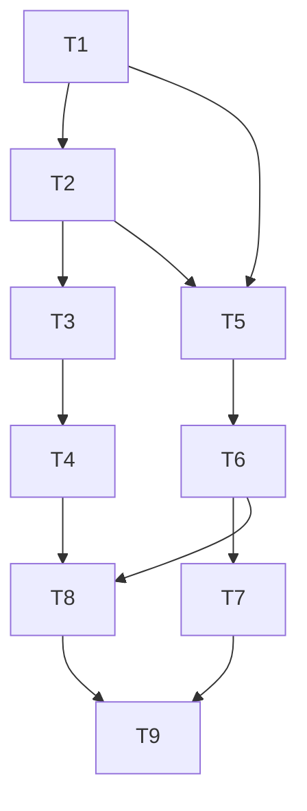

# 0001 - Backup, export & restore des données FlowFlow

> RÉVISION 2 (2026-06-11). La v1 (2026-05-30) a été écrite au schéma V7, avant la
> sync LAN P2P (RFC 0004, schéma V10) et avant l'app desktop macOS. Cette révision
> intègre les deux : l'archive n'embarque plus `vectordb/` (les vecteurs vivent en
> BLOB dans SQLite depuis V10), et la sémantique du restore face aux pairs de sync
> est spécifiée. Audit de péremption + revue adverse v2 (4 reviewers code-grounded,
> 4 BLOCKERs / 16 MAJORs corrigés, §11) menés le 2026-06-11. Acceptée par Mirko le
> 2026-06-11.

## 1. Summary

FlowFlow n'a aucun mécanisme de sauvegarde interne : toutes les données (notes,
dossiers, tags, conversations, attachments, audio, vecteurs, rappels) vivent dans le
conteneur de l'app, sans recours en cas de perte de l'appareil, de réinstallation ou
d'un changement de signature. Avec la sync LAN livrée, exposer la sync au public sans
filet de restauration violerait la prime directive (zéro perte de données).

Ce RFC recommande une **archive zip auto-portante** : snapshot SQLite consistant via
`VACUUM INTO` (secrets et état appareil-local expurgés) + fichiers WAV, décrits par un
`manifest.json` versionné. **Plus de copie de `vectordb/`** : depuis V10, chaque
vecteur vit en BLOB dans la table `chunks` de SQLite et LanceDB est un cache dérivé
que la passe boot (`backfill_legacy_chunks` + `reconcile_once`) reconstruit
hors-ligne, sans appel API. Export via la feuille de partage native iOS et via
dialogue fichier sur desktop. Import en **replace total** validé puis appliqué au
**prochain cold launch** : staging fsync-é -> phase 2 en tête de `main()` qui
checkpoint l'ancienne DB, la met de côté, **purge `vectordb/`** et committe par un
unique rename de fichier - exactement le pattern crash-safe single-file déjà testé en
régression (#27). L'app est verrouillée sur un écran « redémarrage requis » entre la
mise en staging et le cold launch (sync et transcriptions stoppées).

L'archive exclut TOUS les secrets : clés API, clé privée Noise, PSK d'appairage. Les
appairages (`sync_peers`) sont retirés du snapshot ; l'identité de données
(`sync_device_id`, `sync_seq`, `sync_row_meta`) est conservée. Le marqueur
`sync_restored_pending` et le plancher de seq `sync_restored_floor` sont écrits DANS
la DB stagée (atomiques avec le commit). Après restore, l'utilisateur ré-appaire ;
le protocole converge via des sessions full-state où le pair intact fait autorité
(mécanisme T19 de RFC 0004, étendu : drapeau `restored` + floor dans le HELLO, suivi
par pair, exemption des créations post-restore, garde HLC contre les version vectors
recyclés).

Impact : une nouvelle couche `src/services/backup.rs`, un module de partage iOS, un
dialogue fichier desktop (`rfd`), deux boutons dans Settings, un hook de swap en tête
de `main()`, trois amendements ciblés du protocole de sync. Aucune migration de
schéma SQLite.

## 2. Context / Codebase

### Affected modules
- `src/services/backup.rs` - **nouveau** : orchestration export/import, archive, manifest, scrub, `apply_pending_restore`.
- `src/db/mod.rs` - `db_path()` (`:30`), `desktop_data_dir()` (`:52`), `migrate_legacy_temp_data()` (`:84-134`, pattern crash-safe #27 single-file), `Database::open_at()` (`:147`, WAL + FK + `migrate()` + `init_sync` - **jamais utilisé pour la validation**, cf. §6), `checkpoint_wal()` (`:187`).
- `src/db/schema.rs` - `MIGRATIONS` V1->V10 (`:1-12`). V10 : `sync_row_meta` (version vectors + tombstones), `sync_seq`, `sync_peers` (watermarks + gc_horizon), `sync_conflicts`, `chunks` (BLOB vecteurs, `:221-236`).
- `src/db/settings_repo.rs` - `get_setting`/`set_setting`. Cible des consts de scrub (n'existent pas encore).
- `src/db/sync_meta.rs` - `DEVICE_ID_KEY`, `ensure_device_id` (INSERT OR IGNORE à chaque open), `install_sync_triggers` (hook V10), `tombstone_entity`, triggers vv (`:116-140`).
- `src/services/sync/peers.rs` - `STATIC_PRIVKEY_KEY`/`STATIC_PUBKEY_KEY`/`PSK_KEY_PREFIX` (`:17-19`), `ensure_sync_identity` (`:96-128`, régénère le keypair s'il manque), `bind_peer` (`:139-165`, deux seuls call sites = la cérémonie d'appairage), `unpair` (`:411-416`, reset watermark + gc_horizon + ack book).
- `src/services/sync/engine.rs` - `SyncEngine::start`, `run_pass` (sessions par pair séquentielles, `:313-341`), `run_gc` (`:214,354`).
- `src/services/sync/gc.rs` - ack book `sync_peer_acked_by_*` (`:32-48`), `min_acked` (`:63-67`), avance de `gc_horizon` (`:82-89`).
- `src/services/sync/protocol/session.rs` - HELLO (`:111-123`), détections natives `peer_restored`/`peer_stale_gc` (`:114-117`), `reseed_after_restore` (`:148-187`, renumérote en préservant l'ordre, ne touche pas les vv `:144-147`), credentials (`:318-332`).
- `src/services/sync/protocol/apply.rs` - apply en tx IMMEDIATE ; règle autorité « absent localement = supprimé » + archivage (`:612-650`) ; branche non-autorité (`:651-665`) ; chemins AlreadyCurrent/TakeRemote/Concurrent (`:696-826`) ; machine à états reminders (`:135-155`, `:271-423`).
- `src/services/sync/vv.rs` - comparaison de version vectors (`:25-41`).
- `src/services/sync/conflict.rs` - archivage (chemin Concurrent uniquement, `:52-70`).
- `src/services/sync/reconcile.rs` - `run_boot_reconcile` = `backfill_legacy_chunks` (`:77-121`, lit LanceDB, pose `chunks_backfilled_v10` même à zéro ligne `:118`) + `reconcile_once` (`:167-204`, **diff par id uniquement**, `content_hash` jamais comparé) ; thread détaché (`:208-248`). `reconstruct_from_blob` (`:123-145`) n'a aucun appelant production.
- `src/services/vectordb.rs` - `vectordb_path()` (`:34`, seam `FLOWFLOW_VECTORDB_PATH`) ; table manquante => résultats vides (`:196-200,289-293`) ; `ensure_fts_index` (`:258-280`).
- `src/services/audio.rs` - `output_dir()` (`:213`), `wav_path()` (`:241-246`, **`recording_{unix_seconds}.wav`** - PAS uuid, collisions cross-lineage possibles), `resolve_audio_path()`.
- `src/db/note_repo.rs` - `cleanup_orphan_audio` (`:298-321`, filtre extension .wav, non récursif), `all_audio_paths` à exposer.
- `src/platform/ios/mod.rs` + **nouveau** `src/platform/ios/share.rs` - partage `UIActivityViewController`.
- `src/platform/ios/picker.rs` - `open_file_picker(extensions)` (`:121-133`).
- `src/platform/ios/sync_ffi.rs` - observer `DidEnterBackground` (`:126-152`) ; **aucun** observer foreground n'existe (à créer pour le verrou restore).
- `src/ui/mod.rs` - boot `App()` (`:44-66`) : premier handle DB, `cleanup_orphan_audio`, `run_boot_reconcile`, observer checkpoint iOS, `SyncEngine::start`, gate `ai_consent`.
- `src/main.rs` - `main()` (`:24-48`) store-free avant `dioxus::LaunchBuilder` : point d'insertion du swap. iOS : `main()` ne tourne qu'au **cold launch** (suspend/resume ne repasse pas par lui).
- `Cargo.toml` - `zip = "2"` déjà présent ; **nouveau** `rfd` (desktop, gated `#[cfg(not(target_os = "ios"))]`).
- `Dioxus.toml` - `UIFileSharingEnabled` + `LSSupportsOpeningDocumentsInPlace` (`:27-28`) : `Documents/` est potentiellement exposé à l'app Fichiers -> le staging d'import ne doit JAMAIS y vivre.

### Key facts (audit + revue, 2026-06-11)
- Schéma SQLite max = **V10** (`MAX(version)` de `MIGRATIONS`, jamais hardcodé).
- Les vecteurs sont dupliqués en BLOB dans `chunks` (V10) **une fois le backfill
  accompli** (`chunks_backfilled_v10`) ; l'ordre d'écriture du pipeline embed est
  SQLite-first (vérifié) ; LanceDB = cache dérivé.
- Boot reconcile = diff par id ; il n'est un rebuild complet QUE si LanceDB est vide.
  Ids de chunks déterministes (`note:{id}:{idx}`, `att:{id}:{idx}`).
- Secrets en `settings` : 3 clés API + `sync_static_privkey` + `sync_psk_*` (préfixe
  dynamique). Le keypair et les PSK sont des bytes aléatoires en base64 : un byte-scan
  ne peut les trouver QUE si leurs valeurs sont capturées avant scrub.
- T19 (même appareil) : `peer_restored` compare l'ack RETENU par le pair intact à
  notre `next_seq` ; `peer_stale_gc` compare notre ack (0 après ré-appairage) à son
  `gc_horizon`. Ces détections survivent au scrub de NOTRE archive ; elles meurent si
  le pair intact fait unpair+re-pair (reset watermark/gc_horizon/ack book).
- La règle autorité full-state ré-supprime AUSSI les lignes créées sur l'appareil
  restauré entre restore et première session (`apply.rs:612-622`, documenté).
- `sync_seq` ne contient que la ligne self ; `sync_conflicts.losing_vector_ref` ne
  référence rien hors snapshot. `ai_consent` absent == vide == révoqué (vérifié).
- Boot avec identité + row meta + zéro pair : propre, aucun code ne suppose
  `sync_peers` non vide (vérifié engine/gc/session).
- Layouts : iOS = `Documents/` (db racine, `vectordb/`, WAV dans `flowflow/`,
  imports `flowflow_import/`) ; macOS = `~/Library/Application Support/FlowFlow`
  (tout à la racine). Seams `FLOWFLOW_DATA_DIR`, `FLOWFLOW_VECTORDB_PATH`.

### Prior art
- RFC 0004 (multidevice sync) : version vectors, tombstones, watermarks, T19.
- Issue #27 : pattern crash-safe single-file (`VACUUM INTO` staging + rename atomique
  + retry au boot), implémenté et testé (`db/mod.rs:84-134`, tests `:289-342`). Les
  tests couvrent staging périmé + non-écrasement ; PAS de trio ni de rollback - d'où
  le choix §6 de réduire le swap à un single-file rename.
- PRD source : `docs/prd/data-backup-export/prd.md` (scope étendu au desktop le
  2026-06-11).

## 3. Problem & Motivation

### Current state
Deux stores durables coexistent sous le data root (le troisième, `vectordb/`, est un
cache dérivé depuis V10) :
1. `flowflow.db` (SQLite, **WAL**) - notes, dossiers, tags, conversations, attachments,
   settings, rappels, transcriptions en attente, état de sync complet ET vecteurs (BLOBs `chunks`).
2. `recording_*.wav` (audio brut ; iOS sous `Documents/flowflow/`, desktop à la racine).

Aucun chemin programmatique ne les sort de l'app. Le seul contournement (`Xcode ->
Download Container`) exige une app signée dev et un Mac câblé : inutilisable par un
utilisateur App Store.

### Pain (qui, fréquence, coût)
- **Mirko (maintenant)** : à chaque réinstallation / changement de signature, risque de
  perte totale. Déjà vécu.
- **Utilisateurs App Store (à venir)** : la valeur du produit est la mémoire personnelle ;
  une perte = perte de confiance définitive.
- **Nouveau depuis la v1** : la sync LAN est livrée. La release publique avec sync est
  bloquée tant qu'il n'existe pas de backup/restore (décision backlog 2026-06-11).

### Why now (trigger)
La sync RFC 0004 est mergée et device-validée. C'est la prochaine release App Store.
On n'expose pas une feature qui réplique et supprime des données entre appareils sans
filet de restauration.

### Signals
- 0 mécanisme d'export aujourd'hui.
- Incident réel documenté (app dev-signée disparue).
- La GC des tombstones supprime physiquement de l'historique : sans backup, aucune
  récupération d'une suppression propagée par erreur.

## 4. Goals / Non-Goals

### Goals (mesurables)
1. Exporter 100 % des données utilisateur dans **une archive unique** depuis Settings,
   sans Xcode ni câble, sur iOS **et** desktop macOS.
2. Aller-retour fidèle : export -> import restitue notes/audio/tags/conversations/rappels
   identiques (0 perte) ; la recherche sémantique est reconstruite en arrière-plan au
   premier boot (résultats partiels possibles pendant la passe, signalés dans l'UI).
3. Partager l'archive : feuille de partage native iOS ; dialogue save desktop.
4. Import = **replace total atomique** : un échec laisse les données courantes
   **intactes** (0 corruption), y compris sur crash à n'importe quelle fenêtre du swap.
5. **0 secret** dans l'archive : clés API, clé privée Noise, PSK (test capture-then-scan).
6. Post-restore, la sync reconverge avec les pairs ré-appairés **sans résurrection
   silencieuse** de données supprimées et **sans perte des écritures post-restore**.

### Non-Goals (explicitement hors scope)
- Pas de sync auto ni de backup cloud géré.
- Pas de backup planifié en arrière-plan.
- Pas de merge à l'import (la reconvergence post-restore passe par la sync).
- Pas d'export sélectif.
- Pas de chiffrement par mot de passe (secrets exclus, non inclus chiffrés).
- Pas de format interopérable.
- Pas de restauration des notifications OS planifiées (lignes restaurées,
  re-planification = backlog).

## 5. Alternatives Considered

### Alt 0 - Status quo (Xcode Download Container)
Rejeté : exige app dev-signée + Mac + câble ; exclut la cible App Store.

### Alt 1 - Backup cloud géré (iCloud / CloudKit)
Rejeté : non-goal explicite (zéro cloud) ; complexité majeure ; données hors appareil.

### Alt 2a - Archive zip db + vectordb + audio (design v1, 2026-05-30)
- **Résumé** : zip 3 stores + write-gate global sur les writers LanceDB (T6b v1) +
  swap 3 stores au cold launch.
- **Cons (rédhibitoires depuis V10)** : la copie de `vectordb/` exige de geler des
  writers **non énumérables** (threads embed détachés, reconcile post-sync,
  `ensure_fts_index` sur le chemin de lecture RAG) ; couplage au format on-disk Lance ;
  archive plus lourde ; atomicité inter-stores à 3. Bénéfice nul : les mêmes vecteurs
  sont déjà dans le snapshot SQLite.
- **Verdict** : remplacé par Alt 2b.

### Alt 2b - Archive zip db + audio, LanceDB reconstruit au boot (RECOMMANDÉ)
- **Résumé** : zip `manifest.json` + `db/flowflow.db` (snapshot `VACUUM INTO` scrubbed)
  + `audio/*.wav`. Au premier boot post-restore, la passe reconcile reconstruit
  `vectordb/` (+ index FTS) depuis les BLOBs `chunks`, hors-ligne, sans clé API -
  à condition que le swap ait **purgé** l'ancien `vectordb/` (le reconcile diffe par
  id : sans purge, des vecteurs post-backup survivraient sous les mêmes ids, §6).
- **Pros** : archive minimale ; zéro couplage Lance ; **aucun write-gate LanceDB** ;
  `VACUUM INTO` sur connexion dédiée garantit seul la consistance du snapshot ;
  restore offline complet (l'objection chicken-and-egg de la v1 contre le re-embed
  est morte : la reconstruction ne passe plus par l'API).
- **Cons** : recherche sémantique partielle tant que la passe reconcile n'a pas fini
  (arrière-plan, signalée dans l'UI) ; `.db` plus gros (BLOBs) mais archive totale
  plus petite ; l'export doit être gated sur `chunks_backfilled_v10` (un export
  pendant un backfill V10 incomplet perdrait les vecteurs encore Lance-only).
- **Coût** : M. **Réversibilité** : élevée.

### Alt 3 - Archive métadonnées seules + re-embed API à l'import
Obsolète : subsumée par Alt 2b. Rejetée.

### Alt 4 - Dump SQL logique
Inchangé : complexité sans bénéfice. Rejeté.

### Identité sync dans l'archive (décision structurante)

| Option | Contenu archivé | Verdict |
|---|---|---|
| I-a : tout garder | device_id + keypair Noise + PSK + sync_peers | **Rejeté** : l'archive exfiltre des secrets ; restaurée sur un 2e appareil, elle clone une identité que le protocole ne sait pas détecter |
| I-b : strip secrets + appairages, garder l'identité de données | device_id + sync_seq + sync_row_meta + chunks + sync_conflicts ; SANS privkey/pubkey Noise, PSK, sync_peers, endpoints, ack book | **RECOMMANDÉ** : 0 secret ; lineage (version vectors, seq monotone) préservé ; ré-appairage explicite requis |
| I-c : régénérer l'identité au restore | comme I-b mais nouveau device_id | **Rejeté** : casse la continuité du lineage sans supprimer le vrai risque (les secrets) |

Pourquoi garder `sync_seq` (ligne self uniquement, vérifié) : réinitialiser le
compteur ferait ré-émettre des seq déjà ackés -> écritures invisibles sous le
watermark du pair. Conservé, le compteur est au pire en retard : cas détecté au HELLO
et réparé par `reseed_after_restore` (vérifié, `session.rs:114,148-187`).

### Résurrections post-GC après restore

Un restore ramène des lignes supprimées APRÈS le backup. Si le pair a encore les
tombstones, la sync les ré-supprime. S'il les a GC, la ligne ressuscitée passe pour
une création.

**Mécanisme retenu (R-b corrigé post-revue)** : marqueur `sync_restored_pending` +
plancher `sync_restored_floor` écrits **dans la DB stagée** dès la phase 1 (donc
atomiques avec le commit du swap - aucune fenêtre de crash ne peut produire un
appareil restauré qui ne se déclare pas). Tant qu'un pair n'a pas sa marque de
complétion `sync_restored_done_{peer}`, tout HELLO avec lui déclare
`restored: { floor }` ; le pair force alors la session full-state avec lui-même en
autorité (chemin T19 existant). Le marqueur global n'est retiré que lorsque TOUS les
pairs courants ont leur marque ; un pair appairé pendant que le marqueur est posé
hérite de l'obligation au bind. Champ HELLO ajouté = bump de la version protocole
(aucune version publique avec sync n'existe : coût nul).

**Justification corrigée** (la v2 initiale attribuait le besoin du drapeau au retrait
de l'ack book de l'archive - faux mécanisme) : les détections natives T19 vivent dans
l'état RETENU par le pair intact (`sync_peers.last_acked_seq`, `gc_horizon`) et
couvrent déjà la plupart des cas après un simple ré-appairage (qui préserve la ligne
pair). Mais cet état n'est PAS garanti de survivre : l'UX naturelle d'un pair dont la
sync erre contre un binding mort est unpair+re-pair, qui remet watermark, gc_horizon
et ack book à zéro et tue toute détection native. Le drapeau explicite couvre ce cas
et sert de signal auditable ; il est de la défense en profondeur, pas l'unique barrière.

**Exemption des créations post-restore (corrigé post-revue)** : la règle autorité
« absent localement = supprimé » attraperait aussi les lignes que l'utilisateur crée
entre le restore et la première session (archivées sur le MAUVAIS appareil, puis
supprimées partout - « j'ai restauré, écrit trois notes, appairé mon Mac, mes notes
ont disparu »). Contrairement au restore opaque de T19, NOTRE restore contrôle le
swap : `sync_restored_floor` = `next_seq` de la DB stagée, capturé en phase 1. Le
HELLO le transmet ; l'autorité exempte de la ré-suppression toute ligne du restauré
avec `origin_seq > floor` (créations authentiques). `reseed_after_restore` préserve
l'ordre (ROW_NUMBER OVER ORDER BY origin_seq) et remappe le floor de façon cohérente.

**Garde HLC contre les version vectors recyclés (corrigé post-revue)** : les vv
restaurés repartent de leurs anciens compteurs ; une édition post-restore produit un
vv (ex. `{R:4}`) DOMINÉ par l'état pré-perte du pair (`{R:5}`) alors que son contenu
est plus récent -> AlreadyCurrent/TakeRemote écraserait silencieusement l'édition la
plus fraîche, sans archive (vérifié `vv.rs:25-41`, `apply.rs:696-826`). Règle : dans
une session où l'un des côtés est restored-flagged, une ligne vv-dominée dont
`updated_hlc` est strictement plus récent que celui du vainqueur local prend le chemin
**Concurrent** (archive + tie-break déterministe) au lieu d'être silencieusement
écartée ou écrasée. La signature « dominé mais HLC plus récent » est précisément celle
d'une édition post-restore sur vv périmé.

### Rotation de clé à l'appairage (conséquence d'I-b, durcie post-revue)

`bind_peer` refuse un device_id déjà lié à une autre clé statique - et ses deux seuls
call sites SONT la cérémonie d'appairage : « autoriser le rebind en cérémonie »
reviendrait à supprimer purement le garde anti-hijack (un voleur de QR pourrait
remplacer silencieusement le binding d'un appareil existant, invisible dans la liste
des pairs). Décision durcie : le rebind d'un device_id existant exige une
**confirmation explicite sur l'appareil détenteur de l'ancien binding** (« <nom>
se présente comme <device_id> restauré avec une NOUVELLE clé - remplacer
l'appairage ? », fingerprints des deux clés affichés). Le rebind **préserve la ligne
`sync_peers` existante** (watermark + gc_horizon, nécessaires aux détections natives)
mais **efface l'ack book** `sync_peer_acked_by_{id}` (sinon la GC compterait un ack
périmé élevé entre le rebind et la première session). Une rotation répétée du même
device_id dans une fenêtre courte affiche un avertissement « identité possiblement
clonée - un backup = une lignée ».

## 6. Proposed Design

### Architecture overview



### Archive layout

```
flowflow-backup-YYYYMMDD-HHMMSS.ffbak.zip
├── manifest.json
├── db/
│   └── flowflow.db          # snapshot VACUUM INTO, scrubbed
└── audio/
    └── recording_*.wav      # collectés via note_audios.file_path
```

- `.ffbak.zip` = zip standard, extension custom, inspectable.
- **Pas de `vectordb/`** (Alt 2b).
- Audio collecté **par la liste `note_audios.file_path`** résolue via
  `resolve_audio_path()`, jamais par dossier. Un WAV référencé mais absent (sync sans
  transfert audio) est toléré et consigné dans `audio_missing`.
- **Les noms de WAV ne sont PAS uniques entre lignées** (`recording_{unix_seconds}.wav`,
  seconde près) : le manifest porte un CRC32 par fichier, utilisé par le swap pour la
  détection de collision (cf. phase 2).

### Data model - `manifest.json`

```json
{
  "format": "flowflow-backup",
  "archive_version": 1,
  "schema_version": 10,
  "app_version": "1.1.0",
  "platform": "ios",
  "device_id": "uuid-...",
  "created_at": "2026-06-11T12:00:00.000Z",
  "counts": { "notes": 0, "folders": 0, "attachments": 0, "conversations": 0,
              "audio_files": 0, "chunks": 0, "reminders": 0 },
  "audio_missing": ["recording_x.wav"],
  "excluded_settings": ["openai_api_key", "anthropic_api_key", "soniox_api_key",
                         "sync_static_privkey", "sync_static_pubkey", "ai_consent",
                         "sync_psk_*", "sync_peer_addr_*", "sync_peer_acked_by_*",
                         "sync_restored_*"],
  "excluded_tables": ["sync_peers", "pending_transcriptions"],
  "entries": [ { "path": "db/flowflow.db", "crc32": "..." },
               { "path": "audio/recording_123.wav", "crc32": "..." } ]
}
```

- `schema_version` = `MAX(version)` de `MIGRATIONS`, calculé dynamiquement. Règles de
  compat à la validation d'import : refuser si `> app` (« mettez à jour FlowFlow ») ;
  refuser si `< 10` (**plancher** : la table `chunks` naît en V10 ; une archive
  antérieure n'aurait pas ses vecteurs et le backfill post-restore lirait un LanceDB
  vide ou périmé, verrouillant la perte via `chunks_backfilled_v10`) ; sinon
  forward-migration standard au boot. NB : `migrate()` n'a pas de garde de downgrade -
  le refus à l'import est la SEULE barrière.
- `device_id` : permet à l'UI d'import d'afficher même-lignée vs autre-lignée (et de
  durcir l'avertissement dans le second cas). Zéro coût privacy : la DB scrubbed du
  zip le contient déjà. Cross-check anti-tamper à la validation
  (`manifest.device_id == settings.sync_device_id` de la DB stagée).
- `counts.audio_files` = `COUNT(*) FROM note_audios` (recomptable depuis la DB). Les
  WAV embarqués sont validés séparément : chaque `file_path` doit être une entrée
  `audio/` du zip OU figurer dans `audio_missing`.
- CRC32 par entrée : fourni par la crate `zip`.

### Scrub : ce qui sort, ce qui reste (sur la copie VACUUM INTO, jamais la DB live)

Consts dans `settings_repo.rs` (source unique, testée) :

```
SENSITIVE_SETTINGS            = [openai_api_key, anthropic_api_key, soniox_api_key,
                                 sync_static_privkey, sync_static_pubkey]
SENSITIVE_SETTING_PREFIXES    = [sync_psk_]
DEVICE_LOCAL_SETTINGS         = [ai_consent, sync_restored_pending, sync_restored_floor]
DEVICE_LOCAL_SETTING_PREFIXES = [sync_peer_addr_, sync_peer_acked_by_, sync_restored_done_]
```

Procédure sur la copie stagée :
1. Ouverture par **connexion rusqlite brute** (jamais `Database::open_at`, qui
   migrerait et mutterait le snapshot), avec `PRAGMA journal_mode=MEMORY` et
   `PRAGMA secure_delete=ON` AVANT les DELETEs - sinon un sidecar `-journal`/`-wal`
   du scrub peut retenir les octets des secrets et survivre à un crash.
2. `DELETE FROM settings WHERE key IN (...) OR key LIKE 'prefix%'` (les 4 listes),
   `DELETE FROM sync_peers`, `DELETE FROM pending_transcriptions`.
3. **`VACUUM`** (purge des pages libres - le contenu des cellules supprimées y
   survivrait sinon).
4. Assertion : aucun sidecar `-wal`/`-shm`/`-journal` à côté du fichier stagé ; le
   dossier de staging est recréé de zéro à chaque tentative d'export.
5. Le zip ajoute des **entrées explicites uniquement** (manifest, db, chaque WAV
   collecté) - jamais un walk du dossier de staging (un retry après crash de scrub
   pourrait sinon embarquer un sidecar porteur de secrets).

**Test de fuite (capture-then-scan, normatif pour T9)** : les secrets Noise/PSK sont
des bytes aléatoires en base64, introuvables par un scan aveugle. Le test (1) capture
AVANT scrub les valeurs des 4 listes sur la DB source (+ sentinelles seedées : fausse
clé `sk-...`, vrai appairage), (2) scanne CHAQUE entrée du zip pour chaque valeur
capturée ET chaque NOM de clé sensible, (3) ouvre la DB archivée en lecture seule et
asserte 0 ligne sur les 4 listes, 0 ligne `sync_peers`/`pending_transcriptions`,
(4) vérifie `counts` == snapshot scrubbed.

Justifications de rétention :
- `sync_device_id` + `sync_seq` + `sync_row_meta` + `sync_conflicts` : lineage (§5).
- `chunks` + `chunks_backfilled_v10` + `sync_meta_seeded` : vecteurs + gardes de seed.
- `language`, `rag_max_sources`, `llm_provider` : préférences portables. Si
  `llm_provider` désigne un provider dont la clé manque post-restore, la couche LLM
  dégrade déjà en erreur NotConfigured claire ; la Settings UI doit offrir la
  re-saisie de chaque clé référencée.
- `note_reminders` : données utilisateur ; les `reminder_id` OS orphelins post-restore
  sont l'état déjà toléré des reminders synchronisés depuis un autre appareil.

### Export flow



- **Gate backfill** : `chunks_backfilled_v10` doit valoir `true` avant le snapshot ;
  sinon une passe backfill synchrone s'exécute d'abord (état UI « préparation des
  données »). Un export pendant un backfill incomplet perdrait silencieusement les
  vecteurs encore Lance-only, et le flag posé post-restore verrouillerait la perte.
- **Connexion dédiée** : `VACUUM INTO` s'exécute sur une connexion rusqlite propre
  (lecture seule, busy_timeout posé), jamais à travers le `Mutex<Connection>` partagé -
  sinon l'UI et la sync gèleraient sur le mutex pendant toute la durée de l'export.
  En WAL, ce lecteur snapshot-isolé coexiste avec le writer IMMEDIATE de la sync :
  c'est ce qui rend l'export sans gate. Effet de bord attendu et loggé : un
  `wal_checkpoint(TRUNCATE)` concurrent (backgrounding iOS) retourne busy.
- Fenêtre résiduelle assumée : DB à T0, WAV à T1 ; un WAV créé entre les deux n'est
  pas référencé (ignoré), un WAV supprimé est consigné `audio_missing`.
- Staging en `temp_dir`, cleanup **best effort** (Drop sur unwind + purge OS de tmp +
  sweep des stagings périmés au prochain export) - « garanti » est inatteignable
  (SIGKILL, jetsam).
- Zip en streaming par entrée (`std::io::copy`).

### Import / restore flow

```mermaid
sequenceDiagram
    participant U as User
    participant S as Settings UI
    participant B as backup::import
    participant M as main() au cold launch
    Note over U,B: Phase 1 - app en cours d'exécution
    U->>S: tap Import
    S->>B: picker iOS / rfd desktop -> archive
    B->>B: unzip -> staging ; lire manifest
    B->>B: VALIDATE en LECTURE SEULE (connexion brute RO) :<br/>format, 10 <= schema <= app, crc par entrée,<br/>MAX(_migrations) == manifest, device_id == manifest,<br/>counts DB == manifest, WAV embarqués vs audio_missing,<br/>aucun sidecar
    alt invalide
        B-->>S: refus + raison (données intactes)
    else valide
        S->>U: confirm "ceci écrase vos données actuelles"<br/>(+ avertissement renforcé si autre lignée)
        U->>S: confirme
        B->>B: écrit sync_restored_pending + sync_restored_floor<br/>DANS la DB stagée (connexion brute)
        B->>B: fsync DB stagée + dossiers ; move -> pending_restore/<br/>(app container, HORS Documents)
        B->>S: écran bloquant "redémarrage requis"<br/>SyncEngine + TranscriptionManager stoppés
    end
    Note over M: Phase 2 - cold launch, tête de main(), AVANT db_path()
    M->>M: pending_restore/flowflow.db présent ? sinon skip
    M->>M: re-validation rapide (manifest, CRC db stagée, aucun sidecar)
    M->>M: WAV : copie vers dossier audio ; collision (CRC différent)<br/>-> ancien fichier déplacé dans restore_bak/ d'abord
    M->>M: checkpoint TRUNCATE + close ancienne DB ;<br/>suppression -wal/-shm résiduels
    M->>M: move flowflow.db -> restore_bak/flowflow.db (single file)
    M->>M: purge vectordb/ (cache dérivé, chemin résolu<br/>FLOWFLOW_VECTORDB_PATH inclus)
    M->>M: fsync dir ; rename pending_restore/flowflow.db -> data root (COMMIT) ; fsync dir
    M->>M: suppression du reste de pending_restore/
    Note over M: launch normal : migrate() + reconcile = rebuild complet<br/>(LanceDB vide) ; orphan-cleanup SKIPPÉ ce boot ;<br/>restore_bak/ purgé au PROCHAIN boot réussi
```

**Invariants normatifs du swap** :

1. `pending_restore/` vit dans le conteneur app **hors `Documents/`** (iOS :
   `Library/Application Support`, même volume que Documents -> rename atomique ;
   desktop : sous `desktop_data_dir()`). `Documents/` est exposable à l'app Fichiers
   (`UIFileSharingEnabled`) : un staging qui y vivrait serait lisible ET altérable
   entre validation et swap (TOCTOU). La phase 2 re-valide quand même (manifest
   présent, CRC de la DB stagée, aucun sidecar) avant de toucher quoi que ce soit.
2. **Prédicat de commit à deux facteurs** : commit acquis ssi `flowflow.db` existe au
   data root ET `pending_restore/flowflow.db` n'existe plus. Table d'états au boot :
   - `pending_restore/flowflow.db` présent -> restore en attente : (re)dérouler la
     phase 2 du début (chaque étape est idempotente : copies WAV vérifiées par CRC,
     checkpoint re-exécutable, moves re-testés).
   - absent + `restore_bak/` présent -> commit acquis : boot normal ; `restore_bak/`
     purgé à la FIN du prochain boot réussi (pas celui-ci).
   - échec irrécupérable avant commit -> rollback : remettre
     `restore_bak/flowflow.db` en place, restaurer les WAV mis de côté, supprimer
     `pending_restore/`, message d'erreur au boot. Si le rollback lui-même échoue,
     **abort du boot avec erreur visible** - ne JAMAIS retomber dans `db_path()` avec
     un data root sans DB (sur desktop, `migrate_legacy_temp_data` y réinstallerait
     un store antique que le prédicat prendrait ensuite pour le restore commité).
3. **Single-file, pas de trio** : avant la mise de côté, l'ancienne DB est ouverte par
   connexion brute, `PRAGMA wal_checkpoint(TRUNCATE)`, fermée, et les `-wal`/`-shm`
   résiduels supprimés. Le move de mise de côté et le rename de commit portent chacun
   sur UN fichier - le pattern exact, déjà testé en régression, de
   `migrate_legacy_temp_data` (#27). Aucun état « db sans son wal » n'est possible ;
   le hazard de rejeu de frames étrangères disparaît par construction. Sur retry,
   sweep systématique des `-wal`/`-shm` au data root avant le rename de commit.
4. **Durabilité** : la DB stagée vient d'un unzip (pas d'un VACUUM INTO syncé par le
   pager SQLite) -> `File::sync_all` sur la DB stagée + fsync des dossiers parents en
   phase 1, fsync du data root après chaque rename en phase 2. Sans ça, une coupure
   de courant peut rendre le rename durable mais pas le contenu - et la purge
   détruirait la seule copie saine. `restore_bak/` n'est de toute façon purgé qu'au
   boot réussi SUIVANT : si l'open de la DB restaurée échoue au premier boot et que
   `restore_bak/` existe, rollback automatique proposé.
5. **WAV et collisions** : noms `recording_{unix_seconds}.wav`, collisions
   cross-lineage réelles. Pour chaque WAV restauré : cible absente -> copie ; cible
   présente CRC identique -> skip (idempotence vraie) ; CRC différent -> l'ancien
   fichier est déplacé dans `restore_bak/` AVANT l'écrasement (restauré tel quel par
   le rollback). Aucun octet du state courant n'est détruit avant le commit.
6. **`vectordb/` purgé au swap** : le reconcile diffe par id et les ids de chunks sont
   déterministes - sans purge, un restore-in-place garderait à jamais les vecteurs et
   `chunk_text` post-backup sous les mêmes ids (RAG incohérent permanent, invisible
   sur un env de test vide). LanceDB vide => `reconcile_once` = rebuild complet +
   `ensure_fts_index` (vérifié). Cache dérivé : sa suppression est sûre même sur
   rollback (reconstruit depuis les chunks de l'ancienne DB).
7. **`cleanup_orphan_audio` est SKIPPÉ au premier boot post-restore** (gate sur
   `sync_restored_pending` ou `restore_bak/` présent) : il purgerait immédiatement
   les WAV de l'ancien état non référencés par la DB restaurée, supprimant tout
   recours après l'import d'une mauvaise archive. La fenêtre de recours court jusqu'au
   boot suivant (purge de `restore_bak/`).
8. **Verrou entre staging et cold launch (iOS)** : `main()` ne tourne qu'au cold
   launch ; home + retour = resume, l'app continuerait sinon d'écrire dans la DB
   condamnée (notes, transcriptions, sync entrante), écritures détruites au swap des
   jours plus tard. Dès la mise en staging : écran bloquant « redémarrage requis »
   (aucune création/édition), arrêt du SyncEngine et du TranscriptionManager pour le
   reste de la session, et détection de `pending_restore/` au boot de `App()` ET dans
   un nouvel observer `UIApplicationWillEnterForegroundNotification` (couvre aussi un
   `pending_restore` périmé d'une session précédente dont la phase 2 a échoué).
9. **Watchdog de lancement iOS** : la phase 2 tourne avant l'UI, dans le budget du
   watchdog (0x8badf00d). Elle logge sa progression par WAV et est kill-résumable en
   tout point (conséquence des invariants 2 et 5) ; le plan de fault-injection inclut
   un kill en pleine copie WAV sur gros corpus.

**Post-restore, côté sync** (mécanismes détaillés en §5) :
- `sync_restored_pending` + `sync_restored_floor` voyagent dans la DB stagée -> aucun
  état « restauré mais non déclaré » possible.
- Suivi par pair : `sync_restored_done_{peer}` posé après session full-state aboutie
  avec ce pair ; HELLO déclare `restored` à tout pair sans marque ; marqueur global
  retiré quand tous les pairs courants sont marqués ; pair appairé pendant le
  marqueur -> obligation au bind.
- Autorité full-state avec exemption floor (créations post-restore préservées) +
  garde HLC (chemin Concurrent pour les dominés-mais-plus-récents).
- Rebind d'appairage : confirmation explicite côté détenteur de l'ancien binding,
  préservation de la ligne `sync_peers`, effacement de l'ack book, alerte rotation
  répétée.
- UI : « appareil restauré : ré-appairez vos appareils » + bandeau « reconstruction
  de l'index en cours » tant que la passe reconcile n'a pas abouti (sinon les
  premières recherches RAG renvoient silencieusement vide et l'utilisateur peut
  conclure à une perte).
- Reminders : lignes restaurées avec `reminder_id` OS potentiellement orphelins -
  état identique aux reminders synchronisés entrants, déjà toléré (`apply.rs:135-155`).
  Re-planification = backlog.

### Modules / files affected

| Fichier | Action | Détail |
|---|---|---|
| `src/services/backup.rs` | **NEW** | `export()`, `validate_and_stage(archive)`, `apply_pending_restore()`, manifest, scrub, état restore |
| `src/db/settings_repo.rs` | edit | 4 consts de scrub (source unique) |
| `src/db/mod.rs` | edit | helper snapshot ; gate orphan-cleanup post-restore |
| `src/db/note_repo.rs` | edit | `all_audio_paths()` |
| `src/main.rs` | edit | `backup::apply_pending_restore()` en tête de `main()`, avant tout `db_path()` |
| `src/services/sync/protocol/session.rs` | edit | HELLO `restored{floor}` + bump version protocole + full-state autorité + exemption floor |
| `src/services/sync/protocol/apply.rs` | edit | garde HLC (Concurrent pour dominé-mais-plus-récent en session restored) |
| `src/services/sync/peers.rs` | edit | rebind avec confirmation + préservation ligne pair + clear ack book |
| `src/services/sync/engine.rs` | edit | arrêt propre pour le verrou restore ; marks par pair |
| `src/platform/ios/share.rs` | **NEW** | `share_file(path)` UIActivityViewController |
| `src/platform/ios/sync_ffi.rs` | edit | observer WillEnterForeground (verrou restore) |
| `src/platform/ios/mod.rs` | edit | exports |
| `src/platform/ios/picker.rs` | edit | extension `.ffbak.zip` |
| `src/ui/mod.rs` | edit | gate pending_restore au boot ; skip orphan-cleanup post-restore |
| `src/ui/settings.rs` | edit | boutons + confirm (lignée) + états + écran bloquant + bandeau reconstruction |
| `Cargo.toml` | edit | `rfd` (desktop only) |

### Cross-cutting
- **Sécurité** : capture-then-scan en test ; staging import hors Documents ; jamais de
  valeurs `settings` dans les logs `[backup]`.
- **Concurrence** : aucun gate LanceDB ; snapshot sur connexion dédiée ; verrou UI +
  arrêt sync/transcription pendant la fenêtre staging->relaunch.
- **Desktop** : data root via `desktop_data_dir()` ; non-macOS reste sur temp_dir ;
  `rfd` save/open ; mêmes invariants de swap (le verrou « redémarrage requis » s'y
  applique aussi, en fermant simplement l'app).
- **Compat** : `archive_version` + plancher/refus de `schema_version` ; forward-migration
  au boot post-commit uniquement.
- **Observabilité** : logs `eprintln!("[backup] ...")`, progression par WAV en phase 2.

## 7. Drawbacks & Risks

### Drawbacks (inhérents)
- Replace total : aucun merge à l'import.
- Archive non chiffrée : qui obtient le fichier lit les notes (mais ne peut usurper
  l'appareil : zéro secret).
- Recherche sémantique partielle tant que la reconstruction d'index (arrière-plan,
  signalée) n'a pas abouti.
- Une transcription Soniox en vol au moment de l'export est perdue.
- Les notifications OS des reminders ne sont pas re-planifiées.
- Fenêtre staging->relaunch : l'app est volontairement inutilisable (écran bloquant).

### Risques

| Risque | Probabilité | Impact | Mitigation |
|---|---|---|---|
| Archive restaurée sur un 2e appareil pendant que l'original tourne | Faible | **Critique** | Secrets + appairages hors archive ; rebind = confirmation explicite côté pair + fingerprints ; après rebind, le clone précédent échoue le handshake Noise (stall visible, pas de corruption vv) ; corruption réelle = ré-appairages alternés délibérés, détecteur de rotation répétée + « un backup = une lignée » |
| Résurrection de lignes dont les tombstones pairs sont GC | Moyenne | Élevé | Marks restored par pair (aucun pair non couvert) + détections natives T19 préservées (rebind garde la ligne pair) |
| Écritures post-restore détruites par la session autorité | Certaine sans fix | **Critique** | Exemption floor (`origin_seq > sync_restored_floor`) ; archives pair-side surfacées |
| Édition post-restore écrasée par un vv pré-perte dominant | Moyenne | Élevé | Garde HLC : dominé-mais-plus-récent -> chemin Concurrent (archive + tie-break) |
| Crash entre commit et pose du marqueur restored | Moyenne | Élevé | Sans objet par construction : marqueur écrit DANS la DB stagée en phase 1 |
| iOS resume (pas cold launch) : écritures dans la DB condamnée | **Élevée** (chemin commun) | Élevé | Écran bloquant + arrêt sync/transcription + gate App() + observer WillEnterForeground |
| Collision de noms WAV cross-lineage écrasant de l'audio vivant avant commit | Moyenne | Élevé | CRC par fichier ; ancien fichier déplacé dans `restore_bak/` avant écrasement ; restauré au rollback |
| Rename durable mais contenu unzippé non durable (coupure courant) | Faible | Élevé | fsync DB stagée + dossiers ; `restore_bak/` retenu jusqu'au boot réussi suivant ; rollback proposé si l'open échoue |
| `vectordb/` périmé servi après restore-in-place | Certaine sans fix | Élevé | Purge de `vectordb/` au swap -> rebuild complet ; bandeau reconstruction |
| Export pendant backfill V10 incomplet : vecteurs perdus définitivement | Faible | Élevé | Gate `chunks_backfilled_v10` + backfill synchrone ; plancher `schema_version >= 10` à l'import |
| Validation/scrub via `Database::open_at` (migration + mutation du stagé, faux refus anti-tamper) | Élevée si non spécifié | Élevé | Connexions brutes : RO pour la validation, journal MEMORY + secure_delete pour le scrub - normatif |
| Sidecar de scrub porteur de secrets zippé après crash | Faible | Élevé | journal_mode=MEMORY ; zip d'entrées explicites ; assertion no-sidecar ; staging recréé |
| Race avec `migrate_legacy_temp_data` (desktop) | Moyenne | Élevé | Swap avant tout `db_path()` ; rollback obligatoire sinon abort du boot (jamais de data root sans DB) |
| Mauvaise archive importée volontairement : recours | Moyenne | Moyen | `restore_bak/` + skip orphan-cleanup au premier boot = fenêtre de recours jusqu'au boot suivant |
| Stall mutex pendant l'export | Élevée si connexion partagée | Moyen | Connexion dédiée RO pour `VACUUM INTO` |
| Watchdog iOS pendant la phase 2 (gros corpus) | Faible | Moyen | Phase 2 kill-résumable + progression loggée + fault-injection mid-copy |
| GC entre rebind et première session (ack book périmé) | Faible (3+ appareils) | Moyen | Rebind efface `sync_peer_acked_by_{id}` |
| Archive plus récente que l'app | Faible | Élevé | Refus dur (seule barrière : pas de garde downgrade dans `migrate()`) |

### Rollout / rollback
- Livraison AVANT la release App Store avec sync (prérequis de sortie).
- Rollback produit : feature additive ; la retirer n'affecte pas les données.
- Rollback runtime : `restore_bak/` + table d'états au boot ; recours jusqu'au boot suivant.

### Gating metrics
- 0 perte sur aller-retour (round-trip incluant recherche post-reconcile, sur env
  PRÉ-PEUPLÉ - un env vide masquerait le bug vectordb périmé).
- 0 secret dans l'archive (capture-then-scan).
- 0 corruption sur import échoué ou crash injecté à CHAQUE ligne de la table d'états.
- Reconvergence sync post-restore : sans résurrection (3 appareils), sans perte des
  créations post-restore, sans écrasement silencieux d'éditions fraîches.

## 8. Open Questions

| # | Question | Owner | Deadline |
|---|---|---|---|
| 1 | Volume cible pour la métrique < 30 s (500 notes / 100 audios ?) | Mirko | avant T9 |
| 2 | Desktop : destination d'export = dialogue save `rfd` (proposé) ou `~/Downloads` fixe ? | Mirko | T4 |
| 3 | Confirmation import : double confirmation (taper RESTORE) pour le cas autre-lignée ? | Mirko | T8 |
| 4 | Re-planification des notifications reminders post-restore (proposé : backlog) | Mirko | post-v1 |
| 5 | Chiffrement par mot de passe (inclusion des secrets) - backlog futur ? | Mirko | post-v1 |
| 6 | Renommage des WAV en uuid (élimine les collisions à la source) - tâche séparée ? | Mirko | post-v1 |

## 9. Recommendation & Rationale

**Recommandation : Alt 2b (archive db + audio, LanceDB purgé puis reconstruit) +
identité I-b + R-b corrigé (marqueur dans la DB stagée, marks par pair, exemption
floor, garde HLC) + rebind confirmé côté pair + swap single-file pattern #27.**
Confiance : **élevée** - design re-groundé deux fois sur le code (audit du
2026-06-11 + revue adverse 4 angles), mécanismes T19/#27 déjà testés en régression,
et chaque finding BLOCKER/MAJOR de la revue v2 est intégré au design (§11).

### Goals -> mécanismes

| Goal | Mécanisme |
|---|---|
| Export complet 1 archive, iOS + desktop | zip `manifest + db + audio` ; share sheet / rfd |
| Aller-retour fidèle (0 perte) | snapshot + BLOBs `chunks` ; purge vectordb + rebuild complet ; gate backfill |
| Replace total atomique | staging fsync-é -> single-file rename commit -> `restore_bak/` + table d'états |
| 0 secret | scrub 4 listes + tables, secure_delete, VACUUM, capture-then-scan |
| Reconvergence sans résurrection ni perte | marks par pair + exemption floor + garde HLC + rebind confirmé |

### Pourquoi pas les alternatives
- **db+vectordb (v1)** : gèle des writers non énumérables pour copier un cache
  reconstructible.
- **I-a** : exfiltre la clé privée Noise et les PSK.
- **I-c** : casse le lineage sans supprimer le vrai risque.
- **Trio WAL swap (v2 draft)** : prédicat de récupération ambigu (même état observable
  = deux actions opposées) ; le checkpoint+TRUNCATE réduit au single-file testé.

### Revisit-if
- Archive trop lourde -> export sélectif / compression audio.
- Besoin d'inclure les clés -> chiffrement (Q5).
- Reconstruction trop lente sur gros corpus -> copie optionnelle de `vectordb/` comme
  accélérateur (jamais comme source de vérité).

## 10. Implementation Plan

| ID | Titre | Fichiers | Deps | Effort | Acceptation |
|---|---|---|---|---|---|
| T1 | Consts de scrub + manifest (serde) | `settings_repo.rs`, `backup.rs` | - | S | 4 listes uniques testées ; manifest round-trip ; `schema_version` dynamique ; `device_id` inclus |
| T2 | Snapshot scrubbed sur connexions dédiées + gate backfill | `db/mod.rs`, `backup.rs`, `reconcile.rs` | T1 | M | connexion RO dédiée ; scrub journal=MEMORY + secure_delete + VACUUM ; no-sidecar ; capture-then-scan vert ; gate `chunks_backfilled_v10` + backfill synchrone |
| T3 | Collecte audio via `note_audios` + zip entrées explicites | `note_repo.rs`, `backup.rs` | T2 | S | WAV manquants tolérés + consignés ; CRC par entrée ; jamais de dir-walk |
| T4 | Export UX : share sheet iOS + save dialog desktop | `platform/ios/share.rs`, `mod.rs`, `backup.rs`, `Cargo.toml` | T3 | M | feuille native ; rfd + reveal ; annulation propre ; sweep stagings périmés |
| T5 | Import : validation RO + staging fsync-é + marqueurs dans la DB stagée + verrou UI | `picker.rs`, `backup.rs`, `ui/settings.rs`, `ui/mod.rs`, `sync_ffi.rs`, `engine.rs` | T1 | L | validation 100 % lecture seule (bytes du stagé inchangés, testé) ; plancher >= 10 ; cross-checks ; fsync ; `sync_restored_pending`+`floor` écrits dans le stagé ; écran bloquant + arrêt sync/transcription + observer foreground |
| T6 | Swap cold-launch single-file + purge vectordb + table d'états | `backup.rs`, `main.rs`, `db/mod.rs`, `ui/mod.rs` | T5 | L | tête de main() avant db_path() ; checkpoint TRUNCATE ; collisions WAV via CRC + mise de côté ; purge vectordb (path résolu) ; skip orphan-cleanup 1er boot ; `restore_bak/` purgé au boot suivant ; rollback sinon abort ; fault-injection verte sur CHAQUE ligne de la table d'états |
| T7 | Protocole : HELLO `restored{floor}` + marks par pair + exemption + garde HLC + rebind confirmé | `protocol/session.rs`, `protocol/apply.rs`, `peers.rs`, `engine.rs` | T6 | L | bump version protocole ; full-state forcé par pair non marqué ; créations > floor préservées ; dominé-mais-plus-récent -> Concurrent ; rebind = confirm + ligne pair préservée + ack book effacé |
| T8 | UI Settings : flux complets + bandeau reconstruction + lignée | `ui/settings.rs`, `ui/mod.rs` | T4, T6 | M | confirm (avertissement autre-lignée via manifest.device_id) ; progress ; re-consent forcé ; invite ré-appairage ; bandeau index ; i18n FR/EN |
| T9 | Tests & validation | `tests/` | T7, T8 | L | round-trip sur env pré-peuplé ; capture-then-scan ; fault-injection par état ; 3 appareils sans résurrection ; créations post-restore préservées ; édition fraîche non écrasée (garde HLC) ; collision WAV ; appareil vierge ; archive < V10 refusée ; perf Q1 |

### Dependency graph



### Verification plan
- **Unit** : serde manifest ; scrub (4 listes + tables, no-sidecar) ; refus versions
  (> app, < 10) ; anti-tamper `_migrations` + `device_id` ; validation read-only
  (bytes inchangés).
- **Integration** (`tests/`, seams `FLOWFLOW_DATA_DIR`/`FLOWFLOW_VECTORDB_PATH`) :
  round-trip sur base réaliste AVEC vectordb pré-existant divergent (le cas qui
  masquait le BLOCKER) ; archive corrompue -> refus + intact ; store vierge ;
  WAV manquant ; collision WAV cross-lineage ; `restore_bak/` survit au 1er boot.
- **Sync** (pattern tests RFC 0004) : 3 DBs appairées ; delete + GC sur A ; restore
  antérieur sur B ; re-pair ; aucune résurrection sur A NI sur C ; créations
  post-restore sur B préservées partout ; édition post-restore vs vv dominant ->
  archivée en conflit, pas écrasée ; reseed seq vérifié.
- **Fault injection** : kill à chaque ligne de la table d'états (avant WAV, pendant
  WAV, après checkpoint, entre move et rename, après rename avant purge staging,
  pendant rollback) -> chaque boot suivant atteint soit le commit soit le rollback
  intégral, jamais un état mixte ; cas « contenu stagé tronqué post-rename » ->
  `restore_bak/` survit et le rollback restaure.
- **Perf** : export < 30 s sur volume cible (Q1) ; phase 2 loggée par WAV.

## 11. Review Findings

### Revue v1 (2026-05-30) - historique

6 BLOCKERs + 6 MAJORs corrigés avant mise en Review (schema hardcodé, write-gate
embed, handles Arc, exit() iOS, DELETE sans VACUUM, sidecars WAL, renames de dirs,
staging Documents, etc.). La plupart concernaient la copie de `vectordb/` : rendus
sans objet par l'Alt 2b. Les findings sur le swap restent intégrés au design v2.

### Revue v2 (2026-06-11) - 4 reviewers adverses code-grounded

11 OK, 4 BLOCKERs, 16 MAJORs, 15 MINORs, 1 NIT. Tous repliés dans les §5-§10 ;
dispositions :

| # | Sév | Finding | Disposition |
|---|---|---|---|
| 1 | BLOCKER | Flag restored global cleared après la 1re session full-state : pairs 2..n exposés à la résurrection (sessions strictement pairwise) | **Fixé** §5/§6 : marks par pair `sync_restored_done_{peer}`, retrait global quand tous marqués, obligation héritée au bind ; test 3 appareils en T9 |
| 2 | BLOCKER | Récupération du swap trio ambiguë : même état observable exige des actions opposées ; rollback partiel purgé comme commit | **Fixé** §6 : checkpoint TRUNCATE + single-file moves (pattern #27 testé tel quel) ; prédicat deux-facteurs ; table d'états normative ; fault-injection par état |
| 3 | BLOCKER | iOS suspend/resume : phase 2 ne tourne qu'au cold launch ; écritures post-staging détruites silencieusement (chemin commun) | **Fixé** §6 inv. 8 : écran bloquant, arrêt SyncEngine + TranscriptionManager, gate App(), observer WillEnterForeground |
| 4 | BLOCKER | `vectordb/` jamais purgé : reconcile diffe par id, restore-in-place sert du contenu post-backup à jamais | **Fixé** §6 inv. 6 : purge au swap (path résolu) -> rebuild complet ; test round-trip sur env pré-peuplé |
| 5 | MAJOR | Créations post-restore ré-supprimées par l'autorité, archivées sur le mauvais appareil | **Fixé** §5 : `sync_restored_floor` capturé en phase 1, transmis au HELLO, exemption `origin_seq > floor` |
| 6 | MAJOR | vv recyclés : édition fraîche dominée écrasée sans archive (AlreadyCurrent/TakeRemote) | **Fixé** §5 : garde HLC -> chemin Concurrent en session restored |
| 7 | MAJOR | Rebind « en cérémonie » = suppression pure du garde anti-hijack (seuls call sites = la cérémonie) | **Fixé** §5 : confirmation explicite côté détenteur de l'ancien binding + fingerprints + alerte rotation répétée |
| 8 | MAJOR | Marqueur restored posé après commit : crash window qui désarme R-b | **Fixé** §6 : marqueur + floor écrits DANS la DB stagée (phase 1), atomiques avec le rename |
| 9 | MAJOR | « recording_{uuid} » factuellement faux (`recording_{unix_seconds}`) : collision écrase de l'audio vivant pré-commit | **Fixé** §6 inv. 5 : CRC par fichier, skip si identique, mise de côté dans `restore_bak/` sinon |
| 10 | MAJOR | Purge de `*.bak` avant preuve d'ouvrabilité + aucun fsync (unzip != VACUUM INTO syncé) | **Fixé** §6 inv. 4 : fsync stagé + dossiers ; `restore_bak/` retenu jusqu'au boot réussi suivant |
| 11 | MAJOR | `pending_restore/` dans Documents (Files-visible, TOCTOU post-validation) | **Fixé** §6 inv. 1 : staging hors Documents (Library/Application Support) + re-validation phase 2 |
| 12 | MAJOR | Byte-scan non implémentable pour des secrets aléatoires base64 | **Fixé** §6 : design capture-then-scan normatif (valeurs capturées avant scrub, scan de chaque entrée, sentinelles) |
| 13 | MAJOR | Sidecars journal/WAL du scrub peuvent retenir des secrets et être zippés | **Fixé** §6 : journal_mode=MEMORY + secure_delete=ON ; zip d'entrées explicites ; assertion no-sidecar |
| 14 | MAJOR | Validation/scrub via `Database::open_at` muterait le stagé et casserait l'anti-tamper (x2 reviewers) | **Fixé** §6 : connexions brutes normatives (RO pour validation) ; test bytes-inchangés |
| 15 | MAJOR | Export pendant backfill V10 incomplet : vecteurs Lance-only perdus, flag verrouille la perte | **Fixé** §6 : gate `chunks_backfilled_v10` + backfill synchrone avant snapshot |
| 16 | MAJOR | Pas de plancher de schema_version : archive < V10 déclenche le piège backfill | **Fixé** §6 : refus si `schema_version < 10` |
| 17 | MINOR | Ack book périmé côté pair entre rebind et 1re session (GC) | **Fixé** §5 : rebind efface `sync_peer_acked_by_{id}` |
| 18 | MINOR | Justification R-b erronée (l'ack book archivé ne nourrit pas la détection T19) | **Fixé** §5 : rationale réécrite (état retenu par le pair ; menace = unpair+re-pair ; défense en profondeur) |
| 19 | MINOR | `sync_restored_*` absents des listes de scrub | **Fixé** §6 : ajoutés à DEVICE_LOCAL_* |
| 20 | MINOR | `llm_provider` gardé sans UI de re-saisie anthropic | **Fixé** §6 : dégradation NotConfigured documentée + exigence UI |
| 21 | MINOR | Risque dual-lineage : la vraie borne est l'échec de handshake du clone (stall visible), pas la cérémonie | **Fixé** §7 : risque réécrit + détecteur de rotation |
| 22 | MINOR | Manifest : ajouter `device_id` (lineage à l'import, zéro coût privacy) | **Fixé** §6 : ajouté + cross-check + UX lignée |
| 23 | MINOR | « Premier boot plus long » faux : rebuild en arrière-plan, recherche vide silencieuse | **Fixé** §6/§7 : bandeau reconstruction + drawback corrigé + test 1re requête |
| 24 | MINOR | `counts.audio_files` ambigu (rows vs fichiers embarqués) -> faux refus | **Fixé** §6 : = COUNT(note_audios) ; WAV embarqués validés séparément |
| 25 | MINOR | `reconstruct_from_blob` cité comme mécanisme boot : aucun appelant production | **Fixé** §2 : mécanisme corrigé (backfill + reconcile_once, précondition Lance vide) |
| 26 | MINOR | Purge same-boot de `*.bak` : mauvaise archive = zéro recours | **Fixé** §6 inv. 7 : skip orphan-cleanup 1er boot + purge au boot suivant |
| 27 | MINOR | `VACUUM INTO` sur le Mutex partagé : UI/sync gelées | **Fixé** §6 : connexion dédiée RO normative + note checkpoint-busy |
| 28 | MINOR | Échec de rollback -> data root sans DB -> migration legacy réinstalle un store antique | **Fixé** §6 inv. 2 : rollback obligatoire sinon abort du boot |
| 29 | MINOR | « Cleanup garanti » surpromis ; watchdog iOS au lancement ignoré | **Fixé** §6 : best-effort + sweep ; inv. 9 kill-résumable + fault-injection mid-copy |
| 30 | NIT | `sync_restored_pending` non classé dans les listes | **Fixé** (fusionné #19) |

**Résultat** : 0 BLOCKER ouvert, 0 MAJOR ouvert. Les changements les plus structurants
vs la v2 initiale : swap single-file (plus de trio), purge de `vectordb/`, marqueurs
restored DANS la DB stagée, suivi par pair, exemption floor, garde HLC, verrou UI
pré-relaunch.
