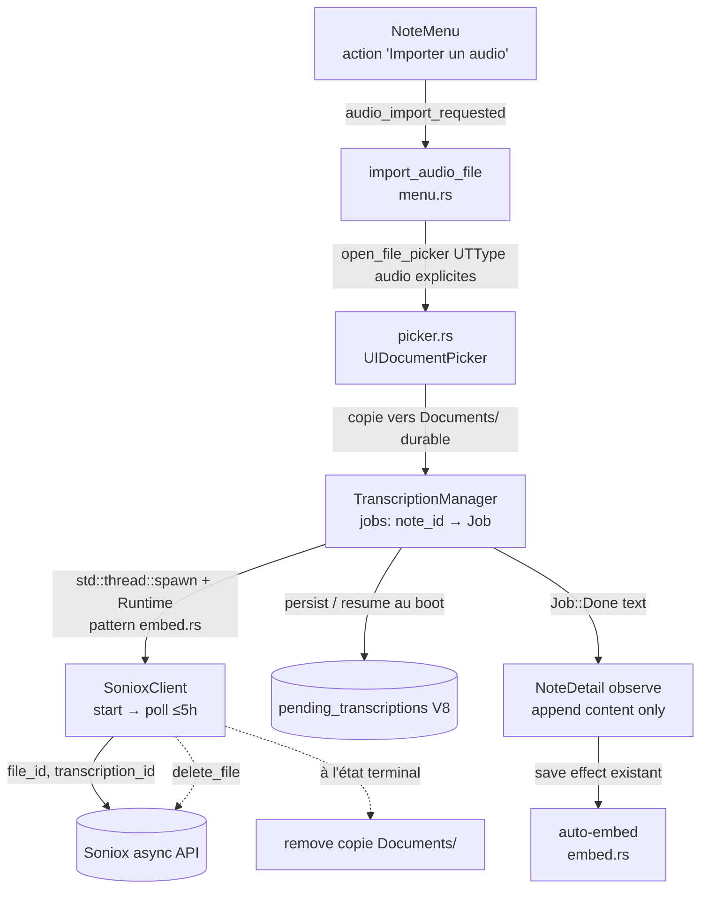
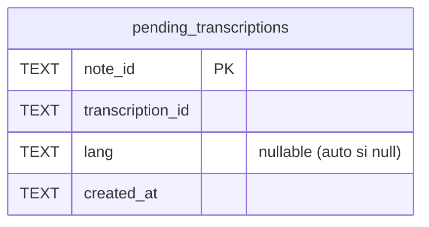
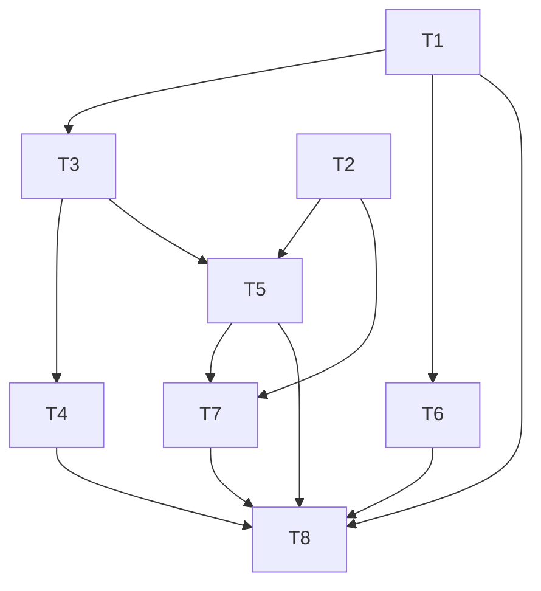

# 0002 — Import audio dans une note pour transcription

## 1. Summary

FlowFlow ne transcrit que ce qu'il capte **en direct au micro** : tout audio préexistant (dictaphone,
Voice Memos, réunion enregistrée ailleurs) est inexploitable, et le timeout serveur de 2 min casse
déjà les enregistrements longs. Le moteur de transcription Soniox et le picker de fichiers existent
déjà ; le manque est du **câblage** + 3 verrous (durée, langue, survie en arrière-plan).

**Recommandation (Alt 3)** : réutiliser `SonioxClient::transcribe` (format-agnostic) via une 2e action
menu « Importer un audio » → picker audio (UTType explicites, copie durable dans `Documents/`) → un
`TranscriptionManager` qui lance la transcription sur un **thread détaché + `Runtime`** (pattern
`embed.rs`, **pas** `spawn` Dioxus qui meurt au re-render), indexée par `note_id`, poll jusqu'à **5 h**
(borne Soniox), **resume** au boot via une migration **V8** `pending_transcriptions`. Langue
**auto-détectée** partout (retrait de `language_hints_strict`), `delete_file` Soniox après coup
(hygiène quota), texte **appended au contenu uniquement** puis auto-embeddé comme une note normale.

**Impact** : ~10 fichiers, 1 nouveau module, 1 migration additive réversible, **0 breaking change
public** (impact GitNexus LOW : 1 caller de `transcribe`). Le live hérite de 3 améliorations partagées
(durée, langue, quota). Risque principal — la survie de la tâche en arrière-plan — résolu par le
pattern thread détaché déjà éprouvé in-repo. La revue adverse a corrigé 2 BLOCKERs + 3 MAJORs avant
toute ligne de code. **Status : Review** (3 questions mineures ouvertes : Q4 notif, Q7 dédup, Q8 soft
hint FR live).

## 2. Context / Codebase

### Affected modules
- `src/ui/notes/menu.rs` — `NoteMenu` (point d'entrée, **une seule** action import aujourd'hui) + `import_file_content(lang)` (patron picker → contenu) + struct `ImportedFile`. Cible pour ajouter l'action "Importer un audio".
- `src/ui/notes/detail.rs` — `use_effect` (l.306-327) qui consomme `RecordingState::Transcribed(text)` → append au contenu de la note + `set_audio_transcription`. **Point de jonction** texte → note.
- `src/ui/recording/controls.rs` — `spawn_transcription(path, state, gen, gen_signal, cleanup)` (l.21) + prop `transcribe_only` + garde de génération anti-écriture périmée. Machinerie de transcription async réutilisable.
- `src/services/transcription/client.rs` — `SonioxClient::transcribe(path)` **format-agnostic** (upload multipart bytes + filename). Constantes **partagées** : `MAX_POLLS=60`, `POLL_INTERVAL=2s` → plafond **2 min**. `language_hints:["fr"]` + `language_hints_strict:true` **codés en dur**. `from_env()` vérifie `ai_consent` + `soniox_api_key`.
- `src/platform/ios/picker.rs` — `open_file_picker(extensions)` : UIDocumentPicker, `asCopy:true` (copie dans la sandbox), `setAllowsMultipleSelection(false)`, UTType résolu par extension de fichier.
- `src/services/audio.rs` — enum `RecordingState { Idle, Recording, Paused, Transcribing, Transcribed(String), Error(String) }` ; `output_dir()`, `resolve_audio_path()`.
- `src/services/embed.rs` — auto-embed du contenu (indexation recherche). Déclenché à la sauvegarde de note.
- `src/services/i18n/locales/{en,fr}.ftl` — libellés (action menu, états, erreurs).

### Key symbols
- `import_file_content()` — `src/ui/notes/menu.rs:15` — **patron à cloner** : picker → garde taille → lecture → `ImportedFile{filename, content}`. Timeout dynamique `60 + (Mo)*30` s, `spawn_blocking` (lecture document, pas réseau).
- `spawn_transcription()` — `src/ui/recording/controls.rs:21` — `spawn` async : `transcribe()` puis (si `cleanup`) `remove_file`, écrit `RecordingState::Transcribed/Error` **sous garde** `gen_signal()==generation`.
- `RecordingState::Transcribed` (consumer) — `src/ui/notes/detail.rs:306` — append `text` au `content`, persiste via `set_audio_transcription`, repasse `Idle`.
- `SonioxClient::transcribe` — `src/services/transcription/client.rs:186` — `upload_file → create_transcription → poll_transcript → clean_hesitations`.
- `open_file_picker` — `src/platform/ios/picker.rs:77`.
- `transcribe_only` — `src/ui/chat_input.rs:80` — **déjà** utilisé (saisie vocale du chat) : transcrit + jette le fichier, n'ajoute pas de `note_audio`. Comportement « transcription seule » **existant**.

### Prior art
- **RFC 0001 data-backup-export** (status Review, `docs/rfcs/0001-data-backup-export/`) — même couches `services/` + `platform/ios/` ; introduit le concept de **write-gate** sur les threads détachés d'`embed.rs` (pertinent si un long traitement coexiste avec l'embedding).
- **PRD `lan-serve` + `agentic-tools`** (`docs/prd/`) — recherche actée : **iOS n'autorise pas l'exécution longue en arrière-plan** une fois l'app suspendue (écran verrouillé / app quittée). Contrainte directe pour la story 4 « arrière-plan ».
- Mémoire `project_multi_audio` — `note_audios` (V5/V6), `transcribe_only` pour le scope chat.
- Pas d'ADR. `docs/stories/2026-05-29-...` (iris API) non lié.
- Tests pertinents : `tests/` (migrations/CRUD) ; aucun test transcription/picker actuel.

### Execution flows touched
- **Enregistrement live** : `RecordingControls` stop → `add_audio` → `spawn_transcription(cleanup=false)` → `Transcribed(text)` → effect `detail.rs:306` append + `set_audio_transcription` → `Idle`.
- **Saisie vocale chat** : `RecordingControls{transcribe_only:true}` → `spawn_transcription(cleanup=true)` → `Transcribed` → jette le fichier. **Précédent direct** de « transcription seule ».
- **Import document** : `NoteMenu` `import_requested` → `import_file_content` → `open_file_picker(["txt","md","csv","pdf","docx"])` → lecture → `ImportedFile` → attachment + embed.
- **NOUVEAU import audio (cible)** : `NoteMenu` → `open_file_picker(audio exts)` → `path` → `spawn_transcription(cleanup=true)` → `Transcribed(text)` → contenu de la note.
- **Point chaud archi** : `spawn()` est lié au **scope du composant** `NoteDetail`/`RecordingControls`. La garde `generation` empêche les écritures périmées, mais si le composant se **démonte** (navigation hors note), la future spawnée est **droppée** → transcription perdue. Bloquant pour la story 4 « continuer ailleurs dans l'app ».

## 3. Problem & Motivation

### Current state
FlowFlow ne transcrit que ce qu'il **capte en direct au micro** : `AudioRecorder` (cpal/hound) →
WAV → `spawn_transcription` → `SonioxClient::transcribe`. Aucun chemin programmatique ne fait
entrer un **fichier audio préexistant**. Le picker (`open_file_picker`, `picker.rs:77`) existe mais
n'est câblé que pour les **documents** texte (`["txt","md","csv","pdf","docx"]`, `menu.rs:24`).

### Pain (qui, fréquence, coût)
- **Mirko + futurs utilisateurs App Store** : tout enregistrement fait ailleurs (dictaphone
  physique, Voice Memos iPhone, capture de réunion par une autre app) est **inexploitable** dans
  FlowFlow. Le seul contournement = **rejouer le fichier devant le micro** : temps réel (1 h
  d'audio = 1 h d'attente), qualité dégradée (bruit, double-encodage micro), et inutilisable pour
  une réunion longue.
- Fréquence : à chaque fois que la matière première existe déjà hors de l'app — cas courant pour
  qui possède un dictaphone ou enregistre des réunions.
- Coût produit : la promesse (parole → notes exploitables) est cassée pour tout l'audio non capté
  par l'app elle-même.

### Why now (trigger)
v1.0 en revue App Store : l'app passe d'un usage perso (où l'on peut bricoler) à de vrais
utilisateurs. L'import est une attente de base d'une app de prise de notes vocales, et le moteur
de transcription est **déjà en place** — le manque est purement un défaut de câblage + 3 verrous
(timeout 2 min, FR strict, scope de tâche). Demande explicite de Mirko.

### Signals
- 0 fonction d'import audio aujourd'hui (mesurable : `open_file_picker` n'est appelé qu'avec des
  extensions document).
- Plafond `MAX_POLLS=60` × `POLL_INTERVAL=2s` = **120 s** : un fichier dont la transcription serveur
  dépasse 2 min échoue déjà (`"Transcription timeout (2 min)"`, `client.rs:159`). Donc même le live
  long casse aujourd'hui.

## 4. Goals / Non-Goals

### Goals (mesurables)
1. Importer **1 fichier audio** (m4a/AAC, mp3, wav, caf) depuis le menu d'une note et obtenir son
   texte ajouté au contenu de la note (réutilise le point de jonction `detail.rs:306`).
2. Transcrire un fichier **≥ 2 h** sans échec dû à une borne de durée trop courte (relève le plafond
   `MAX_POLLS`, **partagé** live + import).
3. Transcription en **arrière-plan** : l'app reste navigable et le résultat **survit à la navigation**
   hors de la note (corrige le drop de `spawn()` au démontage) **et à un redémarrage de l'app**
   (resume via `transcription_id` persisté, migration V8 — **in-scope**, décidé step-05).
4. **Auto-détection** de langue pour **import ET live** (lève `language_hints_strict` partout — décidé
   step-05 ; le live n'est plus forcé en FR strict).
5. **0** note corrompue / texte partiel sur échec ; message clair + retry ; garde `ai_consent` +
   `soniox_api_key` (réutilise `from_env()`).
6. **Hygiène quota Soniox** : supprimer le fichier uploadé après transcription (`DELETE /v1/files/{id}`)
   — corrige une fuite latente qui touche **aussi le live** (décidé step-05).

### Non-Goals (hors scope explicite)
- **PAS** d'import multi-fichiers (un seul à la fois ; `setAllowsMultipleSelection(false)` conservé).
- **PAS** de conservation du fichier audio importé (transcription seule : pas de `note_audio` jouable,
  on réutilise `cleanup=true`).
- **PAS** d'extraction audio depuis une vidéo (mov/mp4).
- **PAS** de sélecteur de langue manuel (auto-détection uniquement).
- **PAS** de transcription offline (réseau requis, inchangé).
- **PAS** de diarisation / horodatage par locuteur.
- **PAS** de refonte de l'enregistrement live : il **hérite** de 3 changements partagés (plafond de
  durée relevé, langue auto, suppression fichier Soniox), mais l'UX/flow live reste inchangé.

## 5. Alternatives Considered

Le moteur de transcription existe déjà (`SonioxClient::transcribe`, format-agnostic) et
« transcrire + jeter » existe déjà (`transcribe_only`/`cleanup`). Les alternatives portent donc
sur **comment câbler l'import** et surtout **comment tenir 3 verrous** : durée (timeout), survie
en arrière-plan (scope de tâche), langue. Faits externes qui contraignent l'espace :

- **Soniox** : durée max **300 min (5 h), fixe, non augmentable** ; **webhook OU polling**.
  Source: [Soniox async](https://soniox.com/docs/stt/async/async-transcription),
  [Limits & quotas](https://soniox.com/docs/stt/async/limits-and-quotas).
- **Webhook** exige une **URL publique** → FlowFlow n'a **pas de backend** (lan-serve = LAN only) →
  **webhook non viable**, le polling reste obligatoire.
- **iOS** : une app **suspendue** (verrouillée / quittée) tue une requête `URLSession` standard en vol ;
  `beginBackgroundTask` ne donne que ~secondes, pas des heures.
  Source: [Apple — Extending background execution](https://developer.apple.com/documentation/uikit/extending-your-app-s-background-execution-time),
  [Forum DTS Quinn](https://developer.apple.com/forums/thread/743847).
- **Nuance clé** : « continuer ailleurs **dans l'app** » (story 4, app au **premier plan**) ≠ « app
  **verrouillée/suspendue** ». Le premier est un problème de **scope de composant Dioxus** (soluble) ;
  le second est une **limite iOS dure** (hors scope, mitigeable par resume).

### Alt 0 — Status quo (rejouer au micro)
**Summary:** ne rien construire ; l'utilisateur rejoue son fichier devant le micro.
**Cost of inaction:** la story principale reste impossible ; réunion longue = inutilisable ;
qualité dégradée (double-encodage, bruit). De plus le **timeout 2 min casse déjà le live long**.
**Pros:** 0 effort, 0 régression.
**Cons:** ne résout rien ; douleur §3 persiste ; bug timeout live non corrigé.
**Cost:** nul. **Reversibility:** n/a. **Verdict provisoire:** rejeté.

### Alt 1 — Câblage minimal, tâche au scope composant
**Summary:** ajouter une action menu → `open_file_picker(audio exts)` → `spawn_transcription(path,
cleanup=true)` **tel quel**, dans le scope de `NoteDetail`. Timeout relevé à un **plafond fixe** (ex.
`MAX_POLLS=180` ≈ 6 min de poll). Langue : drapeau simple sur `transcribe()`.
**How it solves:** couvre import + transcription seule en réutilisant la machinerie existante.
**Pros:**
- Effort minimal (S) ; 1 fonction clonée de `import_file_content` + 1 branche.
- 0 nouveau module ; réutilise garde `generation`.
- Corrige partiellement le timeout (relève le plafond).
**Cons:**
- **Story 4 échoue** : `spawn()` lié au scope `NoteDetail` → naviguer hors note = future **droppée** =
  transcription perdue.
- Plafond **fixe** = soit trop court (réunion 3 h), soit poll inutile long sur petit fichier.
- Pas de resume : app backgroundée pendant un long poll = perte.
**Cost:** S. **Reversibility:** élevée. **Verdict provisoire:** insuffisant pour la story 4.

### Alt 2 — Pipeline import dédié + webhook + background URLSession
**Summary:** nouveau module d'import autonome ; transcription via **webhook** Soniox ; upload via
**background `URLSession`** pour survivre à la suspension.
**How it solves:** viserait le « vrai » arrière-plan (app quittée, résultat livré plus tard).
**Pros:**
- Robuste à la suspension iOS en théorie (upload out-of-process, relance app).
- Webhook = 0 polling.
**Cons:**
- **Webhook impossible sans backend public** : FlowFlow n'en a pas (rédhibitoire).
- Background `URLSession` via objc2/Rust = **lourd**, peu de prior art, rate-limiter iOS, fiabilité
  « best effort » (DTS Quinn : *« you can't ensure anything »*).
- Réécrit ce qui marche déjà ; double le chemin de transcription (dette).
**Cost:** XL. **Reversibility:** faible (couplage infra). **Verdict provisoire:** rejeté (pas de backend + sur-ingénierie).

### Alt 3 — Réutilisation + tâche hissée hors composant + poll budget dérivé + resume (RECOMMANDÉ)
**Summary:** réutiliser `transcribe()`/`cleanup` mais **sortir la tâche async du scope `NoteDetail`**
vers un **gestionnaire au scope racine** (registre `note_id → JobState` dans l'état Dioxus global).
Le **budget de poll est dérivé** (couvre jusqu'à 5 h, borne Soniox) au lieu d'un plafond fixe aveugle.
Langue **auto-détectée** pour l'import via un **paramètre** sur `transcribe()` (live inchangé).
**Resume-on-relaunch** : persister `transcription_id` + `note_id` → au retour app, reprendre le poll
(le résultat est gardé côté Soniox).
**How it solves:** Goal 1 (réutilise jonction `detail.rs:306`), Goal 2 (budget jusqu'à 5 h, fix
partagé live), Goal 3 (tâche hors composant → survit à la navigation **in-app** ; resume couvre le
cas suspendu **du mieux possible** sans backend), Goal 4 (param langue), Goal 5 (réutilise `from_env`
+ garde `generation`).
**Pros:**
- Survit à la navigation in-app (story 4 réelle) sans dépendre d'API iOS exotiques.
- Pas de plafond aveugle : budget dérivé de la borne produit (≤ 5 h) ; rejette > 5 h **tôt** (limite Soniox).
- Resume gratuit grâce au `transcription_id` déjà retourné par l'API.
- Réutilise le moteur ; aucune dette de double-pipeline ; pas de backend requis.
- Param langue isole l'import du live (pas de régression FR strict du live).
**Cons:**
- Introduit un **gestionnaire de tâches global** (état + cycle de vie) = complexité moyenne, à écrire
  proprement (idempotence, dedup par `note_id`).
- Le cas **app verrouillée pendant des minutes** reste « best effort » (poll suspendu → repris au
  retour) ; pas de livraison pendant suspension (limite iOS assumée, cf. §8).
- Persistance d'un job en cours (table légère ou settings) = petit ajout.
**Cost:** M (L si resume persistant complet). **Reversibility:** élevée (interne, format modifiable).
**Réfs:** [Soniox webhooks](https://soniox.com/docs/stt/async/webhooks) (écarté faute de backend),
[Apple background limits](https://developer.apple.com/documentation/uikit/extending-your-app-s-background-execution-time).

### Sous-décisions transverses (rendues visibles)

| Décision | Option A | Option B | Option C |
|---|---|---|---|
| **Timeout/durée** | Plafond fixe `MAX_POLLS` relevé (aveugle) | **Budget dérivé ≤ 5 h + rejet > 5 h tôt** (borne Soniox) | Poll infini jusqu'à `error` serveur (risque de boucle) |
| **Scope tâche (story 4)** | Scope composant (Alt 1, perd au démontage) | **Tâche au scope racine + registre `note_id`** | Background `URLSession`/BGTask iOS (lourd, Alt 2) |
| **Langue** | FR strict gardé (régression import non-FR) | **Param `language: Option<…>` sur `transcribe()`** (live inchangé, import = auto) | Sélecteur UI manuel (hors scope PRD) |
| **Resume app suspendue** | Aucun (perte au background) | **Persister `transcription_id`+`note_id`, reprendre au retour** | BGProcessingTask iOS 26 (objc2 incertain, iOS 26 only) |

Les options **en gras** = pistes que le design (step 04) retiendra ; les autres documentent le tradeoff
pour éviter de relitiger plus tard.

## 6. Proposed Design

**Base : Alt 3** (réutilisation du moteur + tâche hissée hors composant + budget poll ≤ 5 h + resume).
**Impact GitNexus** : `transcribe` upstream = **LOW** (1 seul caller : `spawn_transcription`) ;
`spawn_transcription` upstream = **LOW** (0 caller tracé). Le changement de signature `transcribe()`
ne casse qu'**un** appelant interne. `breaking_changes: false` côté public (API interne Rust seulement).

### Architecture overview

Le picker fournit un fichier ; au pick il est **copié dans `Documents/`** (chemin durable, survit à la
purge iOS du `tmp/`). Un **`TranscriptionManager`** lance la transcription sur un **thread détaché +
`tokio::runtime::Runtime`** — pattern **déjà éprouvé dans `embed.rs`** (le `spawn` Dioxus, lui, est
annulé au drop / re-render de `App` : voir §11 BLOCKER #1, donc **pas** utilisé). Le thread écrit
l'avancement dans `transcription_jobs: Signal<HashMap<note_id, Job>>` (état global, indépendant du
cycle de vie de `NoteDetail`) et persiste `transcription_id` (resume). `NoteDetail`, monté pour ce
`note_id`, **observe** son Job et **n'append que le contenu** (jonction `detail.rs:306` **scindée** :
`set_audio_transcription` reste live-only). L'import **ne touche jamais** `recording_state` (signal
global, réservé au live — §11 MAJOR #3).



### Modules / files affected

| Path | Change | Why |
|------|--------|-----|
| `src/ui/notes/menu.rs` | modified | 2e action menu "Importer un audio" + `import_audio_file(lang) -> Result<Option<PathBuf>,String>` (clone de `import_file_content`, exts audio, garde format/taille) |
| `src/ui/transcription_manager.rs` | **new** | `TranscriptionManager` : registre `note_id → Job` ; lance via `std::thread::spawn` + `Runtime` (**pattern `embed.rs`**, pas `spawn` Dioxus) ; start/poll ≤ 5 h/cleanup/delete_file ; resume au boot |
| `src/ui/mod.rs` (`App`) | modified | instancier le manager (contexte) ; déclencher le **resume au boot** depuis `pending_transcriptions` |
| `src/ui/state.rs` (`AppState`) | modified | `transcription_jobs: Signal<HashMap<String, VecDeque<Job>>>` (file FIFO/note, Q7) + `transcription_done_badge: Signal<usize>` (Q4) + `audio_import_requested: Signal<bool>` ; indépendant de `recording_state` |
| `src/ui/sidebar/` ou `top_bar.rs` | modified | afficher le **badge** des jobs terminés non vus (Q4), remis à 0 à l'ouverture de la note |
| `src/ui/notes/detail.rs` | modified | **scinder** le bloc `detail.rs:306` : append-content (partagé) vs `set_audio_transcription` (live-only) ; observer le Job du `note_id` → **append content uniquement** ; états en cours/échec/retry |
| `src/platform/ios/picker.rs` | modified | UTType **explicites** (`public.mpeg-4-audio`, `public.mp3`, `com.microsoft.waveform-audio`, `com.apple.coreaudio-format`, `public.audio`) ; loguer un type non résolu ; **copie du fichier choisi vers `Documents/`** (durable, pas `tmp/`) |
| `src/services/transcription/client.rs` | modified | scinder `transcribe` en `start_transcription(path, language) -> (transcription_id, file_id)` + `poll_transcript(id) -> text` ; param `language: Option<&str>` (None=auto partout) ; relever `MAX_POLLS` ; `delete_file(file_id)` après transcription |
| `src/ui/recording/controls.rs` | modified | `spawn_transcription` passe `language = None` (live → auto comme l'import) ; appel adapté à la nouvelle signature |
| `src/ui/chat_input.rs` | none/trivial | passe par `RecordingControls` ; `transcribe_only` inchangé |
| `src/db/schema.rs` + `src/db/mod.rs` | modified | migration **V8** : table `pending_transcriptions` (resume) — **in-scope** |
| `src/services/i18n/locales/{en,fr}.ftl` | modified | libellés action + états + erreurs |

### Data model

**En mémoire (cœur, couvre la story 4 in-app) :**

```rust
enum JobStatus { Queued, Uploading, Polling { elapsed_s: u32 }, Done(String), Failed(String) }
struct Job { id: String, note_id: String, file_path: PathBuf, status: JobStatus,
             transcription_id: Option<String>, soniox_file_id: Option<String> }
// AppState:
//   transcription_jobs: Signal<HashMap<String /*note_id*/, VecDeque<Job>>>  // file FIFO par note (Q7)
//   transcription_done_badge: Signal<usize>  // compteur de jobs terminés non vus (Q4)
```

La transcription tourne sur un **thread détaché** (pattern `embed.rs`), pas un `spawn` Dioxus → elle
survit aux changements de vue **et** au re-render de `App` (§11 BLOCKER #1). **File d'attente par
`note_id`** (Q7) : les imports sur une même note s'enchaînent en **série**, texte appended dans l'ordre
FIFO ; un seul job actif par note à la fois, les suivants en `Queued`. **Badge** (Q4) : à chaque
`Done` hors-note-courante, incrémenter `transcription_done_badge` (remis à 0 à l'ouverture de la note).

**Persistance resume (in-scope, couvre app tuée/suspendue au mieux) — migration V8 additive :**



- Écrite **après** `start_transcription` (dès qu'on a un `transcription_id`), supprimée à `Done`/`Failed`.
- Au boot (`App`), pour chaque ligne → le manager **reprend le poll** (résultat conservé côté Soniox).
- Réversible (drop table). Aucun impact sur les schémas existants.

### API contracts (interne Rust)

- `SonioxClient::start_transcription(&self, path: &Path, language: Option<&str>) -> Result<String, String>`
  — upload + create ; retourne `transcription_id`. **Nouveau** (extrait de `transcribe`).
- `SonioxClient::poll_transcript(&self, id: &str) -> Result<String, String>` — déjà existant, rendu `pub`.
- `SonioxClient::transcribe(path, language)` — **conservé** comme façade `start` + `poll` pour les
  appelants simples (live/chat). **Signature change** : ajout `language: Option<&str>`.
  - `None` → **pas** de `language_hints` → **auto-détection Soniox**. C'est le défaut **partout**
    (import ET live, décidé step-05) : on **retire** `language_hints_strict:true` codé en dur.
  - `Some(lang)` → conservé pour un futur forçage explicite ; aucun caller ne l'utilise en v1.
  - **Breaking interne** : seul `spawn_transcription` à mettre à jour (impact LOW confirmé).
- `SonioxClient::delete_file(&self, file_id: &str) -> Result<(), String>` — **nouveau**.
  `DELETE /v1/files/{file_id}` appelé après transcription (succès **ou** échec post-upload) pour ne
  pas saturer le quota (10 Go / 1000). Best-effort : un échec de delete logue mais ne casse pas le flux.
- **Budget poll** : le thread **détaché** (pattern `embed.rs`) poll la **durée pleine ≤ 5 h**
  (`MAX_POLLS` relevé en conséquence à `POLL_INTERVAL=2s`), sans cap intermédiaire artificiel.
  Borne **produit** = 5 h (limite Soniox 300 min, erreur serveur au-delà). Le **resume V8** couvre le
  cas app **tuée** (thread perdu) — filet de sécurité, pas la couverture primaire (corrige §11 #10).
- **Progress** : Soniox **ne fournit pas de %** → état **indéterminé** (spinner + `elapsed_s`).
  Répond à la question ouverte PRD : progression = « en cours + temps écoulé », pas un pourcentage.

### Flows / sequences

```mermaid
sequenceDiagram
    participant U as User
    participant ND as NoteDetail
    participant MG as TranscriptionManager (App scope)
    participant SX as Soniox
    U->>ND: menu → Importer un audio
    ND->>ND: import_audio_file (picker audio, garde format/taille)
    ND->>MG: enqueue(note_id, path, lang=None)
    Note over MG: vérifie consent + clé (from_env) sinon Failed tôt
    MG->>SX: start_transcription(path) → transcription_id
    MG->>MG: persist pending_transcriptions(note_id, transcription_id)
    MG->>MG: cleanup: remove sandbox copy
    loop poll ≤ 30 min (resume au-delà)
        MG->>SX: GET /transcriptions/{id}
        SX-->>MG: status (queued/processing/completed/error)
    end
    SX-->>MG: completed → transcript
    MG->>MG: Job::Done(text) ; delete pending row
    alt NoteDetail monté sur ce note_id
        MG-->>ND: observe → append au content (detail.rs:306) + save
        ND->>ND: save effect → auto-embed (embed.rs)
    else NoteDetail ailleurs
        Note over MG: texte gardé dans Job + persisté en note ; visible au retour
    end
```

Chemin d'échec : `start`/`poll` `Err` → `Job::Failed(raison)` ; aucun texte inséré ; UI montre la
raison + bouton **Relancer** (réutilise le `path` si encore présent, sinon ré-ouvre le picker).

### Cross-cutting

- **Consent / clé** : `SonioxClient::from_env()` réutilisé (vérifie `ai_consent` + `soniox_api_key`).
  Vérif **avant** upload → `Failed("Consentement IA requis")` / `"clé non configurée"` sans état partiel.
- **Auto-embed** : aucun nouveau code. Le texte appended déclenche le `save effect` existant de
  `NoteDetail` → pipeline `embed.rs` actuel. L'import devient cherchable comme une note normale.
- **Garde anti-périmé** : indexation **par `note_id`** dans le manager (remplace le compteur
  `generation` lié au composant). L'import **n'utilise pas** `recording_state` (signal global live-only)
  → pas de race live/import (§11 MAJOR #3).
- **Jonction scindée** : pour l'import, **append au content uniquement** ; jamais
  `set_audio_transcription` (qui viserait à tort un `note_audios` antérieur — §11 MAJOR #2).
- **Nettoyage** : la copie **`Documents/`** (durable) est gardée **jusqu'à l'état terminal**
  (`Done`/abandon) → **retry** sans re-picker (la copie `tmp/` du picker serait purgée par iOS, §11
  BLOCKER #5). Supprimée à `Done`. **Fichier Soniox** : `delete_file(file_id)` après transcription
  (best-effort) — corrige la fuite quota qui touche **aussi le live**.
- **i18n** : nouvelles clés `note-menu-import-audio`, `audio-transcribing`, `audio-import-failed`,
  `audio-import-retry`, `audio-format-unsupported` — parité FR/EN.
- **Observabilité** : logs `[import]`/`[soniox]` cohérents (durée, statut, jamais le contenu).
- **iOS arrière-plan** : couvre la navigation **in-app** (scope racine). App **verrouillée/suspendue**
  = poll gelé par iOS → repris au retour via `pending_transcriptions` (best effort assumé, §8).

## 7. Drawbacks & Risks

### Drawbacks (inhérents)
- **App suspendue ≠ livraison directe** : verrouillage/quit prolongé → poll gelé par iOS ; le résultat
  n'arrive qu'au retour (resume). Pas contournable sans backend (webhook) — assumé.
- **Transcription seule** : pas de relecture audio de l'import (décision PRD).
- **Coût Soniox proportionnel à la durée** : une réunion de plusieurs heures = coût API réel à chaque
  import. L'utilisateur déclenche explicitement (pas de surprise silencieuse), mais le coût existe.
- **Progression indéterminée** : Soniox ne renvoie pas de % → spinner + temps écoulé seulement.

### Risques

| Risque | Probabilité | Impact | Mitigation |
|---|---|---|---|
| UTType `m4a`/`caf` mal résolu par `typeWithFilenameExtension` → fichier non sélectionnable dans le picker | Moyenne | Élevé | Tester sur device ; fallback sur identifiants UTType explicites (`public.mpeg-4-audio`, `com.apple.coreaudio-format`, `public.mp3`, `com.microsoft.waveform-audio`) plutôt que par extension |
| Tâche au scope racine mal nettoyée → jobs zombies / fuite mémoire | Moyenne | Moyen | Dedup par `note_id` ; suppression du Job à `Done`/`Failed` ; un seul job audio par note |
| Copie picker `tmp/` purgée par iOS avant retry / fin de transcription longue | Moyenne | Élevé | Copier vers `Documents/` au pick (durable) ; garder jusqu'à l'état terminal (§11 BLOCKER #5) |
| Manager via `spawn` Dioxus → annulé au re-render de `App` | Élevée si mal fait | Critique | Thread détaché + `Runtime` (pattern `embed.rs`), pas `spawn` Dioxus (§11 BLOCKER #1) |
| Quota Soniox : fichiers uploadés jamais supprimés (10 Go / 1000) — **latent aussi pour le live** | Moyenne | Moyen | `DELETE /v1/files/{file_id}` après `start_transcription` (réussi ou en échec post-upload) |
| Fichier > 300 min (5 h) → rejet serveur | Faible | Faible | Surfacer l'erreur Soniox en message clair ; documenter la borne 5 h |
| Texte très long (heures) inséré d'un coup → textarea lente / gros embedding | Faible | Moyen | Le chunker `ai.rs` gère déjà l'embedding ; surveiller la perf UI sur très gros contenu |
| Changement de signature `transcribe()` casse la compilation (caller manqué) | Faible | Faible | Impact GitNexus = LOW (1 caller `spawn_transcription`) ; `cargo build` le révèle |
| Resume au boot lance plusieurs polls simultanés | Faible | Faible | Async non bloquant ; cap concurrent ; rares (peu de jobs en vol) |
| Embed concurrent pendant import (cf. write-gate RFC 0001) | Faible | Faible | Pas de copie `vectordb/` ici ; juste un append + embed normal, pas de conflit |
| Migration V8 (`pending_transcriptions`) | Faible | Faible | Additive, réversible (drop) ; testée comme les migrations existantes |

### Rollout / rollback
- Feature **additive** (action menu + manager) : la retirer n'affecte pas les données ni le live.
- Le **fix timeout partagé** bénéficie au live immédiatement ; non-régression à tester (story live).
- La **persistance resume (V8)** peut être livrée en **phase 2** : le cœur in-memory couvre déjà la
  story 4 in-app ; la table ne fait qu'améliorer le cas app-tuée.
- Rollback runtime : un import en échec laisse la note **intacte** (aucun texte partiel).

### Gating metrics
- Round-trip : chaque format ciblé (m4a/AAC, mp3, wav, caf) importé → texte dans la note + cherchable.
- 0 note corrompue / texte partiel sur échec (test fault-injection : clé absente, format refusé, timeout).
- Fichier ≥ 2 h transcrit jusqu'au bout (foreground) sans échec de durée.
- Navigation in-app pendant transcription → résultat présent au retour.

## 8. Open Questions

**Tranchées en step-05 (verrouillées) :**

| # | Question | Décision |
|---|----------|----------|
| 1 | Borne haute de durée | **5 h** (limite Soniox 300 min) ; > 5 h → erreur serveur surfacée |
| 2 | Auto-détection langue aussi pour le live | **Oui, partout** — `language_hints_strict` retiré (live + import en auto) |
| 3 | Persistance resume (V8) | **In-scope cette version** (pas phase 2) |
| 5 | `DELETE /v1/files/{id}` Soniox | **In-scope ce RFC** (corrige le quota, bénéficie au live) |
| 6 | Retry sans re-picker | **Oui** — garder la copie `Documents/` jusqu'à l'état terminal |
| 4 | Notification de fin quand l'utilisateur est ailleurs | **Badge global discret** sur un job terminé |
| 7 | 2e import sur la même note | **File d'attente** (série par `note_id`, FIFO, texte appended dans l'ordre) |
| 8 | Langue live après retrait du strict | **Full auto, aucun hint** (live + import identiques) — `transcribe(None)` |

**Encore ouvertes :** aucune. Toutes tranchées.

## 9. Recommendation & Rationale

**Recommandation : Alt 3** — réutilisation du moteur + tâche au scope racine + budget poll ≤ 5 h +
resume persistant. Confiance : **élevée**. Le moteur existe, l'impact est LOW (1 caller), et le seul
vrai défi (survie en arrière-plan) est résolu sans dépendre d'API iOS exotiques ni d'un backend.

### Goals → mécanismes

| Goal | Mécanisme |
|---|---|
| 1 — Import 1 fichier → texte dans la note | `import_audio_file` (clone de `import_file_content`) → manager → jonction `detail.rs:306` |
| 2 — Fichier ≥ 2 h (jusqu'à 5 h) | `MAX_POLLS` relevé (fenêtre foreground) + borne Soniox 300 min ; au-delà = resume |
| 3 — Arrière-plan (in-app + relaunch) | `TranscriptionManager` au scope `App` (survit au démontage) + `pending_transcriptions` V8 (resume au boot) |
| 4 — Langue auto | `transcribe(path, None)` → pas de `language_hints` → auto-détection, partout |
| 5 — Échec sans dégât | `from_env()` garde clé/consent ; `Job::Failed` n'insère aucun texte ; retry (copie gardée) |
| 6 — Hygiène quota | `delete_file(file_id)` après transcription (best-effort) |

### Pourquoi pas les alternatives
- **Alt 0 (status quo)** : ne résout rien + laisse le bug timeout 2 min sur le live.
- **Alt 1 (scope composant)** : compile et démo OK, mais **perd la transcription à la navigation**
  (story 4) — faux ami.
- **Alt 2 (webhook + background URLSession)** : webhook **impossible sans backend public** ; background
  URLSession via objc2 = XL + fiabilité « best effort » ; double-pipeline = dette.

### Revisit-if
- Le format on-disk / l'API Soniox change la borne 5 h → réviser le budget poll.
- iOS 26 `BGContinuedProcessingTask` obtient des bindings objc2 stables → upgrader le resume vers une
  vraie exécution arrière-plan avec UI système (remplace le poll foreground).
- Apparition d'un backend FlowFlow (lan-serve élargi) → réintroduire le webhook (supprime le polling).
- Coût Soniox sur longs fichiers devient un problème → ajouter un plafond de durée configurable (Q1).

## 10. Implementation Plan

Aligné sur `docs/prd/audio-import-transcription/tasks.md`, enrichi du « how » + décisions step-05.

| ID | Titre | Fichiers | Deps | Effort | Acceptation |
|---|---|---|---|---|---|
| T1 | Moteur : scinder `start`/`poll`, param `language` (None=auto partout), relever `MAX_POLLS`, `delete_file` | `services/transcription/client.rs` | — | S | live+chat compilent ; auto-détection ; fichier Soniox supprimé ; budget ≤ 5 h |
| T2 | Picker audio + `import_audio_file` + garde format/taille + 2e action menu | `platform/ios/picker.rs`, `ui/notes/menu.rs`, `ui/state.rs` | — | M | picker liste m4a/AAC/mp3/wav/caf ; format refusé → message, note intacte ; UTType validé device |
| T3 | `TranscriptionManager` : file FIFO `note_id→VecDeque<Job>`, thread détaché + `Runtime` (pattern `embed.rs`), start/poll hors composant, cleanup terminal, badge à `Done` | `ui/transcription_manager.rs` (new), `ui/mod.rs`, `ui/state.rs` | T1 | L | navigation/re-render ne perd pas la transcription ; file série par note (Q7) ; badge incrémenté (Q4) ; copie `Documents/` gardée jusqu'à terminal |
| T4 | Migration **V8** `pending_transcriptions` + resume au boot | `db/schema.rs`, `db/mod.rs`, `ui/transcription_manager.rs` | T3 | M | app tuée → relance → poll repris → texte arrive ; ligne purgée à Done ; rollback drop |
| T5 | `NoteDetail` : observer la file du `note_id` → **append content only** + save + auto-embed ; états en cours/échec/**retry** ; badge remis à 0 à l'ouverture | `ui/notes/detail.rs`, `ui/top_bar.rs` | T3 | M | texte ajouté + cherchable ; retry sans re-picker ; 0 texte partiel ; jamais `set_audio_transcription` (§11 #2) |
| T6 | Adapter `spawn_transcription`/live (`language=None`) + non-régression live/chat | `ui/recording/controls.rs`, `ui/chat_input.rs` | T1 | S | live + saisie vocale chat marchent en auto-détection ; timeout long bénéficie au live |
| T7 | i18n libellés FR/EN (action, états, erreurs, retry) | `services/i18n/locales/{en,fr}.ftl` | T2, T5 | S | parité FR/EN sur toutes les clés ajoutées |
| T8 | Tests & validation | `tests/` | T1–T7 | M | voir Verification plan |

### Dependency graph



### Verification plan
- **Unit** : `language=None` n'émet pas `language_hints`/`_strict` ; split `start`/`poll` round-trip ;
  `delete_file` appelé en succès et en échec post-upload ; budget poll = 5 h.
- **Integration** (`tests/`) : import + transcription d'un échantillon par format (m4a/AAC, mp3, wav, caf) ;
  fichier ≥ 2 h jusqu'au bout ; navigation in-app pendant transcription → résultat au retour ;
  app tuée → relance → resume via `pending_transcriptions` ; fault-injection (clé absente, format
  refusé, timeout) → note intacte + retry ; contenu importé retrouvé via recherche/chat.
- **Perf** : très gros transcript (heures) inséré → textarea + embedding tiennent ; pas de blocage UI.
- **Non-régression** : enregistrement live + saisie vocale chat OK après le changement de signature.

## 11. Review Findings

Revue adverse (subagent, code-grounded). 2 BLOCKERs + 2 MAJORs corrigés dans le design avant
acceptation ; ce tableau trace findings → disposition.

| # | Sév | Finding | Disposition |
|---|-----|---------|-------------|
| 1 | BLOCKER | « spawn hissé au scope `App` survit à la navigation » **FAUX** : `spawn` Dioxus est annulé au drop ; `App` re-render à chaque switch de vue (`mod.rs:152+`). Seul pattern de survie prouvé in-repo = `std::thread::spawn` + `tokio::runtime::Runtime` détaché (`embed.rs:43,108,194,238`). | **Fixé** : §6 — `TranscriptionManager` utilise le pattern détaché `embed.rs` (thread + Runtime), écrit dans `Signal<HashMap>` + SQLite. Abandon du framing « spawn au scope App ». |
| 5 | BLOCKER | Retry cassé : `asCopy:true` (`picker.rs:92`) dépose en `tmp/`, **purgé par iOS** (~60 s+) → une transcription multi-heures survit au fichier. La décision Q6 (garder la copie) repose sur un fichier volatile. | **Fixé** : §6 — au pick, **copier immédiatement dans `Documents/`** (`documents_dir`), persister ce chemin durable pour le retry, supprimer à l'état terminal. |
| 2 | MAJOR | `detail.rs:306` n'est pas réutilisable tel quel : il fait aussi `set_audio_transcription` sur le **dernier** `note_audios` (l.316-322) → un import (sans `add_audio`) écrirait son texte comme transcription d'un **enregistrement précédent**. | **Fixé** : §6 — scinder la jonction : chemin « append au content » (partagé) vs « set_audio_transcription » (live-only). Import = append content **uniquement**, ne touche jamais `note_audios`. |
| 3 | MAJOR | `recording_state` est un **signal global unique** (`audio.rs:7`), pas par note → un import qui finit pendant un live `Transcribing` (ou l'inverse) écrase les transitions `Transcribed`/`Idle`. Coexistence non prouvée. | **Fixé** : §6 — l'import ne touche **pas** `recording_state` ; piloté seulement par `transcription_jobs[note_id]` + observateur dédié `NoteDetail`. L'enum `RecordingState` n'est pas réutilisé pour l'import. |
| 10 | MAJOR | Budget poll incohérent : §6 disait « 900 × 2 s = 30 min » puis « borne 5 h » (= 9000 polls). Le cap 30 min + resume cassé = perte silencieuse au-delà de 30 min. | **Fixé** : §6 — le thread détaché (#1) poll la **durée pleine ≤ 5 h** ; le resume V8 devient filet de sécurité (app tuée), pas la couverture primaire. Cap 30 min supprimé. |
| 4 | MINOR | Auto-détect Soniox CONFIRMÉ (omettre `language_hints` = auto). Mais retirer le hint FR du live dégrade le FR bruité. | Voir Open Q8 : garder un **soft hint `["fr"]` non strict** sur le live (le bug réel = `language_hints_strict:true`, pas le hint). À trancher (Q8). |
| 6 | MINOR | UTType par extension : `caf` peut résoudre `nil`, `filter_map` (`picker.rs:83`) **drop en silence** → picker sans type, sans erreur. | **Fixé** : §6 — identifiants UTType explicites (`public.mpeg-4-audio`, `public.mp3`, `com.microsoft.waveform-audio`, `com.apple.coreaudio-format`, `public.audio`) ; loguer un type non résolu. |
| 8 | MINOR | `from_env()` rouvre une `Database::open()` par appel ; resume au boot × N polls = churn (pas de lock dur, WAL). | **Fixé** : §6 — `Arc<Database>` partagé + cap concurrent explicite sur les resume. |
| 9 | MINOR | `delete_file` threading CONFIRMÉ propre (`file_id` déjà nommé `client.rs:187`, 1 caller). | Conservé tel quel (best-effort). |
| 7 | NIT | Version migration CONFIRMÉE : MAX = V7 (`schema.rs:8`), next = V8. | Conservé. |

**Résultat** : 2 BLOCKERs + 3 MAJORs corrigés dans le design. Le changement structurant = le manager
passe du « spawn Dioxus hissé » au **thread détaché + Runtime** (pattern `embed.rs` déjà éprouvé) ;
ça résout du même coup le budget poll (#10) et fiabilise le resume.
