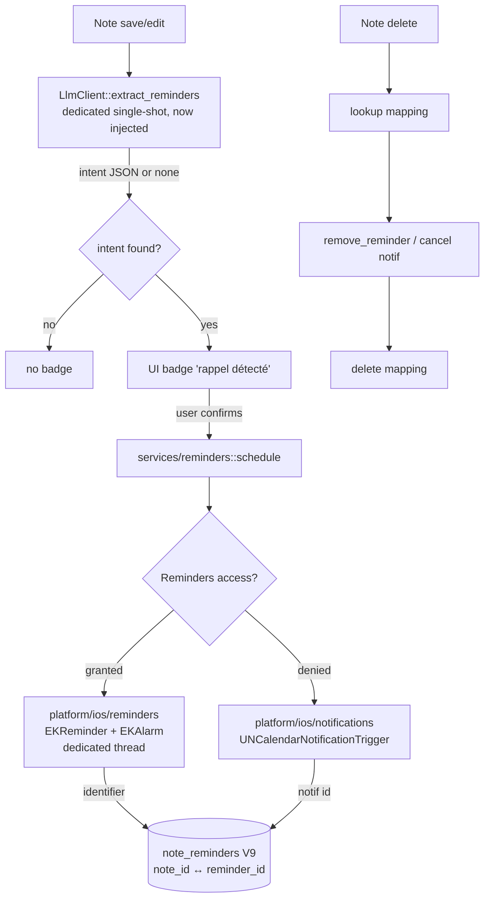
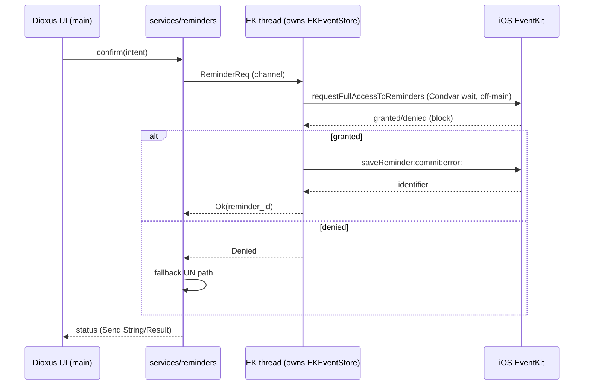
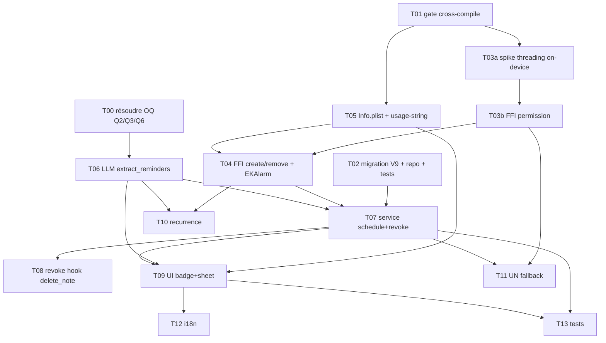

# 0003 — smart note-driven reminders

## 1. Summary

**Problem :** une intention datée écrite dans une note ("appeler Paul demain 15h") n'a aucun effet
système (pas de rappel, app suspendue = 0 CPU) → double saisie ou oubli. Créer un rappel depuis du
Rust pur sur iOS franchit 3 boundaries (FFI objc2 EventKit, permission iOS 17, scheduling délégué OS).

**Recommendation :** adopter **Alt 4 hybride** — EventKit Reminders primaire (sémantique
"rappelle-moi", identifier fiable pour le revoke) + UserNotifications fallback si refus ; extraction
d'intent en **appel LLM dédié** (hors agent chat, blast radius HIGH évité) ; threading prototypé
on-device (picker-style vs thread dédié). **Confidence: medium** (high dès que le gate cross-compile T1 passe).

**Impact :** ~15 modules (majorité additifs), **breaking changes: none**, migration V9 reversible,
~11-12 j solo (buffer on-device). Revue adversariale = 3 BLOCKER + 12 MAJOR, tous load-bearing
**foldés dans le design** (EKAlarm obligatoire, feature set figé, threading sans missed-wakeup,
revoke-tombstone, TZ locale, DDL UNIQUE). Gate bloquant T1 = `cargo build` iOS réel avant tout code feature.

## 2. Context / Codebase

### Affected modules
- `src/platform/ios/` — répertoire FFI iOS existant : `mod.rs` (audio session, keyboard, exports), `picker.rs` (UIDocumentPicker), `pdf.rs` (PDFKit), `player.rs` (AVAudioPlayer), `live_activity.rs`. Nouveau `reminders.rs` se branche ici (mêmes conventions objc2).
- `src/services/tools/` — pattern rig `Tool` existant : `search.rs` (SearchNotes), `summarize.rs` (SummarizeFolder), `create.rs` (CreateNote), `mod.rs` (`prompt_agent_with_tools`, `ToolStatusHook`). Nouveau `extract_reminders.rs` suit ce moule.
- `src/services/llm.rs` — `LlmClient::prompt_with_agent` (193-242), `chat` (128-164) : point d'entrée agent + tools.
- `src/db/schema.rs` — `MIGRATIONS: &[(i64,&str)]` versionné V1→V8. Prochaine = `(9, V9_SCHEMA)`.
- `src/db/` — repos par entité (`note_repo`, `attachment_repo`, `pending_transcription_repo`). Nouveau `note_reminder_repo.rs` suit ce moule.
- `src/ui/notes/` — `menu.rs` (`import_audio_file` 92-103, `import_file_content`), `detail.rs` (UI note). L'indicateur "rappel détecté" + sheet de confirmation s'y branchent.
- `Cargo.toml` — section objc2.

### Key symbols
- `present_picker()` / `open_file_picker()` (`src/platform/ios/picker.rs`) — référence vivante d'appel objc2 UIKit présentant un view controller iOS (même classe de problème que présenter une demande de permission EventKit).
- `configure_audio_session()` (`src/platform/ios/mod.rs:151`) — référence d'appel objc2 vers framework Apple feature-gaté.
- `prompt_agent_with_tools()` (`src/services/tools/mod.rs:69`) — orchestration agent multi-tools.
- `SearchNotes::definition()` (`src/services/tools/search.rs:41`) — forme exacte d'une définition de tool rig (schéma JSON).
- `MIGRATIONS` (`src/db/schema.rs:1`) — liste de migrations additive.

### objc2 stack already cross-compiling on iOS (strong prior art for gap-1)
```
objc2 = "0.6"
objc2-foundation = { "0.3", features = ["NSString","NSArray","NSURL","NSThread","NSData","NSDictionary","NSValue","NSNotification","block2"] }
objc2-ui-kit       = { "0.3", features = [...UIDocumentPickerViewController...] }   # presents iOS VC
objc2-avf-audio    = "0.3"                                                          # AVFoundation
objc2-pdf-kit      = { "0.3", features = ["PDFDocument","PDFPage"] }                # PDFKit
objc2-uniform-type-identifiers = "0.3"
```
→ 4 framework crates objc2 (UIKit, AVFoundation, PDFKit, UTType) compilent et se lient déjà sur `aarch64-apple-ios` + `-sim` dans ce projet. `objc2-event-kit` = même famille, même mécanisme `#[link(name=…, kind="framework")]`, même peer `objc2 0.6` / `objc2-foundation 0.3`. Le risque de gap-1 se réduit à : ajouter les features EventKit + features Foundation manquantes (`NSCalendar`, `NSDate`, `NSDateComponents`, `NSError`).

### Prior art
- RFC-0001 data-backup-export (Draft, non implémenté).
- RFC-0002 audio-import-transcription (locked, implémenté) — précédent direct : pattern thread détaché + `tokio::runtime` écrivant un `Arc<Mutex>` registry (jamais un Signal Dioxus depuis un thread brut), pont via coroutine App-level. Réutilisable pour le travail off-main-thread d'EventKit.
- PRD source : `docs/prd/smart-note-reminders/prd.md`.
- Mémoire projet : "iOS no persistent inbound server" → aucun scheduling en background process maison, cohérent avec la délégation OS.

### Execution flows touched
- Flow extraction : note save → (LLM tool `extract_reminders`) → intent JSON → UI indicateur.
- Flow confirmation → création : user confirme → `services/reminders` (validation) → `platform/ios/reminders` (EventKit, off-main-thread) → identifier → `note_reminder_repo` (mapping).
- Flow cycle de vie : note delete → lookup mapping → `remove_reminder` → delete mapping.

## 3. Problem & Motivation

> Assumptions (auto_mode) flagged inline with ⚑.

### Current state
FlowFlow stocke une note comme texte (`note_repo`) + embeddings (LanceDB). Une intention
datée écrite dans la note ("appeler Paul demain 15h") n'a **aucun effet système** : pas de
notification, pas d'entrée Rappels/Calendrier. L'app, une fois suspendue par iOS, ne tourne
pas (mémoire projet "iOS no persistent inbound server") → aucun timer interne ne peut
déclencher quoi que ce soit.

La couche LLM/agent existe déjà (`prompt_agent_with_tools`, tools rig `search/create/summarize`),
mais aucun tool ne traduit une intention temporelle en action OS. La couche FFI iOS existe
déjà (`platform/ios/*` via objc2) mais ne touche pas EventKit/UserNotifications.

### Pain
- Double saisie : l'utilisateur recopie manuellement l'intention dans Rappels.app, ou oublie.
- L'oubli annule la valeur de la prise de note rapide (le cœur du produit).
- Le "comment" n'est pas trivial : créer un rappel depuis du **Rust pur** sur iOS implique
  3 contraintes dures qui interagissent (FFI objc2 vers EventKit, modèle de permission iOS 17,
  exécution background déléguée à l'OS) → décision d'architecture qui franchit une boundary
  (nouveau framework Apple, nouveau pattern de threading, nouvelle permission App Store).

### Why now
- Couches notes / transcription / RAG / agent matures → la brique manquante est l'**action**.
- Premier pas concret vers des "notes agentiques" (vision projet).
- ⚑ Pas de deadline externe ; opportunité produit, pas incident.

### Signals
- ⚑ Pas de metric en place aujourd'hui (feature inexistante). Baseline à instaurer via les
  metrics M1-M6 du PRD (taux de capture, faux positifs, conversion, fiabilité de déclenchement).
- Précédent technique mesurable : 4 framework crates objc2 (UIKit/AVFoundation/PDFKit/UTType)
  compilent déjà sur les 2 cibles iOS → coût d'intégration d'un 5e (EventKit) faible et borné.

## 4. Goals / Non-Goals

### Goals
- G1 — Décider le **mécanisme OS** de déclenchement (EventKit vs UserNotifications vs hybride)
  et le justifier par tradeoffs, pas par défaut.
- G2 — Fixer le **pattern de threading** pour un `EKEventStore` `!Send` + une permission dont
  le callback bloque (Condvar) sans figer le run-loop de la pop-up iOS.
- G3 — Définir le **modèle de données** du mapping note ↔ rappel (anti-doublon + revoke) en
  migration additive V9.
- G4 — Définir l'intégration **LLM tool** (`extract_reminders`) cohérente avec le pattern rig
  existant, sans casser l'agent actuel.
- G5 — Verrouiller le **gate de faisabilité** (cross-compile réel) comme prérequis bloquant
  avant tout code produit.

### Non-Goals
- We are NOT building une exécution background maison (process/daemon/timer) — impossible sur
  iOS par design ; tout scheduling est délégué à l'OS.
- We are NOT supporting Android dans ce RFC (FFI EventKit = Apple-spécifique).
- We are NOT implémentant l'édition d'un rappel existant depuis la note en V1 (create + delete
  seulement ; l'édition fine reste dans Rappels.app).
- We are NOT construisant un moteur NLP de dates maison — l'extraction passe par le LLM intégré.
- We are NOT gérant la sync cross-device au-delà de ce qu'iCloud Rappels donne gratuitement.

## 5. Alternatives Considered

> Decision axis : comment transformer un intent confirmé en rappel déclenché par l'OS, depuis
> du Rust pur sur iOS. Tous les forward-paths partagent la couche extraction LLM
> (`extract_reminders`) + confirmation UI ; ils diffèrent sur le **mécanisme OS de
> déclenchement** et son coût de permission/threading.

### Alt 0 — Status Quo
**Summary:** L'intention reste du texte mort dans la note.
**Cost of inaction:** double saisie manuelle dans Rappels.app ou oubli → la valeur de la prise
de note rapide est annulée. Aucune metric, aucun déclenchement.
**Pros:** zéro effort, zéro risque de régression, zéro nouvelle permission App Store.
**Cons:** la pain de la section 3 persiste intégralement ; pas de pas vers les "notes agentiques".
**Reversibility:** n/a.

### Alt 1 — UserNotifications local-only
**Summary:** À la confirmation, planifier une notification locale via `objc2-user-notifications`
(`UNCalendarNotificationTrigger` + `UNUserNotificationCenter`). Rien n'entre dans Rappels/Calendrier.
**How it solves:** G1 (mécanisme OS) par le chemin le plus léger ; iOS déclenche la notif app fermée.
**Pros:**
- Permission unique et douce (`requestAuthorization`), pas d'accès Rappels/Calendrier, pas de clé Info.plist EventKit.
- Pas de problème de threading `!Send` (UN center est thread-safe, pas de store `EKEventStore`).
- 100% in-app, dégradation simple si refus.
**Cons:**
- Cap **64 pending** : au-delà, iOS garde les 64 plus proches et drop le reste silencieusement → re-scheduling à chaque lancement nécessaire.
- Pas visible/éditable/snoozable dans une app système ; sémantique "rappel" plus faible (banner fire-and-forget).
- Survie au reboot **non documentée officiellement** (anecdotique SO "worked for me", pas de garantie Apple). ⚑
- Pas de récurrence riche (RRULE) aussi naturelle qu'EventKit.
**Cost:** faible (1 crate, pas de gymnastique thread). **Reversibility:** facile (retirer le scheduling).
**References:** developer.apple.com/.../SchedulingandHandlingLocalNotifications ; SO 44457030 / 66924442 (reboot anecdotique).

### Alt 2 — EventKit Reminders, programmatique (full access)
**Summary:** `objc2-event-kit` — `EKReminder` + `EKAlarm` + `saveReminder:commit:error:`,
sauvegardé dans Rappels.app. Recommandé sémantiquement pour "rappelle-moi".
**How it solves:** G1-G4 ; le rappel devient un objet système first-class.
**Pros:**
- Sémantique exacte : "rappelle-moi" → entrée Rappels.app, visible, éditable, snoozable, Siri/widgets.
- Survit reboot + terminaison (DB système Rappels). Pas de cap 64.
- Récurrence native `EKRecurrenceRule`. Family objc2 déjà cross-compilée dans le projet.
**Cons:**
- Exige **full access Rappels** (aucun write-only pour les reminders, contrairement aux events) → friction permission + clé `NSRemindersFullAccessUsageDescription`.
- `EKEventStore` est `!Send`/`!Sync` → doit être confiné à un thread dédié.
- Callback de permission (block + Condvar) doit tourner **hors main-thread** sinon deadlock du run-loop de la pop-up.
- Règle iOS : due date exige start date (`EKErrorNoStartDate`).
**Cost:** moyen (FFI + threading discipliné). **Reversibility:** moyenne — la permission accordée est une **one-way door** UX (révocable seulement dans Réglages iOS), mais le code est retirable.
**References:** developer.apple.com/eventkit/accessing-the-event-store ; docs.rs/objc2-event-kit/0.3.2 ; WWDC23 "Discover Calendar and EventKit".

### Alt 3 — EventKit **Calendar event** via `EKEventEditViewController` (EventKitUI, iOS 17 no-permission)
**Summary:** Au lieu d'écrire programmatiquement, présenter l'éditeur système pré-rempli
(`EKEventEditViewController`, EventKitUI). En iOS 17 il tourne **out-of-process** → **aucune
permission Calendrier requise** ; l'utilisateur tape "Ajouter".
**How it solves:** G1 sans le coût de permission/threading d'Alt 2.
**Pros:**
- **Zéro prompt de permission**, zéro clé Info.plist EventKit (en pur iOS 17 SDK). Friction minimale.
- L'éditeur a full access système → l'utilisateur choisit le calendrier, ajuste, confirme.
- Réutilise le pattern de présentation de VC UIKit déjà en place (`picker.rs`/`present_picker`).
**Cons:**
- **Events, pas Reminders** : sémantiquement "rendez-vous" plutôt que "tâche à cocher". "Rappelle-moi d'appeler Paul" colle moins.
- Un **tap manuel** par item (pas de création batch silencieuse) ; pas de récurrence programmatique sans interaction.
- L'app est **aveugle** au résultat (out-of-process) → impossible de stocker un identifier fiable pour le revoke (G3/US6 cassé) ; pas d'anti-doublon côté système.
- Nécessite bindings EventKitUI (`objc2-event-kit-ui` si publié, sinon binding manuel) — ⚑ à vérifier comme gap.
- Présenter une UI système casse le flow "confirme dans une sheet maison".
**Cost:** faible-moyen. **Reversibility:** facile.
**References:** developer.apple.com/EventKit/accessing-calendar-using-eventkit-and-eventkitui ("In iOS 17, your app can add events to Calendar without prompting"); TN3153 ; SO 78094998.

### Alt 4 — Hybride : EventKit Reminders primaire + UserNotifications fallback
**Summary:** Alt 2 quand l'accès Rappels est accordé ; bascule sur Alt 1 (UN local) quand
l'utilisateur refuse ou pour des nudges éphémères qu'on ne veut pas dans Rappels.app.
**How it solves:** G1-G5 ; couvre le cas refus de permission sans bloquer la feature (US5).
**Pros:**
- Meilleure sémantique quand permission accordée (Rappels first-class) **et** dégradation utile si refus.
- Aligne sur la reco de la deep-research et le principe "feature reste utilisable sans accès Rappels".
- Le mapping/identifier reste fiable sur le chemin EventKit (revoke OK).
**Cons:**
- **Deux chemins de code** à maintenir (EventKit + UN) → plus de surface de test, deux modèles de permission.
- Le fallback UN hérite du cap 64 + de l'incertitude reboot.
- Complexité de routage (quel mécanisme, quand) à spécifier proprement.
**Cost:** moyen-élevé (somme d'Alt 1 + Alt 2 + logique de routage). **Reversibility:** moyenne.
**References:** mêmes qu'Alt 1 + Alt 2 ; deep-research feasibility report (reco hybride).

## 6. Proposed Design

**Base = Alt 4 (hybride)** : EventKit Reminders comme colonne vertébrale (sémantique
"rappelle-moi", visible/éditable, identifier fiable pour le revoke), UserNotifications comme
fallback quand l'accès Rappels est refusé. Alt 3 (EKEventEditViewController) écartée comme base
car l'app est aveugle au résultat → pas d'identifier → G3/US6 (revoke, anti-doublon) cassés.

### Decision driven by impact analysis
`gitnexus_impact(prompt_agent_with_tools, upstream)` = **HIGH** (RAG `query` conf 0.9 →
chat `send_question`, 8 process, 13 hits). **Donc l'extraction d'intention N'EST PAS ajoutée
comme tool dans l'agent chat existant.** Elle est un **appel LLM dédié single-shot**
(`LlmClient::extract_reminders`), isolé du chemin chat critique → blast radius du nouveau code
≈ 0 sur l'agent RAG. `delete_note` = MEDIUM (5 tests) → le revoke est un hook **additif**.

### Architecture overview
Trois sous-systèmes, tous nouveaux ou additifs : extraction (services), création/révocation OS
(platform/ios FFI), persistance du lien (db). Le thread UI Dioxus ne touche jamais
`EKEventStore` directement.



### Modules / files affected
| Path | Change | Why |
|------|--------|-----|
| `Cargo.toml` | modified | add `objc2-event-kit` + `objc2-user-notifications` (both `default-features=false`); extend `objc2-foundation`. **Exact feature set (figé, post-review #2) :** `objc2-event-kit = { default-features=false, features=["EKEventStore","EKReminder","EKEvent","EKCalendarItem","EKObject","EKCalendar","EKAlarm","EKRecurrenceRule","EKRecurrenceEnd","EKRecurrenceDayOfWeek","EKTypes","EKError","block2"] }` (exclut explicitement `objc2-app-kit`/`-map-kit`/`-core-location`). `objc2-foundation` += `NSCalendar`,`NSDate`,`NSDateComponents`,`NSError`,`NSTimeZone`. |
| `src/platform/ios/reminders.rs` | **new** | EventKit FFI: `request_reminders_access`, `create_reminder`, `remove_reminder`; owns the dedicated `EKEventStore` thread |
| `src/platform/ios/notifications.rs` | **new** | UserNotifications FFI fallback: `request_notif_auth`, `schedule_local`, `cancel_local` |
| `src/platform/ios/mod.rs` | modified | `pub use` the two new modules (additive, alongside picker/pdf/player) |
| `src/services/reminders.rs` | **new** | business logic: datetime validation (start+due rule), routing EventKit↔UN, map domain↔FFI, revoke orchestration |
| `src/services/llm.rs` | modified | add `extract_reminders(text, now) -> Option<ReminderIntent>` — dedicated call, NOT wired into `prompt_agent_with_tools` |
| `src/services/constants.rs` | modified | extraction system prompt (FR/EN dates, current-date injection, null-on-absent) |
| `src/db/schema.rs` | modified | add `(9, V9_SCHEMA)` + `V9_SCHEMA` (additive) |
| `src/db/note_reminder_repo.rs` | **new** | CRUD mapping (add, get_by_note, delete_by_note, exists_by_intent_hash) |
| `src/db/mod.rs` | modified | `pub mod note_reminder_repo;` |
| `src/db/note_repo.rs` | modified | `delete_note` calls revoke hook (additive; cascade tests must stay green) |
| `src/ui/notes/detail.rs` | modified | "rappel détecté" badge + confirmation sheet + states |
| `src/ui/state.rs` | modified | signal(s) for detected/pending reminders |
| `src/services/i18n/locales/{fr,en}.ftl` | modified | labels (detected, confirm, ignore, permission, failure) |
| `Info.plist` (make/dx pipeline) | modified | `NSRemindersFullAccessUsageDescription` (+ legacy `NSRemindersUsageDescription`) |
| `tests/` | **new** | V9 migration, repo CRUD, extraction parse, anti-doublon/revoke |

**Breaking changes: none.** Migration additive, FFI additif, extraction = appel séparé (agent chat
intact), revoke = hook additif.

### Data model (migration V9, additive + reversible)
**DDL explicite (post-review #8) :**
```sql
CREATE TABLE note_reminders (
  id            TEXT PRIMARY KEY,
  note_id       TEXT NOT NULL REFERENCES notes(id) ON DELETE CASCADE,
  reminder_id   TEXT NOT NULL,              -- EKReminder calendarItemIdentifier OR UN request id
  backend       TEXT NOT NULL,              -- 'eventkit' | 'usernotifications'
  intent_hash   TEXT NOT NULL,              -- hash(action + recurrence + local due components)
  due_year      INTEGER, due_month INTEGER, due_day INTEGER,
  due_hour      INTEGER, due_minute INTEGER,-- LOCAL components, not a UTC instant (post-review #11)
  is_all_day    INTEGER NOT NULL DEFAULT 0,
  tz_id         TEXT,                        -- explicit IANA tz for dueDateComponents.timeZone
  recurrence    TEXT,                        -- RRULE-subset string or NULL
  state         TEXT NOT NULL DEFAULT 'active', -- 'active' | 'tombstone' (revoke-failed, retry)
  created_at    TEXT NOT NULL,
  UNIQUE(note_id, intent_hash)
);
```
- Cardinalité : **1 note → N rappels** (`note_id` non unique) ; `UNIQUE(note_id, intent_hash)`
  applique l'anti-doublon au niveau DB.
- **Datetime = composants locaux + `is_all_day` + `tz_id`**, jamais un instant UTC (évite le décalage
  DST / voyage de fuseau ; aligne sur `dueDateComponents` d'EventKit). All-day = composants sans heure.
- **`intent_hash` = hash(action + recurrence + composants due locaux)**, pas le texte brut de la note
  ni un instant absolu (post-review #7). Sur ré-édition : `services/reminders` **diff par `note_id`** ;
  si l'intent résolu change → revoke l'ancien rappel + crée le nouveau (pas de reliance sur l'égalité
  de hash d'une note éditée).
- CASCADE sur `note_id` nettoie la ligne SQLite ; le **revoke OS reste explicite** (CASCADE ne touche
  pas Rappels.app). Le hook `delete_note` appelle `remove_reminder` ; **sur échec OS, la ligne passe
  `state='tombstone'`** (pas supprimée) → retry ultérieur, jamais d'orphelin silencieux (post-review #9).
- Reversible : `DROP TABLE note_reminders` (aucune donnée V8 touchée).

### API contracts (internes — pas d'API réseau)

**Couche FFI `platform/ios/reminders.rs`** (signatures Rust, exécutées hors main-thread)
```
fn request_reminders_access() -> RemindersAuth   // Granted | Denied | Restricted
fn create_reminder(req: &ReminderReq) -> Result<String, ReminderErr>   // Ok = reminder_id
fn remove_reminder(reminder_id: &str) -> Result<(), ReminderErr>
```
**Couche FFI `platform/ios/notifications.rs`**
```
fn request_notif_auth() -> bool
fn schedule_local(req: &ReminderReq) -> Result<String, ReminderErr>     // Ok = request id
fn cancel_local(request_id: &str)
```
**Couche service `services/reminders.rs`**
```
struct ReminderReq { title, due_components: LocalComponents, is_all_day: bool, tz_id: String,
                     alarm: AlarmSpec, recurrence: Option<Rrule> }   // alarm TOUJOURS présent (post-review #1)
fn schedule(db, note_id, intent) -> Result<Mapping, ReminderErr>     // routes EventKit↔UN, diff+persist
fn revoke_for_note(db, note_id)                                      // tombstone on OS-removal failure
```
**Note #1 (load-bearing) :** `create_reminder` pose **systématiquement** un `EKAlarm`
(`alarmWithAbsoluteDate:` au moment due, ou `alarmWithRelativeOffset:` pour all-day). Sans alarme,
`dueDateComponents` est purement informatif et **n'alerte jamais** → M4 échouerait. T04 doit asserter
que l'alarme fire, pas seulement la présence du rappel.
**Couche LLM `services/llm.rs`** (dedicated, hors agent chat)
```
struct ReminderIntent { action: String, date: Option<NaiveDate>, time: Option<NaiveTime>,
                        recurrence: Option<String>, location: Option<String> }
fn extract_reminders(&self, text: &str, now: DateTime<Local>) -> Result<Vec<ReminderIntent>, LlmError>
```
Tool JSON schema (single-shot prompt, current date injected) :
```json
{ "intents": [ { "action": "...", "date": "YYYY-MM-DD|null", "time": "HH:mm|null",
                 "recurrence": "RRULE|null", "location": "string|null" } ] }
```

### Threading design (the load-bearing decision)
`EKEventStore` est `!Send`/`!Sync`/`!Freeze` → ne peut traverser des threads. Le callback de
permission (block objc2) fire sur une queue OS background.

**⚠️ Pivot post-review (#5/#6) — prototyper AVANT de figer.** Le seul précédent qui marche dans
le repo (`picker.rs`) présente un VC en `MainThreadOnly` + `MainThreadMarker` + poll async sur le
main. Le "tout hors main-thread" n'a **aucun prior art interne** et le deadlock du callback est
**asserté, pas prouvé**. Décision : **T03a = spike on-device** comparant deux patterns avant
d'écrire la couche :
- **Pattern A (préféré si ça marche) — picker-style :** demander la permission sur le main-thread
  via `requestFullAccessToReminders`, récupérer le résultat par poll async d'un `Arc<Mutex<Option<…>>>`
  rempli par le block (exactement le pattern `picker.rs`). Évite le 2e thread `!Send` entièrement.
- **Pattern B (repli) — thread dédié :** un thread long-vécu possède l'`EKEventStore` ; le reste
  communique par **canal `mpsc`/`oneshot`** (pas un `Condvar` nu).

**Synchronisation du block → Rust (corrige #3, missed-wakeup) :** quel que soit le pattern, ne
**jamais** `Condvar::wait` sans prédicat — le block peut fire avant le `wait`. Utiliser soit un
`oneshot`/`mpsc` (le sender survit, pas de lost-wakeup), soit `Condvar::wait_while` sur un
`Mutex<Option<Result>>` re-checké. Le thread UI Dioxus ne voit jamais l'`EKEventStore`, seulement
des `String`/`Result` `Send`.



### Cross-cutting
- **Permission / App Store** : `NSRemindersFullAccessUsageDescription` injectée par le pipeline
  `make`/`dx` (historique de bugs d'injection → tâche de vérif que la clé survit dans le `.app`).
  Sans la clé, iOS 17 auto-refuse. Création toujours user-confirmée (jamais silencieux).
  **Modèle d'état (post-review #4) :** lire `authorizationStatus(for: .reminder)` **avant** tout
  `requestFullAccess` (qui ne re-prompt pas une fois décidé). `NotDetermined` → prompt. `Denied` /
  `Restricted` (parental/MDM) → bascule fallback UN + affordance "ouvrir Réglages"
  (`UIApplication.openSettingsURLString`). Re-check le statut **avant chaque create** (l'user peut
  révoquer dans Réglages à tout moment en cours de session).
- **App Store review (post-review #17)** : full Reminders access pour une app IA + historique
  review 5.1.2 du projet = surface de reject réelle. Pré-rédiger la usage-string + des reviewer
  notes (flux user-confirmé, on-demand) + un chemin démo → tâche T05.
- **Consentement IA** : `extract_reminders` derrière `ai_consent` existant.
- **Observability** : `eprintln!` ciblés (`[reminder] created id=… backend=…`, `[reminder] revoked …`),
  cohérent avec le style de logs existant (`[soniox]`, `[import]`). Metrics M1-M6 = manuelles V1.
- **Rollout** : feature additive, pas de flag nécessaire ; le badge n'apparaît que si un intent
  est détecté → invisible tant que l'utilisateur n'écrit pas d'intention datée.
- **Backwards compat** : V9 additive ; bases V8 existantes migrent sans perte.

## 7. Drawbacks & Risks

### Drawbacks (inherent)
- **+2 nouvelles dépendances objc2** (`objc2-event-kit`, `objc2-user-notifications`) → temps de
  compile iOS plus long, surface de crate plus large. Atténué : même famille déjà présente.
- **Deux chemins de scheduling** (EventKit + UN) = complexité permanente : deux modèles de
  permission, deux formats d'identifier, deux comportements de révocation à maintenir et tester.
- **Nouvelle permission App Store** (full Reminders) → un point de friction supplémentaire à la
  review Apple + une justification d'usage à rédiger. La permission accordée est une one-way door UX.
- **Code `unsafe` FFI** : chaque appel EventKit est `unsafe` (objc2 header-generated) → revue
  plus exigeante, risque mémoire si mal manié.
- **Couplage à un appel LLM payant** pour l'extraction (latence + coût par note traitée).
- **Thread dédié long-vécu** supplémentaire (propriétaire de l'`EKEventStore`) → un peu plus de
  complexité de cycle de vie que le reste de l'app.

### Risks (probabilistic)

| Risk | Likelihood | Impact | Mitigation |
|------|-----------|--------|------------|
| `objc2-event-kit` ne link pas sur `aarch64-apple-ios` (docs.rs ne build que macOS) | low | high | **Gate bloquant T1** : `cargo build --target aarch64-apple-ios` AVANT tout code produit ; précédent fort (4 framework crates objc2 déjà liées). Repli = Alt 3 (EventKitUI, no-perm) ou Alt 1 (UN only). |
| `default-features=false` strip une sous-feature `objc2-foundation` requise → symbole inexistant à la compile | medium | medium | Itérer la liste de features au gate T1 ; erreur visible à la compile, pas au runtime. |
| Deadlock du run-loop si la permission est demandée sur le main-thread | medium | high | Pattern thread dédié imposé (design §threading) ; revue ciblée + test on-device de la pop-up. |
| `extract_reminders` produit dates fausses / faux positifs (M1/M2 ratés) | medium | medium | Date courante injectée ; défauts explicites affichés ; **confirmation user obligatoire** absorbe les erreurs avant écriture. |
| Clé Info.plist non injectée par `make`/`dx` → iOS 17 auto-refuse l'accès | medium | high | Tâche de vérif explicite que la clé survit dans le `.app` installé (historique projet de bugs d'injection icône/plist). |
| Fallback UN dépasse le cap 64 pending → drops silencieux | low | medium | **Cap dur 64** (refus au-delà + prévenir l'user) ; pas de reliance sur un "re-schedule au lancement" (app peut ne pas se lancer pendant des semaines — post-review #15) ; UN = fallback best-effort documenté. |
| Survie reboot des notifs UN non garantie (non documentée Apple) | low | low | Documenter comme limite connue ; EventKit (chemin primaire) n'a pas ce souci. |
| Régression du test `test_cascade_delete_note_removes_attachments` via le hook revoke dans `delete_note` | low | medium | Revoke additif ; sur échec OS → tombstone (pas de delete SQL silencieux) ; relancer la suite cascade. |
| ~~`objc2-event-kit-ui` absent / non publié~~ **(résolu post-review #20)** | — | — | **Publié** (crates.io v0.3.2, déc. 2024, `EKEventEditViewController` en défaut) → le repli Alt 3 est binding-ready, pas un risque. |

### Rollout / rollback
- **Rollout :** big-bang additif, pas de flag. Le badge "rappel détecté" n'apparaît que si un
  intent est extrait → la feature est invisible/inerte tant que l'utilisateur n'écrit pas
  d'intention datée et ne confirme pas. Gate T1 (cross-compile) précède toute livraison.
- **Rollback :** révoquer le PR. Migration V9 **reversible** (`DROP TABLE note_reminders`, aucune
  donnée V8 touchée). Les rappels déjà créés dans Rappels.app **survivent** au rollback (objets
  système indépendants) — acceptable, ils restent éditables/supprimables par l'utilisateur.
- **Gating metrics :** validation on-device manuelle (M4 = déclenchement app fermée à 100 %)
  avant merge ; M1/M2 (capture/faux positifs) sur set d'échantillon avant d'élargir.

## 8. Open Questions

### Décidées à l'acceptation (2026-06-01)
| # | Question | Décision |
|---|----------|----------|
| Q2 | Déclencheur de détection | **Debounce on-blur** : extraction quand la note se stabilise (perte de focus / save debouncé), jamais par frappe ni à chaque autosave. Évite coût LLM + churn de ré-extraction (review #10). |
| Q3 | Plusieurs intents par note | **Tous d'un coup, badge pluriel** : une passe d'extraction → N intents ; badge compteur ; sheet liste chaque intent avec Confirmer/Ignorer propre. Aligné sur le schéma 1 note → N rappels (`UNIQUE(note_id, intent_hash)`). |
| Q4 | Granularité du fallback UN | **Notif unique, cap dur 64** : un `UNCalendarNotificationTrigger` par rappel ; refus au-delà de 64 + prévenir l'user. Pas de re-schedule-au-lancement (review #15 : app suspendue peut ne pas se lancer). Best-effort documenté. |
| Q6 | Défaut d'heure (date sans heure) | **Fixe 09:00, affiché + éditable** : date sans heure → 09:00 par défaut, montré dans la sheet de confirmation, modifiable avant validation. PRD-compliant (explicite + modifiable), V1 simple. |

### Encore ouvertes
| # | Question | Owner | Deadline |
|---|----------|-------|----------|
| Q1 | `cargo build --target aarch64-apple-ios` + `-sim` link-il `objc2-event-kit` avec le feature set figé §6 ? | Mirko | **Bloquant** — gate T01, avant tout code produit (seul un build réel tranche). |
| Q5 | Survie reboot des notifs UN : test on-device, ou assumée non garantie ? | Mirko | avant T11, non bloquant |

## 9. Recommendation & Rationale

**Recommendation:** Adopter **Alt 4 — hybride (EventKit Reminders primaire + UserNotifications
fallback)**, tel que conçu en section 6, avec l'extraction d'intention en **appel LLM dédié**
(hors agent chat) et un **thread propriétaire de l'`EKEventStore`**.

**Confidence: medium** — l'architecture (threading, data model, isolation de l'agent chat) est
solide et appuyée par un précédent interne fort (RFC-0002 + 4 framework crates objc2 déjà liées
iOS). Le seul facteur qui empêche "high" : le link réel d'`objc2-event-kit` sur
`aarch64-apple-ios` n'est pas encore prouvé on-target (docs.rs ne build que macOS) → confiance
remonte à high dès que le gate T1 passe.

### How it hits the goals
| Goal | Mechanism (section 6) |
|------|-----------------------|
| G1 — mécanisme OS justifié | EventKit primaire (sémantique "rappelle-moi", survit reboot, pas de cap) ; UN en fallback de refus. Choix issu de la matrice §5, pas par défaut. |
| G2 — threading `!Send` + permission sans deadlock | Thread dédié long-vécu possède l'`EKEventStore` ; permission + Condvar hors main-thread ; UI ne voit que des `Send`. |
| G3 — data model anti-doublon + revoke | Table V9 `note_reminders` avec `intent_hash` UNIQUE (anti-doublon) + `reminder_id` (revoke explicite avant delete SQL). |
| G4 — intégration LLM sans casse | `extract_reminders` = appel single-shot dédié ; **n'est pas** branché dans `prompt_agent_with_tools` (HIGH blast radius évité). |
| G5 — gate de faisabilité bloquant | T1 = `cargo build` iOS réel avant tout code produit ; repli documenté (Alt 3 / Alt 1). |

### Why not other alternatives
- **Alt 0 (status quo) :** rejeté — l'intention datée reste muette, double saisie/oubli ;
  le coût d'inaction annule la valeur produit, supérieur au coût d'implémentation additive.
- **Alt 1 (UN local-only) :** rejeté comme base — cap 64 pending + pas d'entrée Rappels.app
  visible/éditable + survie reboot non garantie → sémantique "rappel" trop faible. **Conservé
  comme fallback** (US5), pas comme colonne vertébrale.
- **Alt 2 (EventKit Reminders seul) :** rejeté tel quel — sans fallback, un refus de permission
  full Reminders **bloque entièrement** la feature (US5 non satisfait). Alt 4 = Alt 2 + filet.
- **Alt 3 (EKEventEditViewController, no-perm) :** rejeté comme base pour deux blocages précis :
  (1) l'app est **aveugle** au résultat out-of-process → aucun identifier stockable → **G3/US6
  (revoke, anti-doublon) impossibles** ; (2) c'est un **event Calendrier, pas un Reminder** →
  "rappelle-moi d'appeler Paul" mal modélisé. Reste un repli envisageable si le gate EventKit
  échoue.

### Revisit if
- Le gate T1 échoue (link `objc2-event-kit` KO sur iOS) → basculer base vers Alt 3 (EventKitUI,
  events, no-perm) ou Alt 1 (UN only), et réviser G3/US6 en conséquence.
- Apple durcit l'accès full Reminders (refus systématique en review) → promouvoir UN en primaire.
- Le volume de rappels dépasse durablement 64 simultanés par utilisateur → repenser la stratégie
  fallback UN (budget/priorisation).
- Une API EventKitUI no-permission pour **Reminders** (pas seulement events) apparaît → reconsidérer
  Alt 3 pour supprimer la friction de permission.

## 10. Implementation Plan

### Tasks

| ID | Title | Files | Depends on | Effort | Accept criteria |
|----|-------|-------|------------|--------|-----------------|
| T00 | **Résoudre open questions bloquantes** ✅ | (RFC §8) | none | XS | **DONE (2026-06-01)** : Q2=debounce on-blur · Q3=all-at-once badge pluriel · Q4=notif unique cap-dur 64 · Q6=fixe 09:00 éditable. Reste Q1 (gate T01) + Q5 (non bloquant). |
| T01 | **Gate** cross-compile EventKit | `Cargo.toml`, `src/platform/ios/reminders.rs` (stub) | none | M | `cargo build --target aarch64-apple-ios` **et** `-sim` OK avec le **feature set figé §6** ; `EKEventStore::new()` lie. 2e jour sur T01 = signal de repli Alt3/Alt1. **Bloquant.** |
| T02 | Migration V9 + repo mapping (+tests) | `src/db/schema.rs`, `src/db/note_reminder_repo.rs`, `src/db/mod.rs` | none | M | DDL §6 (UNIQUE, composants locaux, state) ; CRUD + `exists_by_intent_hash` + tombstone testés ; V8→V9 sans perte. **T02 possède les tests migration/repo** (post-review #24). |
| T03a | **Spike threading on-device** | `src/platform/ios/reminders.rs` | T01 | M | prototyper Pattern A (picker-style main+async-poll) vs Pattern B (thread dédié) ; choisir ; prouver permission Granted/Denied bridgée sans deadlock ni missed-wakeup (post-review #3/#5/#6). |
| T03b | FFI permission (pattern retenu) | `src/platform/ios/reminders.rs` | T03a | M | `request_reminders_access()` lit `authorizationStatus` d'abord ; Denied/Restricted → signalé ; pop-up visible on-device ; sync via channel/`wait_while`. |
| T04 | FFI create/remove + EKAlarm | `src/platform/ios/reminders.rs`, `src/platform/ios/mod.rs` | T03b, T05 | M | `create_reminder` pose **EKAlarm** → identifier ; rappel **alerte** app fermée (pas juste visible) ; `remove_reminder` le retire ; start+due posés (pas d'`EKErrorNoStartDate`). |
| T05 | Info.plist key + usage-string + survie bundle | pipeline `make`/`dx`, `Info.plist` | T01 | S | `NSRemindersFullAccessUsageDescription` (copie rédigée) présente dans le `.app` installé ; reviewer notes App Store ébauchées (post-review #17) ; accès non auto-refusé iOS 17. |
| T06 | LLM `extract_reminders` dédié | `src/services/llm.rs`, `src/services/constants.rs` | T00 | M | appel single-shot (PAS dans l'agent chat) ; derrière guard `ai_consent` (path réel) ; date courante injectée ; relatives→absolu ; phrases vagues → règle ou ask (post-review #16) ; cap longueur ; JSON → `Vec<ReminderIntent>`. |
| T07 | Service schedule + routing + revoke | `src/services/reminders.rs` | T02, T04, T06 | M | `schedule()` route EventKit↔UN, valide (start+due, TZ locale), persiste mapping ; édition → diff par `note_id` + revoke/update (post-review #7) ; `revoke_for_note()` → tombstone sur échec OS. |
| T08 | Hook revoke dans delete_note | `src/db/note_repo.rs` | T07 | S | `delete_note` appelle `revoke_for_note` ; `test_cascade_delete_note_removes_attachments` reste vert. |
| T09 | UI badge + sheet confirmation | `src/ui/notes/detail.rs`, `src/ui/state.rs` | T05, T06, T07 | M | badge (plural-aware si Q3) si intent ; sheet Confirmer/Ignorer ; aucune création sans confirmation ; pas de date → pas de badge ; date passée → avertit. (T05 = soft-dep pour test E2E permission, post-review #13.) |
| T10 | Récurrence EKRecurrenceRule | `src/platform/ios/reminders.rs`, `src/services/reminders.rs` | T04, T06 | S | sous-ensemble RRULE défini (dont BYDAY jours ouvrés) → `EKRecurrenceRule` (interval ≥ 1, due components toujours posés) ; phrases non gérées rejetées ; redéclenche on-device. |
| T11 | Fallback UserNotifications | `src/platform/ios/notifications.rs`, `src/platform/ios/mod.rs`, `src/services/reminders.rs` | T03b, T07 | M | Rappels refusé → UN local ; **cap dur 64** (refus au-delà + prévenir l'user, best-effort documenté, post-review #15) ; feature utilisable sans accès Rappels. |
| T12 | i18n + messages d'erreur | `src/services/i18n/locales/{fr,en}.ftl` | T09 | S | labels FR/EN (détecté, confirmer, ignorer, permission, ouvrir Réglages, échec+retry) ; parité 0 gap. |
| T13 | Tests | `tests/` | T07, T09 | M | extraction parse (relatif→absolu, DST/all-day, défauts, null), anti-doublon/diff édition, revoke+tombstone ; set M1/M2 sur échantillon. (migration/repo = T02.) |

Aucune tâche > M (T03 splitté en T03a/T03b suite review #5). T00 ajouté (résolution OQ bloquantes).

### Dependency graph


**Parallelizable :** T00/T02/T06 en parallèle de la branche T01→T03a→T03b→T04. T05 en parallèle
tôt (gate du test permission). T10/T11/T12 après T07/T09.

### Verification
- **Unit/integration :** T02 (migration + CRUD), T06 (parse extraction : relatif→absolu, défauts,
  null), T07 (routing + anti-doublon + revoke), T08 (cascade reste verte).
- **Manuel on-device (non automatisable) :** T03 (pop-up permission), T04 (rappel fire app fermée
  = M4 100 %), T10 (récurrence), T05 (clé dans le bundle).
- **Sample metrics :** T13 mesure M1 (capture ≥80 %) / M2 (faux positifs ≤5 %) sur notes échantillon.

### Timeline (indicatif, solo — révisé post-review #14)
- Critical path : T01 → T03a → T03b → T04 → T07 → T09 → T13 ≈ 7 × M.
- Parallèle : T00/T02/T06/T05 absorbés pendant T01-T04 ; T10/T11/T12 après T07/T09.
- **Buffer 50 % sur les tâches on-device** (T03a/T03b/T04/T05/T10 non-CI-ables → chaque loop =
  `make all` + friction provisioning/signing documentée). Threading (T03a) = plus gros unknown.
- Estimation : ~7 j nominal → **~11-12 j réalistes** (pré-flight d'un `make all` device sain
  avant T03a recommandé).
- **Hard gate :** si T01 échoue (ou 2e jour sans link), STOP avant les tâches feature →
  réévaluer base (Alt 3 EventKitUI no-perm / Alt 1 UN-only).

## 11. Review Findings

**Reviewers:** 2 adversarial subagents (`general-purpose`, fresh context) — "Gap hunter" [G] +
"Impl realism" [I]. **Date:** 2026-05-31. Neutral capture (findings not yet folded into §1-10).

| # | Severity | Section | Issue | Suggestion |
|---|----------|---------|-------|------------|
| 1 | BLOCKER | §6 API/data [G] | Le design n'impose pas explicitement d'`EKAlarm`. `dueDateComponents` est informatif et ne **déclenche pas** de notification → rappel créé mais jamais d'alerte (M4 échoue silencieusement). | Imposer `EKAlarm::alarmWithAbsoluteDate` sur tout rappel temporisé ; T04 doit asserter que l'alarme fire, pas juste la présence de la ligne. |
| 2 | BLOCKER | §2/Cargo [G] | Liste de features non figée. `default-features=false` + liste incomplète → manque `EKAlarm`, `EKRecurrenceRule`, `EKRecurrenceEnd`, `EKRecurrenceDayOfWeek`, `block2`, `EKError` → link KO ou API absentes. | Figer le set exact non-AppKit dans le RFC **maintenant** (pas "itérer à T1") ; exclure `objc2-app-kit` ; lister chaque feature EK* appelée. |
| 3 | BLOCKER | §6 threading [G] | Trou missed-wakeup : le block de complétion EventKit fire sur une queue OS et peut s'exécuter **avant** `Condvar::wait` → lost-wakeup → thread bloqué à vie. | Utiliser `Mutex<Option<Result>>` + `wait_while` (prédicat), ou un canal `oneshot`/`mpsc` ; jamais `wait` sans re-check d'un flag partagé. |
| 4 | MAJOR | §6 perm [G] | Aucun traitement de "déjà Denied", "Restricted" (parental/MDM), "accordé puis révoqué en cours". `requestFullAccessToReminders` ne re-prompt pas → user refusé n'a ni pop-up ni chemin Réglages. | Lire `authorizationStatus(for:)` d'abord ; Denied/Restricted → fallback UN + affordance "ouvrir Réglages" ; re-check avant chaque create. |
| 5 | MAJOR | §6 threading [I] | Aucun précédent ne bridge une **valeur de retour** (granted + NSError) d'un block objc2 vers Rust à travers un thread (l'usage existant `observe_interruptions` est fire-and-forget). C'est la partie la plus dure, dimensionnée en un seul M. | Splitter T03 → T03a (block permission + bridge Condvar, prouvé on-device) + T03b (thread owner + canal) ; budgéter **L**, pas M. |
| 6 | MAJOR | §6 threading [I] | Le seul précédent de présentation VC (`picker.rs`) est `MainThreadOnly` + `MainThreadMarker` + poll async sur main. Le "tout hors main-thread" n'a aucun prior art ; le deadlock du callback est **asserté, pas vérifié**. | Prototyper les deux on-device tôt (picker-style main+async-poll vs thread dédié) ; le pattern picker plus simple pourrait éviter le 2e thread `!Send`. |
| 7 | MAJOR | §6 data [G] | `intent_hash = hash(action+due+recurrence)` **instable** : éditer le texte ("Paul"→"appeler Paul") ou décaler la date change le hash → ancien rappel orphelin + doublon créé. L'anti-doublon ne tient que si rien ne change. | Définir la sémantique d'édition : sur ré-extraction, diff par `note_id` et update/revoke le rappel antérieur ; décider si le hash inclut le `due_at` absolu (casse au DST) ou la phrase relative. |
| 8 | MAJOR | §6 data [G] | Texte dit `UNIQUE(note_id, intent_hash)` mais l'erDiagram ne déclare aucune contrainte ; cardinalité floue → anti-doublon peut-être non appliqué au niveau DB. | Écrire le `CREATE TABLE` explicite avec `UNIQUE(note_id, intent_hash)` ; clarifier 1 note → N rappels ; `reminder_id` unique ? |
| 9 | MAJOR | §6 revoke [G] | "remove OS avant delete SQL, non bloquant, erreur OS n'arrête pas le delete" **cause** l'orphelin que le RFC prétend éviter : si `remove_reminder` échoue, la ligne SQL part quand même → `reminder_id` perdu. | Sur échec revoke, **garder** la ligne mapping (ou tombstone/retry queue) ; ne supprimer le mapping qu'après removal OS confirmé. |
| 10 | MAJOR | §6/§8 trigger [G][I] | Trigger d'extraction indéfini (Q2 ouverte) alors que T06/T09 en dépendent ; `update_note` n'a aucun hook → appel LLM par save = coût/latence + churn de ré-extraction. | Résoudre Q2 **avant** T06 : détection explicite ou debounce on-blur ; cap longueur ; jamais d'appel LLM à chaque autosave. |
| 11 | MAJOR | §6 TZ/DST [G] | `due_at` stocké absolu ISO mais EventKit utilise `dueDateComponents` (local/flottant) ; all-day vs timed jamais modélisé. "demain 15h" autour d'une frontière DST ou téléphone qui voyage → mauvaise heure murale. | Stocker composants locaux + flag `is_all_day` (pas un instant UTC) ; poser `dueDateComponents.timeZone` ; cas DST/all-day dans T13. |
| 12 | MAJOR | §6 recurrence [G] | "tous les jours ouvrés" n'a pas de mapping `EKRecurrenceRule` simple (BYDAY MO-FR sur règle weekly) ; un reminder récurrent sans due lève `EKErrorRecurringReminderRequiresDueDate`. | Spécifier le sous-ensemble RRULE supporté en V1 + le mapping `daysOfTheWeek` ; rejeter/traduire les phrases non gérées ; toujours poser les due components en récurrent. |
| 13 | MAJOR | §10 dep [I] | T09 (UI) ne peut être testé E2E sans T05 (clé Info.plist) — sans la clé iOS 17 auto-refuse → chemin confirm→create inexécutable. Le graphe masque cette dépendance de test. | Ajouter T05 en soft-dep de T09 (ou plier "vérif clé dans .app" dans l'acceptance T04) ; séquencer T05 avant le 1er test permission on-device. |
| 14 | MAJOR | §10 timeline [I] | T03/T04/T05/T10 non-CI-ables → chaque itération = `make all` avec la friction provisioning/signing documentée (profils expirent, bugs injection plist). Le buffer 30 % ne price pas un stall signing par loop. | Buffer 50 % sur les tâches on-device, ou pré-flight d'un `make all` device sain avant T03 ; ~8 j optimiste → **~11-12 j** réaliste. |
| 15 | MAJOR | §7/§10 T11 [I] | UN fallback "re-schedule au lancement" pour battre le cap 64 = theater : une note app "suspendue qui ne tourne pas" (§3) peut passer des semaines sans lancement → rappels au-delà de 64 ne firent jamais. | Cap dur (64 plus proches, refus au-delà) + prévenir l'user ; documenter le fallback comme best-effort, pas équivalent. |
| 16 | MINOR | §6 LLM [G] | Phrases temporelles vagues ("la semaine prochaine", "bientôt", "ce week-end") sans politique de résolution → le LLM devine une date absolue sans règle → faux positifs (M2). | Définir des règles de résolution (ou un chemin "flou → demander") ; trancher Q6 (heure défaut) avant T06. |
| 17 | MINOR | §7 App Store [G][I] | Full Reminders access pour une app de notes IA + l'historique review 5.1.2 du projet = risque de reject non trivial, sous-pondéré en "drawback" (reviewer sans compte ne voit pas l'extraction IA). | Pré-rédiger la `NSRemindersFullAccessUsageDescription` + des reviewer notes (flux user-confirmé, on-demand) + un chemin démo, maintenant. |
| 18 | MINOR | §6 lifecycle [G] | Le thread dédié long-vécu n'a pas de cycle de vie défini vs Dioxus/tokio : spawn quand, suspend/resume iOS, leak, interaction avec le thread RFC-0002. Cohérence assertée, pas montrée. | Spécifier point de spawn (lazy vs init), idle/shutdown, survie suspend/resume ; noter l'interaction avec le thread détaché RFC-0002. |
| 19 | MINOR | §6/§8 Q3 [G] | Multi-intents par note (Q3) collisionne avec le modèle : badge singulier, hash per-note ne marche que si chaque intent hashe distinctement. | Résoudre Q3 avant de figer le schéma ; badge/sheet plural-aware ; confirmer unicité hash entre intents d'une même note. |
| 20 | MINOR | §5/§7 Alt3 [I] | `objc2-event-kit-ui` flaggé "⚑ à vérifier / peut-être non publié" est en fait **publié** (crates.io v0.3.2, déc. 2024, `EKEventEditViewController` en défaut). Risk row + ⚑ périmés → gonflent l'incertitude du fallback. | Retirer cette risk row ; noter qu'Alt3 est binding-ready. |
| 21 | MINOR | §7 rollback [I] | "Rappels déjà créés survivent au rollback — acceptable" laisse des rappels orphelins dont la note source a disparu après downgrade, aucune app pour les révoquer → confusion user réelle. | Documenter le comportement orphelin en release notes ; envisager un cleanup one-shot ; surfacer dans la résolution des open questions. |
| 22 | NIT | §6 consent [G] | `ai_consent` vit dans `embed.rs` comme lecture de setting (`get_setting`), pas comme gate réutilisable → câblage dans `extract_reminders` non spécifié. | Référencer le path réel + précondition explicite dans T06, ou extraire un guard de consentement partagé. |
| 23 | NIT | §6 obs [G] | Observability `eprintln!`-only → M1/M2/M4 "manuelles V1" sans mécanisme de capture, alors que le gating rollout dépend de mesurer capture/faux positifs. | Définir la collecte des metrics échantillon (compteurs ? parse de log lines ?) pour rendre le gating §7/§10 exécutable. |
| 24 | NIT | §10 T02/T13 [I] | T02 acceptance dit tests CRUD+migration ; T13 dit aussi "V9+repo (T02 couvert)" → propriété dupliquée/ambiguë des mêmes tests. | T02 possède les tests migration/repo ; T13 scope = extraction-parse, anti-doublon, revoke seulement. |

### Counts
- **BLOCKER: 3** · **MAJOR: 12** · **MINOR: 6** · **NIT: 3**

### Post-review revisions (folded into §2/§6/§7/§10)
Les findings load-bearing ont été intégrés au design (pas seulement capturés) :
- **#1 EKAlarm** → §6 contrat (`alarm` toujours présent) + T04 asserte que l'alarme fire.
- **#2 feature set** → §6 Cargo row figée (13 features EK*, AppKit exclu) ; pré-condition T01.
- **#3 Condvar** → §6 threading : `oneshot`/`mpsc` ou `wait_while`, jamais `wait` nu.
- **#4 perm Denied/Restricted** → §6 cross-cutting : `authorizationStatus` d'abord, re-check avant create, affordance Réglages.
- **#5/#6 threading prior-art** → §6 pivot : **T03a = spike on-device** picker-style (Pattern A) vs thread dédié (Pattern B) avant de figer.
- **#7/#8 intent_hash + DDL** → §6 DDL explicite `UNIQUE(note_id,intent_hash)` ; diff par `note_id` à l'édition.
- **#9 revoke-orphan** → §6 : échec OS → `state='tombstone'`, jamais delete SQL silencieux.
- **#11 TZ/DST** → §6 : composants locaux + `is_all_day` + `tz_id`, pas d'instant UTC.
- **#12 recurrence** → T10 : sous-ensemble RRULE défini (BYDAY ouvrés), due components toujours posés.
- **#13 T05 dep** + **#14 buffer 50 %** + **#15 UN cap-dur** + **#17 usage-string** + **#20 EKUI publié** + **#24 test ownership** → §7/§10 mis à jour. **#10/#16/#19** → nouveau **T00** (résoudre OQ avant T06).

### Encore ouvert (non bloquant, à trancher en impl)
- #18 cycle de vie du thread (si Pattern B retenu) ; #21 orphelins post-rollback (release notes) ;
  #22 guard `ai_consent` partagé ; #23 mécanisme de capture des metrics M1/M2.
