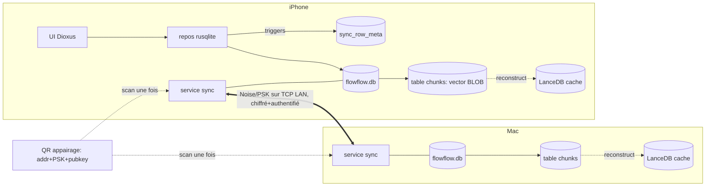
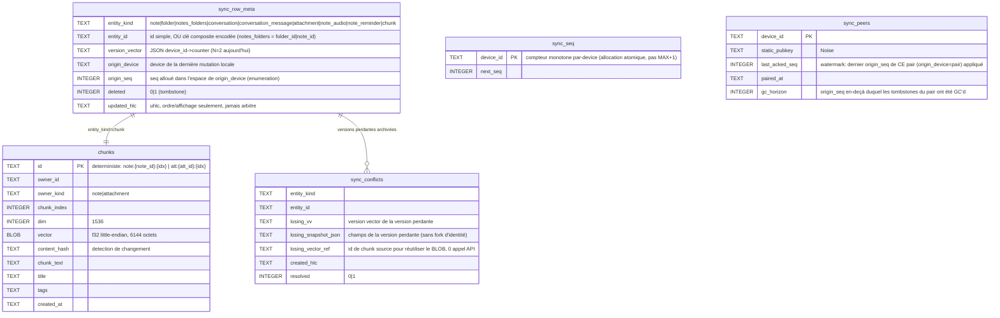
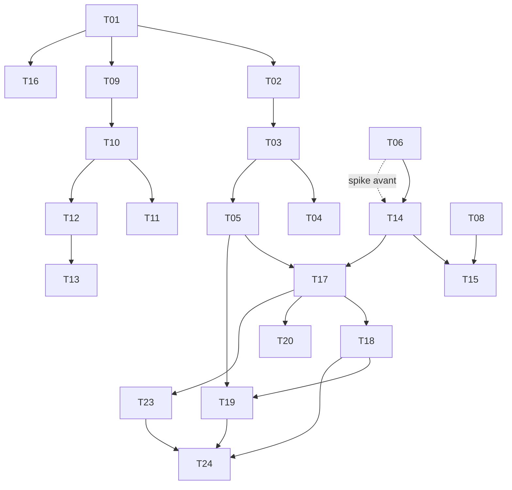

# 0004: Synchronisation multi-appareils (LAN, sans serveur externe)

## 1. Summary

**Problem:** FlowFlow tourne sur iPhone et Mac dans deux sandboxes disjoints sans aucune couche de
sync; Mirko veut toutes ses données sur chaque appareil, sans jamais rien perdre, hors-ligne, et
sans rien sur un serveur externe.

**Recommendation (confidence: medium):** réconciliation applicative pair-à-pair sur le LAN (Alt 4),
rusqlite conservé: tracking par triggers (défaut=local) + version vector à 2 entrées + `sync_seq`
par-device (détection de conflit sans horloge), tombstones (delete applicatif + `recursive_triggers`),
versions perdantes archivées dans `sync_conflicts` (zéro perte, sans fork d'identité), transport
Noise/PSK (`snow`), vecteurs en BLOB SQLite reconstruisant LanceDB (0 ré-embedding). En v1 les
FICHIERS audio ne sont PAS synchronisés (seule la transcription voyage) - décision de scope. Migration
V10 additive, données v1.0 intactes.

**Impact:** ~15 modules touchés (dont un nouveau `src/services/sync/`), 0 breaking change pour les
données v1.0; 21 tâches actives (T07/T21/T22 descopés audio), chemin critique ~8 j + 2 spikes. Risque
le plus élevé déjà neutralisé en conception (`store_chunks` CRITICAL isolé en chemin additif scopé par
id); la revue adversariale a levé 7 BLOCKER + 9 MAJOR, tous intégrés. Reste à valider par 2 spikes
(`snow` iOS, QR/IP) + la sémantique `recursive_triggers` avant de figer l'implémentation.

## 2. Context / Codebase

Inventaire factuel (état actuel, pas de design). Vérifié via GitNexus + lecture directe.
Repo `flowflow`, 100% Rust, rusqlite + LanceDB, iOS d'abord, Mac (Designed for iPhone).

### Persistance SQLite (`src/db/`)
- `mod.rs` - `Database { conn: Mutex<Connection> }`. ATTENTION (corrigé en revue): chaque
  `Database::open()` crée une NOUVELLE `Connection`; il y a 9+ sites d'ouverture (ui/mod.rs:43,
  embed.rs:6/197, llm.rs:66, tools/*, rag.rs:128/297/357) + des threads `embed` avec leur propre
  connexion. Il n'y a donc PAS une connexion unique au sens process -> le design de tracking doit
  tenir sur N connexions (cf. §6). `open_at()` (l.45): `PRAGMA journal_mode=WAL` + `foreign_keys=ON`
  (PAS `recursive_triggers`, OFF par défaut), puis `migrate()`. `now_iso()` (l.34) = horloge murale.
- `migrate()` (l.65) - runner séquentiel versionné via table `_migrations`, idempotent
  (n'applique que `version > current`). Précédent de migration pilotée par code: hook
  `migrate_audio_paths_to_relative` déclenché à la V4 (l.91). => modèle réutilisable pour V10+.
- `schema.rs` - `MIGRATIONS` V1..V9 (l.1-11). Tables: notes, folders, notes_folders,
  settings, conversations, conversation_messages, attachments, note_audios,
  pending_transcriptions, note_reminders.

### `modified_at` et FK existantes (déterminantes pour G1/G2)
- Ont `modified_at`: `notes`, `folders`, `conversations`. N'ont PAS `modified_at`:
  `attachments`, `conversation_messages`, `notes_folders`, `note_audios`, `note_reminders`.
- Aucune table n'a de compteur de version par ligne aujourd'hui (G1 part de zéro).
- `ON DELETE CASCADE` (enfants effacés physiquement, sans trace): `notes_folders`
  (folder_id + note_id, l.50-53), `conversation_messages` (conversation_id, l.79),
  `attachments` (note_id, l.94), `note_audios` (note_id, l.113), `note_reminders`
  (note_id, l.149). `folders.parent_id` = `ON DELETE SET NULL` (l.38).
- `note_reminders` a déjà `state` `active`/`tombstone` (l.162) + `UNIQUE(note_id, intent_hash)`
  (l.166): seul socle de tombstone existant; bon point de départ pour G2.
- `note_audios` (V5, l.106): UUID backfillé via SQL `randomblob()`/`hex()` (l.117-123),
  donc généré indépendamment par appareil => risque de doublon d'audio historique au 1er
  appairage (D8/Story 10). Colonne `transcription` ajoutée en V6.
- V7 (l.130) a retiré `audio_file_path`/`duration_secs` de `notes` (audio sorti de la table).

### Repos (`src/db/note_repo.rs`, mutations à instrumenter pour la sync)
- `delete_note` (l.145) = un seul `DELETE FROM notes WHERE id` qui s'appuie sur
  `foreign_keys=ON` + CASCADE pour effacer attachments/audios/rappels/liens. AUCUNE cascade
  applicative, AUCUN tombstone, et ne nettoie ni LanceDB ni les fichiers audio (flux séparés).
  => coeur du risque de résurrection (G2).
- `update_note` (l.112) écrit `modified_at` à chaque champ; pas de version.
- `set_audio_transcription` (l.192) met à jour `note_audios.transcription` SANS aucun
  timestamp/version => mutation invisible à toute réconciliation par horloge (D8).
- `add_audio` (l.152) crée un UUID aléatoire; `create_text_note` (l.34) idem (UUID v4).

### Vecteurs (`src/services/embed.rs`, `src/services/vectordb.rs`)
- `Chunk` (vectordb.rs l.14): `id, note_id, chunk_text, chunk_index, vector: Vec<f32>,
  title, tags, created_at`. Le vecteur vit UNIQUEMENT dans LanceDB; rien en SQLite (variante B
  = nouveau stockage à créer). `chunks_schema` (l.49): `vector` = FixedSizeList<Float32, 1536>.
- Id de chunk INCOHÉRENT: note = `uuid::Uuid::new_v4()` aléatoire (embed.rs l.81);
  attachment = déterministe `att:{attachment_id}:{idx}` (embed.rs l.165). G3 doit unifier
  (note => `note:{note_id}:{idx}`).
- `embed_note` (embed.rs l.32) et `embed_attachment` (l.122) appellent toujours `ai.embed()`
  (réseau) et sont gardés par `ai_consent_granted()` (l.5; gate utilisé l.50 et l.139).
  => la reconstruction-depuis-BLOB (D5/G3) doit être un chemin DISTINCT qui ne passe ni par
  `ai.embed` ni par ce gate.
- `store_chunks` (vectordb.rs l.125) fait un upsert SCOPÉ PAR `note_id`: il `delete` tous les
  chunks où `note_id = chunks[0].note_id` puis ré-`add`. Conséquence latente: stocker des
  chunks d'attachment (dont `note_id` = note parente) efface aussi les chunks propres de la
  note. À prendre en compte dans le schéma de réconciliation (G3).
- `delete_note_chunks` (l.385) filtre `note_id = ...`; `delete_attachment_chunks` (l.405)
  filtre `id LIKE 'att:{id}:%'`. `migrate_chunk_dates` (embed.rs l.192, vectordb.rs l.354)
  = précédent de passe de backfill/réconciliation idempotente gardée par un flag `settings`.

### Plateforme / réseau
- `src/platform/` - layout réel: `mod.rs` + `ios/{mod.rs, picker.rs, parsers.rs, live_activity.rs}`
  (PAS de `ios.rs`; correction revue). FFI objc déjà en place (AVAudioSession, documents_dir
  ios/mod.rs:148, picker ios/picker.rs:121, parsers ios/parsers.rs:1). Précédent direct pour D6
  (AudioToolbox FFI) et D7/D9 (Network.framework, NSFileProtection); le code sync FFI ira dans un
  nouveau sous-module `src/platform/ios/`.
- `Cargo.lock` contient déjà aws-lc-rs 1.16.3 + aws-lc-sys + ring + getrandom cross-compilant iOS
  (pertinent pour B4: mTLS/rustls n'a pas le blocage iOS supposé).
- Aucun serveur réseau ni couche de sync n'existe aujourd'hui (greenfield côté transport).

### Prior art (RFC/PRD du repo)
- PRD source: `docs/prd/multidevice-sync/prd.md` (+ `tasks.md`) - décisions D1-D9, gating G1-G4.
- `docs/prd/lan-serve/prd.md` - SEUL le cycle de vie "serveur foreground" est réutilisable;
  son relais VPS et sa couche réseau sont explicitement EXCLUS (contrainte "rien hors appareils").
- `docs/rfcs/0001-data-backup-export/` - export/restore local (référence de format/IO local).
- RFC 0002 (audio-import) et 0003 (smart-reminders): shippés puis élagués du repo; ids retirés
  (d'où ce RFC en 0004).
- Tests existants couvrant la zone: `tests/attachment_test.rs` (migrations V3), `tests/
  note_reminder_test.rs` (V9 + tombstone exclu de exists), `tests/pending_transcription_test.rs`
  (V8), `tests/rag_integration_test.rs` + `tests/lancedb_ios.rs` (store/search vecteurs).

### Execution flows touchés (GitNexus)
- App boot -> `migrate_chunk_dates` -> `VectorStore::open` (`proc_92_app`): point d'accroche
  d'une passe de réconciliation au démarrage.
- `append_transcription_to_note` -> `ai_consent_granted` / `Database::open` (`proc_3`, `proc_69`).
- `embed_attachment` -> `Database::open` (`proc_95`); `store_chunks` (`proc_133`, `proc_135`).

## 3. Problem & Motivation

### Current state
FlowFlow écrit tout dans deux stores locaux par appareil, dans le sandbox: SQLite
(`flowflow.db`, `Database` connexion unique) et LanceDB (`vectordb`), plus des fichiers
audio hors-base. La même app tourne sur iPhone et Mac dans deux sandboxes disjoints. Aucune
couche réseau ni sync n'existe (greenfield côté transport, cf. section 2). Les deux installs
ne partagent rien: une note créée sur l'iPhone est invisible sur le Mac, et inversement.

### Pain
Mirko utilise FlowFlow sur deux appareils et ne retrouve pas ses données de l'un sur l'autre.
C'est le frein principal à un usage réel multi-appareils d'une app par ailleurs mûre (notes,
RAG, chat, import, rappels). Le coût d'un mauvais design ici est une perte de données
irréversible, inacceptable pour une app de notes personnelles "privacy-first".

Trois caractéristiques actuelles du code rendent une sync naïve dangereuse (réfs section 2):
- `delete_note` (note_repo.rs:145) efface les enfants par `ON DELETE CASCADE` sans laisser
  de trace: une suppression non tracée réapparaît chez le pair (résurrection).
- Les mutations sont horodatées en horloge murale (`now_iso`, `modified_at`) et certaines ne
  sont pas tracées du tout (`set_audio_transcription`, note_repo.rs:192): arbitrer un conflit
  par horloge autoriserait une perte silencieuse sous décalage d'horloge entre appareils.
- L'id de chunk vecteur de note est aléatoire (`Uuid::new_v4()`, embed.rs:81) alors que celui
  d'attachment est déterministe: impossible de reconstruire/diff les vecteurs de façon stable
  entre appareils sans réembarquer (donc sans re-payer l'embedding).

### Why now
L'app est en production (v1.0 sur l'App Store) et installée sur deux appareils de Mirko.
L'absence de sync est désormais le manque fonctionnel n°1. Le travail de fond (PRD vérifié en
ligne + revue adversariale) est terminé: il reste à trancher le COMMENT technique, rôle de ce RFC.

### Signals
- Pas de métrique applicative (app solo); signal = usage quotidien bi-appareil bloqué.
- Données existantes v1.0 à protéger: migration devant être 100% non destructive (0 perte).
- Coût cible de la sync: 0 (aucun serveur), embedding payé une seule fois.

## 4. Goals / Non-Goals

### Goals
- Convergence bi-directionnelle iPhone <-> Mac sur le LAN: après sync, état identique des
  deux côtés (notes, folders, liens, conversations, attachments, audios+transcription,
  rappels, vecteurs).
- Zéro perte de données, garantie par construction: sur conflit, version courante + copie-de-
  conflit (jamais d'écrasement silencieux), détection par version+baseline et NON par horloge.
- Aucune donnée hors des appareils de Mirko: échange pair-à-pair chiffré et authentifié,
  0 octet vers un tiers (vérifiable réseau).
- Vecteurs présents partout sans re-payer l'embedding: BLOB voyageant avec la sync, LanceDB
  reconstruit localement (0 appel API), même sans re-consentement IA.
- Migration non destructive des données v1.0 (migrations V10+ additives, V1-V9 jamais retouchées),
  idempotente, avec dédup de l'audio historique.

### Non-Goals
- PAS de migration vers libSQL (aucune valeur sans primary distant, voie offline en beta avec
  perte possible) - on reste sur rusqlite.
- PAS de serveur/cloud/Turso/VPS, ni aucune brique réseau du PRD `lan-serve` (relais VPS).
- PAS de sync "depuis n'importe où" tant qu'aucun pair n'est joignable: la sync exige les deux
  appareils sur le même réseau (tradeoff accepté).
- PAS de collaboration temps réel multi-utilisateurs; PAS de CRDT / merge ligne-à-ligne d'un
  moteur tiers (la règle anti-perte est applicative et explicite).
- PAS de sync distante (réseau privé type Tailscale) dans ce RFC; PAS d'Android (plus tard).

## 5. Alternatives Considered

Deux niveaux: (A) l'architecture globale de sync, (B) les forks de mécanisme (G1-G4) qui
nourriront le design. Cette section expose les options + tradeoffs SANS trancher (la décision
est en section 9). Recherche prior art vérifiée via Exa (URLs citées).

### A. Architecture globale

#### Alt 0: Status quo (aucune sync)
**Summary:** garder le comportement actuel, deux sandboxes disjoints.
**Cost of inaction:** la douleur de la section 3 persiste; usage bi-appareil impossible; manque
fonctionnel n°1 non résolu.
**Pros:** zéro effort, zéro risque de régression.
**Cons:** ne résout rien; valeur produit bloquée.
**Reversibility:** n/a.

#### Alt 1: Export/import manuel (navette de fichier)
**Summary:** réutiliser le bundle de RFC 0001 (data-backup-export): exporter sur A, transférer
(AirDrop/Fichiers), importer sur B.
**How it solves:** déplace les données, partiellement.
**Pros:** effort minimal, réutilise du code existant, pas de réseau, pas de serveur.
**Cons:** manuel à chaque fois (contredit "toujours la synchro"); l'import est un écrasement ou
un merge non défini -> perte si non géré; aucune détection de conflit; pas de propagation de
suppression. Ne tient pas la garantie zéro-perte en édition concurrente.
**Cost:** faible.
**Reversibility:** facile (réutilise l'existant).

#### Alt 2: Moteur CRDT clé en main (cr-sqlite ou Automerge)
**Summary:** déléguer le merge sans conflit à un moteur: cr-sqlite (extension SQLite CRDT) ou
Automerge (document CRDT pur Rust, SQLite/LanceDB en index dérivé).
**How it solves:** merge automatique, principié; Automerge merge même le texte caractère-à-caractère.
**Pros:** résolution de conflit théoriquement la plus propre; Automerge est pur Rust, production,
conçu pour 2 pairs sur un flux ordonné (protocole sync intégré), prouvé dans la forme exacte de
FlowFlow (app Tender: CRDT source + index SQLite).
**Cons:** cr-sqlite = extension chargeable, se heurte à rusqlite bundled + interdiction de
chargement d'extension sur iOS, et le projet est en pause (dernier release jan-2024); Automerge
= rétrograde rusqlite de source de vérité à index dérivé = gros réécriture du data layer + 2
stores à garder cohérents + historique non borné. Surdimensionné pour 2 appareils mono-utilisateur.
**Cost:** élevé (réécriture data layer ou chirurgie de build d'extension).
**Reversibility:** difficile (porte à sens unique sur le modèle de données).
**References:** https://github.com/vlcn-io/cr-sqlite/issues/444 (maintenance en pause),
https://www.vlcn.io/docs/cr-sqlite/installation (extension), https://automerge.org/blog/automerge-2/,
https://tender.run/blog/tender-and-crdts (CRDT + index SQLite).

#### Alt 3: libSQL embedded replicas (direction du brief initial)
**Summary:** remplacer rusqlite par libSQL et synchroniser via embedded replicas vers un primary.
**How it solves:** sync "intégrée", format de fichier SQLite compatible (migration = driver).
**Pros:** mêmes données, pas de conversion de fichier; sync gérée par le moteur.
**Cons:** exige un primary distant (Turso Cloud ou sqld self-host) = SERVEUR EXTERNE, interdit par
la contrainte dure; la voie offline (`new_synced_database`/`db.sync()`) est en public beta depuis
2025-03-31, jamais GA, "data loss is possible"; abandonne rusqlite (porte à sens unique du data layer).
**Cost:** élevé (changement de driver + risque beta + serveur à héberger).
**Reversibility:** une fois sur libSQL, retour difficile.
**References:** https://turso.tech/blog/turso-offline-sync-public-beta ,
https://docs.turso.tech/libsql . (Déjà rejeté en non-goal du PRD; conservé ici pour mémoire.)

#### Alt 4: Réconciliation applicative pair-à-pair sur le LAN (direction PRD)
**Summary:** garder rusqlite; ajouter (1) un suivi de changements + détection de conflit par
version, (2) des tombstones, (3) un transport LAN chiffré-authentifié; LanceDB reconstruit depuis
des BLOB vecteurs en SQLite. (En v1, fichiers audio non synchronisés - seule la transcription voyage.)
**How it solves:** convergence bi-directionnelle, zéro-perte par construction, aucune donnée hors
des appareils, vecteurs gratuits sur le 2e appareil. (Couvre tous les goals de la section 4.)
**Pros:** respecte toutes les contraintes dures; 100% Rust (FFI objc toléré); aucun serveur;
migrations additives (V1-V9 intactes); on possède toute la logique de bout en bout.
**Cons:** le plus de code bespoke (merge/watermark/tombstone GC/transport = on en porte la
correction); exige des spikes de faisabilité (G4). Pas de merge texte automatique (LWW par ligne
+ copie-de-conflit), acceptable en mono-utilisateur.
**Cost:** moyen-élevé, mais borné et étalable par phases.
**Reversibility:** bonne (migrations additives; choix de transport/codec remplaçables).
**References:** pattern oplog/LWW indépendamment ré-inventé par
https://github.com/carboneio/replic-sqlite , https://pypi.org/project/sqlite-sync-core/0.6.0/ ,
https://github.com/EntglDb/EntglDb.Net (HLC + LWW + tombstones sur SQLite).

### B. Forks de mécanisme (alimentent G1-G4; tradeoffs, pas de décision ici)

#### B1. Suivi des changements (quoi expédier) — G1
- **Oplog append-only** (table de log écrite par les repos: entité, pk, valeur, horloge, device,
  op): incrémental, append-only = zéro-perte natif, transport-agnostique; pattern de production
  (replic-sqlite, sqlite-sync-core). Coût: discipline d'écriture sur chaque chemin de mutation.
- **Colonne de version par ligne + watermark** (diff = `WHERE version > watermark`, tombstones à
  part): plus simple à requêter, pas de log séparé; deletes via table tombstone. Compose avec B2.
- **SQLite session extension (changesets)**: built-in, mais exige la feature `session` +
  `buildtime_bindgen` (risque de cross-compile iOS non vérifié) et reste un outil de diff, pas un
  moteur de sync. Ref: http://sqlite.org/sessionintro.html .
- **Snapshot diff complet**: simplissime mais coût O(taille DB) et NON zéro-perte sans tombstones
  + merge par ligne (re-réimplémente l'oplog en moins efficace).

#### B2. Détecteur de conflit (zéro-perte, sans horloge) — G1 (bloquant)
- **Version vector à 2 entrées = compteur par ligne + watermark par pair** (option recommandée par
  la recherche): à N=2 c'est la forme minimale et complète des vector clocks; détecte précisément
  "les deux ont muté depuis la baseline" SANS jamais comparer d'horloge murale -> le décalage
  d'horloge ne peut structurellement pas causer de perte; "les deux ont avancé -> INSERT d'une
  copie-de-conflit" implémente le keep-both directement. Pur rusqlite (1 colonne INTEGER + petite
  table watermark). Refs: https://riak.com/posts/technical/vector-clocks-revisited/index.html ,
  https://learn.microsoft.com/en-us/aspnet/core/data/ef-rp/concurrency (rowversion).
- **Vector clocks complets** (map device->compteur): identique à N=2, plus de cérémonie; utile
  seulement si 3+ appareils un jour.
- **HLC (Hybrid Logical Clock)**: CORRECTION clé vs PRD - HLC est À SENS UNIQUE et NE PEUT PAS, seul,
  détecter la concurrence (HLC(A)<HLC(B) n'implique pas A->B). Rôle correct: ORDONNER/AFFICHER les
  deux copies gardées (crate `uhlc`), jamais arbitrer. Refs: https://cse.buffalo.edu/tech-reports/2014-04.pdf ,
  https://docs.rs/uhlc/latest/uhlc/ .
- **Lamport timestamps**: ordre total mais efface la concurrence -> insuffisant seul.
- **LWW sur horloge murale**: ANTI-PATTERN, perte silencieuse par design (Jepsen: ~28% d'écritures
  acquittées perdues sous Cassandra LWW). À exclure. Ref: https://www.abstractalgorithms.dev/clock-skew-and-causality-violations .

#### B3. Propagation des suppressions vs CASCADE — G2 (bloquant)
- **Table tombstone dédiée via triggers AFTER DELETE** (recommandé par la recherche): GARDE le
  CASCADE pour le nettoyage local, ajoute des triggers qui écrivent un tombstone à chaque delete
  (y compris les enfants cascadés, car SQLite tire les triggers AFTER après l'action CASCADE).
  Migration PUREMENT ADDITIVE (CREATE TRIGGER + CREATE TABLE), pas de rebuild de FK, aucune requête
  de lecture à changer -> le plus sûr sur une base v1.0 qui détient l'unique copie. PIÈGE à gérer:
  `INSERT OR REPLACE`/`recursive_triggers` peut écrire un faux tombstone (sqlite-chronicle le garde
  via `WHEN NOT EXISTS(...)`). Granularité note-agrégat + règle explicite "ajout concurrent d'un
  enfant". Refs: https://github.com/simonw/sqlite-chronicle ,
  https://github.com/simonw/sqlite-chronicle/blob/main/examples/insert-or-replace.md ,
  http://sqlite.org/foreignkeys.html .
- **Retirer CASCADE + cascade applicative par enfant**: contrôle total mais migration la plus
  RISQUÉE (retrait de FK = table rebuild 12 étapes sur l'appareil qui détient l'unique copie) et
  chaque chemin de delete oublié = dérive d'intégrité. Surdimensionné à granularité note.
- **Soft-delete partout (colonne state)**: le plus anti-résurrection (précédent in-repo:
  `note_reminders.state`), mais taxe CHAQUE requête de lecture (un filtre oublié peut nourrir le
  RAG/LLM avec du contenu supprimé) et garde la donnée (privacy d'une note vocale supprimée).
- **GC des tombstones** (transversal): pour 2 appareils, GC PAR ACQUITTEMENT (purger un tombstone
  dès que le watermark de l'autre appareil couvre sa version - règle DottedDB/Garage) = sans
  résurrection prouvée, + backstop TTL long + règle "appareil hors-ligne trop longtemps ->
  réconcilier/confirmer, jamais appliquer en silence". Refs:
  https://www.scylladb.com/2022/06/30/preventing-data-resurrection-with-repair-based-tombstone-garbage-collection/ ,
  https://deuxfleurs-org-garage-38.mintlify.app/design/internals .

#### B4. Transport LAN chiffré + authentifié — G4 / D7 (décision utilisateur)
- **Noise/PSK (crate `snow`)**: cross-compile iOS le plus simple (seul `getrandom`, support iOS
  natif; AUCUN cmake/C/aws-lc); auth mutuelle symétrique où le QR d'appairage EST la PSK; MITM
  résistant. CAVEAT: `snow` n'a pas reçu d'audit formel (le protocole Noise, lui, est éprouvé:
  WireGuard/libp2p). Refs: https://github.com/mcginty/snow , https://docs.rs/snow/latest/snow/ .
- **mTLS sur rustls + pinning d'empreinte**: pile auditée (rustls/ring ou aws-lc-rs), TLS 1.3,
  forward secrecy; auth mutuelle par certs auto-signés épinglés. CORRECTION post-revue (MAJOR 13):
  l'argument "aws-lc-rs casse iOS" n'est PAS avéré sur ce build - `Cargo.lock` contient déjà
  aws-lc-rs 1.16.3 + aws-lc-sys 0.40.0, et ring/getrandom cross-compilent déjà pour iOS ici. Le
  blocage iOS cité n'existe donc pas; mTLS/rustls est un repli audité de risque iOS comparable.
  Refs: https://github.com/quinn-rs/quinn/issues/1282 , https://aws.github.io/aws-lc-rs/platform_support.html .
- **iroh (QUIC, dial-by-public-key)**: viable seulement après avoir DÉSACTIVÉ ses relais + sa
  découverte DNS par défaut (sinon = serveur externe); surdimensionné. À réserver si sync hors-LAN.
=> Décision Mirko: **Noise/PSK (snow)**. Justifiée non par le build iOS (l'argument anti-aws-lc est
   tombé) mais par ses mérites propres: canal 2-parties le plus simple, QR d'appairage = PSK, pas de
   PKI/certs/expiration. mTLS/rustls reste le repli audité documenté (Revisit if, §9).

#### B5. Découverte du pair — G4 / D7
- **QR / IP manuelle** (recommandé en primaire): zéro entitlement (une connexion TCP unicast vers
  une IP LAN ne requiert jamais l'entitlement multicast), quasi pur Rust, shippable jour 1; pour 2
  appareils un appairage unique est une UX acceptable. Refs: https://apple-docs.everest.mt/docs/technotes/tn3179-understanding-local-network-privacy/ .
- **Bonjour via le responder système (Network.framework / dnssd C-FFI)**: CORRECTION vs PRD -
  parcourir UN type de service précis (`_flowflow._tcp`) via le responder d'Apple ne requiert PAS
  l'entitlement multicast (seulement la permission Local Network); découverte zéro-touche,
  App-Store-safe. Bon upgrade v2. Refs: https://developer.apple.com/forums/thread/761857 ,
  https://developer.apple.com/forums/thread/685181 .
- **mDNS pur Rust (mdns-sd)**: MARCHE au simulateur, ÉCHOUE sur iPhone réel 16+ (EHOSTUNREACH) sans
  l'entitlement multicast restreint (rarement accordé, risque App Store). À éviter sur device.

#### B6. Compression audio — G4 / D6
> NB: SANS OBJET en v1 (sync des fichiers audio descopée, décision Mirko). Conservé pour une
> éventuelle ré-intégration v2. Si on ré-active la sync audio, `flacenc` reste le défaut.
- **flacenc (FLAC pur Rust, mature)** (DÉFAUT, révisé post-revue): 100% Rust, SANS perte, ~2x
  (jusqu'à ~2.5-3x voix solo), décodage iOS natif, aucune cross-compile C. Ref:
  https://github.com/yotarok/flacenc-rs/ .
- **AAC via AudioToolbox (objc2-audio-toolbox)** (SPIKE, plus "recommandé d'office"): ~11-16x à débit
  voix MAIS l'encode passe par un callback C brut (`AudioConverterFillComplexBuffer`, 0 usage actuel
  dans src) -> rabbit hole; à adopter seulement si un spike prouve le callback + le ratio (correction
  MAJOR 14). Refs: https://docs.rs/objc2-audio-toolbox/latest/ , https://github.com/shiguredo/audio-toolbox-rs .
- **Opus (audiopus/libopus)**: meilleurs ratios voix mais cmake + XCFramework libopus à la main +
  décodage non natif (AVAudioPlayer ne lit pas l'Opus brut). Coût d'intégration que l'AAC évite.
- **zstd du PCM**: CORRECTION - réaliste ~1.2-1.5x sur la parole (pas ~2x); trop faible comme codec
  principal. **oxideav-* (AAC/Opus pur Rust)**: pre-alpha, versions YANKED, non bit-exact -> exclu
  (conflit avec zéro-perte). Ref: https://crates.io/crates/oxideav-aac/0.0.6 .

#### B7. Vecteurs: re-embed vs BLOB qui voyage — G3 / D5
- **Variante B: BLOB f32 LE dans SQLite, LanceDB reconstruit** (recommandé): le vecteur (1536 x
  f32 = 6144 octets, little-endian, byte-identique au format sqlite-vec, SANS avoir besoin de
  sqlite-vec) voyage avec la ligne; 0 appel d'embedding sur le 2e appareil, pas de clé ni de
  consentement requis; LanceDB = cache jetable reconstruit via le `chunks_to_batch()` existant;
  id de chunk déterministe (`note:{id}:{idx}`) = clé de diff stable. Refs:
  https://alexgarcia.xyz/sqlite-vec/api-reference.html , https://docs.rs/bytemuck/latest/bytemuck/ .
- **Variante A: re-embed par appareil**: payload texte seul, mais contredit l'offline-first (2e
  appareil bloqué sur réseau+clé+consentement), re-paie l'embedding et re-expose le texte; risque
  de vecteurs non identiques entre appareils.
- **Sync native LanceDB (merge_insert)**: à éviter - pas de merge offline bidirectionnel turnkey
  (besoin d'un store partagé, interdit) et duplicats silencieux possibles sous écritures
  concurrentes. Refs: https://github.com/lancedb/lancedb/issues/2319 ,
  https://github.com/lancedb/lancedb/issues/3377 .

## 6. Proposed Design

**Base:** Alt 4 (réconciliation applicative pair-à-pair sur le LAN), hybridée avec les gagnants
de la section 5: version vector à 2 entrées (B2), tombstones via triggers AFTER DELETE (B3),
transport Noise/PSK `snow` (B4, choisi par Mirko), découverte QR/IP puis Bonjour-système (B5),
vecteurs variante B BLOB (B7). 100% rusqlite conservé. Audio: fichiers NON synchronisés en v1
(seule la transcription voyage) - B6 sans objet pour la v1.

### Impact analysis (GitNexus, avant tout code)
| Symbole | Risque | Blast radius | Conséquence design |
|---------|--------|--------------|--------------------|
| `store_chunks` (vectordb.rs) | **CRITICAL** | 11 upstream, 7 process (tout le pipeline RAG + tests) | NE PAS casser sa signature/sémantique Arrow; l'alimenter depuis la table `chunks` SQLite via un chemin additif. |
| `delete_note` (note_repo.rs) | **HIGH** | 6 upstream (tests cascade) | Garder le `DELETE` + CASCADE; ajouter les tombstones par TRIGGER (les tests cascade restent verts). |
| `embed_note` (embed.rs) | LOW | NoteDetail, append_transcription | Écrire le BLOB en plus; ajouter un chemin reconstruct-from-blob distinct. |
| `update_note` (note_repo.rs) | LOW | NoteDetail | Le tracking de version passe par trigger, pas de réécriture du corps. |

Conséquence: la stratégie est ADDITIVE et isolée derrière des triggers + un nouveau module
`sync/`, pour ne pas perturber les symboles CRITICAL/HIGH.

### Architecture overview
Chaque appareil reste autonome (écrit toujours sa base locale). Un module `sync/` orchestre:
(1) un suivi de changements maintenu par triggers SQL dans une table méta, (2) un transport
Noise sur le LAN, (3) une réconciliation par version vector qui ne perd jamais rien, (4) une
reconstruction de LanceDB depuis des BLOB vecteurs. SQLite est la seule source de vérité
synchronisée; LanceDB est dérivé. NB (décision v1): les FICHIERS audio ne sont PAS synchronisés;
seule la transcription (texte dans la base) voyage.



### Modules / files affected
| Path | Change | Why |
|------|--------|-----|
| `src/db/schema.rs` | modified | Migration V10 additive: `sync_row_meta`, `sync_peers`, `sync_seq`, `sync_conflicts`, `chunks`, triggers AFTER INSERT/UPDATE. |
| `src/db/mod.rs` | modified | `device_id` persistant (row config lue par les triggers); `PRAGMA recursive_triggers=ON`; classe NSFileProtection; PAS de temp `_sync_ctx` (cf. tracking ci-dessous). |
| `src/db/note_repo.rs`, `folder_repo.rs`, `attachment_repo.rs`, `conversation_repo.rs`, `note_reminder_repo.rs` | modified | Chemins de delete écrivent les tombstones enfants (choke-point applicatif); `add_note_to_folder` (`INSERT OR IGNORE`) capture le changement d'état logique; `set_audio_transcription` tracké. |
| `src/services/embed.rs` | modified | Écrire le vecteur en BLOB dans `chunks`; chemin `reconstruct_from_blob` sans `ai.embed` ni gate `ai_consent`; id de chunk note déterministe; supprime `migrate_chunk_dates` (fondu dans le backfill T11). |
| `src/services/vectordb.rs` | modified (prudent, CRITICAL) | `store_chunks`/delete scopés par PRÉFIXE d'id déterministe (`note:{id}:%` / `att:{id}:%`), plus par `note_id` (corrige le bug attachment-écrase-note); alimenté depuis les BLOB. |
| `src/services/sync/mod.rs` | new | Point d'entrée: déclencheurs, orchestration, connexion DÉDIÉE du service (seule à poser `applying=1`). |
| `src/services/sync/meta.rs` | new | Lecture/écriture du tracking (version vector, `sync_seq` par-device, tombstones). |
| `src/services/sync/conflict.rs` | new | Fusion par version vector; version perdante archivée dans `sync_conflicts` (PAS de fork d'identité). |
| `src/services/sync/reconcile.rs` | new | Réconciliation locale (SQLite->LanceDB) + application d'un batch distant (idempotente) + full-state reconcile si pair périmé. |
| `src/services/sync/protocol.rs` | new | Messages (HELLO/PUSH/ACK, watermark par `(origin_device, seq)`, payloads), framing length-prefixed, transfert RESUMABLE. |
| `src/services/sync/transport.rs` | new | Handshake Noise (`snow`, XXpsk3) sur TCP, mode transport AEAD. |
| `src/services/sync/peers.rs` | new | Appairage (PSK+empreinte), table `sync_peers`, watermark par pair, GC tombstones, horizon de GC. |
| ~~`src/services/sync/audio.rs`~~ | DESCOPÉ v1 | Sync des FICHIERS audio retirée de la v1 (décision Mirko). La transcription voyage par la sync normale (ligne `note_audios`). Ré-ajoutable plus tard, isolé. |
| `src/platform/ios/sync_ffi.rs` (nouveau sous-module) | new | NSFileProtection, (option) Bonjour via Network.framework. (Plus de FFI AudioToolbox: audio descopé v1.) Le layout réel est `src/platform/ios/{mod.rs,picker.rs,parsers.rs,live_activity.rs}` (PAS `ios.rs`). |
| `src/ui/` | new/modified | Écran d'appairage (QR/scan/IP), bouton "Sync maintenant", indicateur, vue des conflits (`sync_conflicts`). |

### Data model (Migration V10, additive, V1-V9 jamais retouchées)

- `PRIMARY KEY(entity_kind, entity_id)` sur `sync_row_meta`. `notes_folders` (PK composite, sans
  surrogate ni `modified_at`) encode `entity_id = folder_id||':'||note_id`; les triggers calculent
  cet encodage à l'identique. Même règle pour toute table sans id simple.
- **Tracking (correction post-revue, BLOCKER 1/2/11):** abandon de la temp `_sync_ctx` par-connexion
  (le code ouvre N connexions: `Database::open()` x9 + threads embed). À la place:
  - `device_id` global, lu d'une row config par les triggers (pas par-connexion).
  - INSERT/UPDATE: triggers AFTER sur chaque table synchronisée -> upsert `sync_row_meta`. Par
    DÉFAUT (toute connexion locale, y compris les threads embed) = écriture LOCALE: bump l'entrée
    `device_id` du `version_vector`, alloue `origin_seq` via `sync_seq` (allocation atomique
    `UPDATE ... RETURNING`, jamais `MAX+1` -> pas de collision concurrente), `origin_device=device_id`.
  - APPLICATION distante: SEULE la connexion dédiée du service `sync/` pose un marqueur
    (connection-local) que les triggers détectent pour devenir no-op; le service écrit alors la méta
    VERBATIM depuis le payload (`origin_device`/`origin_seq`/`version_vector` du pair conservés). Comme
    une seule connexion applique, la limite "temp table par-connexion" ne pose plus problème.
- **Enumeration / watermark (BLOCKER 2):** le push envoie `WHERE origin_device = moi AND origin_seq >
  peer.last_acked_seq` (espace de seq PAR origine). Les lignes appliquées d'un pair n'allouent PAS de
  seq local. Le watermark `sync_peers.last_acked_seq` est keyé par `(origin_device=pair)`.
- **Deletes (BLOCKER, M8 recursive_triggers):** `PRAGMA recursive_triggers=ON` posé à l'ouverture ET
  les chemins de delete applicatifs (un helper `tombstone(tx, kind, id)` appelé par `delete_note` et
  les autres) écrivent explicitement les tombstones note+enfants. On ne dépend PAS uniquement du
  "cascade-déclenche-trigger" (sémantique subtile à valider par test). Le CASCADE physique reste.
- **Upserts (BLOCKER 7, reframe):** l'audit est fait. `notes_folders` -> `INSERT OR IGNORE`
  (folder_repo.rs:141): un no-op = aucun changement d'état = rien à synchroniser (sûr); un (re)lien
  réel après unlink est un vrai INSERT -> trigger OK. `settings` -> `ON CONFLICT` (exclu de la sync).
  Aucun `INSERT OR REPLACE` dangereux sur table synchronisée. Si un "touch" de lien devient
  nécessaire, passer à un upsert explicite qui bumpe la version.
- **`chunks` = source de vérité des vecteurs.** Backfill (BLOCKER 6, fond `migrate_chunk_dates`):
  pour chaque note, lire les rows LanceDB par `note_id`, keyer par `chunk_index`, écrire le BLOB +
  l'id déterministe + le `created_at` dans `chunks`, puis HARD-DELETE les rows LanceDB à id aléatoire
  par `note_id` et re-add avec id déterministe, en UNE passe atomique. Critère: 0 row à id aléatoire restant.
- Réversibilité: migration purement additive (tables + triggers). Aucun rebuild de FK. CASCADE conservé.

### Reconciliation (zéro-perte, par version)
```mermaid
sequenceDiagram
  participant A as Appareil A
  participant B as Appareil B
  A->>B: HELLO {device_id, last_acked_seq_for(B), gc_horizon}
  B->>A: HELLO {device_id, last_acked_seq_for(A), gc_horizon}
  Note over A,B: si last_acked du pair < gc_horizon -> RECONCILE FULL-STATE<br/>(comparer ensembles d'ids; manquant-localement = supprimé) au lieu du push incrémental
  A->>B: PUSH rows WHERE origin_device=A AND origin_seq > B.last_acked_seq (méta + payload + BLOB)
  B->>B: pour chaque ligne: merge par version vector
  Note over B: VV local domine -> garder; distant domine -> prendre;<br/>concurrent -> garder courant + ARCHIVER la version perdante dans sync_conflicts (réutilise le BLOB)
  B->>A: ACK {dernier origin_seq de A appliqué} + PUSH ses propres rows
  A->>A: même merge; applique tombstones (note + enfants), 0 résurrection
  A->>B: ACK
  Note over A,B: transfert RESUMABLE: une coupure (suspension iOS) laisse les 2 côtés cohérents,<br/>reprise au dernier origin_seq acquitté. GC tombstone quand last_acked du pair >= son origin_seq.
```
- Détection de conflit: comparaison des `version_vector` (dominance vs concurrence), JAMAIS
  d'horloge murale. `updated_hlc` (uhlc) sert seulement à ORDONNER l'affichage.
- **Conflit sans fork d'identité (correction BLOCKER 3):** la version COURANTE garde son `id` (et
  donc ses enfants attachments/audios/notes_folders/chunks intacts); la version PERDANTE est archivée
  dans `sync_conflicts` (snapshot des champs + `losing_vector_ref` réutilisant le BLOB source, 0 appel
  API), surfacée en UI pour résolution. On évite ainsi la "coquille vide" (copie sans enfants) et la
  collision de `owner_id` des chunks.
- **Tombstones + ajout concurrent (correction MAJOR 8, tranché):** une suppression propage le
  tombstone sur la note ET ses enfants. Règle de tie-break ARRÊTÉE: un ajout d'enfant concurrent
  (mutation depuis la baseline) gagne sur la suppression -> il RESSUSCITE la note parente (add wins
  over delete), biais keep-both/zéro-perte. Jamais d'enfant orphelin, jamais de perte silencieuse.
- **GC anti-résurrection (correction MAJOR 9):** un tombstone n'est GC'd que si le watermark du pair
  couvre son `origin_seq`; `gc_horizon` mémorise jusqu'où on a purgé. Un appareil réinstallé/restauré
  (RFC 0001) revient avec un watermark < `gc_horizon` -> on force le reconcile full-state (ci-dessus),
  jamais un push incrémental qui ressusciterait des lignes supprimées.
- Idempotence: rejouer un batch ne change rien (clé = entity_id + version_vector).

### Transport & appairage (Noise/PSK)
- `snow`, pattern `XXpsk3` (ou `IKpsk`) sur une socket TCP LAN; après handshake, flux AEAD en
  mode transport. Framing length-prefixed pour handshake et messages.
- Appairage: un appareil affiche un QR contenant `{addr:port, PSK 32 octets, device_id,
  static_pubkey}`; l'autre scanne (ou saisie manuelle IP + code). Sans la PSK valide, le
  handshake échoue -> aucune donnée exposée (résistant au MITM sur Wi-Fi partagé).
- Aucune connexion vers un tiers (vérifiable: capture réseau = uniquement IP LAN du pair).

### Découverte
- Primaire: QR / IP manuelle (connexion TCP unicast -> aucun entitlement multicast; seulement
  le prompt Local Network iOS au premier lancement). Shippable jour 1, quasi pur Rust.
- Option v2: Bonjour via le responder système (Network.framework / dnssd C-FFI) en parcourant
  UN type de service `_flowflow._tcp` -> découverte zéro-touche SANS entitlement multicast.
- Exclu: mDNS pur Rust (mdns-sd) sur device (EHOSTUNREACH iOS 16+ sans entitlement restreint).

### Vecteurs (variante B)
- À l'embed: vecteur écrit en BLOB (`f32` little-endian, 6144 octets) dans `chunks` (id
  déterministe + `content_hash`). LanceDB alimenté en copiant les octets via le `chunks_to_batch()`
  existant.
- **Scope par id, pas par note_id (correction BLOCKER 5):** `store_chunks` et tous les delete LanceDB
  sont scopés par PRÉFIXE d'id déterministe (`id LIKE 'note:{id}:%'` pour la note, `att:{id}:%` pour
  un attachment), JAMAIS par `note_id`. Corrige le bug live où embarquer un attachment (dont
  `note_id` = note parente) effaçait les chunks propres de la note. `reconstruct_from_blob`
  reconstruit la table LanceDB d'une note depuis TOUS ses owners (note + attachments) en un batch
  atomique, jamais en deletes per-owner qui se clobberent.
- `reconstruct_from_blob` (chemin DISTINCT de `embed_note`): lit les `chunks` SQLite, reconstruit
  l'index LanceDB; JAMAIS `ai.embed`, NON soumis au gate `ai_consent` (aucun appel réseau).
- Re-embed (contenu changé, `content_hash` différent): DELETE atomique des chunks de l'entité (par
  préfixe d'id) puis re-INSERT (N variable, 0 orphelin), des deux côtés (SQLite + LanceDB).
- Boot: une SEULE passe de reconcile (le `migrate_chunk_dates` historique est supprimé/fondu dans le
  backfill T11) -> pas de course entre deux threads mutant LanceDB au démarrage (correction MAJOR).
- Recovery: supprimer le dossier `vectordb` -> reconstruction complète depuis les BLOB, 0 appel API.

### Audio (HORS SCOPE v1 - décision Mirko)
- Les FICHIERS audio (`.wav` dans `audio_outputs/`) ne sont PAS synchronisés en v1. Ce qui voyage:
  la TRANSCRIPTION (texte dans la colonne `note_audios.transcription`), via la sync normale des
  lignes. Sur le 2e appareil tu vois/recherche le contenu dicté, tu ne réécoutes pas la voix.
- Bénéfice: supprime tout codec (flacenc/AAC), le spike codec, le transfert binaire d'audio, la
  reprise de ce transfert et la dédup des audios historiques -> une classe de risque entière en moins.
- Ré-intégration future isolée (cf. Revisit if): un module `sync/audio.rs` + un codec (flacenc pur
  Rust en tête) + transfert binaire resumable, sans toucher au reste.

### Cross-cutting
- Périmètre (D8, révisé v1): synchronisé = notes, folders, notes_folders, conversations,
  conversation_messages, attachments, note_audios (MÉTA + transcription seulement, PAS le fichier),
  note_reminders (intention), chunks.
  Exclu = FICHIERS audio `.wav` (descopé v1), `pending_transcriptions` (état de job),
  `settings`/clés API (par appareil).
- **Rappels (correction MAJOR 10/16):** l'unité synchronisée est l'INTENTION (date, récurrence,
  `intent_hash`, `state`). À la réception, B matche par `(note_id, intent_hash)` (la contrainte
  `UNIQUE` existante) sa propre row locale plutôt que d'INSÉRER une 2e -> pas de collision UNIQUE ni
  de double notification. Le handle OS (`reminder_id`/`backend`) reste device-local. Le `state`
  `active`/`tombstone` existant (schema V9) fait AUTORITÉ pour les rappels: un trigger mappe
  `state='tombstone'` -> méta `deleted=1` (une seule notion de "supprimé"), la suppression méta
  générique ne vaut que pour un DELETE physique.
- **Consentement IA (clarif MINOR 18):** le consentement est par-appareil pour les appels SORTANTS
  uniquement (embedding/LLM). Recevoir par sync de la donnée DÉJÀ embarquée (texte + BLOB) sur un
  appareil à `ai_consent=false` est INTENTIONNEL (aucun appel réseau) et fait partie du contrat:
  les données de Mirko sont à lui sur tous ses appareils.
- **Chiffrement au repos (D9, correction MAJOR 12):** NSFileProtection classe
  `CompleteUntilFirstUserAuthentication` (PAS `Complete`) sur `flowflow.db` + `-wal` + `-shm` + le
  dossier audio. La classe `Complete` rendrait les fichiers WAL illisibles à l'écran verrouillé et
  corromprait un sync foreground qui survit au lock. Checkpoint WAL avant passage en arrière-plan.
  PAS d'encryption libSQL (casse le build iOS).
- Déclencheurs de sync: bouton "Sync maintenant", sync à l'ouverture dès détection du pair, à la
  sauvegarde (debounced). Limite iOS: serveur foreground seulement; un `beginBackgroundTask` donne
  une courte fenêtre de grâce pour terminer un transfert en cours, sinon reprise resumable.
- Observabilité: logs `[sync]` (handshake, lignes poussées/appliquées, conflits archivés, tombstones
  GC) via le `log()` syslog existant.
- Breaking changes: aucun pour les données v1.0 (migration additive). Changement interne: l'id de
  chunk note passe d'aléatoire à déterministe (backfill unique).

## 7. Drawbacks & Risks

### Drawbacks (inhérents, vrais même si tout se passe bien)
- Code bespoke à maintenir: version vector, `sync_seq`, tombstone GC, framing Noise.
  C'est la classe de bug "sync subtil" la plus difficile; on en porte la correction de bout en bout.
- Coût de stockage: BLOB vecteur (6144 octets/chunk) présent dans `chunks` (SQLite) ET dans LanceDB
  (cache reconstructible) = ~2x par vecteur (~6 Mo / 1000 chunks par store). Trivial en mono-utilisateur;
  LanceDB exclu du backup possible (rebuildable).
- Pas de merge texte automatique: deux éditions concurrentes du même corps -> 1 courant + 1 version
  archivée dans `sync_conflicts` (jamais de fusion caractère-à-caractère). Acceptable en mono-utilisateur.
- Complexité cognitive: nouveau module `sync/`; tracking par triggers (INSERT/UPDATE) + tombstones
  écrits dans le chemin applicatif de delete -> dette de documentation à compenser.
- Audio: les enregistrements vocaux ne sont PAS réécoutables sur le 2e appareil en v1 (seule la
  transcription suit). Compromis assumé pour couper la complexité; ré-ajoutable plus tard.
- Sync seulement app au premier plan (limite iOS): pas de sync en arrière-plan, déclencheur explicite requis.
- Nouvelles dépendances Rust: `snow` (Noise), `uhlc` (ordre/affichage), `qrcode`. Surface d'audit accrue.

### Risks (probabilistes)
| Risk | Likelihood | Impact | Mitigation |
|------|-----------|--------|------------|
| Tracking raté car N connexions (`Database::open()` x9 + threads embed) -> mutation non tracée (perte) | medium | critical | Triggers où DÉFAUT = écriture locale (toute connexion tracke sans setup); SEULE la connexion sync pose `applying`; `device_id` global lu d'une row config; test: un edit via CHAQUE chemin (y compris threads embed) incrémente bien le version_vector (pas seulement "row méta existe"). |
| `recursive_triggers` OFF par défaut -> tombstones enfants cascadés non écrits -> résurrection | medium | critical | `PRAGMA recursive_triggers=ON` + tombstones enfants écrits dans le chemin applicatif `delete_note` (ne pas dépendre du cascade-déclenche-trigger); test cascade dédié sur le rusqlite bundled. |
| `origin_seq` dupliqué/sauté sous concurrence -> ligne sautée par le watermark | low | critical | Allocation atomique via `sync_seq` (UPDATE...RETURNING), jamais `MAX+1`; watermark keyé `(origin_device, seq)`; test concurrent. |
| Régression sur `store_chunks` (CRITICAL, 7 process) + bug attachment-écrase-note | medium | high | Delete scopé par préfixe d'id (`note:{id}:%`/`att:{id}:%`), pas `note_id`; signature/Arrow inchangée; test "note+attachment coexistent" + tous les tests RAG. |
| NSFileProtection `Complete` casse le WAL pendant un sync foreground (lock) -> IOERR/corruption | medium | critical | Classe `CompleteUntilFirstUserAuthentication` sur `.db`/`-wal`/`-shm`; checkpoint avant background; test "verrouiller en plein sync". |
| Copie-de-conflit "coquille vide" (enfants non re-keyés) | medium | high | Pas de fork d'identité: version perdante archivée dans `sync_conflicts`; la courante garde id+enfants; test compte-enfants conservé. |
| GC tombstone trop tôt / appareil restauré ressuscite des lignes | low | critical | GC seulement si watermark pair >= `origin_seq`; `gc_horizon`; pair périmé -> reconcile FULL-STATE, jamais push incrémental. |
| Rappel synchronisé entre en collision `UNIQUE(note_id,intent_hash)` / double notification | medium | high | Merge par `(note_id, intent_hash)`; handle OS device-local; `state` fait autorité (mappé en méta). |
| Spike infaisable: `snow`/`uhlc` ne build pas iOS | low | medium | Spikes AVANT impl (phase 2.0); `snow`+getrandom natif iOS (risque faible); aws-lc déjà dans le build (mTLS repli). |
| Migration V10 abîme la base v1.0 (unique copie) | low | critical | Migration purement additive (pas de rebuild FK); test sur COPIE de la vraie base; idempotence; backup via RFC 0001 avant 1ère sync. |
| Transfert coupé par suspension iOS -> état incohérent | medium | medium | Protocole resumable au dernier `origin_seq` acquitté; `beginBackgroundTask` pour fenêtre de grâce; test "tuer la connexion en plein PUSH". |
| MITM sur Wi-Fi partagé | low | high | Noise PSK (handshake échoue sans la clé d'appairage); 0 connexion tierce vérifiée. |
| Prolifération de copies-de-conflit si édition concurrente fréquente | low | medium | Rare en usage solo; UI pour résoudre/fusionner; backstop = aucune perte de toute façon. |
| `snow` non audité (impl) | low | medium | Protocole Noise éprouvé (WireGuard/libp2p); option de bascule mTLS/ring si Mirko change d'avis. |

### Rollout / rollback
- **Rollout:** par phases (cf. plan d'implémentation), derrière l'appairage explicite (la sync ne
  fait rien tant qu'aucun pair n'est appairé) = feature-gate naturel par l'appairage. Spikes (phase
  2.0) avant tout transport. Validation sur iPhone + Mac réels à chaque phase.
- **Rollback:** migrations V10 additives -> une version sans `sync/` ignore simplement les nouvelles
  tables/triggers; les données v1.0 restent lisibles. Si un trigger pose problème: `DROP TRIGGER`
  (réversible). Le seul changement non trivialement réversible est l'id de chunk déterministe
  (backfill unique) -> idempotent et re-dérivable depuis le texte. Backup RFC 0001 avant 1ère sync.
- **Gating metrics:** 0 perte et 0 doublon sur le banc 2 appareils; transcription présente
  cross-device; 0 appel d'embedding sur le 2e appareil; 0 octet vers un tiers (capture réseau);
  sync < 60 s pour 500 notes.

## 8. Open Questions

Les questions structurantes ont été TRANCHÉES par la revue (cf. §6 corrigé + §11); il ne reste que
des choix UX/produit, non bloquants pour le squelette.

| # | Question | Owner | Deadline |
|---|----------|-------|----------|
| ~~1~~ | RÉSOLU: tracking par triggers (INSERT/UPDATE, défaut=local) + delete applicatif; pas de temp `_sync_ctx`. | - | §6 |
| ~~2~~ | RÉSOLU: audit fait - `notes_folders`=INSERT OR IGNORE (no-op sûr), `settings`=ON CONFLICT (exclu); aucun INSERT OR REPLACE dangereux. | - | §6/§11 |
| ~~3~~ | RÉSOLU: ajout d'enfant concurrent RESSUSCITE le parent (add wins over delete). | - | §6 |
| 4 | Pattern Noise exact: `XXpsk3` vs `IKpsk` (identité cachée vs simplicité) ? | Mirko | Spike phase 2.0 (G4) |
| 5 | Clés API (`settings`): rester par appareil (défaut) ou sync chiffrée optionnelle ? | Mirko | Phase 8.0 |
| ~~6~~ | SANS OBJET v1: codec audio (fichiers audio non synchronisés). | - | - |
| 7 | Découverte Bonjour-système (v2) oui/non, ou QR/IP suffisant durablement ? | Mirko | Après phase 5.0 |
| 8 | Résolution des conflits dans l'UI (`sync_conflicts`): badge différé vs prompt immédiat ? | Mirko | Phase 6.0/UI |
| ~~9~~ | SANS OBJET v1: ratio `flacenc` (fichiers audio non synchronisés). | - | - |
| 10 | Réécoute audio cross-device: assez demandée pour ré-intégrer la sync audio en v2 ? | Mirko | Post-v1 |

## 9. Recommendation & Rationale

**Recommendation:** adopter **Alt 4 (réconciliation applicative pair-à-pair sur le LAN)** telle
que conçue en section 6 (révisée post-revue): rusqlite conservé, tracking par triggers (défaut=local)
+ version vector à 2 entrées + `sync_seq` par-device, tombstones (delete applicatif +
`recursive_triggers`), conflits archivés dans `sync_conflicts` (sans fork d'identité), transport
Noise/PSK, vecteurs variante B (BLOB, scope par préfixe d'id). Audio: fichiers NON synchronisés en v1
(seule la transcription voyage) - décision de scope pour couper la complexité.

**Confidence: medium.** L'architecture est éprouvée par le prior art (version-vector/tombstones
convergents dans plusieurs projets de production); la revue adversariale a corrigé 7 BLOCKER + 9
MAJOR (intégrés en §6/§7); dropper la sync audio retire une classe de risque. Le "medium" tient aux
2 spikes restants (`snow` iOS, QR/IP) et à la sémantique `recursive_triggers` sur le rusqlite
bundled, à valider par test avant de figer.

### How it hits the goals
| Goal (section 4) | Mécanisme (section 6) |
|------------------|-----------------------|
| Convergence bi-directionnelle | Protocole PUSH/ACK par watermark + reconcile idempotente. |
| Zéro perte de données | Version vector (détection sans horloge) + copie-de-conflit systématique + tombstones; jamais de LWW silencieux. |
| Aucune donnée hors des appareils | Transport Noise/PSK direct sur le LAN; 0 connexion tierce (vérifiable réseau). |
| Vecteurs sans re-payer l'embedding | BLOB f32 dans `chunks` qui voyage; LanceDB reconstruit en copiant les octets, sans `ai.embed` ni gate consentement. |
| Migration v1.0 non destructive | V10 purement additive (tables + triggers), V1-V9 intactes, CASCADE conservé. |

### Why not other alternatives
- **Alt 0 (status quo):** rejeté - laisse le manque fonctionnel n°1 (usage bi-appareil impossible).
- **Alt 1 (export/import manuel):** rejeté - manuel à chaque fois (contredit "toujours la synchro")
  et l'import écrase/merge de façon non définie -> perte en édition concurrente.
- **Alt 2 (CRDT clé en main):** rejeté - cr-sqlite = extension chargeable incompatible avec rusqlite
  bundled + interdiction de chargement d'extension sur iOS, et projet en pause; Automerge = rétrograde
  rusqlite en index dérivé (réécriture du data layer) pour un merge texte dont un mono-utilisateur n'a
  pas besoin.
- **Alt 3 (libSQL replicas):** rejeté - exige un primary distant (= serveur externe, contrainte dure
  violée) et sa voie offline est en beta avec "data loss possible".

### Revisit if
- 3+ appareils (Android, 2e Mac): passer le version vector à 2 entrées à une map device->compteur (B2 option b).
- Besoin de co-édition temps réel du corps des notes: réévaluer Automerge (Alt 2) pour le merge texte.
- Besoin de sync hors-LAN (à distance): PRD séparé (réseau privé type Tailscale, ou iroh dépouillé).
- Le spike `snow`/iOS échoue: basculer sur mTLS/rustls backend `ring` (B4, alternative auditée).
- Réécoute audio cross-device demandée: ré-intégrer la sync audio en v2 (module `sync/audio.rs`
  isolé + `flacenc` pur Rust, ~2x; AAC en spike si besoin de plus de compression).

## 10. Implementation Plan

Aligné sur les phases du `tasks.md` du PRD, raffiné en tâches atomiques (chacune <= ~1 jour,
idéalement 1 PR). Spikes (phase 2.0) AVANT tout transport/codec. Test concret à chaque tâche,
validé sur appareil réel quand pertinent.

### Tasks
| ID | Title | Files | Depends on | Effort | Accept criteria |
|----|-------|-------|------------|--------|-----------------|
| T01 | Migration V10 (sync_row_meta, sync_seq, sync_peers, sync_conflicts, chunks) | `db/schema.rs` | none | S | Migration sur COPIE de la vraie base v1.0; 0 perte; app démarre; idempotente. |
| T02 | `device_id` persistant (row config lue par triggers) + `PRAGMA recursive_triggers=ON`; PAS de temp `_sync_ctx` | `db/mod.rs` | T01 | S | device_id stable global; recursive_triggers actif; marqueur d'apply connection-local pour la connexion sync. |
| T03 | Triggers AFTER INSERT/UPDATE: bump version_vector + alloc `origin_seq` via `sync_seq` (atomique); défaut=local | `db/schema.rs` | T02 | M | Un update bumpe l'entrée device + origin_seq unique; connexion sync (apply) = no-op; pas de collision concurrente. |
| T04 | `set_audio_transcription` tracké; `add_note_to_folder` capture le changement de lien; vérifier que les threads embed (connexion fraîche) trackent en local | `db/*_repo.rs`, `services/embed.rs` | T03 | S | Edit via CHAQUE chemin (y.c. threads embed) incrémente le version_vector (pas juste "row méta existe"). |
| T05 | Tombstones via chemin applicatif `delete_note`/deletes (helper) + triggers AFTER DELETE; note+enfants | `db/schema.rs`, `db/*_repo.rs` | T03 | M | Supprimer note avec attachment+audio+rappel -> tombstone sur TOUS; tests cascade existants verts; `state='tombstone'` rappel -> méta deleted=1. |
| T06 | Spike: endpoint Noise `snow` XXpsk3 cross-compile iOS + handshake | `services/sync/transport.rs` | none | S | Build aarch64-apple-ios+sim; handshake OK sur appareil. |
| ~~T07~~ | DESCOPÉ v1: spike codec audio supprimé (sync des fichiers audio retirée). | - | - | - | - |
| T08 | Spike: appairage QR/IP sur device; décision mDNS documentée | `services/sync/peers.rs`, `ui/` | none | XS | Scan/saisie -> connexion; repli IP documenté. |
| T09 | Id de chunk note déterministe (`note:{id}:{idx}`) | `services/embed.rs` | T01 | S | Nouveaux chunks note ont un id déterministe; attachment inchangé. |
| T10 | BLOB f32 LE + content_hash dans `chunks`; delete/store scopés par PRÉFIXE d'id (pas note_id); re-embed atomique | `services/embed.rs`, `services/vectordb.rs` | T09 | M | Note multi-chunks -> N BLOB; **note + attachment coexistent** (régression du bug note_id-scope); édition -> 0 orphelin; tests RAG verts. |
| T11 | Backfill atomique: BLOB depuis LanceDB par (note_id, chunk_index) -> id déterministe + HARD-DELETE des id aléatoires; fond `migrate_chunk_dates` | `services/embed.rs` | T10 | S | Flag `settings` une-fois; **0 row à id aléatoire restant**; notes existantes ont leur BLOB. |
| T12 | `reconstruct_from_blob` (sans `ai.embed`, hors gate `ai_consent`); rebuild d'une note depuis TOUS ses owners en 1 batch | `services/sync/reconcile.rs`, `services/vectordb.rs` | T10 | M | Supprimer `vectordb/` -> reconstruit depuis BLOB; 0 appel embedding; RAG remarche sans re-consentement; chunks note+attachment tous présents. |
| T13 | Boucle reconcile locale SQLite<->LanceDB (manquants/orphelins/changés) au boot (passe UNIQUE) + post-sync | `services/sync/reconcile.rs`, `ui/mod.rs` | T12 | M | Convergence idempotente; pas de course avec un 2e thread LanceDB au boot. |
| T14 | Transport Noise: handshake + flux AEAD + framing length-prefixed | `services/sync/transport.rs` | T06 | M | Canal chiffré+authentifié; empreinte/PSK invalide -> refus. |
| T15 | Appairage: QR/IP, PSK+empreinte, table `sync_peers` | `services/sync/peers.rs`, `ui/` | T08, T14 | M | Appairer iPhone+Mac; clé/empreinte invalide refusée. |
| T16 | NSFileProtection `CompleteUntilFirstUserAuthentication` sur `.db`+`-wal`+`-shm`; checkpoint avant background | `platform/ios/sync_ffi.rs`, `db/mod.rs` | T01 | S | Verrouiller en plein sync -> 0 SQLITE_IOERR, 0 corruption WAL; build iOS sans erreur. |
| T17 | Protocole: HELLO/PUSH/ACK, watermark par `(origin_device, seq)`, payload + BLOB, transfert RESUMABLE | `services/sync/protocol.rs` | T05, T14 | M | Push `origin_device=moi AND origin_seq > watermark`; idempotent; coupure mid-PUSH -> reprise cohérente. |
| T18 | Merge par version vector; version perdante archivée dans `sync_conflicts` (réutilise BLOB, pas de fork d'id) | `services/sync/conflict.rs` | T17 | M | Édition des 2 côtés (horloges décalées +10s) -> 1 courant (enfants intacts) + 1 entrée sync_conflicts, 0 écrasement; compte-enfants conservé. |
| T19 | Tombstones (note+enfants, add-wins-resurrect) + GC par watermark + `gc_horizon` + full-state si pair périmé | `services/sync/peers.rs`, `reconcile.rs` | T05, T18 | M | Suppression note+enfants: 0 résurrection après 3 syncs; ajout enfant concurrent ressuscite le parent; appareil restauré -> full-state, pas de résurrection. |
| T20 | Déclencheurs sync: "Sync maintenant", à l'ouverture, debounced à la sauvegarde + indicateur; `beginBackgroundTask` | `ui/`, `services/sync/mod.rs`, `platform/ios/sync_ffi.rs` | T17 | S | Sync démarre dès détection du pair; indicateur visible; fenêtre de grâce au background. |
| ~~T21~~ | DESCOPÉ v1: sync des fichiers audio retirée (la transcription voyage déjà via la sync normale). | - | - | - | - |
| ~~T22~~ | DESCOPÉ v1: dédup audio historique sans objet (fichiers audio non synchronisés). | - | - | - | - |
| T23 | Exclusions: `pending_transcriptions`, `settings`/clés API; rappels = intention, merge par `(note_id, intent_hash)`, handle OS local | `services/sync/protocol.rs`, `db/note_reminder_repo.rs` | T17 | S | Clés API ne traversent pas; `pending_transcriptions` ignoré; rappel synced sans collision UNIQUE ni double notification. |
| T24 | Validation E2E iPhone+Mac réels + mesure des métriques chiffrées | tests + manuel | T18,T19,T23 | M | Rapport: 0 perte, 0 doublon, 0 embedding 2e appareil, transcription présente cross-device, <60s/500 notes, 0 octet tiers; lock-mid-sync OK; coupure-mid-PUSH OK. |

### Dependency graph

T07/T21/T22 descopés v1 (audio non synchronisé). Spikes restants: T06 (`snow` iOS) et T08 (QR/IP),
parallélisables et sans dépendance (à faire en premier avec T01).
Pistes parallèles: la chaîne vecteurs (T09->T13) est indépendante de la chaîne transport (T06,T14,T15).

### Verification
- Unitaire: T03 (version bump via CHAQUE chemin y.c. thread embed; `origin_seq` unique sous
  concurrence), T05 (tombstone note+enfants; `recursive_triggers`; state rappel -> deleted), T18
  (merge VV: dominance vs concurrence; conflit archivé sans fork), T10 (purge atomique 0 orphelin).
- Intégration: tests RAG existants verts après T10/T12 (régression CRITICAL `store_chunks`);
  **note + attachment coexistent** (bug note_id-scope) après T10; T12 recovery (suppression
  `vectordb/` -> reconstruction, 0 appel API); T11 backfill (0 row à id aléatoire).
- Appareil réel: T15 (appairage refus clé/empreinte invalide), T16 (lock-mid-sync: 0 IOERR/0
  corruption WAL), T19 (0 résurrection; appareil restauré -> full-state), T23 (transcription présente
  cross-device), T17/T24 (coupure mid-PUSH -> reprise cohérente), T24 (scénario complet + métriques).
- Réseau: capture confirmant 0 octet vers un tiers (T24).

### Timeline (indicatif, solo)
- 21 tâches actives (T07/T21/T22 descopés). Chemin critique: T01->T03->T05->T17->T18->T19->T24 (~7-8 jours).
- 2 spikes d'abord (T06 `snow` iOS, T08 QR/IP) pour lever les inconnues G4 avant le transport.
- Buffer +30% pour les inconnues de la section 8.

## 11. Review Findings

**Reviewer:** 3 sous-agents adversariaux indépendants (lentilles: zéro-perte, faisabilité iOS/Rust,
intégration code), via workflow `general-purpose`, lisant le RFC + le vrai code.
**Date:** 2026-06-09. Capture neutre (doublons exacts consolidés; refs `file:line` vérifiées).

### Root-cause clusters
La plupart des BLOCKER convergent sur 3 racines: (R1) le tracking par triggers + temp `_sync_ctx`
ne tient pas car le code ouvre MANY connexions (`Database::open()` à 9+ endroits + threads embed),
or une temp table est par-connexion; (R2) `store_chunks` supprime par `note_id` (les chunks
d'attachment écrasent ceux de la note) - bug pré-existant que le design héritait; (R3) plusieurs
entités (notes_folders composite, copie-de-conflit avec enfants, note_reminders) n'ont pas de
mapping d'identité défini pour la réconciliation.

### Findings
| # | Severity | Section | Issue | Suggestion |
|---|----------|---------|-------|------------|
| 1 | BLOCKER | §6 tracking | Triggers lisent une temp `_sync_ctx` par-connexion, mais le code ouvre N connexions (`Database::open()`: ui/mod.rs:43, embed.rs:6/197, llm.rs:66, tools/*, rag.rs:128/297/357) + threads embed -> ctx absent sur ces connexions, writes mal-attribués/perdus. | Soit funnel tous les writes via 1 connexion, soit choke-point Rust; OU triggers où ctx absent = défaut "local", device_id lu d'une row config, `applying=1` posé UNIQUEMENT sur la connexion du service sync. Résoudre Open Q#1 AVANT T03. |
| 2 | BLOCKER | §6 reconciliation | `mutation_seq = MAX+1` est un compteur local global; watermark entier unique par pair ne distingue pas le seq de A et de B; les lignes appliquées (`applying=1`) polluent l'espace seq local et cassent la monotonie -> ligne sautée. | Watermark keyé par `(origin_device, seq)`; lignes distantes n'allouent PAS de seq local; séquence par-device via table compteur dédiée (anti-collision concurrente). |
| 3 | BLOCKER | §6 copie-de-conflit | La copie reçoit un "nouvel id" mais ses enfants (attachments/note_audios/notes_folders/chunks keyés sur l'ANCIEN id) ne sont pas traités -> coquille vide; les chunks `owner_id` pointent l'original -> collision/orphelins au re-embed. | Soit deep-copy + re-key de tous les enfants, soit (préféré) NE PAS forker l'identité: stocker la version perdante comme snapshot dans une table `sync_conflicts` rattachée au même id. Test: compte enfants conservé. |
| 4 | BLOCKER | §6 data model | `sync_row_meta` PK `(entity_kind, entity_id)` à un seul `entity_id`, mais `notes_folders` a une PK composite `(folder_id, note_id)`, pas de surrogate, pas de `modified_at` (schema.rs:49). Mapping vers un `entity_id` jamais défini -> lien perdu/ressuscité. | Définir l'encodage `entity_id = folder_id||':'||note_id`; triggers AFTER INSERT/DELETE + tombstone dédiés notes_folders; l'ajouter aux règles de conflit. |
| 5 | BLOCKER | §6 vecteurs / §10 T10 | `store_chunks` (vectordb.rs:140-142) supprime `WHERE note_id = chunks[0].note_id`; `embed_attachment` met `note_id = parent_note_id` (embed.rs:165) -> embarquer un attachment EFFACE les chunks propres de la note. Bug live, pas théorique. | Le design DOIT corriger (pas hériter): delete scopé par préfixe d'id déterministe (`note:{id}:%` vs `att:{id}:%`), OU upsert par id. Critère T10: note + attachment coexistent (test régression). |
| 6 | BLOCKER | §6 backfill / §10 T11 | Backfill "id aléatoire -> `note:{id}:{idx}`": les rows LanceDB ont des UUID aléatoires, aucun moyen de les réconcilier sans re-dériver par `(note_id, chunk_index)`; alignement non spécifié -> orphelins (ancien id jamais supprimé) ou doublons. | T11: lire par note_id, keyer par chunk_index, écrire BLOB, puis HARD-DELETE les rows LanceDB random-id par note_id et re-add déterministe en une passe atomique. Critère: "0 row à id aléatoire restant". |
| 7 | BLOCKER | §6 / §10 T04 / Q#2 | Audit upsert répondable maintenant: `notes_folders` utilise `INSERT OR IGNORE` (folder_repo.rs:141) -> sur conflit = no-op = AUCUN trigger -> un changement de lien peut être silencieusement manqué (pas un faux tombstone; le risque réel est l'inverse). settings = `ON CONFLICT` (settings_repo.rs:20, exclu). | Reformuler le risque §6/§7: le danger est `INSERT OR IGNORE` qui n'émet rien. Le tracking de lien doit capturer le changement d'état logique (check d'existence explicite ou upsert qui bumpe la version). |
| 8 | MAJOR | §6 / §8 Q3 | Règle "ajout concurrent d'un enfant à une note supprimée" nommée mais circulaire: si A supprime (tombstone note+enfants cascadés) et B ajoute un attachment, appliquer le tombstone de A efface l'attachment de B (CASCADE local) -> enfant orphelin ou mort. Indéfini, sur le chemin zéro-perte. | Trancher concrètement: ajout concurrent RESSUSCITE le parent (add gagne sur delete), OU reparente l'enfant vers une note-conflit. Ne pas shipper T19 sur une règle non spécifiée. |
| 9 | MAJOR | §6 GC / §7 | GC-par-acquittement suppose seulement 2 pairs connus. Un appareil réinstallé/restauré (RFC 0001, étape de rollback) revient avec un `last_acked_seq` périmé et une copie vivante d'une ligne dont le tombstone a été GC'd -> re-push = résurrection. TTL "hand-wavé". | Sur appairage, si `last_acked_seq` du pair précède l'horizon de GC -> forcer une réconciliation full-state (comparer les ensembles d'ids, manquant-localement = supprimé), pas un push incrémental. Spécifier TTL + algo. |
| 10 | MAJOR | §6 cross-cutting / §10 T23 | `note_reminders` synced comme "intention" + ré-enregistrement local, mais `UNIQUE(note_id, intent_hash)` (schema.rs:166): la row synchronisée + la row créée localement entrent en collision UNIQUE ou double notification. Quel id/handle gagne non défini. | Merge par `(note_id, intent_hash)`: la row synced matchée à la locale, handle OS (`reminder_id`/`backend`) gardé device-local, l'intention = unité synced. Test double-registration. |
| 11 | MAJOR | §2 / §6 prémisse | La prémisse "connexion unique" est fausse: `Database::open()` crée une nouvelle `Connection` à chaque appel (9 sites) + threads embed avec leur propre runtime+connexion. La correction des triggers doit tenir sur N connexions concurrentes. | Abandonner la prémisse "connexion unique" dans §2/§6; spécifier le comportement du trigger quand ctx absent (défaut local), ou un pool avec setup ctx forcé. |
| 12 | MAJOR | §6 D9 / §10 T16 | NSFileProtection sur un `.db` en WAL (db/mod.rs:49) = piège: `-wal`/`-shm` mmappés; la classe `Complete` par défaut rend ces fichiers illisibles à l'écran verrouillé -> un sync foreground qui survit au lock -> `SQLITE_IOERR` + corruption WAL. Le critère T16 ("`.db` inaccessible verrouillé") EST le mode d'échec. | Utiliser `NSFileProtectionCompleteUntilFirstUserAuthentication` pour `.db`/`-wal`/`-shm`; décider checkpoint/close au lock. Test: verrouiller en plein sync, 0 IOERR, 0 corruption. |
| 13 | MAJOR | §5 B4 / §9 | La justif pro-Noise ("aws-lc-rs = cmake/C, cassé sur iOS") n'est pas confirmée par le build: `Cargo.lock` contient déjà aws-lc-rs 1.16.3 + aws-lc-sys 0.40.0, et ring/getrandom cross-compilent déjà iOS ici. Le blocage iOS cité n'est pas avéré -> affaiblit la raison d'éviter mTLS/rustls. | Re-vérifier si aws-lc-sys compile réellement pour les cibles iOS de CE build; corriger la claim B4 avec l'état réel du lock. Le choix Noise peut tenir sur ses autres mérites (canal 2-parties simple, QR=PSK), à re-justifier. |
| 14 | MAJOR | §5 B6 / §10 T07/T21 | AAC encode via `AudioConverterFillComplexBuffer` = callback C brut (`unsafe extern "C-unwind" fn` + AudioBufferList + ASBD + framing ADTS), PAS la surface objc2 haut-niveau utilisée aujourd'hui (0 usage AudioConverter dans src). Effort "S" irréaliste; vrai rabbit hole. | Rétrograder AAC-encode en spike avec go/no-go écrit; faire de `flacenc` (pur Rust) le chemin par DÉFAUT sauf si le spike prouve le callback. |
| 15 | MAJOR | §5 B3 / §6 triggers | Tombstone-sur-cascade exige `PRAGMA recursive_triggers=ON` pour que les triggers AFTER DELETE des enfants cascadés se déclenchent; il est OFF par défaut et db/mod.rs ne le pose jamais (l.49/51 = WAL + FK only) -> delete note = enfants cascadés SANS tombstone -> résurrection. Mentionné seulement comme hazard INSERT OR REPLACE, jamais comme prérequis. | Vérifier la sémantique FK-cascade vs trigger sur le rusqlite bundled; OU (plus robuste) écrire les tombstones enfants dans le chemin applicatif `delete_note` (choke-point unique), sans dépendre du cascade-fires-trigger. Réconcilier avec le hazard INSERT OR REPLACE (même flag). |
| 16 | MAJOR | §6 / §2 note_reminders.state | `note_reminders` a déjà un soft-delete `state` active/tombstone (schema.rs:162) utilisé par l'app; le nouveau `deleted=1` générique double-track: une row mise `state='tombstone'` (UPDATE -> deleted reste 0 en méta) diverge d'un DELETE physique (deleted=1). | Choisir UNE autorité de tombstone pour note_reminders: mapper `state='tombstone'` -> meta `deleted=1` (trigger sur la colonne), OU documenter que `state` se synchronise comme champ normal et que la suppression méta ne vaut que pour le DELETE physique. |
| 17 | MINOR | §6 / §10 T22 | Dédup audio par `note_id`+hash, mais les UUID `note_audios` ont été backfillés per-device (randomblob, schema.rs:117) -> id différents par appareil; après dédup la row gardée a un id distinct par appareil -> 2 entités méta jamais convergentes -> doublon re-créé par la couche version. | La dédup doit canonicaliser l'id (id déterministe dérivé du hash) sur les 2 appareils AVANT d'écrire `sync_row_meta`. Énoncer la règle d'id canonique dans T22. |
| 18 | MINOR | §6 consent / embed.rs:5 | Le chemin sync RECEIVE écrit du contenu + BLOB issus d'embedding IA sur un appareil qui peut avoir `ai_consent=false`; pas un appel sortant, mais de la donnée IA-dérivée y atterrit. Le modèle de consentement inter-appareils n'est pas justifié. | Énoncer explicitement que le consentement est par-appareil pour les appels SORTANTS seulement et que recevoir de la donnée déjà embarquée est intentionnel; OU gater la reconstruction sur le consentement du récepteur. |
| 19 | MINOR | §2 / §6 / §10 | Toutes les réfs au FFI iOS sont fausses: le RFC cite `src/platform/ios.rs` (inexistant). Layout réel: `src/platform/mod.rs` + `src/platform/ios/{mod.rs,picker.rs,parsers.rs,live_activity.rs}` (documents_dir ios/mod.rs:148, parsers.rs:1, picker.rs:121). | Corriger les chemins dans la table d'impact et les tâches; le FFI audio/NSFileProtection doit atterrir dans `platform/ios/` (nouveau sous-module), pas un `ios.rs`. |
| 20 | MINOR | §6 découverte / §10 T08 | "Serveur foreground iOS" + sync à la sauvegarde: le comportement à la SUSPENSION mid-transfert n'est pas spécifié. Un listener TCP foreground meurt à la suspension; un sync 500 notes+audio (<60s) peut être interrompu. Le protocole doit être resumable au niveau transfert, pas seulement au merge. | Exiger qu'un transfert interrompu laisse les 2 côtés cohérents et reprenne au dernier watermark acquitté; test qui tue la connexion en plein PUSH; envisager `beginBackgroundTask` pour une fenêtre de grâce. |
| 21 | MINOR | §2 / §7 storage | "Le vecteur vit UNIQUEMENT dans LanceDB" devient faux: le BLOB duplique 6144 o/chunk en SQLite + garde LanceDB. La duplication réelle = `chunks`(SQLite) + LanceDB cache (~2x), pas "11 tables". | Clarifier §7: duplication BLOB = chunks(SQLite) + LanceDB(cache reconstructible), ~2x; LanceDB exclu du backup possible. |

### Counts
- BLOCKER: 7
- MAJOR: 9
- MINOR: 5
- NIT: 0

### Résolution (corrections intégrées en §2/§5/§6/§7/§10)
Mirko a choisi "Corriger le RFC". Mapping finding -> correction:
- BLOCKER 1 / MAJOR 11 (connexions multiples): tracking par triggers où DÉFAUT=local; seule la
  connexion sync pose `applying`; `device_id` global lu d'une row config. (§6 Data model)
- BLOCKER 2 / MINOR (mutation_seq): `sync_seq` par-device, allocation atomique; watermark
  `(origin_device, seq)`. (§6 Data model + Reconciliation)
- BLOCKER 3 (copie-de-conflit coquille vide): table `sync_conflicts`, pas de fork d'identité. (§6)
- BLOCKER 4 / MINOR (notes_folders): encodage `entity_id = folder_id|note_id`. (§6 Data model)
- BLOCKER 5 / MAJOR (store_chunks): delete scopé par préfixe d'id; reconstruct multi-owner atomique;
  régression test note+attachment. (§6 Vecteurs + T10/T12)
- BLOCKER 6 (backfill): passe atomique BLOB par (note_id, chunk_index) + hard-delete id aléatoires. (T11)
- BLOCKER 7 / MAJOR (upserts): audit fait; INSERT OR IGNORE no-op = sûr; reformulé. (§6 Data model)
- MAJOR 8 (ajout concurrent): tranché add-wins-resurrect. (§6 Reconciliation)
- MAJOR 9 (GC résurrection): `gc_horizon` + reconcile full-state si pair périmé. (§6 + T19)
- MAJOR 10/16 (rappels): merge par `(note_id, intent_hash)`, handle OS local, state fait autorité. (§6 + T23)
- MAJOR 12 (NSFileProtection WAL): classe `CompleteUntilFirstUserAuthentication` + checkpoint. (§6 D9 + T16)
- MAJOR 13 (B4 aws-lc): claim corrigée; Noise tient sur ses mérites propres. (§5 B4 + §2)
- MAJOR 14 (AAC rabbit hole): `flacenc` par défaut, AAC en spike go/no-go. (§5 B6 + §6 + T07/T21)
- MAJOR 15 (recursive_triggers OFF): `PRAGMA recursive_triggers=ON` + tombstones delete applicatif. (§6 + T02/T05)
- MAJOR (migrate_chunk_dates race): supprimé/fondu dans le backfill; une seule passe boot. (§6 + T11/T13)
- MINOR 17 (dédup audio id): id canonique avant la méta. (§6 Audio + T22)
- MINOR 18 (consent): modèle énoncé (sortant par-appareil; réception intentionnelle). (§6 Cross-cutting)
- MINOR 19 (chemins ios.rs): corrigés -> `platform/ios/`. (§2 + §6 modules)
- MINOR 20 (suspension): transfert resumable + `beginBackgroundTask`. (§6 + T17/T20/T21)
- MINOR 21 (storage): clarifié ~2x (chunks SQLite + LanceDB cache). (§7)
Reste ouvert (non bloquant): pattern Noise exact, UX conflits, Bonjour v2, clés API par-appareil (§8).
À lever par les 2 spikes phase 2.0 (`snow` iOS, QR/IP) et les tests listés en §10.

MAJ scope (décision Mirko, post-finalisation): la sync des FICHIERS audio est retirée de la v1 (seule
la transcription voyage). Conséquence: MAJOR 14 (codec AAC) et MINOR 17 (dédup audio) deviennent SANS
OBJET; tâches T07/T21/T22 descopées; 1 spike en moins. Ré-intégrable en v2 (module isolé).
