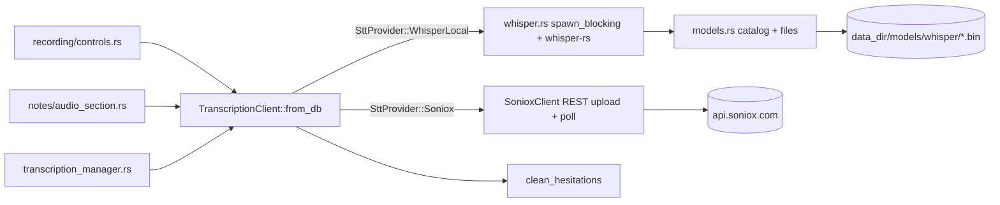
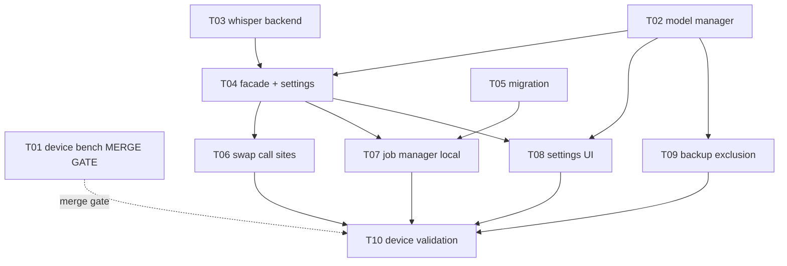

# 0005: Pluggable transcription providers with local Whisper models

## 1. Summary

**Problem:** Speech-to-text is hard-wired to the Soniox cloud API: no offline dictation, a privacy gap against the "Stay private" positioning, and a single-vendor dependency on the app's core input path.

**Recommendation:** Add a `TranscriptionClient` enum-dispatch facade (mirroring the existing LlmClient Provider pattern) with two backends: Soniox unchanged and WhisperLocal (whisper-rs 0.16, spike-validated on iOS) plus an in-app ggml model manager (5-model catalog, user choice, no silent default). Confidence medium-high; the only gating unknown is real-iPhone latency/memory, answered by benchmark task T01 which gates the merge (not the implementation, since Q1 removed the default-model dependency).

**Impact:** 14 modules touched (3 new), one additive SQLite migration, no breaking change (provider defaults to Soniox), +2.2 MB binary, 10 tasks, ~4-day critical path; main risks are device performance and Metal runtime behavior on iOS, both front-loaded into T01.

## 2. Context / Codebase

### Affected modules
- `src/services/transcription/client.rs` (8.4K): `SonioxClient`, the only STT path. REST upload, polling, cleanup. `transcribe(&Path, Option<&str>) -> Result<String, String>` is the high-level entry; granular `start_transcription` / `poll_transcript` / `check_status` / `delete_file` are public for the job manager.
- `src/services/transcription/hesitations.rs`: `clean_hesitations(text)` post-processing applied to every transcript.
- `src/services/constants.rs`: AI config constants (no Soniox constants today; endpoint and model are inline in client.rs).
- `src/services/llm.rs`: `LlmClient` + `Provider` enum (OpenAi/Anthropic dispatch) - the in-repo precedent for multi-provider dispatch keyed on a settings row.
- `src/db/settings_repo.rs`: known key `soniox_api_key`; fallback chain DB -> env var -> `option_env!()`.
- `src/services/backup.rs`: excludes `soniox_api_key` from export (any new local-model state must make the same export decision).
- `src/platform/ios.rs`: objc2 FFI precedent (PDFKit, EventKit, file picker) for a future AppleSpeech provider.

### Key call sites (consumers of SonioxClient)
- `src/ui/recording/controls.rs:42`: live dictation, `client.transcribe(&path, None)` after stop.
- `src/ui/notes/audio_section.rs:103`: per-recording Transcribe button in NoteDetail.
- `src/ui/transcription_manager.rs:238`: background queue for imported audio (resume_pending, retry, job status), builds the client via `from_db`.
- `src/ui/settings/transcription.rs`: Soniox key form (Settings hub sub-screen since #31).

### Prior art
- RFC 0004 multidevice-sync (Accepted, shipped): provider-less but established the service/engine layering.
- `LlmClient` Provider dispatch (Track F): the exact pattern this RFC generalizes to STT.
- Issue #30: research (VoiceInk UX, whisper-rs, Apple SpeechAnalyzer) + spike results 2026-06-11: whisper-rs 0.16 compiles aarch64-apple-ios + sim + metal feature, +2.2 MB binary; Mac M-series latency 12.2 s FR audio: tiny 386 ms / base 162 ms / small-q5_1 473 ms; small-q5_1 near-perfect French.
- No ADR directory; RFCs 0002/0003 shipped without persisted docs in docs/rfcs/.

### Execution flows touched
- Dictation flow: RecordingBar/Controls -> AudioRecorder WAV -> SonioxClient.transcribe -> clean_hesitations -> content append + audio row transcription.
- Import flow: NoteMenu import audio -> TranscriptionManager.enqueue -> SonioxClient (granular API, polling, retry) -> append to note.
- Manual flow: AudioSection Transcribe button -> transcribe -> set_audio_transcription.

## 3. Problem & Motivation

### Current state
Speech-to-text is hard-wired to the Soniox REST API. `SonioxClient` is constructed directly at all three call sites (dictation in `recording/controls.rs`, manual transcribe in `notes/audio_section.rs`, background import queue in `transcription_manager.rs`). Every transcription requires network, a Soniox account, and uploads the user's voice to a third-party cloud.

### Pain
- No offline transcription: airplane mode or bad network means dictation silently becomes a stuck job.
- Privacy gap: the product is positioned "Stay private" (local SQLite, local LanceDB, serverless LAN sync), yet the core input path ships audio to a cloud vendor.
- Single-vendor dependency: a Soniox outage, pricing change, or account issue kills dictation entirely.
- Onboarding friction: a brand-new user must create a third-party API account before the app's main feature works.

### Why now
- Users asked for installable local models (issue #30).
- Feasibility was the main unknown and the spike (2026-06-11) resolved it: whisper-rs 0.16 cross-compiles for aarch64-apple-ios (+ sim, + metal), +2.2 MB binary, near-perfect French with small-q5_1 (181 MB) at far better than real-time on a Mac.
- The Settings hub restructure (#31) just shipped, creating the natural home for a model manager UI.

### Signals
- Spike numbers (Mac M-series, 12.2 s French WAV): tiny 386 ms, base 162 ms, small-q5_1 473 ms; model load ~170 ms warm.
- No telemetry (local-first app): pain is qualitative, from user requests and the positioning mismatch.
- ASSUMPTION (auto mode): on-iPhone latency unmeasured; expected within seconds for minute-long notes with base/small on A-series Metal, must be validated on device.

## 4. Goals / Non-Goals

### Goals
- Record a note in airplane mode and get a transcription from a downloaded local model (issue #30 acceptance test).
- The Soniox path stays byte-for-byte unchanged for users who keep it.
- In-app model manager: list, download with progress, delete, set default; storage and size guardrails suited to iPhone.
- Provider selection persisted in settings, mirroring the existing `llm_provider` pattern.
- Tests for provider dispatch and model manager CRUD.

### Non-Goals
- We are NOT building AppleSpeech (SpeechAnalyzer iOS 26+) in this RFC's implementation; the design must leave a slot for it, but the objc2 spike is a separate follow-up.
- We are NOT doing live streaming transcription (word-by-word while recording); the pipeline stays record-then-transcribe on the finished WAV.
- We are NOT adding cloud providers beyond Soniox (no Groq/Deepgram/ElevenLabs catalog like VoiceInk).
- We are NOT syncing downloaded models between devices (models are per-device artifacts, excluded from backup export like API keys).
- We are NOT changing `clean_hesitations` post-processing or the transcript storage schema.

## 5. Alternatives Considered

### Alt 0: Status quo
**Summary:** Keep Soniox as the only STT path.
**Cost of inaction:** the "Stay private" positioning stays contradicted by the core input path; no offline dictation; vendor risk unaddressed; user requests (#30) unanswered.
**Pros:** zero effort, zero regression risk, one code path to maintain.
**Cons:** all pains from section 3 persist; the gap widens as competitors (VoiceInk) ship local STT as a baseline feature.

### Alt 1: Minimal patch - parallel WhisperClient + if/else at call sites
**Summary:** Add `WhisperLocalClient` next to `SonioxClient`; each of the 3 call sites reads a `stt_provider` setting and branches.
**How it solves:** offline path exists; Soniox untouched.
**Pros:**
- Smallest diff, fastest to ship.
- No abstraction to design; both clients keep their natural APIs.
- Trivially reversible (delete the branch).
**Cons:**
- 3 duplicated dispatch points (controls, audio_section, transcription_manager) that must stay in sync.
- The job manager uses Soniox's granular API (start/poll/status); a local model has no polling concept, so if/else leaks asymmetric semantics everywhere.
- Adding AppleSpeech later means touching every call site again.
**Cost:** ~1 day code, but interest accrues at each new provider.
**Reversibility:** easy.
**References:** none needed (in-repo pattern).

### Alt 2: Enum dispatch facade, mirroring LlmClient (in-repo standard)
**Summary:** A `TranscriptionClient` facade with a `SttProvider` enum (`Soniox`, `WhisperLocal`), constructed via `from_db`, exposing one `transcribe(path, lang)`; call sites swap `SonioxClient` for `TranscriptionClient` and never branch. A separate `model_manager` service owns ggml model files (list/download/delete/default).
**How it solves:** single dispatch point; offline goal met; Soniox internals byte-for-byte unchanged behind the facade; settings pattern (`stt_provider`) mirrors `llm_provider`.
**Pros:**
- Exact precedent in the codebase (`LlmClient` Provider dispatch, Track F) - zero new architecture vocabulary.
- Static dispatch, no async-trait machinery; rustc checks exhaustiveness when a provider is added.
- The transcription_manager's granular polling stays a Soniox-internal detail; local path returns immediately through the same facade method.
- AppleSpeech later = one new enum variant + one module.
**Cons:**
- Enum is closed: third-party/custom endpoints (VoiceInk's "Custom" tier) would require code changes, not config.
- The facade must reconcile two job models (remote polling vs local compute) behind one async fn; progress reporting for long local jobs needs its own channel.
- whisper-rs adds a C/C++ build dependency (whisper.cpp via cmake) to every target build.
**Cost:** ~3-4 days (facade + whisper module + model manager + settings UI + tests).
**Reversibility:** easy (facade collapses back to SonioxClient).
**References:** spike 2026-06-11 on #30; whisper-rs 0.16 (crates.io/crates/whisper-rs); ggml models (huggingface.co/ggerganov/whisper.cpp).

### Alt 3: Trait-object plugin registry (VoiceInk-style catalog)
**Summary:** `trait SttEngine { async fn transcribe(...) }` with `Box<dyn SttEngine>` registry keyed by string id, provider catalog UI with Local/Cloud/Custom tiers, OpenAI-compatible custom endpoints.
**How it solves:** same offline goal, plus arbitrary future providers without enum edits.
**Pros:**
- Open extension: cloud vendors and custom endpoints become data, not code.
- Matches the proven UX of VoiceInk (model cards, per-provider settings).
- Cleanest seam for a future plugin/marketplace story.
**Cons:**
- Over-engineered for 2 concrete providers (Soniox + WhisperLocal) and explicit non-goals (no cloud catalog).
- async fn in trait objects needs `async_trait` or manual boxing; more complexity than the codebase's established enum style.
- String-keyed registry trades compiler exhaustiveness for runtime lookups.
- Heavier settings/migration surface for hypothetical needs.
**Cost:** ~1.5-2x Alt 2.
**Reversibility:** moderate (trait surface spreads through consumers).
**References:** VoiceInk (github.com/Beingpax/VoiceInk, tryvoiceink.com/docs/transcription-models).

### Alt 4: Apple SpeechAnalyzer as the local path (skip Whisper entirely)
**Summary:** Use iOS 26+/macOS 26+ `SpeechAnalyzer`/`SpeechTranscriber` via objc2 FFI as the only local provider; system manages model assets (AssetInventory), zero in-app downloads.
**How it solves:** offline + private with no model manager UI at all.
**Pros:**
- No 74-181 MB downloads, no storage guardrails, no cmake/C++ dependency.
- Reported ~2.2x faster than Whisper Large V3 Turbo (MacStories measurement, #30 research).
- First-party privacy story.
**Cons:**
- Hard OS gate: iOS 26+/macOS 26+ only; older devices keep cloud-only - fails the airplane-mode goal for them.
- objc2 FFI spike unproven (unlike whisper-rs which is now spike-validated); Swift-first API surface may be painful from Rust.
- Apple controls model quality/languages; no user choice of accuracy/size tradeoff.
- One-way door on the UX (no model manager) if Apple's quality disappoints for French.
**Cost:** unknown until FFI spike; potentially small if the API maps cleanly.
**Reversibility:** moderate; flagged ONE-WAY DOOR on minimum OS if shipped as the only local path.
**References:** developer.apple.com/documentation/speech/speechanalyzer (#30 research, verified 2026-06-10).

## 6. Proposed Design

Base: **Alt 2** (enum dispatch facade mirroring LlmClient), with Alt 4 kept as a declared future enum variant (slot only, no implementation).

Impact analysis (GitNexus MCP down, grep fallback): `SonioxClient` has exactly 3 construction sites (`recording/controls.rs`, `notes/audio_section.rs`, `transcription_manager.rs:client_from_db`) plus the settings form. Dictation is the app's core input path: overall risk MEDIUM. Mitigation: the facade keeps `SonioxClient` internals untouched and the Soniox pipeline in the job manager stays as-is.

### Architecture overview

One facade, two backends. UI call sites construct `TranscriptionClient::from_db` and call `transcribe`; they never know which engine runs. The whisper backend executes in `spawn_blocking` (CPU/Metal-bound) on a model file resolved by the model manager.

### Modules / files affected

| Path | Change | Why |
|------|--------|-----|
| `src/services/transcription/provider.rs` | new | `SttProvider` enum (Soniox, WhisperLocal) + `TranscriptionClient` facade: `from_db`, `provider()`, `transcribe(path, lang)` |
| `src/services/transcription/whisper.rs` | new | `WhisperLocal::transcribe`: hound WAV decode, mono mixdown, linear resample to 16 kHz, whisper-rs FullParams greedy, language auto |
| `src/services/transcription/models.rs` | new | model manager: const CATALOG (tiny 74 MB, base 141 MB, small-q5_1 181 MB, medium-q5_0 514 MB, large-v3-turbo-q5_0 547 MB: id, filename, HF URL, exact byte size, pinned sha256), `list_local`, `download(id, progress_cb)`, `delete(id)`, `active_model()`; temp-file + sha256 check + rename on completed download; refuse download if free disk < 2x model size |
| `src/services/transcription/client.rs` | untouched | Soniox stays byte-for-byte identical |
| `src/services/transcription/mod.rs` | modified | re-export provider, models |
| `src/services/constants.rs` | modified | whisper catalog constants (URLs, exact sizes, sha256), models subdir name |
| `src/db/settings_repo.rs` | modified | known keys: `stt_provider` (soniox / whisper_local), `whisper_model` (catalog id) |
| `src/db/schema.rs` | modified | migration VN+1: `pending_transcriptions` gains `provider TEXT NOT NULL DEFAULT 'soniox'`, remote ids nullable for local jobs |
| `src/ui/transcription_manager.rs` | modified | `client_from_db` returns the facade; `process_front` branches once on `client.provider()`: Soniox keeps the existing upload/poll/resume pipeline verbatim; WhisperLocal runs `transcribe` with `Polling{elapsed_s}` ticks from a watch channel, resume = re-run from file |
| `src/ui/recording/controls.rs` | modified | swap `SonioxClient::from_db` for `TranscriptionClient::from_db` (1 line) |
| `src/ui/notes/audio_section.rs` | modified | same 1-line swap |
| `src/ui/settings/transcription.rs` | modified | provider picker (Cloud Soniox / Local Whisper); Soniox key form when cloud; model cards when local: name, size, quality hint, state (absent / downloading % / downloaded), actions download (size-confirm dialog per Q4), delete, set active |
| `src/services/backup.rs` | modified | exclude `models/whisper/` from export archive (same policy as API keys: device-local artifacts) |
| `src/services/i18n/locales/{en,fr}.ftl` | modified | model manager strings |
| `Cargo.toml` | modified | whisper-rs 0.16 (metal feature on apple targets) |

### Data model
- Settings (key-value, no migration): `stt_provider`, `whisper_model`.
- SQLite migration VN+1 (additive, reversible, no backfill): `pending_transcriptions.provider` default `'soniox'`.
- Filesystem: `<data_dir>/models/whisper/<filename>.bin`; `.part` temp file during download.

### API contracts (internal)
- `TranscriptionClient::from_db(&Database) -> Result<Self, String>`: reads `stt_provider` (default soniox for backward compat); WhisperLocal constructor fails with an explicit message if the selected model file is missing.
- `TranscriptionClient::transcribe(&Path, Option<&str>) -> Result<String, String>`: same signature and semantics as today's `SonioxClient::transcribe`, `clean_hesitations` applied in both arms.
- No breaking changes: absence of the new settings keys means Soniox.

### Flows
Dictation (local): stop recording -> WAV -> `transcribe` -> spawn_blocking whisper -> clean -> append to note (UI unchanged).
Import (local): enqueue -> facade -> watch-channel ticks map to `JobStatus::Polling{elapsed_s}` -> Done -> cleanup_file. Relaunch mid-job: pending row with provider=whisper_local and retained WAV -> re-enqueue from scratch.
Download: Settings -> model card Download -> size-confirm dialog (Q4) -> reqwest stream to `.part` with progress callback -> sha256 verify (Q5) -> rename -> card flips to downloaded; single concurrent download enforced by the manager.

### Cross-cutting
- Concurrency: one whisper transcription at a time (model context is heavyweight); a tokio `Semaphore(1)` in whisper.rs.
- Memory: context loaded per transcribe call in v1 (spike: ~170 ms warm load); caching the context is a later optimization.
- Consent: the existing global AI-consent gate applies to every provider, local included (Q3 decided: single uniform consent flow, no bypass).
- Offline: with WhisperLocal selected and model present, airplane mode works end to end; Soniox-specific errors disappear from that path.
- iOS binary: +2.2 MB (spike); IPHONEOS_DEPLOYMENT_TARGET stays 16.0.

## 7. Drawbacks & Risks

### Drawbacks (inherent)
- New C/C++ build dependency: whisper-rs builds whisper.cpp via cmake on every target; CI and `make all` get slower, and cmake becomes a required toolchain item.
- App data can grow by 74-547 MB per downloaded model on an iPhone; users will see FlowFlow's storage footprint jump.
- Two STT engines to maintain and test (Soniox API drift on one side, whisper-rs/ggml version churn on the other).
- Local accuracy on tiny/base is below Soniox; users who pick the smallest model will get worse transcripts than today and may blame the app.
- Per-call model load (~170 ms warm, seconds cold) adds latency the cloud path never had on short clips.

### Risks (probabilistic)

| Risk | Likelihood | Impact | Mitigation |
|------|-----------|--------|------------|
| iPhone latency or thermal pressure unacceptable on minute-long notes (spike ran on Mac M-series only) | medium | high | device benchmark task FIRST in impl plan, before any UI work; abort or downscope to base model if bad |
| Metal shader runtime issue on iOS (GGML_METAL_EMBED_LIBRARY not set by whisper-rs-sys for the iOS build) | medium | medium | on-device smoke test early; fallback to CPU inference (still works, slower) |
| Memory pressure: medium/large-turbo models jetsammed on older iPhones | medium | medium | per-model quality/size hints in the UI (heavy models flagged "for recent devices"); user picks knowingly (Q1); Semaphore(1) already bounds concurrency |
| HuggingFace download blocked / slow / file moved | low | medium | size check after download, `.part` temp + rename, retry button; URLs in constants.rs so a hotfix is one line |
| whisper.cpp cross-compile breaks on a future Xcode/cmake update | low | medium | pin whisper-rs 0.16; the spike project under /tmp is reproducible as a canary |
| App Review questions the 181 MB in-app download | low | low | standard practice (every local-AI app does it); download is user-initiated with size shown |

### Rollout / rollback
- **Rollout:** settings-gated (default provider stays Soniox); shipping the feature changes nothing for existing users until they opt in. One PR on development, device-tested before merge per repo methodology.
- **Rollback:** revert the PR; migration VN+1 is additive with a default so old code reads the table unchanged; downloaded model files are inert artifacts the user can delete via Settings (or are simply orphaned, no data loss).
- **Gating metrics:** on-device benchmark (60 s French note, base + small-q5_1): transcribe time, peak RSS, no thermal warning; Q-device = Mirko's iPhone.

## 8. Open Questions

| # | Question | Owner | Status |
|---|----------|-------|--------|
| 1 | Default catalog model? | Mirko | DECIDED 2026-06-11: no single default. Multi-model catalog, the user chooses what to download and which model is active; the best current model (large-v3-turbo quantized) must be available. UI shows a per-model quality/size hint instead of a hard default. |
| 2 | On-iPhone latency/memory for 1-5 min notes: acceptable? | Mirko + bench task T01 | OPEN: merge gate. T01 harness ships with the feature; Mirko runs it on his iPhone; no merge until numbers are acceptable. Q1's user-choice decision removes the default-model dependency, so implementation may proceed in parallel with the bench. |
| 3 | Should local transcription bypass the global AI-consent gate? | Mirko | DECIDED 2026-06-11: no bypass. The consent gate applies to every provider, local included; single uniform consent flow. |
| 4 | Cellular guard for downloads: hard Wi-Fi-only, or show size and let the user decide? | Mirko | DECIDED 2026-06-11: show the model size and ask for confirmation before download; no network-type detection. |
| 5 | Checksum validation of downloaded ggml files? | Mirko | DECIDED 2026-06-11: sha256 pinned per catalog entry (verified against the HF LFS OIDs on 2026-06-11), checked after download before rename. |
| 6 | Language hint: keep auto-detect, or pass the app language as Whisper language hint for better FR accuracy? | bench task T01 | OPEN: answered by T01 (run the bench both ways on the FR fixture). |

## 9. Recommendation & Rationale

**Recommendation:** Adopt **Alt 2 (enum dispatch facade mirroring LlmClient)** as designed in section 6, with the on-device benchmark (T01) as the merge gate; implementation proceeds in parallel since Q1 (decided: user-choice catalog) removed the bench-to-default dependency.

**Confidence:** medium-high: compile feasibility, binary size, and desktop quality/latency are spike-proven; the single remaining unknown that could downgrade scope (not invalidate the design) is real-iPhone latency/memory, and the plan gates on it first.

### How it hits the goals
| Goal | Mechanism |
|------|-----------|
| Airplane-mode transcription | WhisperLocal backend runs fully on-device on a downloaded ggml file |
| Soniox byte-for-byte unchanged | client.rs untouched; facade defaults to Soniox when settings keys are absent; manager keeps the exact Soniox pipeline behind a single provider branch |
| In-app model manager | models.rs catalog + download/delete/default with disk guardrails, surfaced in the existing Settings hub (#31) |
| Provider persisted like llm_provider | `stt_provider` settings key, same fallback chain |
| Dispatch + CRUD tests | enum dispatch is plainly unit-testable; model manager functions take a dir path so tests run on tempdir |

### Why not other alternatives
- **Alt 0 (status quo):** the privacy/offline gap is the product's core positioning contradiction, and feasibility risk is now retired by the spike; inaction no longer buys information.
- **Alt 1 (if/else at call sites):** three dispatch points that must stay synchronized, and the manager's polling semantics leak into every branch; it costs more by the second provider.
- **Alt 3 (trait registry):** built for an open provider catalog that sections 4 non-goals explicitly reject; pays async-trait and runtime-lookup complexity for zero concrete need at 2 providers.
- **Alt 4 (AppleSpeech only):** iOS 26+/macOS 26+ gate fails the offline goal for every older device, and its FFI path is unproven while whisper-rs is spike-validated; it remains the natural third enum variant later.

### Revisit if
- The T01 device benchmark shows minute-long notes taking unacceptable time or getting jetsammed even with the base model: downscope to dictation-only (short clips) or pivot to Alt 4 on supported devices.
- Apple's SpeechAnalyzer proves excellent for French and FlowFlow's minimum iOS rises to 26+: collapse WhisperLocal in favor of AppleSpeech and drop the model manager.
- A third cloud provider becomes a real user demand: reconsider Alt 3's open registry.

## 10. Implementation Plan

### Tasks

| ID | Title | Files | Depends on | Effort | Accept criteria |
|----|-------|-------|------------|--------|-----------------|
| T01 | Device benchmark (MERGE gate) | bench harness shipped with the feature | none | M | harness transcribes a 60 s FR note with at least base and small-q5_1, reporting time + RSS; Mirko runs it on his iPhone and posts numbers on #30; answers Q2/Q6; NO MERGE before acceptable numbers. Q1 decided 2026-06-11 (user choice) so T02+ proceed in parallel |
| T02 | Model manager service | `services/transcription/models.rs`, `constants.rs` | none | M | 5-model catalog (incl. large-v3-turbo-q5_0) list/download(.part+sha256+rename)/delete/active on tempdir; disk guardrail (2x size) tested; sha256 + size check post-download |
| T03 | Whisper backend | `services/transcription/whisper.rs`, `Cargo.toml` | none | M | WAV 44.1k stereo -> mono 16k -> transcript on desktop test with tiny model fixture; Semaphore(1) enforced |
| T04 | Facade + settings keys | `services/transcription/provider.rs`, `mod.rs`, `db/settings_repo.rs` | T02, T03 | S | from_db defaults to Soniox when keys absent; WhisperLocal errors clearly when model missing; dispatch unit tests |
| T05 | Migration pending_transcriptions.provider | `db/schema.rs` | none (parallel with T02/T03) | XS | migration test: old rows read with default soniox; new local row roundtrips |
| T06 | Swap call sites dictation + manual | `ui/recording/controls.rs`, `ui/notes/audio_section.rs` | T04 | XS | both paths compile and work with provider=soniox exactly as before (no behavior diff) |
| T07 | Job manager local pipeline | `ui/transcription_manager.rs` | T04, T05 | M | local job: enqueue -> Polling ticks -> Done -> cleanup; relaunch mid-job re-runs; Soniox pipeline untouched (existing tests stay green) |
| T08 | Settings UI provider + model cards | `ui/settings/transcription.rs`, `i18n/locales/*.ftl` | T02, T04 | M | picker persists stt_provider; cards show absent/downloading %/downloaded; download/delete/set-default work on device |
| T09 | Backup exclusion + docs | `services/backup.rs`, `CLAUDE.md`, `README.md` | T02 | XS | export archive contains no model files; restore on a device without models keeps provider setting but falls back with clear error |
| T10 | End-to-end device validation | none (test pass) | T06, T07, T08, T09 | S | airplane mode: dictation + import + manual transcribe all produce text with local model; Soniox path re-validated; 249+ tests green; make all |

### Dependency graph

### Verification
- Unit: T02 (model CRUD on tempdir), T03 (resample + decode), T04 (dispatch, missing-model error), T05 (migration).
- Integration: T07 job lifecycle including relaunch resume.
- Manual/device: T01 benchmark, T08 download UX, T10 airplane-mode end-to-end.
- Perf gate: T01 numbers (Mirko's iPhone) answer Q2/Q6 and calibrate the per-model quality/size hints; the branch does not merge before they are acceptable.

### Timeline
- Critical path: T03 -> T04 -> T07 -> T10, about 3-4 days; T01/T02/T05 parallel with T03; T08/T09 parallel with T07; T01 device numbers gate the merge.
- With 30% buffer: ~5 days.

## 11. Review Findings
_TBD: step-08 (optional)_
