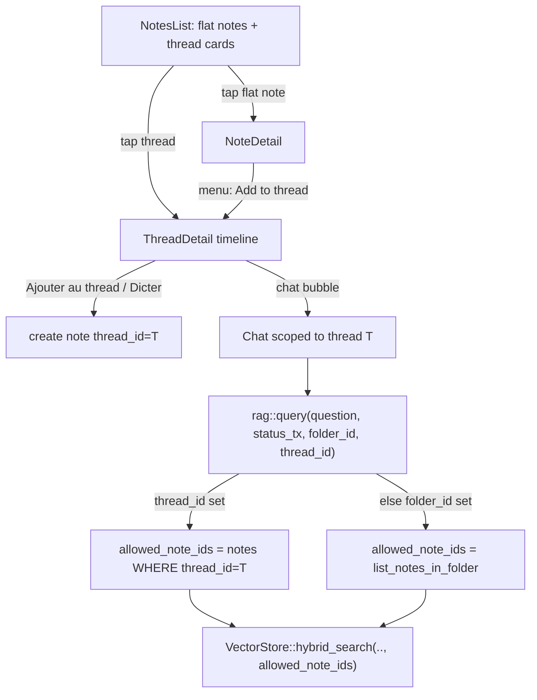
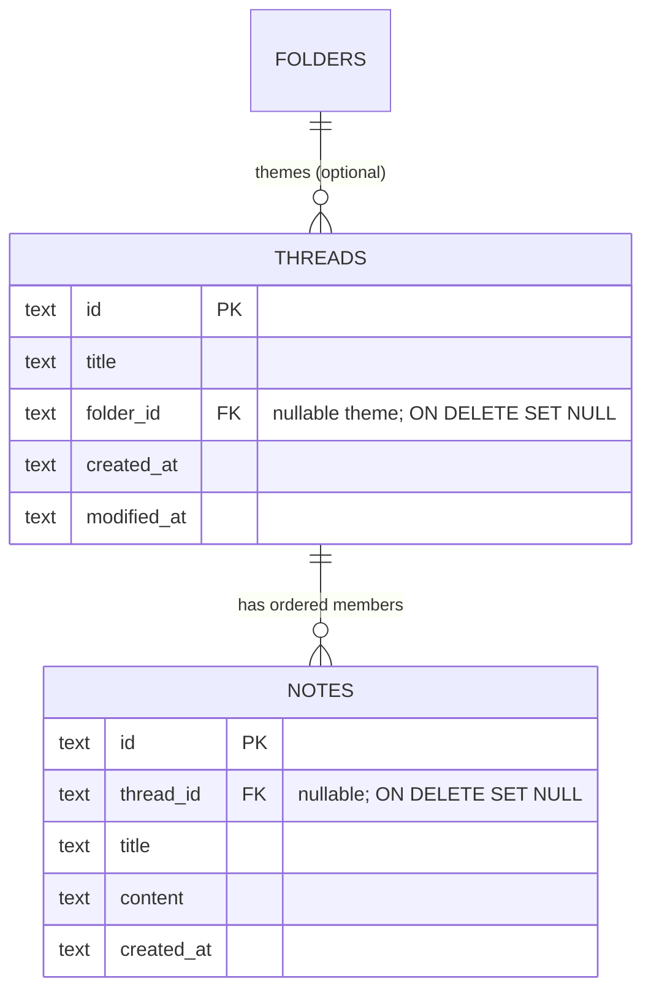
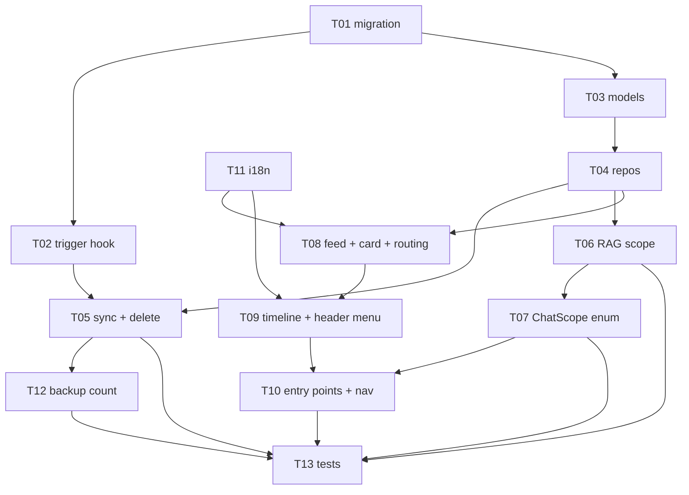

# 0006: Note threads

## 1. Summary

**Problem:** Notes are flat - there is no first-class, ordered stream to group, read top-to-bottom, and append to related notes on one topic; chat conversations are threaded, notes are not (issue #54, mockup `threads-v2.html`).

**Recommendation:** A new `threads` table plus a nullable `notes.thread_id` (1:N, chronological by `created_at`) - a thread is a titled, themed, inline timeline with in-place "Ajouter au thread", and chat can be scoped to a thread by reusing #42's `allowed_note_ids` allow-list. Confidence **high**: the data-model decision survived adversarial review intact; what changed is the sync integration.

**Impact:** ~21 modules, additive and inert until the first thread exists, no breaking changes; SQLite V13. A 3-reviewer adversarial pass (3 BLOCKERs, 11 MAJORs - all resolved in-design) corrected real sync assumptions: the V13 trigger must be installed on upgrade (else threads never sync), thread-delete must explicitly re-stamp members (peers apply FK-off + triggers silenced), and the chat scope must be one `ChatScope` enum (two signals re-create the #42 wipe). 13 tasks, ~7-8 day critical path through the UI. Open: mixed-version sync requires both devices on V13 before the first thread.

## 2. Context / Codebase

Inventory only. No design here. Tracker: issue #54. Reference mockup: `docs/mockups/threads-v2.html` (v1 `threads.html`).

### Data model today

- `models/note.rs` - `Note { id, note_type, title: Option, content, tags, sources_json, created_at, modified_at }`. Flat. No ordering field beyond timestamps, no grouping field. `NoteType` = Voice | Text.
- `models/folder.rs` - `Folder { id, name, description, parent_id: Option, created_at, modified_at }`. Self-referential hierarchy (`parent_id`, `ON DELETE SET NULL`). Themes.
- `notes_folders` junction (schema V1) - N:N between notes and folders, PK `(folder_id, note_id)`, both FKs `ON DELETE CASCADE`. Indexed both directions.
- `models/conversation.rs` + `conversations` / `conversation_messages` (V2) - the CHAT thread model. Separate concept, MUST NOT be conflated with a note-thread.

### Repos (CRUD patterns to mirror)

- `db/note_repo.rs`: `create_text_note`, `get_note`, `list_notes` (ORDER BY created_at DESC), `list_notes_in_folder(folder_id)` (JOIN notes_folders, ORDER BY n.created_at DESC), `update_note`, `delete_note`. `delete_note` tombstones note + every cascade child (attachment, note_audio, note_reminder, notes_folders links) + deletes chunks BEFORE the physical DELETE.
- `db/folder_repo.rs`: `create_folder`, `get_folder`, `list_all_folders`/`list_root_folders`/`list_subfolders`, `update_folder`, `delete_folder` (tombstones notes_folders links + folder), `add_note_to_folder` (INSERT OR IGNORE), `remove_note_from_folder` (tombstones link), `folders_for_note`.
- `db/conversation_repo.rs`: chat scope is stored as a settings row keyed `chat_scope:{conversation_id}` -> folder_id (`chat_scope()` / `set_chat_scope()`); the row is deleted on conversation delete. `settings` is NOT synced (UI-local preference).

### RAG scope (the path #42 builds on)

- `services/rag.rs::query(question, status_tx, folder_id: Option<String>)`: when `folder_id` is set, `allowed_note_ids = list_notes_in_folder(fid).map(|n| n.id)`; that allow-list is passed to `VectorStore::hybrid_search(question, query_vector, k, allowed_note_ids.as_deref())`. Scope is folder-level today (and a note's-folder-level since #42). `chat_scope_folder_id` (a `Signal<Option<String>>` in `AppState`) is the UI carrier; persisted per conversation via the settings key above.

### Migrations

- `db/schema.rs`: `MIGRATIONS: &[(i64, &str)]`, current head = **V12** (`ALTER TABLE notes ADD COLUMN sources_json TEXT`). Next free version = **V13**. V10 = sync foundation (RFC 0004), purely additive; triggers installed by a migrate hook, not hand-written in schema.

### Sync catalog (RFC 0004 - any new entity/column MUST register here)

Adding a synced entity touches exactly three registries plus the delete path:
- `services/sync/protocol/catalog.rs` - `KINDS: &[KindSpec]` (one entry per `entity_kind`: `kind`, `table`, `cols` that travel in the payload, `composite_link`, `chunk_owner`). Current kinds: note, folder, notes_folders (composite_link), conversation, conversation_message, attachment, note_audio, note_reminder.
- `db/sync_meta.rs` - `TRACKED: &[Tracked]` (drives the generated AFTER INSERT/UPDATE triggers that bump `sync_row_meta`). `note_reminder` shows the tombstone-via-state-column pattern (`deleted_new`/`deleted_seed`). `install_sync_triggers`, `seed_sync_meta` (one-time seed of pre-existing rows, settings-flag guarded), `tombstone_entity` (applicative delete marker, called in repo delete tx).
- Deletes are tombstoned applicatively in the repo delete path (`sync_meta::tombstone_entity(&tx, kind, id)`), CASCADE does the physical cleanup. Composite link ids are encoded `"folder_id:note_id"`.

### UI carriers / views

- `ui/state.rs`: `View` enum = NotesList | NoteDetail{note_id} | Chat{conversation_id} | Settings | SettingsSection | SyncPairing. `AppState` holds `chat_scope_folder_id`, `detail_folder_id`, `selected_folder_id`, `previous_view`, `sidebar_tab` (Notes | Chats), navigation history signals. A new top-level surface (thread list / thread detail) would add `View` variant(s).
- `ui/sidebar/conversations.rs` + folder sidebar are the existing list surfaces; FAB (`ui/fab.rs`) creates notes; `ui/recording/bar.rs` hosts the note bottom-bar "Dicter" pill + (since #42) the chat-bubble entry.

### Mockup UX (threads-v2.html, the reference)

- **Notes list (screen A)** mixes flat notes and threads. A thread renders as a single stacked card (layered shadow) showing thread title + latest entry preview + relative date + theme name + a chat-bubble glyph; flat notes render as plain cards. One slot per thread.
- **Thread detail (screen B)** = a vertical chronological timeline (connector line + node dots), each node showing a member note's full content inline + timestamp (oldest -> newest). Header: thread title + chevron + "..." menu. Below header: theme chip ("Idées Apps") + "+ tag". Foot of timeline: "Ajouter au thread" (+) intra-thread add. Bottom bar: "Dicter" (new spoken entry into the thread). Thread title (e.g. "Application contact amis") is distinct from its theme (e.g. "Idées Apps").

### Prior art

- RFC 0004 multidevice-sync (Accepted, shipped) - the sync catalog + tombstone discipline any new entity inherits.
- RFC 0001 data-backup-export (Accepted, shipped) - export/import snapshots the SQLite DB; a new table travels in backup automatically (scrubbed snapshot) but should be sanity-checked.
- #42 note->chat folder scope (shipped) - the RAG allow-list path a thread scope would mirror.
- #52 save-chat-to-notes (shipped) - used "thread" loosely for a saved chat; do not conflate.
- No ADRs. RFCs live in `docs/rfcs/**`. No existing note-thread code (greenfield feature on top of existing models).

## 3. Problem & Motivation

### Current state

Notes are flat. `list_notes` returns every note `ORDER BY created_at DESC`; the only grouping is the N:N `notes_folders` junction (themes), browsed as an unordered card list (`list_notes_in_folder`, also `created_at DESC`). There is no first-class "thread": an ordered, chronological stream of notes on one subject that you read top-to-bottom and append to in place. Chat conversations ARE threaded (`conversations` + `conversation_messages`); notes are not. That asymmetry is the gap.

### Pain

The owner's workflow (ideas arrive while walking, between tasks) produces many short notes on the same topic over days: an app idea, a project, a meeting series. Today those land as separate rows scattered across the flat list. To revisit a topic you either hunt the list, run a chat, or open a theme folder and read disconnected cards - never "read the whole stream of this idea in order." There is no one-tap "add another thought to this stream." A theme folder is close but wrong-shaped: N:N (a note in many folders), no identity beyond a name, card-grid not timeline, no in-place append.

### Why now

The grouping primitives and the scope plumbing just matured: #42 shipped folder-scoped note->chat (the RAG allow-list path a thread would reuse), RFC 0004 shipped the sync catalog any new entity plugs into, and two HTML mockups (`threads.html` v1, `threads-v2.html` v2) already define the product. Threads is the next grouping primitive, and the design risk (data model, migration, sync, RAG scope) is exactly what an RFC exists to settle before code.

### Signals

- No quantitative metric (solo consumer app, pre-scale; no analytics by design - local-first).
- Qualitative: the owner's own capture pattern (bursty, topic-recurring) is the driving signal, and the mockups are the concrete spec.

## 4. Goals / Non-Goals

### Goals

- A **thread** is a first-class, titled, chronological stream of its member notes, filed under one theme (e.g. thread "Application contact amis" under theme "Idées Apps").
- **Browse a thread as one timeline**: member notes shown inline, full content, oldest -> newest (chronological by `created_at`).
- **Intra-thread add**: "Ajouter au thread" / "Dicter" appends a new note directly into the thread, no separate filing step.
- **RAG scope to a thread**: a chat can be scoped to a thread so answers stay within its member notes, reusing the `allowed_note_ids` allow-list, consistent with #42's folder scoping.
- **Survives sync and backup**: threads + membership travel iPhone <-> Mac (sync catalog, version vectors, tombstones) and ride along in the backup snapshot.

### Non-Goals

- NOT chat conversations - those are already threaded; this is note-threads (do not conflate, cf. #52's loose use of "thread").
- NOT the flat note <-> chat path (#42, shipped).
- NOT manual reordering or insert-between of entries (the mockup's per-node hover "+"): v1 ordering is chronological by `created_at` (a synced/older note may sort mid-stream, not strictly appended). An explicit `position` column - the only correct way to express manual order or insert-between - is deferred until reordering is actually requested.
- NOT a note belonging to multiple threads at once: v1 treats thread membership as exclusive (a note is flat OR in one thread). Revisitable, but multi-membership is out of scope now.
- NOT nested threads / sub-threads, and NOT threads-of-threads.
- NOT vectorizing kept web results (#48).

## 5. Alternatives Considered

Three forward options plus status quo. The axis that matters: how a thread and its membership are modelled, which cascades into migration surface, sync surface, RAG scope, and how faithfully the timeline UX maps.

### Alt 0: Status quo (flat notes + theme folders)

**Summary:** Do nothing. Keep flat notes; let users approximate a thread with a theme folder.
**Cost of inaction:** The pain in section 3 persists - related notes stay scattered, no ordered stream, no inline read, no one-tap append, the note/chat threading asymmetry remains. The two mockups stay unbuilt.
**Pros:** Zero effort, zero migration, zero sync/regression risk.
**Cons:** Does not solve the problem. A folder is N:N, identity-less, card-grid not timeline, and has no in-place append. Users keep hunting.
**Cost:** None.
**Reversibility:** N/A.

### Alt 1: Folder-as-thread (typed folder, members via notes_folders)

**Summary:** A thread is a `folders` row flagged `kind='thread'` (new column), nested under its theme folder (`parent_id` = theme), members linked through the existing `notes_folders` junction, ordered by `created_at`.
**How it solves:** Reuses themes + N:N membership; a new `View::ThreadDetail` renders the timeline; "Ajouter au thread" = `add_note_to_folder`.
**Pros:**
- Smallest migration: one `kind` column on `folders` (V13), no new table.
- RAG scope is essentially free: `chat_scope_thread_id` is just a `folder_id`, `list_notes_in_folder` already yields `allowed_note_ids`. The #42 path needs no new branch.
- Sync is mostly free: `folders` + `notes_folders` are already catalog kinds; only the new column joins the `folder` payload.
- Backup: already covered (folders travel).
**Cons:**
- Conceptual overload: threads pollute the folder/theme space (folder picker, sidebar, `list_all_folders`, `folders_for_note`) unless every folder query learns to filter by `kind`. That `kind` filter must be added in many places or threads leak into theme UIs.
- N:N membership contradicts the v1 exclusive-membership model and the timeline's "one node = one note in one stream": nothing stops a note being in a thread and three themes, and the list card's single theme label becomes ambiguous.
- No real ordering identity: relies on `created_at`; reorder later means retrofitting a position onto a junction that other folders share.
- Thread title vs theme: the thread's name lives on the folder; the theme is the parent folder - workable, but every "which folder is a theme vs a thread" decision is now a runtime `kind` check, easy to get wrong.
**Cost:** Low schema, medium-high code (kind-filtering threaded through all folder reads + a new detail view).
**Reversibility:** Medium - data is folders; unwinding means migrating thread-folders back, and any leaked-into-theme-UI bugs are subtle.
**References:** Reuses the #42 folder-scope path verbatim; `notes_folders` composite-link sync already exists (catalog.rs).

### Alt 2: New `threads` table + `notes.thread_id` (nullable FK, 1:N, chronological)

**Summary:** A first-class `threads` table (`id, title, folder_id` = its theme, `created_at, modified_at`) plus a nullable `notes.thread_id` FK. A note belongs to at most one thread; the thread's stream is its notes `ORDER BY created_at`. "Ajouter au thread" creates a note with `thread_id` set.
**How it solves:** Clean identity (thread has its own title + theme), clean exclusive membership, timeline = `SELECT * FROM notes WHERE thread_id=? ORDER BY created_at`. RAG thread scope = `chat_scope_thread_id` -> those ids -> `allowed_note_ids`, a thin mirror of folder scope.
**Pros:**
- Maps the mockup 1:1: distinct thread title, one theme, ordered inline stream, in-place append, no count badge.
- Exclusive membership matches "one node = one note in one stream"; the optional 1:N nullable FK is the textbook choice for an optional one-to-many (junction only justified for real M:N - see references).
- Threads never pollute the theme/folder space: themes stay `folders`, threads are their own entity and their own list/detail surface.
- RAG scope is a small, explicit new path that reuses `allowed_note_ids` and `hybrid_search` unchanged.
- Sync surface is bounded and well-trodden: one new `thread` kind in the catalog + tracker, and `thread_id` joins the `note` payload (notes are already synced). Mirrors the `note_reminder` addition pattern.
**Cons:**
- More migration than Alt 1: a new table + a new column (V13), a new repo, a new `thread` sync kind + trigger + (no rows to seed since greenfield).
- Thread delete must decide member fate (orphan to flat via `thread_id=NULL`, vs cascade-delete the notes) and tombstone correctly.
- Two scope carriers now exist (`chat_scope_folder_id` and a thread scope); they must be mutually exclusive in the UI to avoid an ambiguous allow-list.
**Cost:** Medium schema, medium code (new repo + detail/list views + one RAG branch + one catalog/tracker entry).
**Reversibility:** Good - drop the column + table; notes survive as flat (thread_id ignored). The feature is additive and isolatable.
**References:** softwareengineering.stackexchange.com 335284 and the SO threads on null-FK-vs-junction: nullable FK is the normal modelling of an optional 1:N; a junction is for M:N or when M:N is foreseen. Cursa DB-design: "place the FK on the many side; use UNIQUE only if max-1." Here `notes.thread_id` is exactly that.

### Alt 3: New `threads` table + `thread_notes` junction (N:N) + explicit `position`

**Summary:** A `threads` table plus a `thread_notes(thread_id, note_id, position)` junction (mirrors `notes_folders`), giving multi-membership and manual reordering.
**How it solves:** Same UX, but a note can live in several threads and entries can be dragged to reorder.
**Pros:**
- Maximum flexibility: multi-membership + explicit order out of the box.
- Membership sync reuses the existing composite-link machinery (`composite_link: true`, `"thread_id:note_id"` encoding) verbatim.
- Reordering is a first-class `position` field from day one.
**Cons:**
- Buys capabilities both listed as non-goals (multi-membership, drag-reorder) - speculative surface for v1 (YAGNI).
- Largest surface: new table + new junction, two new sync kinds + trackers + tombstone paths, `position` maintenance on insert/append/delete.
- Multi-membership reintroduces the same "which theme/stream does this note really belong to" ambiguity Alt 2 removes; the timeline's one-node-one-note clarity weakens.
- More places to get tombstones/version-vectors right (every extra synced entity is extra reconvergence risk per RFC 0004).
**Cost:** High schema + high code + highest sync/test surface.
**Reversibility:** Medium-low - two entities and a position invariant to unwind; more migration to undo.
**References:** Same SO/SE consensus, read the other way: a junction is the right tool **only** when M:N is real or imminent. It is not, here (section 4 non-goals).

## 6. Proposed Design

**Base: Alt 2** (new `threads` entity + nullable `notes.thread_id`, 1:N, chronological by `created_at`). No hybrid. Rationale carried into section 9.

### Architecture overview

A thread is a first-class row with its own title and an optional theme (`folder_id`). A note points at its thread via a nullable `thread_id` (exclusive membership). The notes list shows a merged feed of flat notes (`thread_id IS NULL`) and thread cards; tapping a thread card opens a chronological timeline (`View::ThreadDetail`). "Ajouter au thread" / "Dicter" create a note with `thread_id` pre-set. Chat can be scoped to a thread, mirroring #42's folder scope: the thread's member-note ids become the RAG `allowed_note_ids`. Threads register as one new sync kind; the new `notes.thread_id` joins the existing `note` payload.



### Data model



- A note belongs to at most one thread (`notes.thread_id`, nullable). Thread membership and folder (theme) membership are **independent** (review finding 11, closing Open Q3): `threads.folder_id` is the thread's display theme and does NOT auto-link members into `notes_folders`; `list_notes_in_folder` is unchanged. A member note appears in a theme folder view only if it was explicitly linked there. "Start a thread from this note" keeps the seed note's existing folder links.
- Ordering = `created_at` ASC in the timeline (oldest -> newest). No `position` column (non-goal). The timeline is **chronological, not append-only** (review finding 15): a note synced from another device or imported carries its own `created_at` and may sort mid-stream; `now_iso()` is wall-clock `Utc::now()` with no monotonic guarantee. True append/insert-between would need the deferred `position` column.
- Thread delete keeps its notes: members are returned to flat. The FK `ON DELETE SET NULL` is the local safety net; the sync-correct path explicitly nulls + re-stamps each member in the delete tx (see Sync registration).

### Migration (SQLite V13, additive)

```sql
-- V13_SCHEMA
CREATE TABLE IF NOT EXISTS threads (
    id TEXT PRIMARY KEY,
    title TEXT NOT NULL DEFAULT '',
    folder_id TEXT,
    created_at TEXT NOT NULL DEFAULT (strftime('%Y-%m-%dT%H:%M:%fZ','now')),
    modified_at TEXT NOT NULL DEFAULT (strftime('%Y-%m-%dT%H:%M:%fZ','now')),
    FOREIGN KEY (folder_id) REFERENCES folders(id) ON DELETE SET NULL
);
CREATE INDEX IF NOT EXISTS idx_threads_folder ON threads(folder_id);

ALTER TABLE notes ADD COLUMN thread_id TEXT REFERENCES threads(id) ON DELETE SET NULL;
CREATE INDEX IF NOT EXISTS idx_notes_thread ON notes(thread_id);
```

- Reversible-by-isolation: with the column unread, every existing path behaves as before (all `thread_id` are NULL). Append `(13, V13_SCHEMA)` to the `MIGRATIONS` tuple (array order is what matters, not const declaration order - `V12_SCHEMA` is already declared above `V1`).
- **Trigger install must re-run on upgrade (review finding 1, BLOCKER).** `migrate()` calls `install_sync_triggers` only `if version == 10` (db/mod.rs:263); a device already at V10+ applying V13 would never create `trg_sync_threads_*`, leaving every thread write untracked and unsynced. Add an explicit `if version == 13 { sync_meta::install_sync_triggers(&conn)?; }` hook (idempotent, `CREATE TRIGGER IF NOT EXISTS`). This is task T02.
- **Do not rely on `ON DELETE SET NULL` for sync propagation (review findings 2-3).** Locally the cascade fires the `notes` AU trigger, but on a peer applying a `thread` tombstone, `apply_batch` runs `foreign_keys=OFF` (apply.rs:971) and silences triggers via the `sync_is_applying()` guard (sync_meta.rs:152) - so neither the cascade nor the trigger runs and members keep a dangling `thread_id`. Thread delete therefore explicitly nulls + re-stamps each member (see Sync registration below). The FK `ON DELETE SET NULL` stays as a local-safety net only.

### Modules / files affected

| Path | Change | Why |
|------|--------|-----|
| `src/db/schema.rs` | modified | add `V13_SCHEMA` + `(13, ...)` to `MIGRATIONS` |
| `src/models/thread.rs` | new | `Thread`, `NewThread`, `UpdateThread` |
| `src/models/note.rs` | modified | add `thread_id: Option<String>` to `Note` (serde `#[serde(default)]`) |
| `src/models/mod.rs` | modified | export `thread` |
| `src/db/thread_repo.rs` | new | CRUD: create/get/list/update/delete thread, add/remove note, list_thread_notes, touch modified_at |
| `src/db/note_repo.rs` | modified | `row_to_note` reads `thread_id`; add `list_root_notes()` (thread_id IS NULL) + `create_text_note_in_thread()` (single INSERT sets thread_id) |
| `src/db/mod.rs` | modified | wire `thread_repo`; add `if version == 13 { install_sync_triggers }` hook |
| `src/services/rag.rs` | modified | `query()` resolves allow-list from `ChatScope` (thread/folder/global); empty-thread short-circuit |
| `src/ui/chat/actions.rs` | modified | `send_question` passes the resolved scope (1 call site, per impact) |
| `src/ui/state.rs` | modified | `View::ThreadDetail { thread_id }`; `ChatScope` enum; `chat_scope: Signal<Option<ChatScope>>` (replaces `chat_scope_folder_id`) |
| `src/db/conversation_repo.rs` | modified | tag `chat_scope:{cid}` as `folder:{id}`/`thread:{id}` (bare id = folder); clear `thread:{id}` rows on thread delete |
| `src/ui/chat/view.rs` | modified | update all 3 scope restore effects + on_send for the `ChatScope` enum |
| `src/ui/thread/` (detail.rs, card.rs, header_menu.rs, mod.rs) | new | timeline detail + stacked thread card + ThreadHeaderMenu (rename/retheme/delete) |
| `src/ui/note_list.rs` | modified | merged `Vec<FeedItem>` feed; pager adapted from `Vec<Note>` to `Vec<FeedItem>` |
| `src/ui/note_detail.rs` (menu) | modified | "Start a thread" / "Add to thread" entry |
| `src/ui/recording/bar.rs` | modified | thread-aware "Dicter" + chat-bubble (thread scope) in ThreadDetail |
| `src/ui/top_bar.rs` | modified | `ThreadDetail` in `is_inner`/`show_back`/`chat_from_note` + back-target; return paths |
| `src/ui/mod.rs` | modified | macOS keyboard nav incl. `ThreadDetail` (`picker-toggle` L402, nav enums) |
| `src/services/sync/protocol/catalog.rs` | modified | add `thread` KindSpec; add `thread_id` to `note` cols |
| `src/db/sync_meta.rs` | modified | add `threads` to `TRACKED` (update_trigger true) |
| `src/services/backup.rs` | modified | add `threads` to `Counts` + `snapshot_counts` (integrity check coverage) |
| `src/services/i18n/locales/{fr,en}.ftl` | modified | thread strings (title, add-to-thread, dicter, empty, menu) |

### RAG thread scope

**One scope carrier, not two (review finding 3, BLOCKER).** The two-signal `chat_scope_folder_id` + `chat_scope_thread_id` "kept exclusive by a helper" cannot hold: folder scope is written at 6+ sites including 3 `use_effect` restore paths in chat/view.rs the helper cannot intercept - the exact #42 scope-wipe class, multiplied. Instead, collapse to a single tagged value so mutual exclusion is unrepresentable:

```rust
#[derive(Clone, PartialEq)]
pub enum ChatScope { Folder(String), Thread(String) }
// AppState: chat_scope: Signal<Option<ChatScope>>   (replaces chat_scope_folder_id)
```

`rag::query` resolves the allow-list from the scope (downstream `hybrid_search`/RRF/rerank/web fusion untouched - a thread is just another way to compute the same allow-list; `query` has one caller, `send_question`, risk LOW):

```text
allowed_note_ids = match scope {
  Some(Thread(tid)) -> db.list_thread_notes(tid).map(|n| n.id)    // NEW
  Some(Folder(fid)) -> db.list_notes_in_folder(fid).map(|n| n.id) // unchanged (#42)
  None              -> None                                       // global
}
```

- **Empty thread (review finding 5).** `Some(Thread(tid))` where the thread has no members yields `allowed_note_ids = Some(vec![])`. Do NOT fall through to a silent zero-source answer: short-circuit to an explicit "this thread has no notes yet" response. (`Some(empty)` for a folder is the same latent case and gets the same guard.)
- **Dangling thread ref (review finding 4, closing Open Q1).** Apply is FK-OFF (apply.rs:971) and rows land in `origin_seq` order, so a note can briefly reference a not-yet-applied thread - tolerated and benign. The UI renders an unknown `thread_id` as a flat note; a small reconcile sweep (on open) nulls any `thread_id` pointing at a nonexistent thread.

**Persistence.** The per-conversation `chat_scope:{cid}` settings row carries a tagged value `folder:{id}` or `thread:{id}`. `chat_scope()`/`set_chat_scope()` emit/parse the tag; a legacy bare id (pre-tag #42 row) reads as `Folder`. The refactor (T07) updates `chat_scope()`/`set_chat_scope()` AND all 3 restore effects in chat/view.rs together - those effects currently hard-filter on `get_folder(fid)` and would otherwise wipe a restored `thread:` scope (review finding 13). On `delete_thread`, any `chat_scope:{cid}` row tagged `thread:{deleted-id}` is cleared to global (review finding 16). `settings` is not synced, so scope stays device-local (correct for a UI preference).

### UI / views

- **NotesList** (screen A): feed = `list_root_notes()` (flat notes, `thread_id IS NULL`) merged with `list_threads()` (ORDER BY `modified_at` DESC for "latest activity"), sorted by recency into a single `Vec<FeedItem>` (`enum FeedItem { Note(Note), Thread(Thread) }`). **The existing 30-item incremental pager (`NOTES_PAGE`, scroll `dioxus.send('more')`) pages a single `Vec<Note>`; it must page the merged `Vec<FeedItem>` instead** (review finding 8) - merge first, then page, or the pager regresses. Flat notes render as today's `NoteCard`; threads render as a stacked `ThreadCard` (layered shadow, title + latest member preview + relative date + theme + chat-bubble glyph, no count badge per v2). Tap thread -> `View::ThreadDetail`.
- **ThreadDetail** (screen B): header (thread title + a dedicated `ThreadHeaderMenu` for rename / change-theme / delete - NOT `FolderPicker`, which is hardwired to `list_all_folders` and a folder-id signal and cannot switch threads or retheme, review finding 10), theme chip, vertical timeline of `list_thread_notes(tid)` (oldest -> newest), each node = a member note's content inline + timestamp; tap a node -> `NoteDetail`. Foot: "Ajouter au thread" creates a text note via `create_text_note_in_thread(tid, ..)` (single INSERT with `thread_id` set - no insert-then-update double bump, review finding 7) and opens it. Bottom bar: "Dicter" (record -> transcribe -> new note in thread, existing recording pipeline with `thread_id` pre-set). A chat-bubble entry scopes Chat to the thread. The mockup's per-node hover "+" (insert-between) is **out of v1 scope** - it needs the deferred `position` column (review finding 12).
- **Navigation (review finding 9).** `ThreadDetail` must be wired into top_bar.rs: extend `is_inner`, `show_back`, and `chat_from_note` (generalize to "chat entered from any detail view") plus the back-target match, so the back arrow returns ThreadDetail -> origin and Chat(thread) -> ThreadDetail in a single transition (same machinery #42 added for NoteDetail). The macOS keyboard handler `picker-toggle` (mod.rs L402) and nav enumerations must include `ThreadDetail`.
- `list_notes` semantics are unchanged (still all notes) so `list_all_tags`, search, and global aggregates keep working; only the list-view feed uses `list_root_notes` + `list_threads`. The "+ tag" chip in the mockup is theme assignment (`folder_id`), not a thread-tags column (review finding 20).

### Entry points (create / add)

- **Start a thread**: from a note's menu -> "Start a thread from this note" (creates a thread, sets that note's `thread_id`, opens ThreadDetail). Title defaults to the note title, editable.
- **Add an existing note to a thread**: note menu -> "Add to thread" -> pick an existing thread (or create one). Sets `thread_id`, touches `thread.modified_at`.
- **Intra-thread add**: ThreadDetail "Ajouter au thread" / "Dicter" -> new note already in the thread.
- Removing a note from a thread (`thread_id = NULL`) lives in the note menu / thread node menu; it returns the note to flat.

### Sync registration

- `catalog.rs`: append `KindSpec { kind: "thread", table: "threads", cols: ["id","title","folder_id","created_at","modified_at"], composite_link: false, chunk_owner: false }`. Add `"thread_id"` to the `note` KindSpec `cols` so membership travels inside the note row. Forward/backward payload compat holds (review finding 17): a V12 sender omits the key, and the receiver's `json_to_sql(obj.get("thread_id"))` yields NULL, not an error (apply.rs:209).
- `sync_meta.rs`: append `Tracked { table: "threads", kind: "thread", new_id: "NEW.id", seed_id: "t.id", deleted_new: "0", deleted_seed: "0", update_trigger: true }`. And install the trigger on upgrade via the V13 hook in `migrate()` (see Migration; without it the trigger never exists on upgraded devices - BLOCKER 1).
- **`thread_repo::delete_thread` converges the peer explicitly (review finding 2, BLOCKER).** Inside the delete tx: collect member note ids, then for each do `UPDATE notes SET thread_id=NULL WHERE id=?` + `sync_meta::mark_entity_updated(&tx, "note", id)`, then `sync_meta::tombstone_entity(&tx, "thread", id)` before the physical `DELETE FROM threads`. The member-note row updates travel and converge the peer (whose apply is FK-OFF + trigger-silenced, so it would otherwise keep dangling `thread_id`s). This mirrors `delete_note`/`delete_folder` child-tombstone discipline. Use a per-member loop (not one bulk UPDATE) so each member gets exactly one meta bump.
- `seed_sync_meta`: greenfield, no pre-existing thread rows to seed; the `sync_meta_seeded` flag (set on upgraded devices) makes the loop addition inert by design - acceptable only because the V13 trigger hook (above) tracks all new thread writes live.
- **Mixed-version sync (review finding 14).** A V13 device sending the `thread` kind to a V12 peer hits "unknown entity kind" (apply.rs:607) and the peer refuses the whole batch - breaking all sync during a one-device-upgraded window. v1 contract: **upgrade both devices before creating a thread.** Stated in Open Questions; a follow-up to make `apply` skip unknown kinds (forward-compat) is a separate change to shipped sync, out of scope here.
- Backup (RFC 0001): `VACUUM INTO` carries `threads` + `notes.thread_id` transparently (Open Q2 closed - no allowlist blocks it), but `Counts`/`snapshot_counts`/`validate_staged_db` (backup.rs:42-50, 554-560, 1051-1068) check a fixed table set without `threads`, so the integrity check misses them. Add `threads` to `Counts` + `snapshot_counts` (task T12); `notes.thread_id` rides the existing `notes` count/crc. Add a round-trip test (review finding 6).

### Cross-cutting

- No new API surface (local app). No auth. No feature flag needed - additive and inert until a thread exists.
- Observability: reuse `eprintln!("[thread] ...")` style for the few fallible paths (create/add/delete).
- Backwards compat: every pre-V13 row has `thread_id = NULL` => flat behaviour preserved byte-for-byte; #42 folder scope continues via `ChatScope::Folder`; legacy bare-id `chat_scope` rows read as `Folder`; cross-version `note` payloads tolerate a missing `thread_id` key (-> NULL). Cross-version sync of the `thread` kind itself requires both devices on V13 (see Open Questions).

### Impact / risk

- `rag::query` upstream: 1 caller (`send_question`), 1 process (Chat), risk **LOW** (GitNexus). Signature extension is mechanical.
- `list_notes_in_folder`: 0 external callers (used inside `query`), risk **LOW**.
- `Note` struct gains a field: touches `row_to_note`, the `note` sync cols, serde (defaulted). Medium care (every note read/write path compiles against it) but no behaviour change.
- Overall impact risk: **MEDIUM** (sync catalog + model field + one signature), all additive, no one-way door.

## 7. Drawbacks & Risks

### Drawbacks (inherent)

- **A second grouping primitive.** Threads live alongside folders (themes). Users now have two ways to group, and the notes-list feed must merge two sources (`list_root_notes` + `list_threads`). More concepts, more code paths - permanent.
- **`Note` gains a field.** Every note read/write path compiles against `thread_id`; a small but permanent cognitive tax and a wider struct.
- **Two scope carriers.** `chat_scope_folder_id` and `chat_scope_thread_id` must stay mutually exclusive forever; the invariant is enforced by convention (a helper), not by the type system.
- **Sync perimeter +1 entity.** One more kind to reason about in reconvergence, tombstones, and backup. RFC 0004's discipline scales, but the surface is strictly larger.
- **More UI.** A timeline detail view, a stacked card, and thread menus are net-new surface to maintain on two platforms.

### Risks (probabilistic)

| Risk | Likelihood | Impact | Mitigation |
|------|-----------|--------|------------|
| V13 trigger never installed on upgraded devices -> threads silently never sync | high if unaddressed | critical | V13 hook calls `install_sync_triggers` (idempotent); test that a thread created post-upgrade appears in `sync_row_meta` (review finding 1) |
| Thread delete does not converge members on the peer (apply is FK-OFF + triggers silenced) | high if unaddressed | high | `delete_thread` explicitly nulls + `mark_entity_updated` each member in-tx so the rows travel; sync round-trip test asserts members go flat on both devices (review finding 2) |
| Scope wipe / wrong RAG scope (the #42 footgun) recurs with a second signal | medium | medium | single `ChatScope` enum (mutual exclusion unrepresentable); all 6 write sites + 3 restore effects updated; test enum exclusivity + tag round-trip (review finding 3) |
| Empty/dangling thread scope -> silent zero-source chat | medium | medium | empty-thread short-circuits to an explicit message; `delete_thread` clears `thread:` scope rows; reconcile sweep nulls dangling refs (findings 4, 5, 16) |
| Adding `thread_id` to `Note` breaks a read/write path | low | medium | `row_to_note` reads by name (`SELECT *` safe); creates list columns explicitly; intra-thread insert via `create_text_note_in_thread`; compiler catches struct mismatch (finding 7) |
| Mixed-version sync: V13 `thread` kind to a V12 peer refuses the whole batch (apply.rs:607) | medium during rollout | high | v1 contract: upgrade both devices before first thread; follow-up to make apply skip unknown kinds (finding 14) |
| Notes-list double-count or pager regression on the merged feed | medium | low | `list_root_notes` (thread_id IS NULL); pager pages `Vec<FeedItem>`; feed-composition test (finding 8) |
| Backup integrity check misses threads | low | medium | add `threads` to `Counts` + `snapshot_counts`; export/import round-trip test (finding 6) |
| Migration cost on a large DB | very low | low | SQLite `ALTER ADD COLUMN` is O(1), `CREATE TABLE` trivial |

### Rollout / rollback

- **Rollout:** No feature flag. The change is additive and **inert until the first thread is created** - every pre-V13 note has `thread_id = NULL` and behaves exactly as today. Ship behind the normal device-test gate (build, `cargo test`, hands-on on iPhone, then Mac), per project methodology.
- **Rollback:** Revert the PR(s). The codebase uses forward-only migrations (no down-migrations), so V13 stays applied; the `threads` table and `notes.thread_id` column simply go **unread** by the reverted code - inert and safe. A later cleanup migration could drop them if ever desired (not required).
- **Gating:** `cargo test` green (incl. new migration + repo + scope tests); manual on-device verification of create-thread, intra-thread add, timeline order, thread-scoped chat, delete-keeps-notes; one iPhone <-> Mac sync round-trip of a thread.

## 8. Open Questions

### Resolved during the adversarial review (folded into sections 6-7)

- **Q1 (sync apply FK):** resolved - apply runs `foreign_keys=OFF` (apply.rs:971) and rows land in `origin_seq` order; a note referencing a not-yet-applied thread is tolerated (dangling ref, benign), UI renders unknown `thread_id` as flat + reconcile sweep.
- **Q2 (backup):** resolved - `VACUUM INTO` carries `threads` + `thread_id` transparently; the only gap is the integrity count, fixed by adding `threads` to `Counts` (T12).
- **Q3 (thread member in theme folder view):** resolved - thread membership and folder links are independent; `threads.folder_id` is display-only, members are not auto-linked into `notes_folders`; a member shows in a theme folder only if explicitly linked.
- **Q4 (start-thread keeps folder links):** resolved - "Start a thread from this note" keeps the seed note's existing folder links (it only sets `thread_id`).
- **Q5 (thread-level embedding):** resolved - none needed; members are embedded individually, a thread is purely an allow-list, chunk scheme unaffected.

### Still open

| # | Question | Owner | Deadline |
|---|----------|-------|----------|
| 1 | Rollout policy for mixed-version sync: confirm "upgrade both devices before creating a thread" is acceptable for v1, given a V13 `thread` kind sent to a V12 peer makes that peer refuse the whole batch (apply.rs:607). | Mirko | before release |
| 2 | Should `apply` be hardened to skip unknown entity kinds (forward-compat) as a separate follow-up to shipped sync, so future kinds never break an older peer's whole batch? | Mirko | follow-up (post-RFC) |
| 3 | Confirm the macOS keyboard surface for `ThreadDetail`: does `picker-toggle` open the `ThreadHeaderMenu` there, or is the picker a no-op inside a thread? | Mirko | before T10 (UI) |

## 9. Recommendation & Rationale

**Recommendation:** Adopt **Alt 2 - new `threads` table + nullable `notes.thread_id`** (1:N, chronological by `created_at`) as designed in section 6.

**Confidence: high.** The design maps the v2 mockup 1:1, the data model is the textbook choice for an optional one-to-many, the change is additive and inert until first use, and the sync/RAG/backup paths it plugs into are already shipped and understood (RFC 0004, #42, RFC 0001). The only genuine unknowns (section 8) are localized to sync-apply ordering and backup validation, both verifiable before their tasks.

### How it hits the goals

| Goal | Mechanism |
|------|-----------|
| Thread = first-class, titled, themed | `threads(id, title, folder_id, ...)` table + `thread_repo` |
| Browse as one chronological timeline | `list_thread_notes(tid)` ORDER BY `created_at` ASC, rendered by `View::ThreadDetail` |
| Intra-thread add ("Ajouter au thread" / "Dicter") | create a note with `thread_id` pre-set; newest `created_at` appends naturally |
| RAG scope to a thread | `chat_scope_thread_id` -> `rag::query(.., thread_id)` -> `allowed_note_ids` = thread members -> existing `hybrid_search` |
| Survives sync + backup | one new `thread` sync kind + `thread_id` in the `note` payload (catalog + tracker); whole-DB backup carries it |

### Why not other alternatives

- **Alt 0 (status quo):** rejected because the cost of inaction is the unsolved problem in section 3 - the two mockups stay unbuilt and the note/chat threading asymmetry persists; impl cost is moderate and additive.
- **Alt 1 (folder-as-thread):** rejected because reusing `folders` forces a `kind` discriminator into every folder read (picker, sidebar, `list_all_folders`, `folders_for_note`) or threads leak into the theme UIs, and its N:N membership contradicts the timeline's one-note-one-stream model - the saved schema migration is paid back in scattered runtime `kind` checks and ambiguity.
- **Alt 3 (threads + N:N junction + position):** rejected because it buys multi-membership and manual reordering - both explicit non-goals (section 4) - at the cost of two new entities, two new sync kinds, and a `position` invariant to maintain; it is the right tool only when M:N is real, which it is not here.

### Revisit if

- Users need a note in **multiple** threads at once -> migrate `notes.thread_id` to a `thread_notes` junction (Alt 3's membership half).
- Users need **manual reordering** of entries -> add a `position` column and switch the timeline sort.
- Threads need their own **theme hierarchy** or thread-of-threads -> reconsider the flat `folder_id` link.

## 10. Implementation Plan

Each task ~= one focused change, ideally one PR or one validated step (project methodology: stop + device-test between steps). No task exceeds ~1 day.

### Tasks

| ID | Title | Files | Depends on | Effort | Accept criteria |
|----|-------|-------|------------|--------|-----------------|
| T01 | V13 migration: `threads` table + `notes.thread_id` | `db/schema.rs` | none | S | applies on fresh + existing DB; `idx_threads_folder`/`idx_notes_thread` exist; existing rows `thread_id` NULL |
| T02 | V13 trigger-install hook | `db/mod.rs` | T01 | XS | `if version == 13 { install_sync_triggers }`; after upgrade, a new thread row appears in `sync_row_meta` (finding 1) |
| T03 | `Thread` model + `Note.thread_id` field | `models/thread.rs`, `models/note.rs`, `models/mod.rs` | T01 | S | `Thread`/`NewThread`/`UpdateThread`; `Note.thread_id: Option<String>` `#[serde(default)]`; compiles |
| T04 | `thread_repo` CRUD + `note_repo` reads/creates | `db/thread_repo.rs`, `db/note_repo.rs`, `db/mod.rs` | T03 | M | create/get/list/update; `add_note_to_thread`/`remove_note_from_thread` (touch modified_at); `list_thread_notes` ASC; `list_root_notes`; `row_to_note` reads `thread_id`; `create_text_note_in_thread` (single INSERT) |
| T05 | Sync registration + delete convergence | `services/sync/protocol/catalog.rs`, `db/sync_meta.rs`, `db/thread_repo.rs`, `db/conversation_repo.rs` | T04, T02 | M | `thread` KindSpec + `thread_id` in `note` cols; `threads` in TRACKED; `delete_thread` per-member `UPDATE thread_id=NULL` + `mark_entity_updated` + tombstone in-tx; clears `thread:` scope rows; each member exactly one meta bump (findings 2, 16) |
| T06 | RAG thread scope + empty/dangling guards | `services/rag.rs`, `ui/chat/actions.rs` | T04 | S | `query` resolves allow-list from `ChatScope`; empty thread short-circuits (no silent zero-source); unknown `thread_id` reconciled to flat; folder/global unchanged |
| T07 | `ChatScope` enum refactor (collapse + tagged persistence) | `ui/state.rs`, `db/conversation_repo.rs`, `ui/chat/view.rs` + all scope write sites | T06 | M | single `chat_scope: Signal<Option<ChatScope>>`; all 6 write sites + 3 restore effects updated; `chat_scope:{cid}` tagged; legacy bare-id -> Folder; `thread:` round-trips; test exclusivity (findings 3, 13) |
| T08 | Thread list feed + ThreadCard + routing | `ui/state.rs` (View), `ui/note_list.rs`, `ui/thread/card.rs`, `ui/thread/mod.rs` | T04 | M | `View::ThreadDetail`; merged `Vec<FeedItem>` sorted by recency; pager pages `Vec<FeedItem>` (no regression); stacked `ThreadCard` (no badge); no double-count |
| T09 | Thread detail timeline + ThreadHeaderMenu | `ui/thread/detail.rs`, `ui/thread/header_menu.rs` | T08, T11 | M | timeline ASC, node tap -> NoteDetail; `ThreadHeaderMenu` rename/change-theme/delete (not FolderPicker); empty-thread state |
| T10 | Entry points + intra-thread add + nav coverage | `ui/note_detail.rs`, `ui/thread/detail.rs`, `ui/recording/bar.rs`, `ui/top_bar.rs`, `ui/mod.rs` | T07, T09 | M | note menu Start/Add-to-thread; "Ajouter au thread" + "Dicter" -> note with `thread_id`; thread chat-bubble scopes Chat; `ThreadDetail` in `is_inner`/`show_back`/`chat_from_note` + back targets; macOS keyboard incl. ThreadDetail (findings 9, 10, 12) |
| T11 | i18n strings (hard predecessor of UI) | `services/i18n/locales/fr.ftl`, `en.ftl` | none | XS | thread title, add-to-thread, dicter, empty, menu keys in FR + EN before any thread UI renders (finding 18) |
| T12 | Backup integrity coverage | `services/backup.rs` | T05 | XS | `threads` in `Counts` + `snapshot_counts`; export/import round-trip preserves threads + membership (finding 6) |
| T13 | Tests (migration, repo, scope, RAG, sync, backup) | `tests/`, `src/**` unit | T05, T06, T07, T08, T09, T10, T12 | M | V13 + trigger-install; thread CRUD; delete -> members flat with one meta bump; feed dedup + folder-view axis; `ChatScope` exclusivity + tag round-trip (incl legacy bare-id + `thread:`); RAG thread allow-list + empty; iPhone<->Mac thread create + delete convergence; backup round-trip + count |

### Dependency graph



### Verification

- **Unit:** migration up + trigger install (T01/T02); thread CRUD + per-member null-on-delete with single meta bump (T04/T05); allow-list thread/folder/global + empty short-circuit (T06); `ChatScope` exclusivity + tag round-trip incl. legacy bare-id (T07); feed dedup + pager (T08).
- **Integration:** iPhone <-> Mac sync of a thread create AND delete reconverges (members go flat on both, no resurrection) (T13); backup export/import preserves threads + count integrity (T12/T13).
- **Manual (device, per methodology):** create thread, add existing note, intra-thread add + dicter, timeline order, thread-scoped chat stays in-thread (and empty-thread message), delete-thread-keeps-notes, back-arrow return paths, on iPhone then Mac.

### Timeline (indicative)

- Critical path runs through the UI: T01 -> T03 -> T04 -> T08 -> T09 -> T10 -> T13 (S+S+M+M+M+M+M), with T05/T06/T07 and T11/T12 in parallel branches. ~= 7-8 days with the project's stop-and-validate cadence and a 30% buffer for the section-8 unknowns (revised up from the pre-review 5-day estimate, finding 19).
- Parallelizable: T02 alongside T03; T05/T06 after T04; T11 anytime before T08; T12 after T05.

## 11. Review Findings

**Reviewers:** 3 adversarial subagents (`general-purpose`), independent fresh context, grounded in the codebase: data-model/CRUD/RAG, sync+backup, impl-plan+mockup.
**Date:** 2026-06-18

Findings deduped across reviewers and sorted by severity. Resolutions folded into sections 6-10 (this is a Draft; the table is the audit trail). Load-bearing code citations kept.

| # | Severity | Section | Issue | Resolution |
|---|----------|---------|-------|------------|
| 1 | BLOCKER | §6 sync | `install_sync_triggers` is called only `if version == 10` (db/mod.rs:263). A device already at V10+ applying V13 never re-runs it, so `trg_sync_threads_*` are never created -> every local thread create/update is untracked, never enters `sync_row_meta`, never syncs. The "tracked live by the trigger" claim is false for existing users. | Add a `if version == 13 { install_sync_triggers(&conn) }` hook in `migrate()` (idempotent, `CREATE TRIGGER IF NOT EXISTS`). New task T02. |
| 2 | BLOCKER | §6 sync | Thread-delete convergence cannot work on the applying peer: `apply_batch` runs `PRAGMA foreign_keys=OFF` (apply.rs:971) AND the tracking triggers are silenced by the `sync_is_applying()=0` guard (sync_meta.rs:152). So applying a `thread` tombstone does a bare DELETE - no `ON DELETE SET NULL` cascade, no `trg_sync_notes_au`. Member notes on the peer keep a dangling `thread_id` and never converge. The RFC's "recorded by the notes trigger" mechanism only works on the originating device. | `delete_thread` must explicitly `UPDATE notes SET thread_id=NULL` + `mark_entity_updated(tx,"note",id)` per member inside the tx (mirror `delete_note`/`delete_folder` discipline). Those member-note row updates then travel and converge the peer. Drop the SET-NULL-trigger reliance and the "no new note tombstone path" line. Folded into §6 + T04/T05. |
| 3 | BLOCKER | §6/§10 scope | The two-signal model (`chat_scope_folder_id` + `chat_scope_thread_id`) "enforced by a helper" cannot hold: folder scope is written at 6+ sites incl. 3 `use_effect` restore paths in chat/view.rs (L31, L113-120) the helper can't intercept - the exact class of the #42 scope-wipe bug, now multiplied. | Collapse to ONE `chat_scope: Signal<Option<ChatScope>>` enum (Folder/Thread); type makes mutual exclusion unrepresentable. Audit all 6 write sites + 3 restore effects. New task T07. |
| 4 | MAJOR | §8 | Open Q1 (note referencing a not-yet-synced thread) is already answered by shipped code: apply is FK-OFF (apply.rs:971), rows applied in `origin_seq ASC` (collect.rs:106), name-keyed (apply.rs:209). A dangling `thread_id` is tolerated and benign, not an FK reject. The question is moot. | Close Q1 in §8; restate as a verified property + a reconcile sweep that nulls `thread_id` pointing at a nonexistent thread; UI renders unknown `thread_id` as flat. §7 risk row 2 updated. |
| 5 | MAJOR | §6 RAG | Empty thread -> `list_thread_notes` = `[]` -> `allowed_note_ids = Some(vec![])`; behaviour of `hybrid_search` on `Some(empty)` is unspecified and silently returns zero sources, unlike the `None` global case. | Specify: a thread with no members short-circuits to an explicit "thread is empty" answer (no silent zero-source). Unit test. Folded into §6 RAG. |
| 6 | MAJOR | §6 backup | `Counts`/`snapshot_counts`/`validate_staged_db` (backup.rs:42-50, 554-560, 1051-1068) check a fixed table set with no `threads`. `VACUUM INTO` carries the data (Q2: no allowlist blocks it), so backup is not lost, but threads/membership are outside the count-consistency integrity check. | Add `threads` to `Counts` + `snapshot_counts` (then auto-checked). `notes.thread_id` rides the existing `notes` count/crc. New task T12. Q2 closed. |
| 7 | MAJOR | §6 CRUD | `create_text_note` omits `thread_id` (correct, defaults NULL), so intra-thread create via it would insert a flat note then a second `UPDATE` = double trigger fire / double meta bump. `get_note`/`list_notes`/`list_notes_in_folder` use `SELECT *`, so `row_to_note` must read the new column (name-keyed, safe). | Add `create_text_note_in_thread` (or a `thread_id` arg) that sets the column in the INSERT. Folded into T04. |
| 8 | MAJOR | §6/§10 UI | T07 is sized M but bundles `View::ThreadDetail` + routing/animation + timeline detail + merged feed. The feed merge must thread into note_list.rs's existing 30-item incremental pager (`NOTES_PAGE`, scroll `dioxus.send('more')`) which pages a single `Vec<Note>`; a heterogeneous feed breaks it. This is L. | Split into T08 (View variant + routing + ThreadCard + feed-as-`Vec<FeedItem>` with pager adaptation) and T09 (timeline detail). |
| 9 | MAJOR | §6/§10 nav | ThreadDetail is not covered by top_bar.rs: `show_back = (is_inner && !is_chat) \|\| chat_from_note`, `is_inner` is a closed match (NoteDetail/Chat/Settings/SyncPairing) - no back arrow in ThreadDetail; `chat_from_note` only special-cases `NoteDetail`, so back-from-thread-chat won't render. | T10 extends `is_inner`, `show_back`, `chat_from_note` and the back-target match in top_bar.rs; specify ThreadDetail->origin and Chat(thread)->ThreadDetail return paths. macOS keyboard `picker-toggle` (mod.rs L402) also enumerates views and no-ops in ThreadDetail - include it. |
| 10 | MAJOR | §6 UI | The mockup header chevron is a thread switch/retheme affordance, but `FolderPicker` is hardwired to `list_all_folders` + a folder-id signal - it cannot switch threads or retheme. RFC says "chevron for rename/retheme" but ships no component. | Specify a distinct `ThreadHeaderMenu` (rename + change-theme + delete). Explicit scope in T09. |
| 11 | MAJOR | §6/§4 model | Membership exclusivity is a non-goal claim but unenforced: a note can have `thread_id` set AND `notes_folders` links, so it appears in the thread timeline and the theme folder view. §6 asserts "members inherit theme display, not auto-linked" while Open Q3 says this is undecided - a contradiction. | Decide (§6 + close Q3): thread membership and folder links are independent; `threads.folder_id` is the thread's display theme and does NOT auto-link members into `notes_folders`; `list_notes_in_folder` is unchanged. A note shows in a theme folder only if explicitly linked there. |
| 12 | MAJOR | §6 mockup | The mockup shows a per-node hover "+" (insert between entries) distinct from the foot "Ajouter au thread" (append) and bottom "Dicter" = three affordances. With no `position` column, "insert between two timestamps" is unrepresentable. | Drop the per-node "+" from v1 scope explicitly (it needs the deferred `position`). Keep only append ("Ajouter au thread") + "Dicter". Stated in §4 non-goals + §6 UI. |
| 13 | MAJOR | §6 persistence | Tagged `chat_scope:{cid}` restore: the 3 effects in chat/view.rs hard-filter on `get_folder(fid)`; a restored `thread:{id}` fails that check and silently wipes scope. Legacy bare-id "reads as folder" only if every reader is updated. | The ChatScope enum refactor (T07) updates all 3 restore effects + `chat_scope()`/`set_chat_scope()` together; test a `thread:` round-trip and a legacy bare-id -> folder. |
| 14 | MAJOR | §6 sync | Mixed-version sync: a V13 sender ships `thread` kind to a V12 peer, which hits "unknown entity kind" (apply.rs:607) and refuses the whole batch - breaking ALL sync during a staged iPhone-then-Mac upgrade, not just threads. | Document the contract in §6/§8: upgrade both devices before creating a thread. Track a follow-up to make `apply` skip unknown kinds (forward-compat hardening) as a separate change to shipped sync - out of this RFC's scope. New Open Q. |
| 15 | MINOR | §6/§9 ordering | "Ajouter au thread appends because newest `created_at`" is false under sync/clock-skew/import: an older note from device B sorts mid-stream. Timeline is chronological, not append-only. | Reword §4/§6/§9: "chronological by `created_at`"; a synced/older note may land mid-stream; true append needs the deferred `position`. |
| 16 | MINOR | §6 persistence | On `delete_thread`, a `chat_scope:{cid}` row still tagged `thread:{gone-id}` -> reopening restores a dangling thread scope -> empty allow-list -> silent zero-source chat. | `delete_thread` clears/rewrites `chat_scope` rows tagged `thread:{id}` to global (mirror conversation-delete scope cleanup). Folded into T05/T07. |
| 17 | MINOR | §6 sync | Payload version skew: a V12 device sending a 8-col `note` to a V13 receiver - `json_to_sql(obj.get("thread_id"))` returns NULL when the key is absent (apply.rs:209 tolerant), so backward payload compat holds; state it. | Note forward/backward `note` payload compat in §6 (missing `thread_id` key -> NULL, not error). |
| 18 | MINOR | §10 | T09 i18n marked "Depends on: none / anytime" but T07/T08 consume the keys; FR+EN must exist before any thread UI renders (raw keys otherwise). | Make i18n (T11) a hard predecessor of the UI tasks (solid edge). |
| 19 | NIT | §10 | Critical path omits T07/T08 (the heaviest, UI), so 5 days is understated. | Recompute through the UI tasks; ~7-8 days realistic. |
| 20 | NIT | §6 | "thread `+tag`" chip in the mockup is ambiguous: thread tags (no column) vs theme assignment (`folder_id`). | Treat the chip as theme assignment (`folder_id`); no thread-tags column in v1. Stated in §6. |

### Counts
- BLOCKER: 3
- MAJOR: 11
- MINOR: 5
- NIT: 2

All BLOCKERs and MAJORs are resolvable within the chosen design (Alt 2) - none invalidate the data-model decision; they correct sync-integration assumptions, the scope model, task sizing, and mockup coverage. Resolutions are folded into sections 6-10 below.
