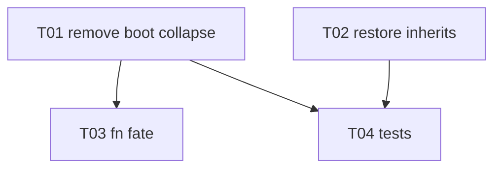

# 0007: Conflict-safe thread lifecycle (stop boot collapse)

## 1. Summary

`collapse_singleton_threads()` runs at app boot, before the first sync pass, and
DELETEs any thread with fewer than 2 members based on a local-only view. Because
thread membership is distributed across two synced rows (the `thread` row and
each note's `thread_id`), the boot collapse fires inside the sync-convergence
window and destroys threads that are still alive on the peer. Both devices end
up having "modified the same data concurrently" -> spurious conflicts, surfaced
in the Conflicts UI. Restoring a conflicted note then detaches it from its
folder and thread (a second bug), feeding the divergence back in: a cascade.

This RFC stops auto-collapsing threads by member count. Singleton display is
already handled by query-time filtering, so the destructive boot op is redundant
and harmful. It also fixes conflict restore to inherit the surviving note's
folder + thread.

## 2. Context / Codebase

- `src/ui/mod.rs:61` - boot calls `db.collapse_singleton_threads()` BEFORE
  `SyncEngine::start` (line 76), i.e. before the first sync pass.
- `src/db/thread_repo.rs:113` `collapse_singleton_threads()` - selects threads
  with `< 2` members and `delete_thread`s each. Only two callers exist: this boot
  site and a unit test (`tests/thread_test.rs`).
- `src/db/thread_repo.rs:219` `delete_thread` - in one tx: `UPDATE notes SET
  thread_id = NULL WHERE thread_id = ?`, then deletes the `threads` row. Both the
  `notes` update trigger and the `threads` delete tombstone fire (sync_meta
  TRACKED), so the collapse propagates as synced edits/deletions.
- Membership is split across synced entities: `note.thread_id` (a `note` column,
  in the `note` KindSpec cols) and the `thread` row (its own KindSpec). They
  arrive as separate sync rows, so a thread can transiently look like a singleton
  locally while the peer still holds it whole.
- Display already filters singletons: `note_repo.rs:141` / `:189`
  (`list_root_notes`, `list_root_notes_in_folder`) surface a `<2`-member thread's
  note as a flat root note. The collapse DELETE adds nothing to presentation.
- Conflict mechanism: `services/sync/conflict.rs` - `decide()` (version-vector
  compare), `archive_conflict()` (losing snapshot + chunks into `sync_conflicts`),
  `restore_note_conflict()` (UI "Restaurer en note").
- `restore_note_conflict` (conflict.rs:216) rebuilds a NEW note from
  `title`/`content`/`tags` only. `thread_id` is present in the snapshot but
  ignored; folder links live in the separate `notes_folders` junction and are not
  in the note snapshot. So the restored copy is detached.
- Folder-link API exists: `folder_repo.rs:201 folders_for_note(note_id)`,
  `folder_repo.rs:161 add_note_to_folder(note_id, folder_id)`. `notes_folders` is
  a synced entity (sync_meta.rs:67), so re-linking propagates via its trigger.

## 3. Problem & Motivation

Frequent iPhone<->Mac syncs surface conflicts on threads and their member notes,
even when the user changed nothing concurrently. Reproduction signature in the
screenshot: a `thread <uuid> = null` conflict (the side that collapsed) plus its
member note (`Modele economique`) conflict, arriving together - the exact
fingerprint of `delete_thread` nulling the thread and its member in one op.

Why it matters:
- Spurious conflicts erode trust ("rien n'est perdu" but the user still has to
  triage them constantly).
- The restore path detaches notes from folders/threads, so the user's act of
  recovering data actively worsens the structure.
- It is self-perpetuating (cascade): collapse -> null thread -> conflict ->
  restore -> detached note -> more divergence -> collapse can fire again.

The newly added foreground sync (issue #58) increases wake frequency, which
EXPOSES this generator more often; it does not cause it.

## 4. Goals / Non-Goals

Goals:
- G1: Eliminate spurious thread/member conflicts caused by boot-time collapse.
- G2: Preserve the "min 2 notes = a thread" UX (a lone member shows flat).
- G3: Conflict restore lands the recovered note in the same folder + thread as
  the surviving original.

Non-Goals:
- N1: Redesigning conflict resolution or version-vector semantics.
- N2: Garbage-collecting orphan (0-1 member) thread rows (deferred; harmless,
  filtered from UI).
- N3: The sync timeout / peer-discovery work (issue #58, separate).
- N4: Retroactively cleaning conflicts already queued from past collapses (user
  dismisses those once).

## 5. Alternatives Considered

### A. Remove auto-collapse; rely on existing query filtering (recommended)
Delete the boot `collapse_singleton_threads()` call. A thread is deleted only by
explicit user action. Singleton/empty threads persist as rows, invisible because
`list_root_notes*` already filter them.
- Pros: smallest change; removes the destructive op entirely; no new machinery;
  leverages filtering that already ships; kills the conflict generator at the
  source.
- Cons: orphan thread rows accumulate (harmless, filtered); thread lifetime
  becomes "until explicit delete".

### B. Keep collapse but gate it on convergence
Only collapse threads that are "settled" (not modified within a sync-settling
window, no pending outbound meta).
- Pros: keeps eager cleanup.
- Cons: needs a convergence/quiescence signal the engine does not expose;
  window heuristics are fragile; still races at the boundary.

### C. Make thread-delete merge-aware
On a concurrent "deleted here / alive there" thread, re-evaluate membership after
the merge instead of conflicting.
- Pros: surgical to the conflict.
- Cons: special-cases thread deletes in the generic apply path (N1); high
  complexity for a problem alternative A removes outright.

### D. Make collapse a local-only (non-synced) operation
- Cons: infeasible - the thread row and `note.thread_id` are both synced; you
  cannot delete them locally without emitting tombstones/edits.

### E. Status quo + only fix restore
- Cons: leaves the generator running; conflicts keep appearing.

## 6. Proposed Design

Adopt Alternative A, plus the restore fix (G3).

### 6.1 Stop auto-collapse (G1, G2)
- Remove the `db.collapse_singleton_threads()` call at `ui/mod.rs:61`.
- Invariant: a thread row is created/deleted ONLY by explicit user action
  (create thread, delete thread). Member count never triggers an automatic
  synced mutation.
- Presentation is unchanged: `list_root_notes` / `list_root_notes_in_folder`
  already render a `<2`-member thread's note as a flat root note.
- `collapse_singleton_threads()` keeps its unit test but loses its production
  caller. Decide in impl: either keep it as an explicit, user-invoked op (no auto
  trigger) or remove it with its test. Default: keep the fn, drop only the boot
  call (smallest diff), with a doc note that it must never run automatically
  during the sync window.

### 6.2 Conflict restore inherits folder + thread (G3)

Id semantics (clarified after review): a concurrent conflict shares ONE entity
id across both versions - the winner is written to the live `notes` row at
`conflict.entity_id`, the loser's text is archived in `sync_conflicts` under that
same id. `restore_note_conflict` mints a NEW note id for the recovered text, so
the surviving original (the winner) is exactly `get_note(conflict.entity_id)`.

In `restore_note_conflict`, after the new note is created, copy the structure of
that surviving original:
- folders: `folders_for_note(conflict.entity_id)` -> `add_note_to_folder(
  restored_id, each)`.
- `thread_id`: read the original's current `thread_id`; set it on the restored
  note ONLY if the thread row still exists (`get_thread(thread_id).is_some()`),
  to avoid a dangling reference.
- If the original note no longer exists (deleted meanwhile), the restored note
  stays flat - safe fallback, no error.

Source decision (review finding, snapshot vs live): take folder AND thread from
the LIVE surviving note, not from the archived snapshot. Folder membership is not
in the note snapshot at all (separate `notes_folders` junction), so the live note
is the only source for it; taking thread from the same source keeps the recovered
note coherent with where the note actually lives now ("restore next to the
original"). The snapshot's own `thread_id` is the losing version's and is
deliberately not used. Accepts a small TOCTOU window, bounded by the deleted/
dangling guards above.

Atomicity (review finding): wrap note creation + chunk restore + folder/thread
re-link in a SINGLE transaction, alongside the existing `resolve_conflict` claim.
The current restore is multi-statement and non-atomic; adding re-link steps
widens the partial-failure surface, so a failure must roll the whole restore back
(including the conflict claim) and leave the conflict visible for retry - never a
half-linked note behind an already-resolved conflict.

`notes_folders` and `notes` triggers fire on the new id, so the re-link/thread
membership propagate as ordinary local edits (new id -> no id fork, no conflict).
This needs no change to the snapshot/archive format.

### 6.3 Modules touched
- `src/ui/mod.rs` (remove boot call)
- `src/services/sync/conflict.rs` (restore inherits folder + thread)
- `src/db/thread_repo.rs` (only if `collapse_singleton_threads` is repurposed/removed)
- `tests/` (new + adjusted)

No schema change, no migration, no new dependency, no protocol change.

## 7. Drawbacks & Risks

- D1 (orphan rows): singleton/empty thread rows persist. Harmless (filtered) but
  the DB grows slowly. Mitigation: optional future GC of 0-member threads,
  guarded against sync races (N2, deferred).
- D2 (lifecycle change): threads become permanent until explicit delete. Verify
  no code path assumes boot collapse ran. Found: display filters cover it; chat
  scope `thread:{id}` resolves members at query time and tolerates singletons.
- D3 (restore on deleted original): falls back to a flat note (acceptable).
- D4 (existing queued conflicts): this is a forward fix; conflicts already
  archived from past collapses remain until dismissed (N4).
- D5 (re-link propagation): the restored note's new folder/thread links emit
  sync rows; confirm they ride the existing triggers (they do: `notes_folders`
  and `notes` are TRACKED).

## 8. Open Questions

- Q1: Keep `collapse_singleton_threads()` as an explicit user op, or remove it
  (and its test) entirely? Leaning keep-fn / drop-boot-call for the minimal diff.
- Q2: Do we want a friendlier label or auto-dismiss for thread-kind conflicts in
  the UI (they only offer "Ignorer")? Likely unnecessary once the generator is
  gone - defer.
- Q3: Eventually GC 0-member threads? If so, only post-convergence and
  local-guarded (N2).

## 9. Recommendation & Rationale

Implement Alternative A + the restore inheritance fix (6.1 + 6.2). It removes the
conflict generator at its root with the smallest possible change, reuses
filtering and folder/thread APIs that already ship, and adds no schema, protocol,
or dependency surface. B/C buy eager cleanup at the cost of convergence machinery
the engine does not expose; the only thing collapse provided (hiding singletons)
is already delivered by query filtering. The restore fix turns a data-detaching
recovery into a structure-preserving one, closing the cascade loop.

## 10. Implementation Plan

Each task is one focused, device-validatable change (project methodology: stop +
test between steps).

### Tasks

| ID | Title | Files | Depends on | Effort | Accept criteria |
|----|-------|-------|------------|--------|-----------------|
| T01 | Remove boot auto-collapse | `src/ui/mod.rs` | none | XS | `collapse_singleton_threads()` no longer called at boot; app builds desktop + iOS-sim; a `<2`-member thread's note still shows flat in feed and folder view (existing filter) |
| T02 | Restore inherits folder + thread (atomic) | `src/services/sync/conflict.rs` | none | S | `restore_note_conflict` copies the surviving original (`get_note(conflict.entity_id)`) `thread_id` (only if `get_thread` alive) and all `folders_for_note(entity_id)` links onto the restored note; if original is gone, restored note is flat; the whole restore (claim + create + chunks + re-link) is ONE transaction that rolls back fully on any failure, leaving the conflict visible |
| T03 | Decide `collapse_singleton_threads` fate (Q1) | `src/db/thread_repo.rs`, `tests/thread_test.rs` | T01 | XS | either the fn is kept with a doc note "explicit/local only, never during sync" (test unchanged) OR removed with its test; no dead auto-trigger remains |
| T04 | Tests: no spurious conflict + restore keeps structure | `tests/` | T01, T02 | M | (a) simulate a thread whose 2nd member is "not yet applied" locally, run the former boot path's conditions, assert no thread/member tombstone is emitted (no collapse); (b) iPhone<->Mac: create a 2-note thread, sync both ways, reboot both, assert zero conflicts; (c) archive a note conflict on a foldered+threaded note, restore it, assert the restored note shares the original's folder(s) + thread |

### Dependency graph

### Verification

- Unit: restore inheritance (folder + thread, and flat-fallback when original
  gone); collapse no longer auto-runs.
- Integration: iPhone<->Mac thread create + double reboot -> zero spurious
  conflicts (the core regression).
- Manual (device): reproduce the original screenshot scenario (frequent
  iPhone->Mac sync of a 2-note thread, reboots) -> no `thread ... = null`
  conflict appears; restore a conflicted foldered+threaded note -> it returns in
  the same folder and thread.

### Timeline (indicative)

T01+T02 are independent (XS+S); T03 trivial after T01; T04 (M) gates on both.
~0.5-1 day with the stop-and-validate cadence.

## 11. Review Findings

Two adversarial reviewers (read-only), distinct lenses: sync-correctness and
restore-correctness.

### Central claim: VALIDATED (sync-correctness reviewer)
- Boot collapse (`ui/mod.rs:61`) is the SOLE automatic generator of the
  thread+member conflicts. No sync path re-collapses: `apply.rs upsert_entity`
  has no post-upsert thread logic, `run_boot_reconcile` is chunk-only,
  `reconcile.rs` is not thread-aware.
- No UX regression: singletons are already filtered by `note_repo.rs:135/178
  list_root_notes*` and `thread_repo.rs:63 list_feed_threads` (>=2 members).
- No hidden dependency on boot collapse: `rag.rs:373` thread scope resolves
  members at query time and tolerates singletons; thread detail/header-menu only
  delete on explicit user action.
- Split-membership transient is benign: the note row carries `thread_id`
  self-contained; if the `thread` row arrives later the note already has its
  membership; query filtering tolerates a transient 1-member state.

### Accepted findings, folded into the design
- F1 (both reviewers, MAJOR): T02 is NOT optional. Removing boot collapse stops
  NEW spurious conflicts, but the restore-detachment bug fires independently.
  T01 + T02 must ship together or restore still worsens structure. Reflected: T04
  gates on both; recommendation states the coupling.
- F2 (restore reviewer, MAJOR - atomicity): restore is multi-statement and
  non-atomic; adding re-link steps must be wrapped in one transaction that rolls
  back fully on failure. Folded into 6.2 and T02 accept criteria.
- F3 (restore reviewer, MAJOR - snapshot vs live thread_id): the snapshot already
  carries the losing `thread_id`. Decision recorded in 6.2: take folder AND
  thread from the LIVE surviving note (folder is not in the snapshot at all;
  coherence with where the note lives now), not from the snapshot.
- F4 (restore reviewer): guard `thread_id` set behind `get_thread(...).is_some()`
  to avoid a dangling reference. Folded into 6.2 + T02.

### Rejected / downgraded
- "BLOCKER: entity_id is the losing id" (restore reviewer): downgraded. A
  concurrent conflict shares ONE id; the live `notes` row at `conflict.entity_id`
  IS the winner, and restore mints a new id for the recovered copy. The genuine
  residual (original deleted before restore) is the documented flat fallback.
- "MAJOR: setting thread_id re-triggers collapse" (restore reviewer): neutralized
  by T01 (no auto-collapse exists after this RFC). Residual dangling-thread case
  covered by F4.
- Orphan thread rows (D1): confirmed benign by both reviewers; deferred (N2).
