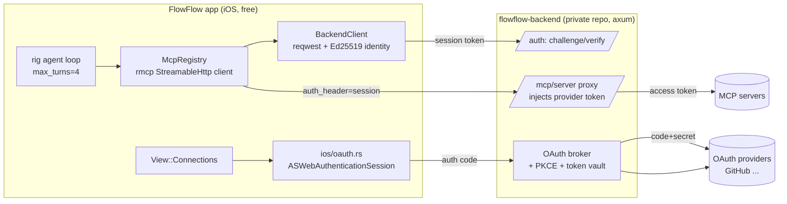
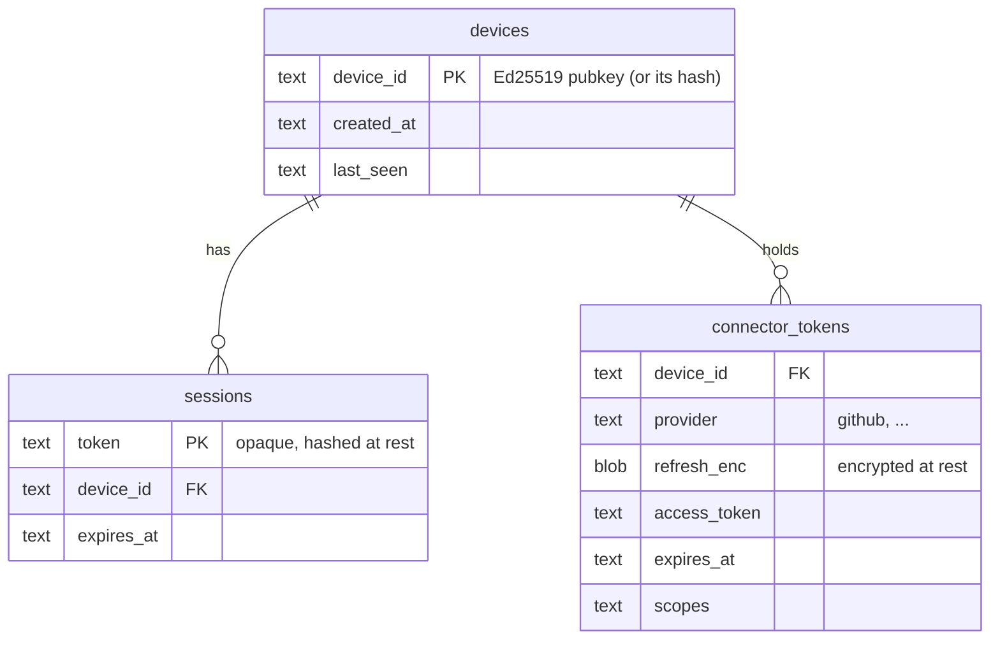
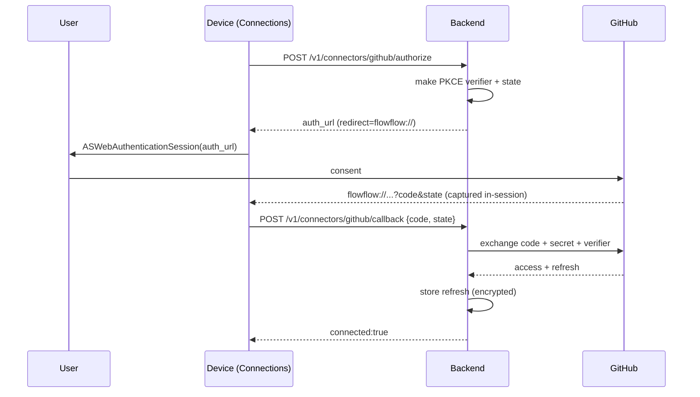
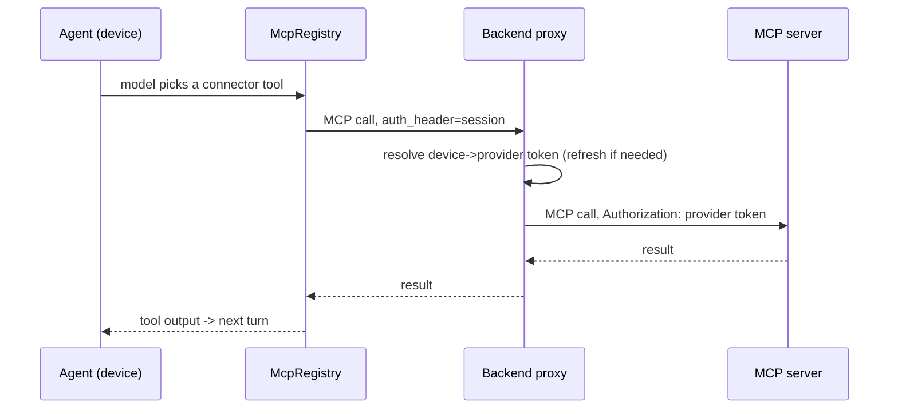
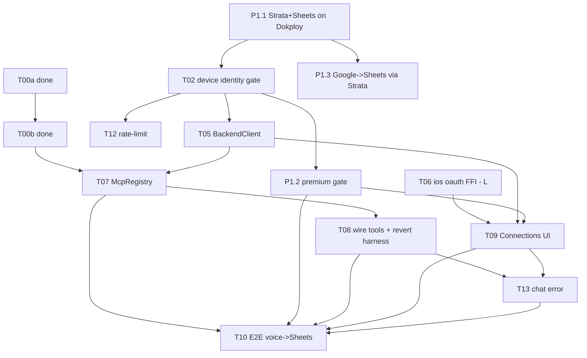
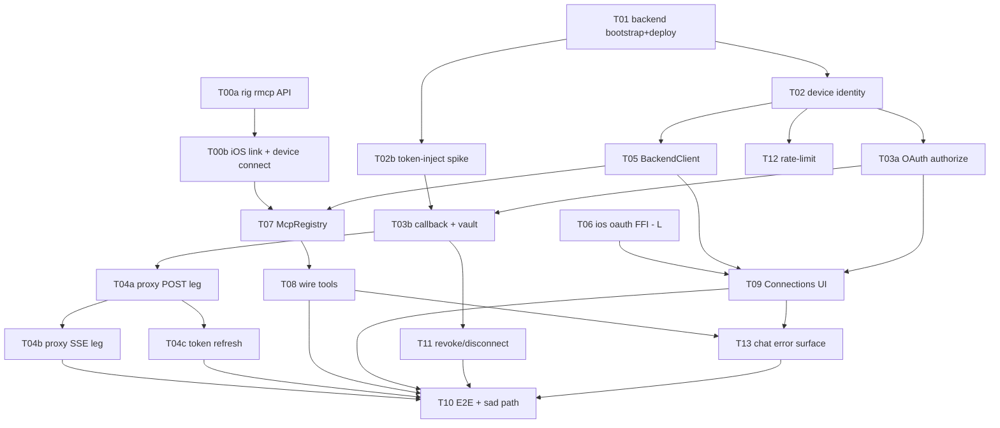

# 0008: Connecteurs MCP externes via backend broker OAuth (agent hybride on-device)

> **PIVOT 2026-06-19 (build direction).** The implementation pivoted from a hand-built OAuth-broker + self-hosted `github-mcp-server` to a **thin premium-gate backend in FRONT of a self-hosted Klavis `open-strata` aggregator** (a generic MCP router; OAuth + tokens + per-app servers are Klavis/Strata's job). First connector = **voice note -> Google Sheets CRM** (`drive.file` scope, non-sensitive). Deployed on **Dokploy** in a new repo `marketplace-flowflow`. Why: self-host = flat infra cost (not per-user, which is ruinous for a churny consumer funnel) + EU/GDPR token custody. Sections 5/6/9 keep the original design rationale; **§10 carries the CURRENT task plan** (the GitHub-broker table is preserved below it as superseded history). Spikes T00a/T00b done. Trackers: issues #62, #63.

## 1. Summary

**Problem:** FlowFlow's on-device agent is sealed to the notes corpus - it cannot act on external services, and the app has no way to hold third-party OAuth secrets or any device/server identity. This RFC is a deliberate strategic-platform bet (no current ICP; the offline second-brain is a "vitamin") to turn it into an MCP-connected agent.

**Recommendation:** Adopt Alt 2 - the on-device rig agent becomes an MCP client over Streamable HTTP, and a thin OAuth-broker backend (separate private repo, Rust/axum) holds client secrets + refresh tokens and proxies `/mcp/{server}`; built as a thin slice driving ONE self-hosted GitHub MCP server end-to-end from chat. Confidence: medium - both keystones (rig `rmcp` feature, `objc2-authentication-services`) are research-confirmed but unproven until the gating spike; monetization is deferred to a separate RFC.

**Impact:** ~12 additive device modules (one hot edit: `prompt_with_agent`) plus a greenfield backend; no breaking changes, dark-by-default, ~12-15 days solo. Adversarial review surfaced 6 security blockers (nonce replay, SSRF/open-proxy, tenant isolation, identity recovery, unpinned GitHub MCP server, untested broker token) now folded into the design; the largest residual risks are custodying users' refresh tokens and the novel iOS OAuth FFI.

## 2. Context / Codebase

Context collected by 7 research agents (5 codebase-mapping + 2 keystone-verification) before this RFC. Inventory only; design lives in section 6.

### Affected modules (integration points)
- `src/services/llm.rs` - `LlmClient` + `Provider` enum. Agent builder at `:219-268`, tool registration at `:232` (`.tool(SearchNotes::new(..))...`), `max_turns(4)` at `:236`/`:259`. Key loading fallback chain (DB -> env -> `option_env!`) at `:78-102`. The single site where MCP tools attach to the on-device agent.
- `src/services/tools/{mod.rs,search.rs,create.rs,summarize.rs}` - hand-written `rig::tool::Tool` impls (const NAME, async `definition()` -> JSON-schema `ToolDefinition`, async `call()`). The shape MCP tools replace at runtime.
- `src/services/rag.rs` - RAG + agent orchestration (`:363-541`); `prompt_agent_with_tools()` invoked at `:524`. The pipeline that gains MCP tools.
- `src/services/constants.rs` - `RAG_AGENT_SYSTEM_PROMPT` (`:98-127`); preamble must learn about connector tools.
- `src/db/settings_repo.rs` - `get_setting`/`set_setting` key-value store; `SENSITIVE_SETTINGS` + backup-exclusion list (`:28-37`). Today only static API keys, NO token/session/OAuth concept - the gap to fill (backend base URL, device session token, per-connector config).
- `src/db/peer_repo.rs` - `SyncPeer` + device static keypair persisted in settings (`persist_pairing` `:87-116`). Reusable device identity for device<->backend auth.
- `src/services/sync/transport.rs` - Noise (`snow`) over `TcpStream`, `connect_tcp` (`:234-259`) uses `to_socket_addrs()` - not LAN-bound, reaches any host:port. Identity/transport precedent, NOT reused for HTTP (MCP uses reqwest).
- `src/platform/ios/{picker.rs,reminders.rs,mod.rs,share.rs}` - canonical FFI patterns: `define_class!` `#[thread_kind = MainThreadOnly]` delegates (picker `:31-67`, event `:171-216`), `block2::RcBlock` completion handlers (reminders `:68-80`), `MainThreadMarker::new()` gating. The template for an `ios/oauth.rs` (ASWebAuthenticationSession).
- `src/ios/plugin/` + `build.rs` (`:38-58`) - existing SwiftPM package compiled via `xcrun swift build`, `@_cdecl` C funcs called via `extern "C"` (Live Activities). Home of the StoreKit shim if/when monetized (deferred).
- `src/ui/state.rs` - `View` enum (`:40-48`); add a `Connections` variant. `src/ui/mod.rs` central router (`:540-697`).
- `Dioxus.toml` - Info.plist customization + `[deep_links] schemes` for the `flowflow://` callback scheme.
- `Cargo.toml` - `rig-core = { version = "0.36", features = ["rustls"] }` (`:24`); add `"rmcp"` feature + `rmcp` (client + streamable-http-reqwest) + `objc2-authentication-services` (iOS target).

### Key symbols
- `LlmClient::prompt_with_agent` / `prompt_agent_with_tools` - agent path; where `rmcp_tools(tools, peer)` / `tool_server_handle(handle)` plug in.
- `Provider` enum (OpenAi/Anthropic, `:19-51`) + `SttProvider`/`TranscriptionClient` facade (`transcription/provider.rs:9-112`) - the enum + `from_str` + match dispatch pattern, exemplar for any new provider/connector dispatch.
- `Tool` impls (SearchNotes/CreateNote/SummarizeFolder) - replaced/augmented by rig's `McpTool` (impl `ToolDyn`, runtime name/schema, single generic forwarder).
- `get_setting`/`set_setting` - config + secret storage; absence of any session/token type is the central gap.
- `SyncPeer` + device static keypair - device identity to reuse for a signed-challenge -> backend session token.

### Prior art
- RFC 0004 multidevice-sync (Accepted/shipped) - device static-keypair identity, Noise transport, version vectors. Identity precedent.
- RFC 0005 pluggable-transcription (shipped) - the enum-provider dispatch pattern to mirror.
- RFC 0001 data-backup-export - settings backup + sensitive-key exclusion; backend session tokens must be backup-excluded.
- RFC 0006 note-threads, RFC 0007 conflict-safe-thread-lifecycle - recent cadence, unrelated.
- Memory `project_agentic_feasibility` - iOS outbound-only (no inbound server), push-wake only; MCP/webhook roadmap; AGPL-on-App-Store caution.
- Memory `project_painkiller_verdict` - offline second-brain judged a vitamin, 6 wedges killed, no ICP. The standing challenge.
- Memory `project_second_brain_rnd` - gitignored `.rnd/` MCP+export R&D (nothing built).

### External prior art (keystone research, cited in section 6)
- rig-core 0.36 `rmcp` feature; official `rmcp` 1.x SDK (`McpTool`, `McpClientHandler`, `StreamableHttpClientTransport`, `StreamableHttpClientTransportConfig.auth_header`). Caveat: rust-sdk#464 (auth header not sent on SSE leg for some servers).
- `objc2-authentication-services` v0.3.2 (ASWebAuthenticationSession); reference `tauri-plugin-auth-session/src/apple.rs` (iOS OAuth in 100% Rust/objc2, no AppDelegate hook).
- OAuth broker/BFF posture: RFC 8252, OAuth 2.1, Browser-Based-Apps BCP - client secret + refresh tokens server-side only, device holds an opaque session token.

### Execution flows touched
- RAG chat pipeline (existing): user msg -> OpenAI embed -> LanceDB search -> build context -> `prompt_agent_with_tools` (rig agent, `max_turns=4`) -> response. MCP tools inject into the agent build step.
- OAuth connect flow (new): Connections UI -> ASWebAuthenticationSession(auth URL, `flowflow://` callback) -> code -> POST to backend -> backend exchanges (holds secret + PKCE) + stores refresh -> returns session token -> settings.
- MCP call flow (new): agent picks a connector tool -> `McpTool.call` -> `StreamableHttpClientTransport` to backend `/mcp/{server}` with backend-minted `auth_header` -> backend proxies to the MCP server injecting the provider access token -> result back into the agent loop.
- Device<->backend identity (new): device signs a challenge with its sync static key -> backend verifies, issues a short-lived session token.

### Greenfield vs existing
- On-device side: brownfield - rides the existing agent/tools/settings/FFI machinery; new code is additive modules, no cfg gating needed (all services are runtime-dispatched today).
- Backend side: greenfield - a new private repo, zero existing code, never in the app's compile.

## 3. Problem & Motivation

### Current state
FlowFlow's on-device agent is sealed. Its only tools act on the user's own corpus: `SearchNotes`, `CreateNote`, `SummarizeFolder` (`services/tools/`), wired into the rig agent at `llm.rs:232` with `max_turns(4)`. It cannot reach any external service. Two structural reasons:
- Each new integration today means a hand-written `Tool` impl, and the app has NO way to hold a third-party OAuth secret or refresh token - shipping secrets in an App Store binary is a non-starter (RFC 8252: a native app is a public client).
- There is NO notion of identity, session, or token between the app and any server. `settings_repo` stores only static API keys; there is no device<->server auth and no vault for delegated credentials.

So "act on my real tools (GitHub, calendar, issues...) from my notes/chat" is impossible today: the moment the agent needs to touch the outside world, it hits a wall.

### Pain
Self-reported, not metric-driven (see Signals). The agent's usefulness caps at the notes corpus. Every real-world action requires leaving the app and doing it by hand. For an app whose pitch is "chat with your second brain", the brain can think but cannot act.

### Why now
Strategic platform bet (owner's stated motivation): the market is moving toward agents that act across a user's services (Raycast AI + MCP, Saner.ai), and the owner intends to build that foundation regardless of a current ICP. Two enabling pieces just made the pure-Rust path viable and were confirmed by keystone research:
- rig-core 0.36 ships MCP client support (`rmcp` feature) with runtime tool discovery (`McpTool`) over pure-Rust Streamable HTTP - the on-device agent can become an MCP client with no new native dependency.
- `objc2-authentication-services` v0.3.2 exposes ASWebAuthenticationSession to Rust, giving iOS OAuth that captures its own callback (no AppDelegate hook - the one ugly Dioxus gap).
MCP standardized the connector protocol, so building one broker pattern yields generic reach. The tech landed; the foundation is cheap to lay now.

### Honest tension (kept visible per owner's request)
There is no ICP and the `project_painkiller_verdict` memory judged the offline second-brain a vitamin (0/3 painkiller). This RFC is a deliberate platform bet, NOT a response to measured user pain. It is scoped thin and monetization is deferred precisely so the bet stays cheap.

### Signals
- No usage metric exists yet (honest: zero connectors today, so nothing to measure).
- Success signal for THIS RFC is binary-technical (owner's choice): one real MCP server (GitHub) driven end-to-end from chat, OAuth brokered, on a physical iOS device. Usage and willingness-to-pay are explicitly out of scope here.

## 4. Goals / Non-Goals

### Goals
1. The on-device rig agent connects to >=1 remote MCP server over Streamable HTTP and calls its tools from the chat loop, with `aarch64-apple-ios` cross-compile green and a device-verified run.
2. OAuth to >=1 provider (GitHub) is brokered by the backend: client secret + refresh tokens live server-side only; the device holds only an opaque session token; the in-app consent uses ASWebAuthenticationSession with no AppDelegate hook.
3. Device<->backend identity is established: the device proves itself with a signed challenge from its existing sync static keypair and receives a short-lived session token.
4. The backend lives in a separate private repo and is NEVER part of the app's mobile/desktop compile; all on-device additions are runtime-dispatched (no new cfg-gating, no compile regression for desktop/sim).
5. Generic-by-protocol: connecting a second MCP server requires backend config + an OAuth client registration, with zero new on-device tool code.

### Non-Goals
1. We are NOT building monetization. No IAP, paywall, billing, or StoreKit work here - that is a separate future RFC. (Explicitly rejecting the obvious extension.)
2. We are NOT building an MCP marketplace, catalog, or multi-tenant connector store. One real server end-to-end; breadth comes later.
3. We are NOT modifying the P2P sync layer (RFC 0004). We reuse its device keypair for identity and touch nothing else.
4. We are NOT hosting LLM inference on the backend. BYO-key stays; the backend never pays for tokens (keeps it cheap to run).
5. We are NOT adding real user accounts / email signup. Anonymous per-device identity only, upgradeable later.
6. We are NOT targeting Android. iOS only, consistent with the app.
7. We are NOT enabling inbound/push-triggered agent actions. iOS has no inbound server; outbound MCP calls only (per `project_agentic_feasibility`).

## 5. Alternatives Considered

Three axes differentiate the options: WHERE the agent runs (device vs server), WHERE third-party credentials live (device vs server), and HOW connectors are defined (hand-rolled per service vs MCP protocol). No convergence here; the recommendation is step 9.

### Alt 0: Status Quo
**Summary:** Keep the sealed agent (notes-only tools).
**Cost of inaction:** the strategic platform bet is abandoned; the agent stays an island that can think over notes but act on nothing. Section 3 pain persists.
**Pros:** zero effort, zero regression risk, no new ops/liability.
**Cons:** no external actions ever; no platform; competitors (Raycast, Saner.ai) own the "agent that acts on your services" space.
**Cost:** none. **Reversibility:** n/a.

### Alt 1: Minimal - hand-rolled per-service tools, tokens on device (BYO)
**Summary:** Add one `rig::Tool` impl per service (a GitHub tool, etc.); the user pastes a personal access token into Settings exactly like today's BYO API keys. No backend.
**How it solves:** gives the agent a few external actions with the smallest possible patch (3 files per tool, the existing pattern at `tools/` + `llm.rs:232`).
**Pros:**
- No backend, no ops, no OAuth plumbing, ships fast.
- Reuses the exact existing tool + settings pattern.
- Works without a server; partial offline.
**Cons:**
- Does not scale: N services = N hand-written tools (defeats goal 5).
- Terrible UX + weak security: user manually creates and pastes a PAT per service; many services don't offer scoped long-lived PATs at all.
- Tokens sit on device (extraction risk, weaker App Store privacy story).
- No OAuth, no central revocation, no monetization seam. Lays no platform.
**Cost:** low. **Reversibility:** easy (delete the tools).
**References:** existing `services/tools/` + BYO-key precedent.

### Alt 2: MCP client on device + thin OAuth-broker backend (hybrid)
**Summary:** The on-device rig agent becomes an MCP client over Streamable HTTP. A thin backend (separate repo) brokers OAuth (holds client secrets + refresh tokens), mints short device/access tokens, and proxies `/mcp/{server}`. Connectors are MCP servers; the device writes no per-service tool code.
**How it solves:** hits all five goals - generic by protocol, secrets server-side, agent stays on device, cross-compile-safe, second connector = config only.
**Pros:**
- MCP is a protocol: one broker pattern, N servers plug in (goal 5). Mirrors Raycast's MCP-behind-connections model.
- Secrets + refresh tokens server-side only (RFC 8252-correct, best App Store privacy; device holds an opaque session token).
- Agent stays on device: no server inference cost, keeps the local RAG/LanceDB ethos, reuses the existing rig loop (`rmcp` is just a feature flag + tool registration).
- Both keystones research-confirmed in pure Rust (integration pending the T00 spike), no new native dependency; clean managed-tier monetization seam for later.
- Backend stays thin and cheap (brokering + proxy only, no inference).
**Cons:**
- Introduces a backend: new repo, hosting, uptime, ops.
- Connector calls require online (chat over local notes still works offline).
- You host users' refresh tokens - real security liability + breach surface.
- Novel assembly on iOS: no shipped Dioxus+MCP+OAuth example exists; integration risk concentrated in the Dioxus build plumbing and FFI lifetimes.
- Known caveat: rust-sdk#464 (auth header may not reach the SSE leg on some MCP servers) - must test per server.
**Cost:** medium. **Reversibility:** medium - on-device additions are additive and runtime-dispatched (easy to remove); the backend is separable; BUT once you hold user tokens and ship a device-identity scheme, changing identity later forces a re-pair/migration (soft one-way element, flagged).
**References:** rig-core `rmcp` feature + official `rmcp` 1.x SDK (`McpTool`, `StreamableHttpClientTransportConfig.auth_header`); MCP authorization spec (OAuth 2.1); Raycast MCP (raycast.com/pricing, manual.raycast.com/ai/model-context-protocol); Curity token-handler / BFF pattern.

### Alt 3: Fat backend - agent runs server-side (thin client)
**Summary:** Move the entire agent loop to the backend. The device sends the chat message and renders the answer; the backend is the MCP host AND runs the LLM and tool execution.
**How it solves:** maximal capability with the simplest device; everything external lives server-side.
**Pros:**
- Simplest device: no on-device MCP client, no rig agent, no connector FFI.
- All secrets, tokens, and tool execution server-side - strongest privacy-from-device posture.
- Easiest to add connectors and to update/meter/monetize centrally.
**Cons:**
- Backend now pays for LLM inference - kills the "BYO-key free, cheap backend" premise (non-goal 4) and changes the cost model entirely.
- Requires online for ALL chat; breaks the on-device RAG/LanceDB ethos and the existing local pipeline (a large rewrite, not an addition).
- You become a data processor for all chat content - heavier privacy/consent surface (AI-consent is already an App Store sensitivity for this app).
- Apple IAP almost certainly required (hosted SaaS), pulling monetization forward into scope we want deferred.
**Cost:** high. **Reversibility:** hard - moving the agent off-device is a one-way architectural door and commits to ongoing server inference cost. ONE-WAY DOOR, flagged.
**References:** ChatGPT/Perplexity hosted model; contrasted against FlowFlow's on-device design (LanceDB, BYO-key).

### Alt 4: Pure on-device MCP, no backend (device-held tokens, public-client OAuth)
**Summary:** Skip the backend entirely. The device does the full OAuth public-client flow (PKCE, no secret) via ASWebAuthenticationSession, stores refresh tokens in the Keychain, and connects directly to MCP servers.
**How it solves:** generic MCP reach with zero server.
**Pros:**
- No backend at all: zero ops, zero hosting, cheapest possible.
- Fully user-owned credentials; the vendor never sees a token (maximal privacy-from-vendor).
- Works without a server; still uses MCP (generic).
**Cons:**
- Many providers require a confidential client / client secret (GitHub OAuth Apps issue a secret; pure public-client PKCE is not universally accepted) - direct device OAuth simply fails for a large share of real connectors, including the chosen first one.
- Refresh tokens on device: extraction risk, no central revocation, fragile background refresh on mobile.
- No server-side seam to ever meter or gate a paid tier - forecloses the deferred monetization path.
- MCP servers that demand confidential-client auth are unreachable.
**Cost:** low-medium. **Reversibility:** medium (could add a backend later, but token-on-device habits + provider registrations would need migration).
**References:** RFC 8252 (public vs confidential client), OAuth 2.1; provider docs requiring a client secret.

## 6. Proposed Design

**Base alternative:** Alt 2 (hybrid - on-device MCP client + thin OAuth-broker backend), confirmed by the owner. One refinement vs the original sketch: device identity uses a NEW Ed25519 keypair, not the sync layer's static key (the sync key is x25519/Noise-DH and cannot sign). The pattern (a persisted per-device keypair, backup-excluded) is reused from `peer_repo`; the key itself is distinct.

**Impact note:** GitNexus impact skipped (index resilience); blast radius taken from the 5 codebase-mapping agents. The single hot-path modification is `llm.rs::prompt_with_agent` (the agent builder); everything else is additive new modules. Overall risk: MEDIUM, concentrated on that one symbol and on the novel iOS FFI/build plumbing.

### Architecture overview
The device keeps running the rig agent. A new on-device MCP client opens one Streamable-HTTP connection per connected server, all pointed at the backend's authenticated proxy. The backend is the only holder of OAuth client secrets and provider refresh tokens; the device carries only an opaque session token. The feature is dark until a `backend_base_url` is set: with no backend, the MCP registry is empty and the agent behaves exactly as today.



### Modules / files affected

Device side (`flowflow` repo - all additive except two modified hot files):
| Path | Change | Why |
|------|--------|-----|
| `Cargo.toml` | modified | add `"rmcp"` to rig-core features; add `rmcp` (client + `transport-streamable-http-client-reqwest` + reqwest/rustls); add `objc2-authentication-services` under `cfg(target_os="ios")`; add `ed25519-dalek` |
| `src/services/backend/mod.rs` | new | `BackendClient` (reqwest): Ed25519 device identity, challenge/verify, session-token cache + refresh, connector list fetch, proxy base URL |
| `src/services/mcp/mod.rs` | new | `McpRegistry`: one `StreamableHttpClientTransport` per connected server (uri = backend `/v1/mcp/{server}`, `auth_header` = session token), tool discovery, exposes rig `McpTool`s |
| `src/services/llm.rs` | modified (hot) | `prompt_with_agent` registers MCP tools on the agent builder when the registry is non-empty (`.rmcp_tools(tools, peer)` or per-tool); empty -> unchanged behavior |
| `src/services/constants.rs` | modified | preamble gains a generic line about connector tools |
| `src/db/settings_repo.rs` | modified | add `backend_base_url`, `backend_session_token`, `device_identity_privkey`/`_pubkey` to `SENSITIVE_SETTINGS` + backup-exclusion (tokens/keys never travel in backup) |
| `src/platform/ios/oauth.rs` | new (iOS only) | ASWebAuthenticationSession wrapper: `RcBlock` completion + `define_class!` MainThreadOnly presentation-context delegate (mirrors `picker.rs`) |
| `src/platform/mod.rs` | modified | `#[cfg(target_os="ios")] pub mod oauth;` |
| `src/ui/state.rs` | modified | add `View::Connections` variant |
| `src/ui/connections.rs` | new | list connectors + status, connect/disconnect, trigger OAuth |
| `src/ui/mod.rs` | modified | route `View::Connections` in the central match |
| `Dioxus.toml` | modified | `[deep_links] schemes = ["flowflow"]` (callback scheme) |

Backend side (`flowflow-backend` - new private repo, never in app compile): Rust + axum + tower-http, sqlx (SQLite for v0, Postgres when multi-instance), reqwest (rustls) outbound to providers + upstream MCP servers, ed25519-dalek for signature verify.

### Data model

Device: NO SQLite migration. Config and tokens live in the existing key-value `settings` table; connector list is fetched from the backend (device stays stateless about connectors). This is a deliberate plus - zero device schema risk.

Backend (greenfield):

Refresh tokens encrypted at rest with envelope encryption; the master key lives off-DB (env / KMS / secrets manager, never in the DB or repo), so a DB-read-only compromise yields no plaintext (finding 9). Session tokens stored hashed. A token-use audit log (`device_id`, `provider`, timestamp, action) is retained separately from request traces (finding 31).

### API contracts (backend, all additive). Security hardening folded in from the review (findings 1-3, 5-6, 19, 22).
- `POST /v1/auth/challenge` `{ device_pubkey }` -> `{ nonce }`. Nonce is single-use, server-stored, 60s TTL, bound to the submitted pubkey, rate-limited.
- `POST /v1/auth/verify` `{ device_pubkey, nonce, signature }` -> `{ session_token, expires_at }`. Ed25519 verify; nonce must be unconsumed + within TTL, then deleted (closes replay/grinding). TOFU registration on first contact (anonymous; see identity-recovery in Cross-cutting). Session token is bound to `device_pubkey` and rotated on refresh.
- `GET /v1/connectors` (Bearer session) -> `[{ provider, name, connected, scopes }]`.
- `POST /v1/connectors/{provider}/authorize` (Bearer) -> `{ auth_url }`. Backend owns PKCE `code_verifier` + `state`; `state` is single-use and bound to THIS session.
- `POST /v1/connectors/{provider}/callback` `{ code, state }` (Bearer) -> `{ connected: true }`. Backend rejects a `state` not issued to this session, then exchanges `code + client_secret + verifier`, stores the refresh token encrypted.
- `DELETE /v1/connectors/{provider}` (Bearer) -> revoke the token upstream + purge the vault row (disconnect / right-to-erasure).
- `DELETE /v1/session` (Bearer) -> invalidate the session.
- `ANY /v1/mcp/{server}/*` (Bearer session) -> authenticated MCP proxy. `{server}` resolves ONLY against a fixed server-side allowlist of vetted upstream MCP URLs, never derived from client input (closes the SSRF/open-proxy hole). Every call asserts the resolved `connector_tokens` row belongs to the session's `device_id` (tenant isolation; cross-device access is a denied + tested case). The backend injects a real GitHub-native OAuth/PAT token upstream (single-flight refresh per device+provider, atomic rotation) on BOTH the POST and SSE legs. The #464 sidestep protects the provider credential, but the device->backend leg uses the same rmcp client, so T00/T07 must confirm the device sends `auth_header` on its own SSE leg to the proxy.

**First connector pinned (finding 5):** self-hosted `github/github-mcp-server --http`, NOT the hosted `api.githubcopilot.com/mcp/` (which gates tools behind a Copilot license + org policy). Self-hosting gives full control of both legs and token injection. A backend token-injection spike validates a real GitHub token against this endpoint before T03b (finding 6).

### Flows

Device identity -> session:
```mermaid
sequenceDiagram
  participant D as Device
  participant B as Backend
  D->>B: POST /v1/auth/challenge
  B-->>D: nonce
  D->>D: sign(nonce) with Ed25519 privkey
  D->>B: POST /v1/auth/verify {pubkey, nonce, sig}
  B->>B: verify sig; upsert device (TOFU)
  B-->>D: session_token (short TTL)
```

OAuth connect (GitHub):


MCP tool call at chat time:


### Cross-cutting
- **Auth/authz:** device Bearer session token on every backend call; session bound to `device_pubkey`, rotated on refresh; provider tokens never leave the backend; refresh encrypted (envelope, off-DB key); every proxy call enforces device_id ownership of the connector row. Re-challenge on 401 is bounded (max attempts + backoff) with a user-visible "reconnect" state distinct from "backend down" (finding 23).
- **Identity recovery (finding 4):** the Ed25519 device key is backup-excluded, so device restore yields a new identity and orphans connectors. v0 posture: ACCEPT this for the dogfood slice and surface it - on a new device, connectors simply show disconnected and the user re-consents (refresh tokens for the dead identity are GC'd). A recovery path (encrypted key backup or an account binding) is explicitly deferred and noted as a known limitation, not silently "clean".
- **Data handling / GDPR (finding 8):** the backend is a data processor for provider refresh tokens. Minimal posture in scope: encrypted vault (off-DB key), `DELETE /v1/connectors/{provider}` performs upstream revoke + row purge (right-to-erasure), tokens never logged, audit log separate. A privacy policy + retention statement is a launch blocker, not a code blocker.
- **Graceful degradation (backwards compat):** if `backend_base_url` unset OR backend unreachable, `McpRegistry` is empty and `prompt_with_agent` builds the agent with only the existing notes tools - identical to today. The feature is dark by default; this IS the rollout mechanism (no flag plumbing beyond "is a backend configured").
- **Best-effort SLO (finding 27):** single instance, NO uptime guarantee; the vault is backed up and the master key escrowed offline; if the box dies, connected users must re-consent (refresh tokens lost). Stated, not hand-waved.
- **Desktop (finding 29):** `ios/oauth.rs` is iOS-gated; `BackendClient` + `McpRegistry` compile everywhere. The Connections "connect" affordance is gated OFF on desktop ("iOS only for now") so the OAuth stub is not a silent dead-end. A loopback-redirect (RFC 8252) desktop flow is a later add. No compile regression (non-goal 4 honored).
- **App Store disclosure (finding 24):** note-derived content and tool-call arguments can flow to third-party connectors; this new data-sharing must appear in the App Privacy label and consent copy, beyond the existing on-device AI-consent gate.
- **Observability:** backend `tower-http` trace + per-connector call counters + the token-use audit log; device-side keeps the existing minimal logging.
- **iOS outbound-only:** every backend and MCP interaction is device-initiated HTTPS; no inbound server (per `project_agentic_feasibility`).

## 7. Drawbacks & Risks

### Drawbacks (inherent - true even if everything goes right)
1. **You now operate a backend.** A formerly 100%-on-device app gains hosting, uptime, deploys, and an on-call surface that did not exist.
2. **You become custodian of users' OAuth refresh tokens.** Permanent security liability and breach blast-radius; as an EU developer storing EU users' provider tokens you are a data processor (GDPR obligations), even with anonymous device identity.
3. **Connector actions require network + a reachable backend.** The offline ethos no longer covers agentic actions (local notes/RAG stay offline; connectors do not).
4. **New, young dependencies.** `rmcp` (API still churning per keystone research), `objc2-authentication-services` 0.3.x, `ed25519-dalek` - more surface to track and to keep cross-compiling green.
5. **Two-repo, two-cadence complexity.** App and backend version independently; you must keep the device<->backend API contract compatible across two release rhythms.
6. **Per-call latency.** Every connector tool call is device -> backend -> provider MCP server (two hops + possible token refresh), inherently slower than a local tool.
7. **Larger App Store review surface.** Third-party OAuth + a backend + agentic actions can re-trigger privacy / AI-consent scrutiny (5.1.2(i) is already a sensitivity for this app).

### Risks (probabilistic)

| Risk | Likelihood | Impact | Mitigation |
|------|-----------|--------|------------|
| rig/rmcp API drift: `rmcp_tools`/`tool_server_handle` don't compile vs 0.36 | medium | medium | Spike (task 0) confirms before any other work; fallback `McpTool::from_mcp_server`; pin `rmcp` to rig's resolved 1.x to avoid two-version link error |
| iOS cross-compile of `rig[rmcp]+rmcp` fails on `aarch64-apple-ios` | low | high | Spike gates it first; reqwest+rustls already ship on iOS so low; if it breaks, the architecture is invalidated early and cheaply |
| ASWebAuthenticationSession FFI lifetime bug (block/delegate/session freed before callback) -> hang/crash | medium | medium | Copy the `tauri-plugin-auth-session/apple.rs` thread-local-retain pattern; device-test the connect flow |
| Hot-path regression: a bug in `prompt_with_agent` MCP registration breaks ALL chat | low | high | Empty-registry path must be behavior-identical to today; guard registration behind non-empty registry; test the no-backend build |
| Token vault breach / leaked refresh tokens | low | critical | Encrypt at rest, short access TTL, minimal scopes, per-provider revocation, never log tokens; treat as security-critical from day 1 |
| Backend single instance = SPOF; connectors dead if down | medium | medium | Graceful degradation (agent falls back to notes tools); SLO is explicitly "connectors best-effort", documented, not "always up" |
| rust-sdk#464 (auth header missing on SSE leg) bites a call | low | medium | Upstream leg: our axum proxy injects the provider token server-side. Device->backend leg: the same rmcp client is used, so T00b/T07 must confirm the session `auth_header` reaches OUR proxy's SSE leg (finding 12) |
| App Store rejection over third-party OAuth / data handling / AI consent | medium | high | Keep monetization out of scope; ASWebAuthenticationSession is Apple-blessed; prepare a data-handling disclosure; re-check at submission (separate from build) |
| Scope creep: "generic MCP" balloons into a marketplace before one server works | medium | medium | Non-goal 2 + slice discipline; one server end-to-end IS the definition of done |

### Rollout / rollback
- **Rollout:** dark-by-default, config-gated. The on-device feature is inert unless `backend_base_url` is set; ship it disabled and enable it for yourself (dogfood) by setting the URL. No percentage-flag infrastructure needed. The backend deploys independently (greenfield, no users at first).
- **Rollback:** device side is additive with NO SQLite migration, so the feature self-disables when no backend URL is set. Revert-the-PR leaves benign orphan `settings` rows + a persisted device key (finding 28); a true clean rollback drops the four keys. Backend is greenfield and can be torn down; the only stateful concern is the token vault (deleting it forces re-consent, acceptable at zero/low user count).
- **Gating metric:** task 0 spike (compiles for iOS + connects to a public MCP server) gates everything downstream. The end-to-end gate is one successful GitHub action issued from chat on a physical device. No production SLO yet (no users).

## 8. Open Questions

### Resolved during review (now design decisions)
- **GitHub MCP server (was OQ#3):** pin self-hosted `github/github-mcp-server --http`; avoids the Copilot-license gating of the hosted endpoint and gives full two-leg control. Reflected in section 6.
- **Device identity (was OQ#4):** Ed25519 TOFU + rate-limit for the dogfood slice; App Attest / DeviceCheck is a REQUIRED gate before any non-dogfood exposure (documented, not silently deferred).
- **Identity recovery (finding 4):** accept the orphan-on-restore limitation for v0 (re-consent), defer a recovery path; stated as a known limitation in section 6.
- **Vault key custody (finding 9):** envelope encryption, master key off-DB in a secrets manager.
- **Desktop OAuth (was OQ#7):** connect affordance gated off on desktop; iOS is the only consent surface for this slice.

### Still open
| # | Question | Owner | Blocks / by when |
|---|----------|-------|------------------|
| 1 | Exact rig 0.36 builder API: `rmcp_tools`/`tool_server_handle` vs `McpTool::from_mcp_server`? Plus a single resolved `rmcp` version (`cargo tree -i rmcp`). | Mirko | T00a; blocks T07-T08 |
| 2 | Host for v0 (Fly.io / Railway / self-host) + domain + TLS for the OAuth redirect; SQLite single-instance is fine for v0. | Mirko | T01 |
| 5 | Confirm `Authorization` reaches BOTH legs: device->backend SSE leg (rmcp #464) AND backend->upstream SSE leg. | Mirko | T00b / T04b |
| 6 | GDPR privacy policy + retention statement for stored EU provider tokens. | Mirko | Launch blocker (not a code blocker) |

## 9. Recommendation & Rationale

**Recommendation:** Adopt **Alt 2 (hybrid - on-device MCP client + thin OAuth-broker backend)** as designed in section 6, built as a thin vertical slice: one MCP server (GitHub) driven end-to-end from chat. Monetization stays out (separate future RFC).

**Confidence: medium.** Both keystones have research-level confirmation - the rig-core `rmcp` feature and `objc2-authentication-services` both exist - but the exact rig builder API the hot path depends on (`rmcp_tools`/`tool_server_handle`) is UNVERIFIED until T00 (finding 11): read "confirmed" as "feature exists, integration pending the spike". The medium (not high) also reflects that the iOS build-plumbing assembly is novel - no shipped Dioxus+MCP+OAuth precedent - and that the review surfaced 6 security blockers now folded into the design but not yet proven in code. The spike is deliberately first to convert this to high (or kill it) cheaply.

### How it hits the goals
| Goal | Mechanism (section 6) |
|------|-----------------------|
| 1 - agent calls a remote MCP server from chat | rig `rmcp` feature + `McpRegistry` (one `StreamableHttpClientTransport` per server) + `McpTool` registered on the existing agent builder |
| 2 - brokered OAuth, secrets server-side | backend `/authorize` + `/callback` (holds client secret + PKCE), token vault; device consent via ASWebAuthenticationSession; device holds only a session token |
| 3 - device<->backend identity | Ed25519 challenge/verify (`/auth/challenge` + `/auth/verify`), TOFU registration |
| 4 - backend never in app compile, no regression | separate private repo; on-device additions are additive runtime-dispatched modules; dark-by-default config gate; no cfg-gating, no device DB migration |
| 5 - generic by protocol | backend MCP proxy + rmcp runtime tool discovery; a second server is backend config + an OAuth client, zero new on-device tool code |

### Why not other alternatives
- **Alt 0 (status quo):** rejected because the strategic platform bet is the entire purpose; status quo forecloses it while competitors (Raycast, Saner.ai) own "agent that acts on your services".
- **Alt 1 (hand-rolled tools + device PATs):** rejected because it violates goal 5 (N services = N hand-written tools) AND most providers do not issue scoped long-lived PATs, so the agent literally cannot authenticate to them - plus refresh tokens on device is a privacy regression.
- **Alt 3 (fat backend, server-side agent):** rejected because the backend would pay LLM inference (kills the cheap-backend premise, non-goal 4) and requires rewriting the on-device RAG pipeline with online-for-all-chat - a one-way architectural door for a slice meant to be cheap and reversible.
- **Alt 4 (no backend, device public-client OAuth):** rejected because GitHub (the chosen first connector) and many providers require a confidential client secret, so direct on-device OAuth fails outright - and it leaves no server-side seam for the deferred monetization path.

### Revisit if
- The task-0 spike shows `rig[rmcp]+rmcp` cannot cross-compile for `aarch64-apple-ios` or cannot speak Streamable HTTP from device -> architecture invalid; fall back to a hand-written reqwest MCP client or reconsider Alt 3.
- Monetization later demands server-side metering of inference -> Alt 3 (fat backend) becomes worth its cost.
- A must-have provider only supports on-device public-client OAuth and forbids brokered exchange -> add an Alt 4 path for that provider specifically.
- The security/ops liability of custodying refresh tokens proves unacceptable for a solo dev -> shrink to Alt 1 for the few PAT-friendly services, or pause the platform bet.
- `rmcp` stalls or is abandoned -> vendor a pinned fork or write a thin MCP-over-reqwest client directly.

## 10. Implementation Plan

> **CURRENT plan (PIVOT 2026-06-19).** Backend = a THIN premium gate in a new repo `marketplace-flowflow` (deploy on Dokploy) in FRONT of a self-hosted Klavis `open-strata` aggregator that handles OAuth + tokens + per-app MCP servers. First connector = voice note -> Google Sheets CRM. The original GitHub-broker task table is preserved further below, marked SUPERSEDED - do NOT implement it. Spikes T00a (#60, closed) and T00b (#61) are done.

### Tasks

**Phase 1 - backend infra (new repo `marketplace-flowflow`, deploy on Dokploy):**

| ID | Title | Files / scope | Depends on | Effort | Accept criteria |
|----|-------|---------------|------------|--------|-----------------|
| P1.1 | Deploy Klavis `open-strata` + a Google Sheets MCP server (Docker) on Dokploy; register own Google OAuth app (`drive.file`) | new repo `marketplace-flowflow`, compose | none | M | strata exposes ONE MCP endpoint over HTTPS on a domain that routes the Sheets server; a manual `add_row` works through it |
| T02 | Device identity gate: single-use TTL nonce + Ed25519 verify + bound/rotated session | backend `auth/` | P1.1 | M | nonce bound to pubkey + TTL; verify consumes nonce; replayed/expired -> 401; session bound + rotates (findings 1,3) |
| P1.2 | Premium gate + connection hygiene: device session required in front of the Strata endpoint, free/premium check, revoke/disconnect | backend `gate/` | T02 | M | non-session/non-premium blocked; disconnect purges; no token logging |
| T12 | Rate-limit on `/auth/*` + the gate | backend middleware | T02 | S | excess -> 429 |
| P1.3 | Connector spike (was T02b): real Google OAuth (`drive.file`) -> Sheets append through Strata's single endpoint | backend | P1.1 | S | known-good Google token appends a CRM row via Strata; folds in T00b vérif 3 (device `auth_header` reaches the Strata SSE leg, finding 12) |

**Phase 2 - device (`flowflow` repo):**

| ID | Title | Files / scope | Depends on | Effort | Accept criteria |
|----|-------|---------------|------------|--------|-----------------|
| T05 | `BackendClient` + Ed25519 identity (settings, backup-excluded) | `Cargo.toml`, `services/backend/mod.rs`, `db/settings_repo.rs` | T02 | M | device key persisted + backup-excluded; obtains + rotates a session |
| T06 | `ios/oauth.rs` ASWebAuthenticationSession (opens the Strata connect link) | `platform/ios/oauth.rs`, `platform/mod.rs`, `Dioxus.toml` | none | L | on device: opens sheet, returns callback URL to Rust, no crash across repeated runs (findings 16,33) |
| T07 | `McpRegistry` (rmcp StreamableHttp) pointed at gate -> Strata endpoint | `services/mcp/mod.rs`, `Cargo.toml` | T00b, T05 | M | connects with a session, lists tools, `auth_header` reaches the SSE leg |
| T08 | Wire MCP tools into agent + preamble; no-backend assertion; REVERT the T00b temp debug harness | `services/llm.rs`, `services/constants.rs`, remove `services/mcp_spike.rs` + the `ui/settings/privacy.rs` debug block + the Cargo `rmcp_spike` wiring if unused | T07 | S | non-empty registry -> MCP tools present; EMPTY -> exactly the 3 notes tools (finding 32); temp harness removed |
| T09 | `View::Connections` UI (connect Google Sheets, status); desktop connect gated off | `ui/state.rs`, `ui/connections.rs`, `ui/mod.rs` | T05, T06, P1.2 | M | lists connectors; connect launches the WebAuth sheet; status flips on connect; desktop "iOS only" |
| T13 | Chat tool-call error surface | `ui/chat.rs` | T08, T09 | S | tool-call 401/timeout/fail -> chat message + connector status (finding 21) |

**Phase 3 - E2E (`flowflow` repo):**

| ID | Title | Files / scope | Depends on | Effort | Accept criteria |
|----|-------|---------------|------------|--------|-----------------|
| T10 | E2E: voice note -> Google Sheets CRM row from chat on a physical device + sad path | integration | T07, T08, T09, P1.2, T13 | M | spoken note -> agent extracts contact fields -> Sheets row via gate -> Strata -> a forced failure shows a graceful error. Definition of done |

### Dependency graph (current)


### Verification (current)
- Spike: P1.3 real Google token -> Sheets append via Strata.
- Integration: T08 no-backend behavior-identical (exactly the 3 notes tools).
- Device manual: T06 connect sheet across repeated runs; T09 connect flow; T10 voice -> Sheets happy + sad.
- Security: gate requires a session, rate-limit 429, tokens never logged, `drive.file` scope only (dodges the restricted-scope CASA audit). Self-host = tokens stay on our EU box.

### Notes (current)
- ship runs `marketplace-flowflow` tasks (Phase 1) in the new repo, `flowflow` tasks (Phase 2-3) in the app repo.
- Klavis/Strata removes the hand-built OAuth authorize/callback/PKCE, token vault, and MCP proxy POST/SSE/refresh work.

---

### Tasks (SUPERSEDED - original GitHub-broker design, do NOT implement)

| ID | Title | Files / scope | Depends on | Effort | Accept criteria |
|----|-------|---------------|------------|--------|-----------------|
| T00a | Spike: rig rmcp builder API + host connect; pin `rmcp` version | `Cargo.toml` (throwaway), 1 test | none | M | a host binary connects via rig to a public Streamable-HTTP MCP server and lists tools; the builder method that compiles (`rmcp_tools`/`tool_server_handle`/`McpTool::from_mcp_server`) is identified; `cargo tree -i rmcp` shows ONE version (resolves OQ#1, finding 17) |
| T00b | Spike: `aarch64-apple-ios` link + on-device connect | same | T00a | M | rig[rmcp]+rmcp LINKS for device AND an on-device run connects + lists tools (not just `cargo build`); device sends `auth_header` on its own SSE leg (findings 12,14) |
| T01 | Bootstrap backend: axum+sqlx/SQLite, health, CI, deploy, TLS/domain, vault key in secrets mgr | new repo | none | M | health 200; migrations; reachable over HTTPS on a domain; master key in a secrets manager, not the repo (findings 9,26) |
| T02 | Device identity: single-use TTL nonce + Ed25519 verify + bound/rotated session | backend `auth/` | T01 | M | nonce bound to pubkey + TTL; verify consumes nonce; replayed/expired nonce -> 401; session bound to pubkey + rotates (findings 1,3) |
| T02b | Token-injection spike vs self-hosted `github-mcp-server` | backend (stub proxy) | T01 | S | a known-good GitHub token yields a successful MCP tool call through a minimal proxy to `github-mcp-server --http` (finding 6; gates T03b/T04) |
| T03a | OAuth authorize (GitHub): URL + PKCE + session-bound state | backend `connectors/` | T02 | M | returns provider URL; verifier + state persisted bound to THIS session (finding 22) |
| T03b | OAuth callback + envelope-encrypted vault + connectors list | backend `connectors/`, `vault/` | T03a, T02b | M | rejects foreign state; valid exchange stores encrypted refresh (off-DB key); `GET /connectors` connected=true |
| T04a | MCP proxy POST leg: `{server}` allowlist + device_id ownership + token inject + 401 | backend `mcp_proxy/` | T03b | M | allowlisted server proxied with token; non-allowlisted denied; cross-device row denied (test); no session -> 401 (findings 2,3) |
| T04b | MCP proxy SSE/GET leg: stream passthrough + `Mcp-Session-Id` + auth on SSE | backend `mcp_proxy/` | T04a | M | long-lived SSE proxied without buffering; session-id preserved; auth header present on SSE leg (findings 12,15) |
| T04c | Provider token refresh: single-flight per device+provider + atomic rotation + fail->disconnect | backend | T04a | S | forced expiry triggers ONE refresh under concurrency; rotated token stored; failed refresh flips connected=false (findings 10,18) |
| T11 | Backend revoke/disconnect + session delete | backend `connectors/` | T03b | S | `DELETE /connectors/{provider}` revokes upstream + purges row; `DELETE /session` invalidates (finding 19) |
| T12 | Backend rate-limiting on `/auth/*` + `/authorize` | backend middleware | T02 | S | excess requests -> 429; gates any non-dogfood exposure (finding 20) |
| T05 | Device `BackendClient` + Ed25519 identity (settings, backup-excluded) | `Cargo.toml`, `services/backend/mod.rs`, `db/settings_repo.rs` | T02 | M | device key persisted + backup-excluded; obtains + rotates a session |
| T06 | Device `ios/oauth.rs` ASWebAuthenticationSession (highest-novelty, spike-grade) | `platform/ios/oauth.rs`, `platform/mod.rs`, `Dioxus.toml` | none | L | on device: opens sheet, returns callback URL to Rust, no crash across repeated runs; confirm whether `[deep_links]` scheme registration is required (findings 16,33); budget device-debug iterations for the retain/lifetime bug |
| T07 | Device `McpRegistry` (rmcp StreamableHttp, auth_header=session, SSE-leg auth) | `services/mcp/mod.rs`, `Cargo.toml` | T00b, T05 | M | connects to the proxy with a session, lists tools, auth_header reaches the SSE leg |
| T08 | Wire MCP tools into agent + preamble; concrete no-backend assertion | `services/llm.rs`, `services/constants.rs` | T07 | S | non-empty registry -> MCP tools present; EMPTY -> registered tools == exactly the 3 notes tools and a fixed prompt yields the pre-change path (finding 32) |
| T09 | Device `View::Connections` UI + routing; desktop connect gated off | `ui/state.rs`, `ui/connections.rs`, `ui/mod.rs` | T05, T06, T03a | M | lists connectors (UI buildable vs T03a/mocks); connect launches OAuth; status flips on T03b; desktop shows "iOS only" (findings 25,29) |
| T13 | Chat tool-call error surface | `ui/chat.rs` | T08, T09 | S | tool-call 401/timeout/refresh-failed -> chat message + connector status reflects failure (finding 21) |
| T10 | E2E: one GitHub action from chat on a physical device + sad path | integration | T04b, T04c, T08, T09, T11, T13 | M | chat command -> GitHub MCP tool via proxy -> one real action -> result; a forced failure shows a graceful error. RFC definition of done |

T06 is the only L (deliberately, as the highest-novelty FFI piece); everything else is S/M.

### Dependency graph


### Verification
- Unit: T02 nonce single-use/replay/expiry + Ed25519; T03b vault envelope encrypt/decrypt; T04c single-flight refresh under forced expiry.
- Integration: T02b real-token tool call; T04a allowlist + cross-device-denied + 401; T04b SSE stream passthrough; T08 no-backend behavior-identical (concrete tool-set assertion).
- Device manual: T00b on-device connect; T06 connect sheet across repeated runs; T09 connect flow; T10 chat-to-GitHub happy + sad path.
- Security: SSRF allowlist enforced, tenant-isolation denied case tested, tokens never logged, sessions hashed, rate-limit 429, scopes minimal.

### Timeline (rough, solo)
- Spikes first: T00a -> T00b (rig/device) and T02b (backend token) gate the design; any failing reshapes or kills it cheaply.
- Critical path: T01 -> T02 -> T03a -> T03b -> T04a -> T04b -> T10, with the device chain T00a -> T00b -> T07 -> T08 and T06 (L) running in parallel.
- Estimate revised up from the first pass (findings 14-16 re-sized T00/T04/T06; finding 26 adds backend provisioning): ~12-15 days of focused solo work including ops, with a 30% buffer for the still-open unknowns.
- Hand off execution to the `ship` skill or build task-by-task; do NOT start coding from this RFC directly.

## 11. Review Findings

**Reviewers:** two adversarial subagents via `general-purpose` - (A) gap hunter (security/contradictions), (B) impl realism. Captured neutrally, not yet rebutted.
**Date:** 2026-06-19

| # | Severity | Section | Issue | Suggestion |
|---|----------|---------|-------|------------|
| 1 | BLOCKER | §6 API / §7 | `/auth/challenge` is unauthenticated and the nonce is never bound to a device or given a TTL; an observed `(pubkey, nonce, sig)` tuple or unlimited nonce requests enable replay / registration grinding. | Single-use, short-TTL, server-stored nonces bound to the client; delete on first verify; document the replay window. |
| 2 | BLOCKER | §6 API (`/mcp/{server}`) | The proxy takes an arbitrary `{server}` segment; without a server-side allowlist this is an open-proxy/SSRF where a device picks any upstream and the backend attaches a provider token. | Hard-allowlist `{server}` to a fixed registry of vetted upstream MCP URLs; never derive the upstream from client input. |
| 3 | BLOCKER | §6 Data model / Auth | Nothing binds a session token's `device_id` to the connector row being used or adds session binding; a stolen session token grants full use of that device's provider tokens, and TOFU lets any pubkey self-register - no written tenant isolation. | Every proxy call asserts the `connector_tokens` row belongs to the session's `device_id`; bind/rotate session tokens; add an explicit cross-device-denied test. |
| 4 | BLOCKER | §6 / §4 / §7 | The Ed25519 device privkey is backup-excluded, so device restore generates a NEW key, self-registers as a new TOFU device, and is permanently orphaned from existing `connector_tokens` (connectors silently disconnect, vault rows leak). "Rollback is clean" ignores identity continuity. | Decide identity-recovery now: encrypted-backup the key, or define a re-pair/recovery path; document that anonymous + backup-excluded = unrecoverable connectors after device loss. |
| 5 | BLOCKER | §10 T03/T04/T10, §8 OQ#3 | The target GitHub MCP server is load-bearing but unpinned. Official remote is `api.githubcopilot.com/mcp/` (some tools need a paid Copilot license + org policy); self-host `github/github-mcp-server --http` is the alternative. T04/T10 cannot be built/tested without choosing. | Pin in T00/OQ#3 before T02; for a solo dev, self-host so you control both legs and token injection; document the Copilot-license caveat if using the hosted endpoint. |
| 6 | BLOCKER | §6 API / §10 T04 | The broker-token premise is unverified against the real server: the GitHub server wants a GitHub-native OAuth token/PAT, not an arbitrary brokered Bearer; T04's "inject provider token on both legs" was never tested against an actual endpoint. | Add a backend spike (before T03b) that POSTs a real GitHub token to the chosen MCP endpoint and confirms a tool call; gate T03b/T04 on it. |
| 7 | MAJOR | §8 OQ#4 / §7 | The TOFU-vs-App-Attest foundation is left as a non-blocking question with default "TOFU + rate-limit", yet the whole authz model rests on device identity being trustworthy; rate-limiting stops volume, not forgery. | Resolve before T02/T05; require App Attest/DeviceCheck for production registration, or explicitly accept "device_ids are unauthenticated, vault is per-anonymous-bearer". |
| 8 | MAJOR | §7 Drawback 2 / §8 OQ#6 | GDPR specifics (vault key custody, rotation, retention, deletion-on-disconnect, breach duty) are deferred to "launch", but they shape the schema and API now. | Pull data-handling design (key custody, erasure flow, delete-on-disconnect/revoke) into §6 cross-cutting now. |
| 9 | MAJOR | §6 Data model | The vault encryption key lives on the same backend as the ciphertext (no KMS/envelope/key separation) - a host compromise yields both; "security-critical" vault is encryption theater against the stated breach risk. | Specify master key off-DB (env/KMS/secrets manager), envelope encryption, and the DB-read-only vs full-host threat model. |
| 10 | MAJOR | §6 API / Cross-cutting | Provider token refresh races: concurrent `max_turns=4` tool calls (and a device_id+provider row) double-refresh and can invalidate each other's refresh token at the provider. | Per-(device,provider) single-flight refresh; store rotated refresh tokens atomically. |
| 11 | MAJOR | §5/§6/§9 | "Both keystones confirmed" overstates: the feature exists, but the exact builder API (`rmcp_tools`/`tool_server_handle`) the hot-path edit depends on is unverified (OQ#1, gated by T00). | Downgrade "confirmed" to "feature exists, integration unverified pending T00" everywhere it props up confidence. |
| 12 | MAJOR | §6 "sidesteps #464" | The #464 sidestep only covers the upstream leg; the device->backend leg uses the same rmcp StreamableHttp client with `auth_header`, so if #464 bites it, the session token never reaches the proxy's SSE leg and proxy auth breaks. | Confirm in T00/T07 the device-side client sends `auth_header` on its SSE leg to your proxy, independent of upstream injection. |
| 13 | MAJOR | §4 Non-Goal 7 / §6 Flows | A `flowflow://` custom-scheme callback can be claimed by any app on the device (scheme hijack) to intercept `code`+`state`. | Rely on ASWebAuthenticationSession's per-session capture + PKCE + single-use server-validated `state`; consider Universal Links over custom scheme; note the risk. |
| 14 | MAJOR | §10 T00 | T00 bundles three independent unknowns (rig rmcp API, iOS cross-compile, live connect) and a simulator-green build doesn't prove device linking - really an L. | Split into T00a (API + host connect) and T00b (`aarch64-apple-ios` link + on-device connect run). |
| 15 | MAJOR | §10 T04 | The SSE+POST proxy is the hardest backend task, not "M": stream passthrough without buffering, `Mcp-Session-Id`, dual-leg auth, mid-stream refresh. | Re-size to L; split T04a (POST + inject + 401) / T04b (SSE/GET stream + session-id); add a streaming test. |
| 16 | MAJOR | §10 T06 | ASWebAuthenticationSession FFI is the highest-novelty piece (no Dioxus precedent, MainThreadOnly delegate, retain-until-callback lifetime the RFC itself flags as crash risk) - not "M". | Size as L; budget explicit device-debug iterations; treat as a second spike-grade gate alongside T00. |
| 17 | MAJOR | §10 deps / §6 Cargo.toml | Two-rmcp-version collision is treated as a footnote but is a real link/type-mismatch gate if your direct `rmcp` diverges from rig's pinned one. | In T00a, `cargo tree -i rmcp`, pin your direct `rmcp` to rig's exact resolved version; if rig doesn't re-export the transport, surface now. |
| 18 | MAJOR | §10 missing | No first-class token-refresh task; it's smuggled into T04. Refresh + rotation + "refresh failed -> re-consent" is non-trivial and untested. | Add T04c: provider refresh + rotation + disconnect-on-failure, with a forced-expiry test. |
| 19 | MAJOR | §10 missing | No revoke/disconnect endpoint or task, though T09 offers "disconnect" and the vault holds refresh tokens; absence of delete is a GDPR gap. | Add `DELETE /v1/connectors/{provider}` (revoke upstream + purge row) and `DELETE /v1/session`; wire T09's button to it. |
| 20 | MAJOR | §10 missing | No rate-limiting task despite OQ#4's "TOFU + rate-limit" default; `/auth/verify` mints sessions for any forged pubkey. | Add a tower rate-limit middleware task on `/auth/*` and `/authorize` as a dependency of any non-dogfood exposure. |
| 21 | MAJOR | §10 missing | No chat-UI error surface when a tool call fails; T10 only asserts the happy path, contradicting the graceful-degradation claim. | Add a task: tool-call 401/timeout/refresh-failed -> chat message + connector status; fold a sad-path assertion into T10. |
| 22 | MINOR | §6 API `/callback` | Nothing states the backend validates that `state` was issued to THIS session before exchanging `code`; a phished `code+state` could be redeemed under an attacker session. | Bind `state` to the authenticated session at `/authorize`; require the same session at `/callback`; reject mismatches. |
| 23 | MINOR | §7 Risks | "Silent re-challenge on 401" can loop with no backoff or user-visible failure if identity/clock is wrong. | Define max attempts, backoff, and a "reconnect" state distinct from "backend down". |
| 24 | MINOR | §6/§7 App Store | Sending note-derived content/tool-calls to third-party services is a new data-sharing disclosure beyond the existing on-device AI-consent; not addressed. | Add a line on what note content can flow to connectors and how it surfaces in consent + App Privacy labels. |
| 25 | MINOR | §10 T09 | T09's UI shell only needs T03a + a mocked connector list; only the connected-state assertion blocks on T03b. | Note T09 can start against T03a/mocks to avoid idling behind the vault. |
| 26 | MINOR | §10 timeline / §8 OQ#2 | "9-10 days" omits ops setup (host provisioning OQ#2, vault key, TLS/domain for the redirect, CI/deploy); T01 "S" hides first-deploy friction. | Add an explicit ops/provisioning line item and reflect it in the timeline. |
| 27 | MINOR | §6/§7 | "Best-effort SLO" with a single instance is undefined: no vault backup, key rotation, or behavior if the box dies (refresh tokens lost -> mass re-consent). | Define it concretely: single instance, no uptime guarantee, vault backed up, key escrowed offline. |
| 28 | MINOR | §7 Rollback | "No device DB migration so revert is clean" overstates: new `SENSITIVE_SETTINGS` keys + a persisted device privkey remain as orphan rows after revert. | Add a one-line cleanup (drop the four keys) for a true clean rollback. |
| 29 | MINOR | §6 desktop | Desktop OAuth is stubbed, so a desktop user can configure a backend and hit `/authorize` but never complete consent - a silent dead-end. | Gate the Connections "connect" affordance off on desktop (or "iOS only for now"). |
| 30 | NIT | §1 / §11 | Section 1 (Summary) is still `_TBD_` for an RFC shipping a backend + token vault. | Fill §1 at finalize; state the security posture in one paragraph. |
| 31 | NIT | §6 Observability | Only call counters + tower-http trace; no audit log of which device used which connector token when - the one log needed after a vault breach. | Add a tamper-evident token-use audit log (device, provider, ts, action), retained separately. |
| 32 | NIT | §10 T08 | "Behavior identical to today" has no concrete assertion. | Pin it: empty registry -> registered tools == exactly the three notes tools; a fixed prompt yields the pre-change path. |
| 33 | NIT | §6 / §10 T06 | `flowflow://` via `[deep_links]` may be redundant since ASWebAuthenticationSession captures the callback in-session (or must exactly match the OAuth App redirect) - unverified. | Confirm in T06 whether the scheme registration is needed; remove if redundant to avoid a misleading deep-link surface. |

### Counts
- BLOCKER: 6
- MAJOR: 15
- MINOR: 8
- NIT: 4

### Orchestrator note
None of the 6 blockers invalidate Alt 2; all are under-specification of the broker/identity/proxy security surface and one unpinned external dependency (the GitHub MCP server, which the reviewer verified exists). They are fixable by tightening §6 (nonce TTL, SSRF allowlist, session-token binding, vault key custody, identity recovery), resolving §8 OQ#1/#3/#4 before coding, and adding the four missing backend tasks (refresh, revoke, rate-limit, error surface) + re-sizing T00/T04/T06 to L in §10.
