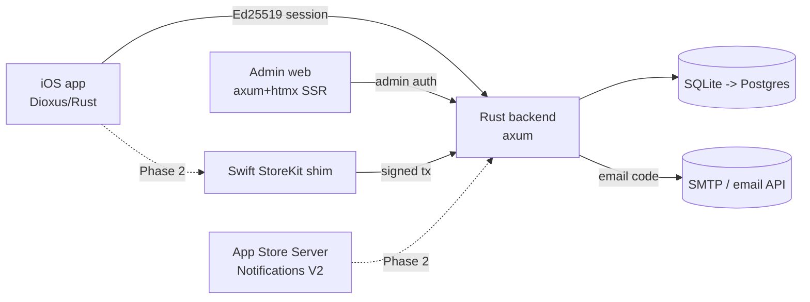
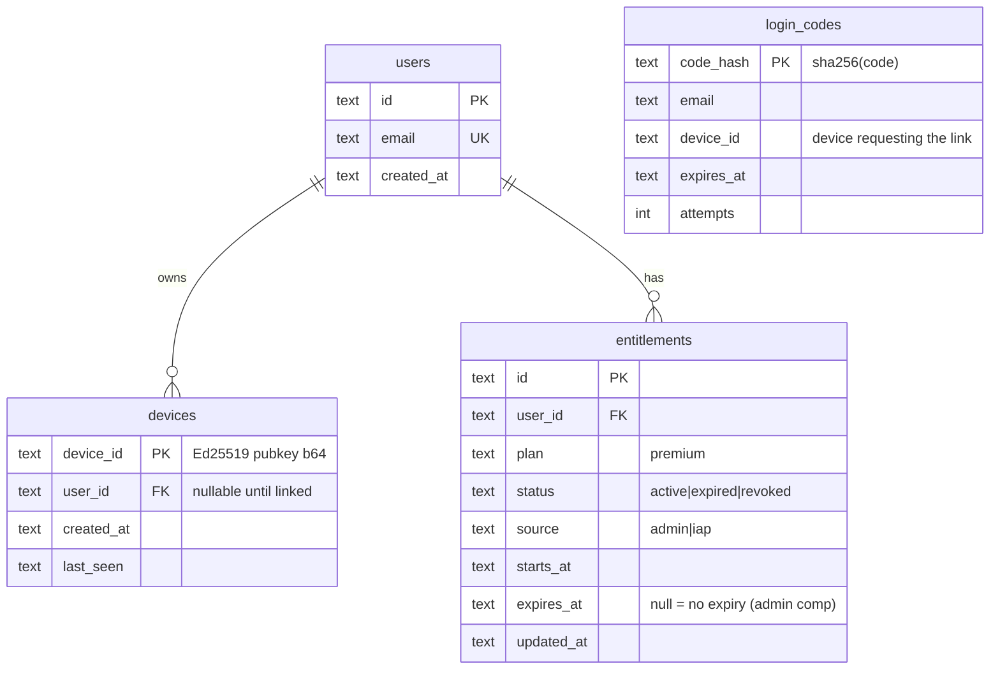
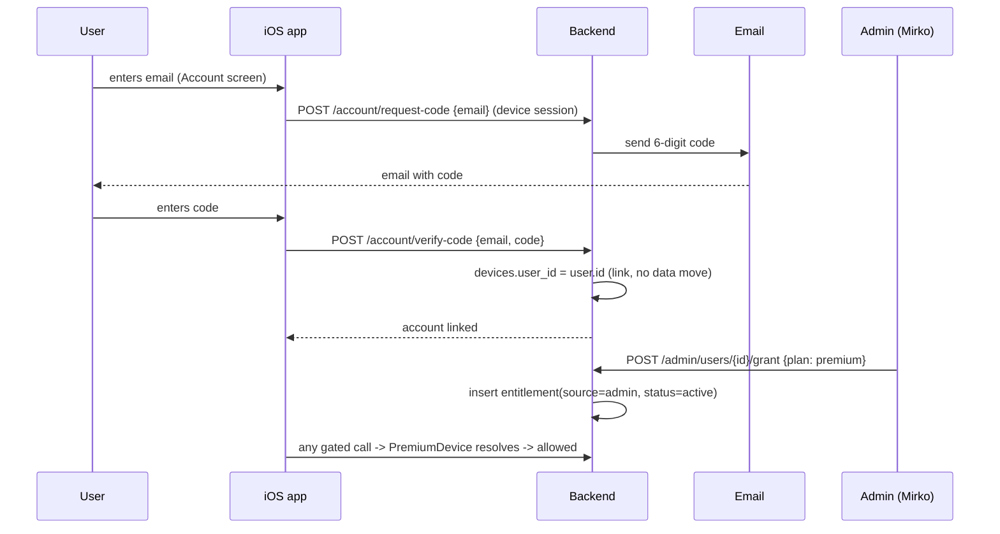
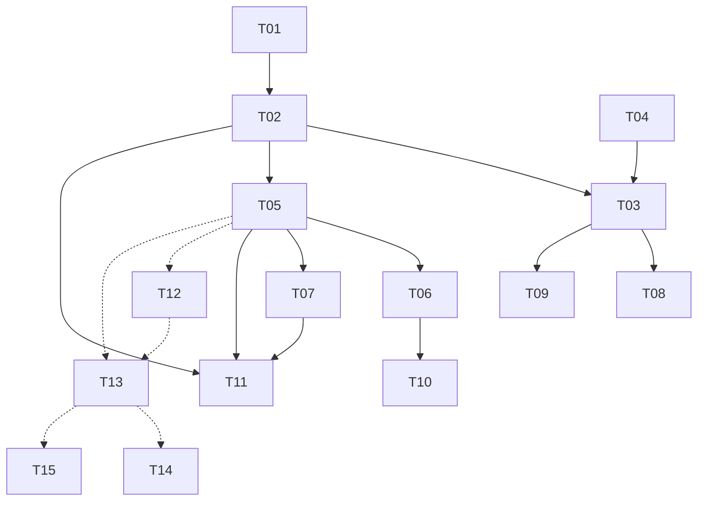
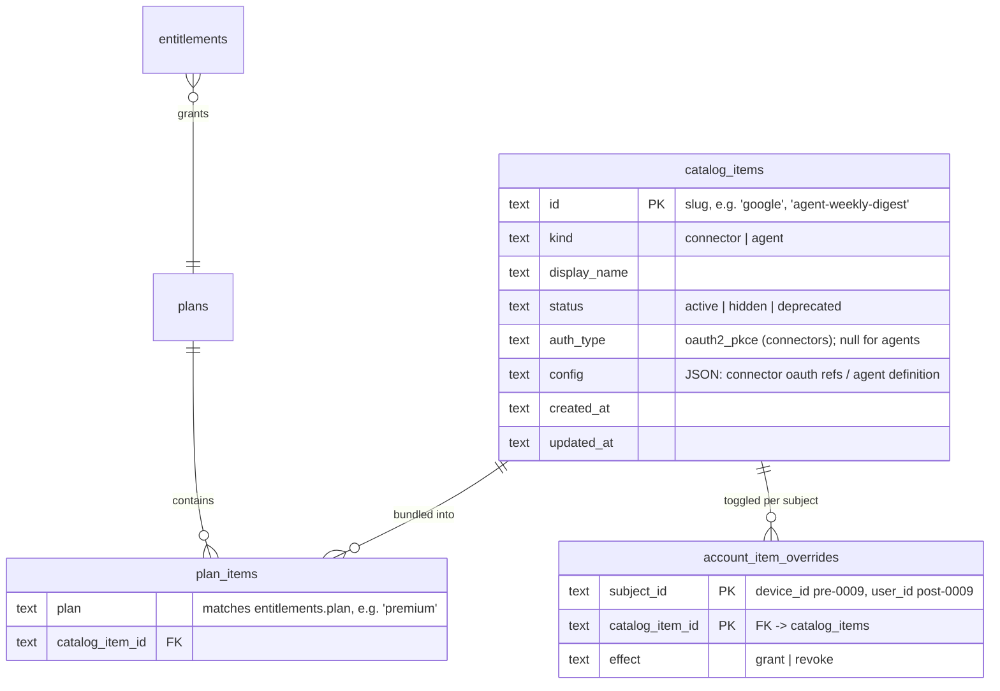
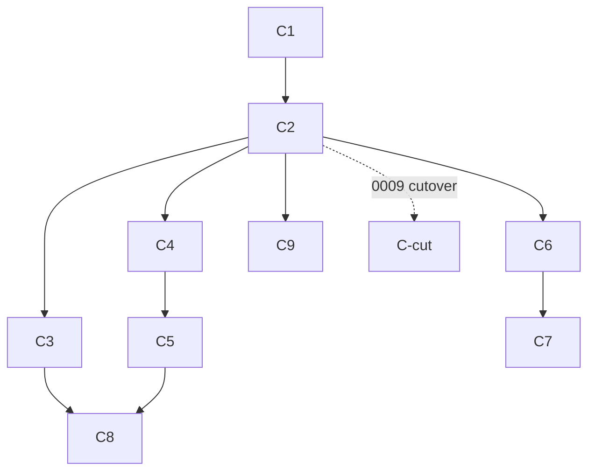

# 0009: User Accounts, Premium Entitlements, Admin Frontend & IAP

## 1. Summary

FlowFlow's premium gate is a manual env allowlist of device pubkeys (`PREMIUM_PUBKEYS`) - accountless, unscalable (one redeploy per user), and unmonetizable (Apple forbids selling premium any other way). This RFC makes premium **account-based**, in three phases:

- **Phase 0 - Bridge (already coded, #64 B2+B3):** the env allowlist makes Mirko (and any chosen pubkey) premium immediately, zero new build. Explicit, swappable stopgap.
- **Phase 1 - Real accounts + admin:** the web frontend is **TanStack Start**, which hosts **Better Auth** (accounts: email/magic-link/social/passkeys + admin plugin). The **Rust backend stays the source of truth for entitlements**: it verifies Better-Auth JWTs via JWKS and resolves `device -> user -> active entitlement` at the single existing seam `PremiumDevice`. The Ed25519 device identity is unchanged (device/transport layer); `devices.user_id` links a device to the account.
- **Phase 2 - Apple IAP:** self-serve premium via a Swift StoreKit shim + Rust server-side JWS validation + Server Notifications.

Two adversarial reviews found 7 blockers (premium theft via an unbound email code, brute force, a prod migration that re-runs base DDL, account deletion vs a live IAP sub, a fragile cutover). The frontend/auth decision (Better Auth owns login, mooting the hand-rolled Rust email-code) plus the §6bis revisions resolve all of them. Confidence: medium-high.

## 2. Context / Codebase

Two repos, both 100% Rust. The system is currently **accountless**: identity is a device-local Ed25519 keypair (TOFU). There is no `user` / `account` / `email` entity anywhere. Premium is an env allowlist of device pubkeys (a stopgap shipped under #64 B3).

### Affected modules - backend (`marketplace-flowflow`)
- `src/auth.rs`: Ed25519 challenge/verify handshake; TOFU device registration (`verify` upserts `devices`, mints sessions). `device_id` IS the base64 pubkey.
- `src/gate.rs`: `AuthedDevice` (session -> device_id) and `PremiumDevice` extractors. **`PremiumDevice` is the single premium seam** - today it checks `cfg.premium_pubkeys.contains(device_id)`.
- `src/state.rs`: `Config` (env-driven), holds `premium_pubkeys: HashSet<String>` from `PREMIUM_PUBKEYS`.
- `src/db.rs`: SQLite schema + `migrate()` (no migration framework; idempotent `CREATE TABLE IF NOT EXISTS`). Tables: `devices` (has unused `premium INTEGER` column), `nonces`, `sessions`, `oauth_states`, `connector_tokens`.
- `src/oauth.rs`: Google connector flow (authorize/callback/list/disconnect). Callback is now GET backend-redirect (#64 B2).

### Affected modules - app (`flowflow`)
- `src/services/backend/mod.rs`: `BackendClient`; `ensure_identity()` generates + persists the device keypair in SQLite settings (`backend_device_privkey` / `backend_device_pubkey`); challenge/verify/session handling.
- `src/ui/settings/connections.rs`: the ONLY backend-facing UI (backend URL field + connector connect/disconnect). No premium/account/login screen exists. The app discovers premium only as a 403 error string.

### Key symbols
- `PremiumDevice` (gate.rs): the entitlement decision point. Everything gated (`authorize`, `callback` exchange, `mcp_proxy`) depends on it.
- `auth::verify` (auth.rs): the only place a device becomes "known"; where account binding would attach.
- `db::migrate` (db.rs): schema evolution lives here; no versioned migrations yet.

### Prior art
- **RFC 0008** (Accepted) - MCP connectors / OAuth broker backend. Declares the two relevant Non-Goals: Non-Goal 1 "NOT building monetization. No IAP, paywall, billing, or StoreKit - separate future RFC" and Non-Goal 5 "NOT adding real user accounts / email signup. Anonymous per-device identity only, upgradeable later". **This RFC is that deferred future RFC.** Also finding 4: restore on a new device = orphaned identity, recovery via "encrypted key backup or an account binding" (deferred).
- **RFC 0004** (multidevice sync) - device pairing, version vectors, Noise transport. Relevant: it already reasons about multiple devices per human; an account is the natural N:1 owner of paired devices.
- **RFC 0001** (data backup/export) - identity recovery surface; account binding is an alternative recovery path.

### Greenfield
Users, entitlements/subscriptions, admin frontend, and IAP/StoreKit are **net-new**: no prior code. The only existing seams are `PremiumDevice` (swap target) and the unused `devices.premium` column (migration hook).

## 3. Problem & Motivation

### Current state
Premium is an env allowlist of device pubkeys (`PREMIUM_PUBKEYS`), checked in `PremiumDevice` (gate.rs). Identity is a device-local Ed25519 keypair; there is no `user` entity. To grant premium, the sole admin (Mirko) hand-edits an env var and redeploys the backend. To know who is premium, read the env. There is no signup, no captured user info, no admin surface, and no way for a user to purchase premium.

### Pain
- **Does not scale**: every premium grant = a manual env edit + redeploy by the only admin. O(1) ops per user, with downtime.
- **No person-level identity**: premium is bound to a device pubkey, not a human. A multi-device user is premium on one device only. Restore onto a new device = orphaned identity, premium lost (RFC 0008 finding 4).
- **No user info**: cannot capture email/profile, cannot contact, support, or segment users.
- **No monetization path**: premium cannot be sold; it is gated behind a manual allowlist. RFC 0008 deferred all IAP to "a future RFC" - this is it.
- **Admin = editing prod env**: granting/revoking access means touching infrastructure, not a UI.

### Why now
#64 / RFC 0008 just shipped real, user-facing premium gating (OAuth connectors), and the allowlist was shipped explicitly as a stopgap (`gate.rs` "a stopgap until a proper accounts/entitlements RFC"). Before onboarding any user beyond Mirko, the premium mechanism must become account-based: otherwise each new premium user is a manual redeploy and revenue is impossible.

### Signals
- No usage metric yet (pre-launch, single user).
- Current premium-grant cost = 1 manual env edit + 1 redeploy per user. Target = 0 manual ops (self-serve) or 1 click (admin UI), no redeploy.

## 4. Goals / Non-Goals

### Goals
1. **Account = stable identity** independent of any device; one account owns N devices (N:1 `device -> user`).
2. **Premium = an account entitlement** (a subscription state with status/expiry, not a boolean flag), resolved at the single existing seam `PremiumDevice`.
3. **Self-serve premium**: a user can become premium without anyone touching infra - via Apple IAP and/or an admin grant.
4. **Admin surface**: Mirko creates/lists users, grants/revokes premium, and sees captured profile info from a UI, never by editing env.
5. **Evolvable DB**: introduce versioned migrations; ship on SQLite, keep a clean path to Postgres at scale, with no schema rewrite.
6. **Non-breaking migration**: existing accountless devices keep working and can bind to an account later; the #64 B2 OAuth callback stays intact.

### Non-Goals
- We are NOT building a social graph, sharing, collaboration, or multi-tenant orgs. One account owns only its own data.
- We are NOT replacing the device Ed25519 keypair auth. It stays as the device/transport layer; accounts sit ON TOP, not instead.
- We are NOT building a billing/invoicing/tax engine (no Stripe/VAT/SCA in v1). Payments ride on Apple IAP; admin grants are free comps.
- We are NOT shipping an Android or web consumer app. The consumer app stays iOS; only the new admin tool is web.
- We are NOT re-keying the sync/connector crypto to the account. Identity *recovery* via account binding is in scope; re-encrypting existing ciphertext under an account-derived key is not.

## 5. Alternatives Considered

Decision axes bundled into coherent alternatives: (a) identity/login model, (b) how premium is provisioned (admin-grant vs Apple IAP), (c) admin surface, (d) self-hosted Rust vs managed vendor.

### Alt 0: Status Quo (env allowlist)
**Summary:** Keep `PREMIUM_PUBKEYS`. No accounts, no entitlements, no admin, no IAP.
**Cost of inaction:** Every premium user = a manual env edit + redeploy; premium bound to a device, not a person; no user info; no revenue; orphaned identity on device restore.
**Pros:** zero effort; zero new surface; already shipped.
**Cons:** unscalable (1 redeploy/user); unmonetizable (Apple forbids selling premium any other way - 3.1.1); no person identity; no admin; the pain in section 3 persists entirely.
**Reversibility:** n/a.

### Alt 1: Minimal - accounts + admin grant, NO IAP
**Summary:** Add `users`, nullable `devices.user_id`, `entitlements`. Premium is granted only by the admin (free comps) through a small admin API/UI. No purchase flow yet.
**How it solves:** kills the env hack, gives real person-level accounts + an admin surface (goals 1,2,4); device-link pattern (goal 6). Skips monetization.
**Pros:**
- Smallest step that removes the redeploy-per-user pain.
- No App Store risk: admin comps are allowed; no IAP to build/review.
- Pure backend + admin; the consumer app barely changes.
**Cons:**
- No self-serve / no revenue (goal 3 unmet). You still personally grant everyone.
- Login model still undecided - "account" may just be `email` captured by admin.
- Two trips to App Review later when IAP is bolted on.
**Cost:** low (backend tables + admin CRUD). **Reversibility:** easy (entitlements table stays when IAP added later).
**Refs:** Apple 3.1.1 (admin comps allowed; only *paid* unlock must be IAP).

### Alt 2: Standard SaaS - managed auth vendor + Apple IAP
**Summary:** Adopt a managed identity provider (Supabase Auth / Clerk / Firebase Auth) for accounts + Sign in with Apple/email, Apple IAP for self-serve premium, backend validates receipts, admin = the vendor dashboard + a thin custom panel.
**How it solves:** all goals, fastest to "real users + payments", offloads auth security to a vendor.
**Pros:**
- Battle-tested auth (password reset, email verification, anonymous->account linking built in - Firebase/Supabase do exactly our device->user link).
- Less code to own; vendor handles tokens, recovery, rate-limits.
- Account-linking pattern is first-class (guest device -> permanent account, no data migration).
**Cons:**
- New hard dependency on a third-party identity cloud - **against the project's privacy-first, self-hosted ethos** (the whole backend exists to avoid external clouds, per RFC 0008).
- Adds a JS/SDK surface and a vendor account model that doesn't speak Ed25519; two identity systems to reconcile.
- Data residency / lock-in; cost scales with MAU.
- Sign in with Apple becomes mandatory the moment a social provider is enabled (Apple 4.8).
**Cost:** medium (integration + reconciliation). **Reversibility:** hard - migrating off a managed auth vendor later is a one-way-door-ish slog.
**Refs:** Firebase/Supabase anonymous-auth account-linking docs; Apple 4.8.

### Alt 3: Rust-native - device-key bootstrap accounts + Apple IAP + Rust admin
**Summary:** Build accounts on the EXISTING Ed25519 device identity. `devices.user_id` nullable FK; an `account` is created by adding a recoverable credential (email magic-link or password) and linking the current device to it (the standard guest->permanent "account linking", no data migration). `entitlements` table is the premium source of truth. Self-serve premium via Apple IAP: a thin Swift StoreKit-2 shim in `src/ios/plugin/` (the seam RFC 0008 already reserved) sends the signed transaction to the backend, which validates it in Rust (`app-store-server-library`, JWS verify) and writes the entitlement; App Store Server Notifications V2 keep it fresh. Admin = a minimal Rust SSR web app (axum + askama/maud + htmx, ~no JS build) hitting an admin-scoped API. `PremiumDevice` resolves `device -> user -> active entitlement`.
**How it solves:** every goal, with one identity system (Ed25519 stays the device layer, account sits on top), fully self-hosted, privacy-first.
**Pros:**
- One identity model, no vendor; consistent with the self-hosted/privacy ethos and 100% Rust.
- Reuses the existing device keypair + the single `PremiumDevice` seam - not bancal, swap is one resolver.
- Email-only (no social login) keeps Sign in with Apple **optional** (Apple 4.8 exemption: "your company's own account setup and sign-in systems").
- Server-side receipt validation in Rust already has a crate; admin SSR has no JS toolchain.
- Account-linking = zero data migration for existing accountless devices (goal 6).
**Cons:**
- Most code to own: email delivery, magic-link/password security, IAP shim FFI, JWS validation, Server Notifications endpoint, admin app, auth for admin.
- StoreKit 2 is Swift-async; needs a small Swift shim compiled into the app (objc2-store-kit only cleanly exposes the deprecated StoreKit 1) - real but bounded FFI work.
- You carry auth-security responsibility (reset flows, token rotation - though the backend already does Ed25519/session rotation well).
- Bigger build; best split into phases (accounts+admin first, IAP second).
**Cost:** high (multi-phase). **Reversibility:** medium - tables + the `PremiumDevice` resolver are stable; the IAP shim is isolated and replaceable.
**Refs:** `objc2-store-kit` (StoreKit 1 deprecated, StoreKit 2 Swift-only); `app-store-server-library` Rust (JWS transaction verify); Apple 3.1.1 (IAP mandatory for paid unlock), 4.8 (SiwA only if social login), 5.1.2(v) (account creation -> must offer in-app account deletion); anonymous->permanent account-linking pattern (Firebase/Supabase/"data funnel").

### Cross-cutting note (applies to Alt 1 and Alt 3)
The phasing is natural: **accounts + entitlements + admin grant (Alt 1) is a strict subset of Alt 3.** Alt 3 = Alt 1 + Apple IAP self-serve. So Alt 1 is not a dead end - it is Phase 1 of Alt 3 if IAP is deferred until there is something to sell.

## 6. Proposed Design

**Base: Alt 3, phased.** Auth is Rust-native email + one-time code (no Node, no Better Auth in Phase 1 - revisit for social/passkeys later). Phase 1 = accounts + entitlements + admin grant. Phase 2 = Apple IAP.

### Architecture overview
The Ed25519 device identity is unchanged: it stays the device/transport layer. An **account** is a new layer on top. A device links to an account by verifying an email code; `devices.user_id` becomes non-null (standard guest->permanent account-linking, no data migration). Premium stops being "pubkey in env" and becomes "this device's account has an active entitlement", resolved at the single existing seam `PremiumDevice`. The admin app and (Phase 2) Apple IAP are two writers into the same `entitlements` table.



### Modules / files affected
| Path | Repo | Change | Why |
|------|------|--------|-----|
| `src/db.rs` | backend | modified | add versioned migrations; `users`, `entitlements`, `login_codes` tables; `devices.user_id` column |
| `src/account.rs` | backend | new | email-code request/verify, device<->account linking, account read/delete |
| `src/entitlement.rs` | backend | new | entitlement read/write; the `device -> user -> active entitlement` resolver |
| `src/gate.rs` | backend | modified | `PremiumDevice` calls the entitlement resolver instead of `premium_pubkeys` |
| `src/state.rs` | backend | modified | drop `premium_pubkeys`; add email + admin config |
| `src/email.rs` | backend | new | send the one-time code (SMTP via `lettre` or HTTP email API) |
| `src/admin/*` | backend | new | admin auth + SSR pages (list/view users, grant/revoke premium) |
| `src/lib.rs` | backend | modified | mount `/v1/account/*`, `/admin/*` routes |
| `src/services/backend/mod.rs` | app | modified | account API calls (request code, verify, get account, delete) |
| `src/ui/settings/account.rs` | app | new | Account screen: email, code entry, premium status, delete account |
| `src/ios/plugin/` | app | new (Phase 2) | Swift StoreKit-2 shim, C ABI for Rust |
| `src/iap.rs` | backend | new (Phase 2) | validate signed JWS tx (`app-store-server-library`), write entitlement |

### Data model

- **Migrations**: introduce a `schema_version` table + ordered migration steps (replace the current idempotent `CREATE TABLE IF NOT EXISTS` style with versioned, append-only migrations). `devices.user_id` added as nullable (`ALTER TABLE`), backfill = none (existing rows stay null = free tier). Forward-only; SQLite now.
- **Postgres-readiness**: keep all SQL portable (no SQLite-only constructs), timestamps as RFC3339 text as today, `sqlx` stays. Postgres is a connect-string + adapter swap when scale demands; not done now.
- `devices.premium` (legacy column) is dropped by the migration once the resolver ships.

### Entitlement resolver (the single seam)
`PremiumDevice` becomes:
```sql
SELECT 1 FROM devices d
JOIN entitlements e ON e.user_id = d.user_id
WHERE d.device_id = ?1
  AND e.status = 'active'
  AND (e.expires_at IS NULL OR e.expires_at > ?2);  -- ?2 = now
```
Null `user_id` (unlinked device) or no active entitlement -> `Forbidden`. Handlers (`authorize`, `callback` token exchange, `mcp_proxy`) are unchanged: they still just ask `PremiumDevice`.

### API contracts (Phase 1)
All `/v1/account/*` require the existing Ed25519 device session (Bearer). Email is the only PII captured.
- `POST /v1/account/request-code` `{email}` -> `204`. Creates/loads the user by email, stores a hashed 6-digit code (TTL 10 min, bound to the calling device), emails it. Rate-limited (reuse `ratelimit::layer`).
- `POST /v1/account/verify-code` `{email, code}` -> `{account: {email}}`. On match: set `devices.user_id`, delete the code. Wrong/expired code -> `401`; too many attempts -> `429`.
- `GET /v1/account` -> `{email, premium: bool, plan, expires_at}` (premium via the resolver). Lets the app show real premium status instead of guessing from a 403.
- `DELETE /v1/account` -> `204`. Unlinks devices, deletes the user + entitlements (Apple 5.1.2(v): in-app account deletion is mandatory when account creation exists).

Admin (separate auth, NOT the device session):
- `GET /admin/users`, `GET /admin/users/{id}` -> SSR HTML (htmx).
- `POST /admin/users/{id}/grant` `{plan, expires_at?}` -> writes `entitlement(source=admin)`. Mirko grants himself here = bootstrap, no env, no redeploy.
- `POST /admin/users/{id}/revoke` -> sets `status=revoked`.

No breaking change to existing device/connector endpoints; `PREMIUM_PUBKEYS` is removed (the #64 B3 bridge retires the day this ships).

### Flow: link account + become premium (Phase 1)


### Phase 2 (designed, deferred): Apple IAP self-serve
- App: a thin **Swift StoreKit-2 shim** in `src/ios/plugin/` (the seam RFC 0008 reserved) runs `Product.purchase`, hands the **signed transaction JWS** to Rust over a C ABI. (`objc2-store-kit` only cleanly exposes deprecated StoreKit 1; StoreKit 2 is Swift-async, hence the shim.)
- Backend `src/iap.rs`: validate the JWS with `app-store-server-library` (Apple root cert chain), then `INSERT entitlement(source=iap, status=active, expires_at=...)` for the device's user.
- `POST /v1/iap/notifications`: **App Store Server Notifications V2** webhook -> keep entitlement fresh on renew / cancel / refund / grace-period.
- Apple compliance: paid premium MUST go through IAP (3.1.1); admin grants remain free comps; email-only login keeps Sign in with Apple optional (4.8).

### Cross-cutting
- **Auth/authz**: device session unchanged. Account ops require a device session. Admin uses a separate credential (an `ADMIN_TOKEN` env gating `/admin/*`, or a small admin password session) - never the device session, never user-facing.
- **Email**: a transactional email sender is a new external dependency (the only new outbound). Provider TBD (open question). Minimize data: email only.
- **Observability**: log code-verify failures + admin grants/revokes (audit). Never log codes or emails in full.
- **Backwards compat**: existing accountless devices keep working as free tier; linking is opt-in; B2 OAuth callback untouched.
- **Rollout**: Phase 1 ships behind no flag (additive); the cutover from `PREMIUM_PUBKEYS` to the resolver happens when Mirko's account is admin-granted (so he never loses access).

### 6bis. LOCKED direction (frontend + auth) + review resolutions
A frontend decision (web = **TanStack Start**) and the adversarial review change the auth approach. This subsection supersedes the Phase-1 Rust email-code design in §6 and resolves §11.

**Auth & frontend (supersedes the Rust email-code flow):**
- The web frontend is **TanStack Start** (a JS runtime you run anyway). **Better Auth runs INSIDE it** (not a separate service): it owns accounts, email/magic-link/social/passkeys, sessions, and the admin plugin. This **moots** the hand-rolled Rust email-code flow and findings F1, F2, F3, F11, F14, F18 (Better Auth owns login security, account-creation timing, and session step-up).
- The **Rust backend stays the API/proxy/entitlement owner**. It verifies Better-Auth JWTs via the **JWKS endpoint** (stateless, no DB hit - the documented non-JS-backend pattern). `AuthedDevice` (Ed25519) stays the device/transport layer; the account is the verified JWT `sub` (Better Auth user id), stored as `devices.user_id`.
- The **iOS Dioxus app** calls Better Auth's REST sign-in endpoints over HTTP, gets a JWT, and presents it to the Rust backend alongside its Ed25519 device session.
- **Bridge (Phase 0, already coded as #64 B2+B3):** the `PREMIUM_PUBKEYS` env allowlist makes Mirko (and any chosen pubkey) premium IMMEDIATELY with zero new build, until the TanStack Start + Better Auth frontend exists. Explicit, swappable stopgap; the resolver replaces it at cutover (R8).
- **Admin** = Better Auth admin plugin (user management) in TanStack Start + a thin **admin-scoped Rust API** for entitlement grant/revoke, gated by the Better Auth admin role (JWT claim), with CSRF on the TanStack Start side and an audit log. Resolves F9/F10: no separate Rust SSR app, no second db-writing process; grants flow through the JWT-verified Rust API.

**Entitlements & data (Rust-owned):**
- **R4 (F12,F24)** No `unique(user_id, plan)`; `entitlements` gains `original_transaction_id`; admin upsert by `(user_id, source='admin', plan)`; IAP by `original_transaction_id`; premium = EXISTS active non-expired row.
- **R3 (F4)** Connectors stay per-device in Phase 1; re-keying `connector_tokens` to `user_id` is explicit future work.
- **R10 (F21)** Resolver adds `AND d.user_id IS NOT NULL`.
- **R11 (F17)** Same-email re-link attaches the new `device_id` to the existing user; old row + connectors are cleaned.

**Migrations & ops (Rust backend):**
- **R5 (F6,F8,F13,F9)** Baseline-aware migration runner (stamp existing prod as baseline, forward-only after); each step transactional + `schema_version` bump in the same txn; `DROP COLUMN` guarded on SQLite >= 3.35 else table-rebuild; the `devices.premium` drop ships in the SAME release as the `auth::verify` INSERT change; pool sets `journal_mode=WAL` + `busy_timeout`.

**Cutover, deletion, IAP:**
- **R8 (F7,F20)** Keep `PREMIUM_PUBKEYS` + OR-branch as the default through cutover; drop (T10) gated on a verified LIVE `200` for Mirko; keep env >= 2 releases; emergency re-enable documented.
- **R9 (F5,F19)** `DELETE /account` (Better Auth) cascades: Better Auth purges email/PII; Rust purges entitlements + `connector_tokens` (upstream revoke first) + device sessions and nulls `devices.user_id`; an active IAP sub surfaces "Manage Subscription" and a tombstone keyed by `original_transaction_id`.
- **R12 (F15,F16)** Phase 2: account link required before purchase; entitlement keyed by `original_transaction_id`; add "Restore Purchases" + "Manage Subscription".

## 7. Drawbacks & Risks

### Drawbacks (inherent)
- **New outbound dependency**: a transactional email sender (the first new external service since the backend was built to avoid clouds). The only new egress.
- **PII enters the system**: email addresses are now stored. Brings data-handling duty (deletion is designed; obligations still grow).
- **More security-critical surface to own**: email codes, account linking, an admin app with its own auth. Auth bugs here = account takeover or free premium.
- **Migration discipline**: switching to versioned migrations means schema changes are append-only, no more editing `CREATE TABLE` in place.
- **Second deployable** (admin SSR app) to run and protect on Dokploy.
- **Phase 2 only**: a Swift shim is the first non-Rust code in the app + an FFI boundary.

### Risks (probabilistic)
| Risk | Likelihood | Impact | Mitigation |
|------|-----------|--------|------------|
| Email-code brute force (6 digits) -> account takeover | medium | high | hash codes at rest; 10-min TTL; attempts cap + lockout; rate-limit; bind code to the requesting device |
| Weak/exposed admin auth -> anyone grants premium | low | critical | strong `ADMIN_TOKEN`, separate path, never user-reachable, rate-limited, audit log; optional IP allowlist |
| Email deliverability (spam / provider down) -> users can't link | medium | medium | reputable provider w/ SPF/DKIM/DMARC; "resend"; admin can grant without email as fallback |
| Prod SQLite migration (`ALTER devices`) corrupts data | low | high | back up the db file before migrate; forward-only; dry-run on a copy |
| Losing premium during `PREMIUM_PUBKEYS` -> resolver cutover | low | high | admin-grant Mirko's account BEFORE removing the env; keep env as OR-fallback for one release, then drop |
| Account-link hijack (bind wrong email/device) | low | high | code emailed to prove email control AND bound to the requesting device; only that device can verify |
| Two writers (admin + IAP) double-write entitlement | low | medium | `unique(user_id, plan)`; `source` column; IAP Server Notifications authoritative for `source=iap` rows |
| StoreKit-2 Swift shim FFI crash (Phase 2) | medium | medium | isolate in `src/ios/plugin/`; validate server-side regardless; Phase 2 is deferred |

### Rollout / rollback
- **Rollout**: Phase 1 is additive, no flag. Ship migrations + account + admin; backfill = none (existing devices stay free). Admin-grant Mirko. THEN swap the `PremiumDevice` resolver, keeping `PREMIUM_PUBKEYS` as an OR-fallback for exactly one release.
- **Rollback**: revert the gate swap to fall back to the env allowlist (kept set during transition). Migrations are forward-only -> rollback of schema = restore the pre-migrate db backup. The only destructive migration is dropping the unused `devices.premium` column (do it last, separate release).
- **Gating metrics**: email-code verify success rate; zero new auth errors on existing (unlinked) devices; Mirko's admin-granted account passes every gated call before the env is removed.

## 8. Open Questions

| # | Question | Owner | Deadline |
|---|----------|-------|----------|
| 1 | Email provider: SMTP via `lettre` vs HTTP API (Resend/Postmark/SES) - deliverability, cost, privacy | Mirko | before the email task |
| 2 | Admin auth shape: single `ADMIN_TOKEN` env vs small admin-password session vs + IP allowlist | Mirko | before the admin task |
| 3 | Existing accountless devices: prompt them to link, or stay silently free? | Mirko | before the app-UI task |
| 4 | Plan shape: one "premium" plan now, or tiers from day one (affects `entitlements.plan`) | Mirko | before the schema task |
| 5 | Cutover: keep `PREMIUM_PUBKEYS` one release as fallback, or hard cut | Mirko | before the gate swap |
| 6 | Phase 2 trigger: when does IAP start (needs a sellable plan + App Store Connect setup) | Mirko | Phase 2 start |

## 9. Recommendation & Rationale

**Recommendation:** Adopt the **§6bis LOCKED direction**, phased:
- **Phase 0 (bridge, already coded):** `PREMIUM_PUBKEYS` env allowlist (#64 B2+B3) -> Mirko premium now, zero new build.
- **Phase 1 (real):** accounts + admin via **TanStack Start + Better Auth** (the JS frontend, hosting auth); the **Rust backend verifies the Better-Auth JWT via JWKS** and owns the `entitlements` resolver at the single `PremiumDevice` seam. No hand-rolled Rust auth.
- **Phase 2:** Apple IAP self-serve.

The original §6 Rust email-code design is superseded by §6bis (Better Auth owns login once the JS frontend exists).

**Confidence:** medium-high. The seam (`PremiumDevice`) and the Ed25519 device layer are unchanged; auth is offloaded to a maintained framework that lives in the frontend you are building anyway; the real unknowns (Better-Auth<->Ed25519 glue, StoreKit shim) are isolated and Phase 2 is deferred. The env bridge means there is no window without premium for Mirko.

### How it hits the goals
| Goal | Mechanism (section 6) |
|------|-----------------------|
| 1. Account = stable identity | `users` table; `devices.user_id` N:1; account-linking by email code |
| 2. Premium = entitlement | `entitlements` (status + expiry + source), not a flag |
| 3. Self-serve premium | Phase 2 Apple IAP writes `source=iap` (Phase 1 = admin comp) |
| 4. Admin surface | Rust SSR admin app: list/view users, grant/revoke |
| 5. Evolvable DB | versioned migrations + Postgres-portable SQL; SQLite now |
| 6. Non-breaking migration | nullable `user_id`, opt-in linking, B2 OAuth callback untouched |

### Why not other alternatives
- **Alt 0 (status quo):** rejected - one redeploy per premium user, premium bound to a device not a person, and Apple forbids selling premium any other way (3.1.1).
- **Alt 2 (managed auth vendor):** rejected - a third-party identity cloud directly contradicts the reason this backend exists (self-hosted, no external cloud), adds lock-in, and forces reconciling two identity models (vendor user vs Ed25519 device).
- **Better Auth (Node sidecar):** deferred, not rejected - it would add a second runtime and break 100% Rust for a Phase 1 that only needs email->account. Its value (social, passkeys, 2FA, admin UI) arrives later; revisit then.

### Revisit if
- Social login / passkeys / 2FA become required -> reconsider Better Auth as a Node sidecar rather than hand-rolling.
- Scale outgrows single-box SQLite -> Postgres (and possibly managed auth).
- Email-code conversion/UX underperforms -> magic-link via universal link, or social login.

## 10. Implementation Plan

### Tasks - Phase 1 (accounts + entitlements + admin)
| ID | Title | Files | Depends on | Effort | Accept criteria |
|----|-------|-------|------------|--------|-----------------|
| T01 | Versioned migration runner | `src/db.rs` | none | S | `schema_version` table; migrations run ordered + once; recorded |
| T02 | Schema: users, entitlements, login_codes, devices.user_id | `src/db.rs` | T01 | S | tables exist; FKs valid; `devices.user_id` nullable; backfill none |
| T03 | Account module: request/verify code + device link | `src/account.rs`, `src/lib.rs` | T02, T04 | M | request stores hashed code + emails it; verify sets `user_id`; wrong/expired -> 401; attempts cap -> 429 |
| T04 | Email sender | `src/email.rs`, `src/state.rs` | none | S | sends a code to an address via configured provider; failure surfaced, not panicked |
| T05 | Entitlement module + resolver | `src/entitlement.rs` | T02 | S | resolver true only for active, non-expired entitlement of the device's user |
| T06 | Swap PremiumDevice to resolver (env OR-fallback) | `src/gate.rs`, `src/state.rs` | T05 | S | active entitlement -> 200; none -> 403; env fallback works for one release |
| T07 | Admin SSR app: auth + list/view + grant/revoke | `src/admin/*`, `src/lib.rs` | T05 | M | `ADMIN_TOKEN` gates `/admin`; grant writes entitlement; unauth -> 401; actions audit-logged |
| T08 | App Account screen | `src/ui/settings/account.rs`, `src/services/backend/mod.rs` | T03 | M | link flow works on device; premium status shown; delete present |
| T09 | Account read/delete endpoints + app wiring | `src/account.rs`, `src/services/backend/mod.rs` | T03 | S | GET returns premium status; DELETE unlinks + purges (Apple 5.1.2(v)) |
| T10 | Retire bridge: drop devices.premium + PREMIUM_PUBKEYS | `src/db.rs`, `src/gate.rs`, `src/state.rs` | T06 | XS | env gone, column dropped, tests green (separate release, post-cutover) |
| T11 | Tests: link, brute-force lockout, resolver, admin, migration | `tests/integration.rs` | T02-T07 | S | integration suite green offline |

### Tasks - Phase 2 (Apple IAP, deferred)
| ID | Title | Files | Depends on | Effort | Accept criteria |
|----|-------|-------|------------|--------|-----------------|
| T12 | Swift StoreKit-2 shim + C ABI | `src/ios/plugin/*` | T05 | L (split at Phase 2 planning) | `Product.purchase` returns signed tx JWS to Rust |
| T13 | Backend IAP validation -> entitlement | `src/iap.rs`, `src/lib.rs` | T05, T12 | M | valid JWS -> `entitlement(source=iap)`; invalid -> reject |
| T14 | Server Notifications V2 webhook | `src/iap.rs`, `src/lib.rs` | T13 | M | renew/cancel/refund update entitlement |
| T15 | App Store Connect product + paywall UI | `src/ui/settings/account.rs` | T13 | S | reviewer can load the IAP on the paywall |

### Dependency graph


### Verification
- **Unit/integration** (T11): account link happy path; code wrong/expired/too-many; resolver active vs expired vs unlinked; admin auth pass/fail; migration up.
- **Manual on device** (T08): email -> code -> linked -> admin grant -> gated call passes; account deletion.
- **Phase 2**: sandbox StoreKit purchase -> server validates -> entitlement; Server Notification replays update status.

### Phasing note
Critical path Phase 1: T01 -> T02 -> T03 -> T08, with T04/T05/T07 parallel. Phase 1 is fully shippable and unblocks "Mirko + chosen users premium via admin" with no env. Phase 2 (IAP) starts only when there is a sellable plan + App Store Connect setup (open question 6).

### Plan revision (post frontend/auth decision - authoritative)
The task table above is superseded where it conflicts; the tasks that built a Rust email-code + Rust SSR admin (T03, T04, T07 in their original form, plus the email findings) are replaced by Better-Auth integration. The phases are:

**Phase 0 - Bridge (DONE, uncommitted):** #64 B2 (callback GET) + B3 (`PREMIUM_PUBKEYS`). Action: commit + deploy + set Mirko's pubkey in the env -> premium now. No further build.

**Phase 1 - Real accounts/admin (Rust backend + TanStack Start/Better Auth):**
| ID | Title | Where | Depends on | Effort |
|----|-------|-------|------------|--------|
| P1.1 | Baseline-aware migrations + WAL/busy_timeout; `users`, `entitlements` (+`original_transaction_id`), `devices.user_id`; drop `devices.premium` WITH the `auth::verify` INSERT change | backend | none | M |
| P1.2 | Verify Better-Auth JWT via JWKS; "link device" maps JWT `sub` -> `devices.user_id` | backend | P1.1 | M |
| P1.3 | Entitlement resolver in `PremiumDevice` (account-level, `user_id IS NOT NULL`), `PREMIUM_PUBKEYS` OR-fallback | backend | P1.1 | S |
| P1.4 | Admin entitlement API (grant/revoke), gated by Better-Auth admin role + audit | backend | P1.2,P1.3 | S |
| P1.5 | TanStack Start app + Better Auth (email/magic-link, admin plugin) | frontend (new) | none | L (split) |
| P1.6 | iOS: sign in via Better-Auth HTTP -> JWT; account screen; premium status; delete account (Apple 5.1.2(v)) | app | P1.2 | M |
| P1.7 | Cutover + retire env/column, gated on verified live `200` for Mirko (>= 2 releases) | backend | P1.3,P1.4,P1.6 | S |

**Phase 2 - Apple IAP (deferred):** Swift StoreKit-2 shim (XL, spike-first) -> Rust JWS validation (`app-store-server-library`, keyed by `original_transaction_id`) -> Server Notifications V2 webhook -> "Restore Purchases" + "Manage Subscription". Link required before purchase.

Moot after this revision: §11 findings F1, F2, F3, F11, F14, F18 (Better Auth owns login/sessions). Still in force: F4, F5, F6, F7, F8, F9, F12, F13, F16, F17, F19, F20, F21 (Rust-side entitlements/migrations/cutover/deletion/IAP), resolved in §6bis.

## 11. Review Findings

**Reviewers:** two adversarial subagents (`general-purpose`): a gap-hunter and an impl-realism critic, both verified against the live code.
**Date:** 2026-06-21

| # | Severity | Section | Issue | Suggestion |
|---|----------|---------|-------|------------|
| 1 | BLOCKER | §6 verify-code | No device binding: `verify-code` matches `{email, code}` only, nothing ties the verifying device to the one that requested. Any device that learns the 6-digit code links ITS OWN `device_id` to the victim's account and inherits premium. | Resolve `AuthedDevice` from the Bearer session; require it equals `login_codes.device_id`; reject otherwise. |
| 2 | BLOCKER | §6 / §7 brute force | Rate limit is IP-only (`ratelimit.rs` is `HashMap<IpAddr>`); 6 digits = 10^6; IP rotation/CGNAT defeats it; the `attempts` column is never enforced. | Per-`email` and per-`device_id` attempt counter, hard lockout after ~5, delete the code on lockout; do not rely on IP rate limit. Longer/random code. |
| 3 | BLOCKER | §6 data model | `login_codes` PK = `code_hash`: two users generating the same 6-digit code collide on INSERT or overwrite each other's pending code. | PK = `(email, device_id)` or a random `request_id`; `code_hash` becomes a column. |
| 4 | BLOCKER | §6 / §2 | Linking sets `devices.user_id`, but `connector_tokens` / `oauth_states` / the resolver stay keyed by `device_id`. Connectors do NOT follow the account, contradicting Goal 1 ("one account owns N devices"). | Decide explicitly: connectors stay per-device (document it) OR re-key `connector_tokens` to `user_id`. Resolve the cross-device connector story. |
| 5 | BLOCKER | §6 DELETE /account | Deletion ignores active Phase-2 IAP subs and `connector_tokens`. Deleting an account with a live Apple auto-renewable sub leaves renewals/Server Notifications for a vanished user; connectors are not purged (right-to-erasure). | Define deletion-with-active-sub (tombstone keyed by Apple `originalTransactionId` or block until managed); purge `connector_tokens`; actually purge the email (PII), not just null the link. |
| 6 | BLOCKER | §10 T01 / §6 migrations | The versioned runner assumes a fresh `schema_version`; prod was built with `CREATE TABLE IF NOT EXISTS` and has none. On first deploy it re-runs base-table creation against tables already holding prod data. | Baseline-detect: if base tables exist and `schema_version` is empty, stamp the baseline version without running DDL, then apply only forward steps. |
| 7 | BLOCKER | §10 T06 / §7 rollback | The env OR-fallback only works if `PREMIUM_PUBKEYS` is still set, but the cutover depends on the whole link+admin+email chain working first. If any link breaks at deploy and the env was trimmed, Mirko loses premium with no path back but redeploy. | Keep the env populated and the OR-branch live as the default for the cutover release; gate removal (T10) behind a verified LIVE check that the resolver returns 200 for Mirko. |
| 8 | MAJOR | §6 / §10 | `auth::verify` (`auth.rs:97`) hardcodes `INSERT INTO devices (device_id, premium, ...)`. T10 drops `devices.premium` without touching `auth.rs`, so post-drop every device registration INSERT fails. | Change the `verify` INSERT in the same release that drops the column; add `auth.rs` to T10 + a test that registration still works post-drop. |
| 9 | MAJOR | §6 / §10 | Prod SQLite runs `max_connections(5)` with no WAL and no `busy_timeout`. A second admin process writing the same db file + account/code writes -> `SQLITE_BUSY`. | Set `journal_mode=WAL` + `busy_timeout`, AND run the admin app inside the same axum process (not a second deployable). |
| 10 | MAJOR | §6 / §7 admin auth | Single static `ADMIN_TOKEN` on `/admin/*` with no session, rotation, CSRF on grant/revoke POSTs, or lockout = one secret = takeover of the premium-granting surface. | Server-set httpOnly admin session behind a login; CSRF tokens on state-changing forms; audit log with actor; IP allowlist. No raw shared bearer. |
| 11 | MAJOR | §6 request-code | `request-code` "creates/loads the user by email" = an unauthenticated-email account-creation + spam-amplification primitive (mails arbitrary victims; enumerates emails). | Create the `users` row only on successful verify; rate-limit per email; do not reveal whether an email exists. |
| 12 | MAJOR | §6 / §7 entitlements | `unique(user_id, plan)` would drop legitimate rows: an admin comp + an IAP sub for the same plan are two valid rows; second writer's INSERT fails (e.g. IAP renewal vs existing comp). | Drop the unique-on-`(user_id, plan)`; resolve "is premium" by any active row / `MAX(expires_at)`; IAP upsert keyed by Apple `originalTransactionId`, admin by its own id. |
| 13 | MAJOR | §6 migrations | SQLite `DROP COLUMN` needs >=3.35; forward-only runner has no down-path; a half-applied multi-statement migration advances schema with no version bump and re-runs next boot. | Wrap each migration step in a single transaction and bump `schema_version` inside it (SQLite has transactional DDL); verify the SQLite version supports DROP COLUMN or use table-rebuild. |
| 14 | MAJOR | §6 sessions | Post-link, the device session is unchanged; a stolen long-lived device session now also grants account-level destructive ops (delete account). No step-up. | Account-scoped destructive ops (delete) require a fresh email code / recent link, not just the long-lived device session. |
| 15 | MAJOR | §6 Phase 2 | Purchase-before-link: a fresh-install/restore purchase happens before the device is linked (`user_id` null); the IAP entitlement has no user, and the resolver returns Forbidden for a device that just paid. | Force account link before purchase, OR bind the IAP entitlement to `device_id` / `originalTransactionId` and migrate it to the user on link. |
| 16 | MAJOR | §6 Phase 2 / Apple | Missing "Restore Purchases" and "Manage Subscription" deep link; Apple rejects IAP apps lacking Restore. | Add Restore-purchases + Manage-Subscriptions to Phase 2 scope (T15). |
| 17 | MAJOR | §6 / §2 | Device re-key/restore (RFC 0008 finding 4) leaves the old `device_id` row + its connectors orphaned; "account recovery" (a stated motivation) is only half-solved (new device re-links, old row dangles). | Define the re-key path: same-email re-link attaches the new `device_id` to the existing user; specify cleanup/merge of the old row + connectors. |
| 18 | MINOR | §6 resend | Concurrent/`resend` `request-code` for the same email+device has no defined upsert; two valid codes widen the brute window. | Invalidate the prior code for that `(email, device)` on a new request; single active code. |
| 19 | MINOR | §6 / privacy | Email is now stored PII rendered in admin SSR HTML; no retention policy or App Store privacy-label/GDPR note. | Email never in logs; add retention policy; update App Store privacy disclosures (email, linked to identity). |
| 20 | MINOR | §6 / §7 rollback | Rollback relies on the env kept "during transition" but T10 drops it after one release; a bug after T10 has no fallback and migrations are forward-only. | Keep `PREMIUM_PUBKEYS` for >=2 releases past the resolver, or add a documented emergency re-enable path. |
| 21 | MINOR | §6 resolver | Resolver relies on SQL NULL-never-equal to exclude unlinked devices; an orphaned `entitlement.user_id = NULL` would silently never match, masking integrity bugs. | Add `d.user_id IS NOT NULL` explicitly; FK/assertion against orphaned entitlements in T11. |
| 22 | MINOR | §10 T10 | Removing the `Config.premium_pubkeys` field breaks every `Config { .. }` literal (e.g. `tests/integration.rs:37`). | List `tests/integration.rs` in T10; update the literal + premium seeds in lockstep. |
| 23 | NIT | §10 T12 | The Swift StoreKit-2 shim + C ABI into the `dx` iOS build (first non-Rust code, xcframework/build-script wiring, async-Swift->sync-C) is rated "L" but is realistically XL and the dominant Phase-2 risk. | Reclassify T12 as XL/spike; front-load a "hello from Swift over C ABI in the dx build" proof before the StoreKit design. |
| 24 | NIT | §6 admin grant | SSR grant form has no idempotency guard; double-submit creates duplicate entitlements (absent the now-removed unique). | Idempotency key or upsert-by-(user_id, source=admin, plan) for admin grants. |

### Counts
- BLOCKER: 7
- MAJOR: 10
- MINOR: 5
- NIT: 2

### Disposition
All 7 BLOCKERs and the structural MAJORs are resolved in **§6bis Design revisions (post-review)** below; the impl plan (§10) and open questions (§8) are updated accordingly. None were waived.

## 12. Extension: Connector/Agent Catalog & Per-Account Entitlement Resolution

> Added 2026-06-21. This section extends the entitlement model of §6bis. Where §6bis made premium an account-level boolean ("EXISTS an active entitlement row"), §12 generalizes it into a **DB-driven catalog** of connectors and agents plus **per-account, per-item** resolution. Repo: backend `marketplace-flowflow`, app `flowflow`.

### 12.1 Problem

The connector layer is hardcoded to one provider:
- `oauth::list` (`/v1/connectors`) returns a fixed one-element vec `[{provider:"google", name:"Google Sheets"}]`. It does not read any catalog and does not consider who is asking.
- Routes are per-provider string literals: `/v1/connectors/google/authorize`, `/v1/connectors/google/callback`, `DELETE /v1/connectors/google`. `oauth.rs` hardcodes Google's scopes/endpoints; `proxy.rs` hardcodes one `sheets_mcp_url`.
- Access is a single global boolean (`devices.premium`): a device is either premium-for-everything or nothing. There is no notion of "this account gets connector A and agent B, that account gets only connector A".

This blocks the locked marketplace vision (`docs/vision/marketplace-agents.md`: accounts -> entitlements -> connectors/agents, toggleable per account). Every new connector or agent today means new Rust code + a redeploy, and there is no per-account control surface.

### 12.2 Goals / Non-Goals (extension)

**Goals**
1. **Catalog in DB**: connectors and agents are rows, not code. Adding/hiding one is a DB write, not a redeploy.
2. **Per-account resolution**: `/v1/connectors` (and a catalog view) returns exactly the items the calling account is entitled to, with per-connector connection status.
3. **Hybrid entitlements**: a plan bundles a default set of items; per-account overrides grant or revoke individual items on top (chosen fork, §12.3).
4. **Generic OAuth**: the per-provider hardcode is lifted into catalog rows; one generic handler serves any OAuth2+PKCE connector (chosen fork, §12.3).
5. **Ship on the existing seam**: build now keyed on the live device seam; flip the key to account at the 0009 cutover, reusing the §6bis R3/F4 device->user re-key (chosen fork, §12.3). No dependency on the unbuilt accounts frontend.

**Non-Goals**
- NOT building the Connections UI redesign here. This RFC is the model; the visual redo of `src/ui/settings/connections.rs` is a separate `/ship` (per the locked decision: model first, UI after).
- NOT supporting non-OAuth2 auth shapes (API-key, basic) in v1. The generic flow targets OAuth2 authorization-code + PKCE + refresh-token (the only shape that exists today). `auth_type` discriminates; other shapes are rejected at catalog-write and deferred.
- NOT moving agent *execution* server-side. Agents keep running app-side (note-as-action via rig). The backend resolves agent *entitlement* and serves the catalog; the app surfaces/gates accordingly. Server-side agent execution is future work.
- NOT re-keying connector storage in this RFC independently. The device->account re-key rides the single §6bis R3/F4 migration, not a second one.

### 12.3 Alternatives (the three forks, decided)

**Fork A - entitlement granularity.** (a) Plan-bundle: premium = one fixed set, same for everyone; weakest fit for "piloté par compte". (b) Per-item per account: each account independently toggled; honest marketplace, but no shared default. (c) **Hybrid [CHOSEN]**: a plan supplies the default bundle, per-account overrides grant/revoke individual items. Picked because the marketplace vision requires per-account toggles AND a launch needs a sane default bundle without enumerating every account; the cost is one extra reconcile step (precedence rules, §12.4).

**Fork B - sequencing vs accounts.** (a) **Ship on the seam now [CHOSEN]**: build the catalog + resolver keyed on the existing gate subject (`device_id` today), flip to `user_id` at the 0009 cutover via the same R3/F4 re-key. (b) Block on 0009 Phase-1 accounts first. Picked (a) because 0009 accounts depend on the heavy TanStack+Better-Auth frontend that does not exist; the `PremiumDevice` seam already resolves per-subject, so the catalog can ride it immediately and inherit accounts later through one swap.

**Fork C - de-hardcoding depth.** (a) **Catalog-driven generic OAuth [CHOSEN]**: lift Google's constants into the catalog row; routes become `/v1/connectors/{slug}/...`; one generic handler. (b) DB-drive `list` only, keep coded per-provider flows. Picked (a) because a `list` that advertises connectors the backend cannot actually OAuth into is hollow; Google's handler is already ~90% generic (only scopes/endpoints/the proxy target are provider-specific, all of which move cleanly into a catalog row).

### 12.4 Design

#### Data model (3 new tables; reuses §6bis `entitlements`)



- **`catalog_items.config` is JSON** (`ponytail:` single table + JSON config, not kind-specific columns or two tables - the connector and agent shapes differ and will evolve; upgrade path is typed columns only if the JSON proves unqueryable). Admin-authored, backend-read; never user input.
  - connector config: `{ auth_endpoint, token_endpoint, revoke_endpoint, scopes, client_id_env, client_secret_env, mcp_url }`.
  - agent config: `{ tools: [...], system_prompt_ref, model }`.
- **Secrets never enter the DB.** Config stores the *env-key name* (`client_secret_env: "GOOGLE_CLIENT_SECRET"`), and the backend resolves the value from env/vault at runtime. A catalog write that contains a value at a `*_env` position (heuristic: looks like a secret, not an identifier) is rejected (§12.6 risk).
- **`plans`** can stay implicit (a plan is just the string in `entitlements.plan` + its `plan_items` rows); a `plans` table is optional metadata, not required for resolution.

#### Entitlement resolution (hybrid)

For a gate subject, the set of accessible items is:

```
entitled(subject) =
    ( ⋃ plan_items[p]  for each plan p active for subject )   -- base bundle
    ∪ { i : override(subject, i) = 'grant' }                   -- per-account add
    \ { i : override(subject, i) = 'revoke' }                  -- per-account remove
accessible(subject) = { i ∈ entitled(subject) : catalog_items[i].status = 'active' }
```

Precedence, fixed: **revoke beats grant**; **`status='active'` is the final hard filter** (a revoked-or-hidden item is never accessible even if a plan bundles it). A grant of a hidden/deprecated item is a no-op until the item is reactivated. A revoke of an item not in any plan is a harmless no-op. These edge cases are in the test matrix (§12.7 C9).

Single resolving query (connector view):

```sql
-- accessible connectors for a subject, with connection status
SELECT c.id, c.kind, c.display_name,
       (t.device_id IS NOT NULL) AS connected, COALESCE(t.scopes,'') AS scopes
FROM catalog_items c
LEFT JOIN connector_tokens t
       ON t.provider = c.id AND t.device_id = ?dev   -- token column stays `device_id` (E1); connection
                                                      -- status is per CALLING device, distinct from ?1 subject
WHERE c.status = 'active' AND c.kind = 'connector'
  AND c.id IN ( /* entitled(?1): plan_items of active plans, ∪ grants, \ revokes */ )
ORDER BY c.display_name;
```

`ponytail:` resolution is a handful of small reads at this scale - one JOIN + a sub-resolve; revisit only if the catalog grows past hundreds of rows.

#### Ship-on-seam adapter (Fork B)

The resolver takes a `subject_id`; the gate supplies it. Today there is no `user_id` (0009 not built):
- **Pre-0009:** `subject_id = device_id`. A subject's "active plan" derives from the live boolean: `devices.premium = 1 -> plan 'premium'`, `0 -> no plan`. Overrides are keyed by `device_id`.
- **Post-0009 cutover:** `subject_id = user_id`. Active plans come from `entitlements` rows. The override table's `subject_id` column is rewritten `device_id -> user_id` in the **same migration that re-keys `connector_tokens`** (§6bis R3/F4) - one re-key event, not two. `connector_tokens.device_id` is likewise read as the subject key (the existing column; renamed/aliased to `subject_id` in that migration).

This is why §12 is an *extension* of 0009 and not a standalone RFC: it consumes 0009's `entitlements`/plan concept, the `PremiumDevice` seam, the device->account re-key, and the admin-grant model.

#### Generic OAuth (Fork C)

Google's constants move into its catalog row's `config`. Routes generalize:
- `POST   /v1/connectors/{slug}/authorize` - load catalog row by slug; require `slug ∈ accessible(subject)` (403 otherwise); build PKCE + state (`oauth_states.provider = slug`); redirect URL from `config.auth_endpoint` + `config.scopes` + `client_id_env`.
- `GET    /v1/connectors/{slug}/callback` - state-bound to slug; exchange at `config.token_endpoint` with the env-resolved secret; store under `connector_tokens(subject_id, slug)`.
- `DELETE /v1/connectors/{slug}` - generic disconnect/revoke via `config.revoke_endpoint`.
- `valid_access_token(subject, slug)` - the existing single-flight refresh, parameterized by slug + config.
- **redirect_uri** is derived per slug: `{cfg.public_base}/v1/connectors/{slug}/callback`; each provider's OAuth client must whitelist its slug-specific URI.
- **Backward compat:** the existing Google rows in `connector_tokens` are `provider='google'`, so the seed catalog row keeps `id='google'` (display_name "Google Sheets"). No `connector_tokens` data migration for the existing token shape.

#### Generic MCP proxy

`proxy::mcp_proxy` hardcodes `sheets_mcp_url` + a Google token. Generalize to `POST /v1/connectors/{slug}/mcp`: resolve `config.mcp_url` from the catalog row and inject `valid_access_token(subject, slug)`. Gate on `slug ∈ accessible(subject)`. The app's `McpRegistry` updates from `/v1/mcp` to the slug route (C8).

#### Admin surface (extends §6bis admin)

- `GET  /v1/admin/catalog` / `POST /v1/admin/catalog` - list / upsert catalog items (slug, kind, display_name, status, auth_type, config). Validates: no secret values in config; `auth_type ∈ {oauth2_pkce}` for connectors; endpoint/`mcp_url` hosts pass an allowlist (SSRF guard, §12.6).
- `POST /v1/admin/plan-items` - set which catalog items a plan bundles.
- `POST /v1/admin/entitlements` - set a per-account override `{subject_id, catalog_item_id, effect}`.
- The existing `POST /v1/admin/premium` keeps working: it sets the subject's premium flag/plan; via `plan_items('premium', ...)` it now resolves to the bundled default set. The boolean bridge becomes "has active plan 'premium'".

#### Migration

New tables ship via the same idempotent `CREATE TABLE IF NOT EXISTS` mechanism the live schema already uses (no dependency on 0009's not-yet-built versioned runner; `ponytail:` ride the existing schema path - when the 0009 runner lands it stamps these as baseline tables). Seed: one `catalog_items` row for `google` (the old hardcode, now data) + `plan_items('premium','google')`. No destructive change; the `devices.premium` boolean stays the plan source until the 0009 cutover.

### 12.5 Module / file map

| Path | Repo | Change | Why |
|------|------|--------|-----|
| `src/db.rs` | backend | modified | add `catalog_items`, `plan_items`, `account_item_overrides`; seed google row + plan_items |
| `src/catalog.rs` | backend | new | catalog read/write; `resolve_entitled_items(subject)`; the connector-view query |
| `src/oauth.rs` | backend | modified | generic authorize/callback/disconnect/`valid_access_token` keyed by slug + catalog config; drop Google constants + the hardcoded `list` vec |
| `src/proxy.rs` | backend | modified | `/v1/connectors/{slug}/mcp`: mcp_url + token from catalog |
| `src/admin.rs` | backend | modified | catalog CRUD, plan-items, per-account overrides; secret/auth_type/SSRF validation |
| `src/gate.rs` | backend | modified | gate exposes `subject_id`; add an entitlement check helper used by the slug handlers |
| `src/lib.rs` | backend | modified | mount `/v1/connectors/{slug}/*`, `/v1/admin/catalog`, etc. |
| `src/state.rs` | backend | modified | `public_base` for redirect derivation; drop the single `sheets_mcp_url`/google fields |
| `src/services/backend/mod.rs` | app | modified | `McpRegistry`/`BackendClient`: migrate the MCP client from `/v1/mcp` to the slug route (the breaking change); read `/v1/catalog` for agents |
| `src/ui/settings/connections.rs` | app | modified | ALREADY renders `/v1/connectors` dynamically (no hardcoded card to kill - E11); add the agent dimension; visual redo is a SEPARATE ship |

### 12.6 Drawbacks & Risks (extension)

| Risk | Likelihood | Impact | Mitigation |
|------|-----------|--------|------------|
| Secret leaks into `catalog_items.config` (admin GET / db dump) | medium | high | config stores `*_env` references only; reject secret-looking values at catalog-write; never echo config secrets in admin responses |
| SSRF: backend now dials `token_endpoint`/`mcp_url` from DB rows | low | high | catalog writes are admin-only (already gated); host allowlist + scheme=https validation on write; treat as admin-trusted but defend against admin-token compromise |
| Generic OAuth assumes one shape; a deviating provider breaks it | medium | medium | `auth_type` discriminator; v1 accepts only `oauth2_pkce`; reject others at write; provider-specific token-parse quirks captured in config, not code |
| Hybrid resolution edge cases (grant hidden item, revoke non-bundled) | medium | low | fixed precedence (revoke > grant; status=active hard filter last); explicit test matrix (C9) |
| Over-advertising: `list` shows an entitled connector whose `client_secret_env` is unset -> connect fails | medium | low | filter out items whose required env secret is missing, or surface `configured:false`; do not offer connect for unconfigured rows |
| App-side agent gate is client-trusted (note-as-action runs locally) | medium | medium | connector-backed agent tools are still backend-gated at the connector seam; pure-local agents are a soft show/hide gate in v1; server-side enforcement is future work (open Q) |
| Existing `connector_tokens.device_id` vs new `subject_id` naming churn | low | medium | keep `provider='google'` slug + the existing column; the rename rides the §6bis R3/F4 re-key, not a separate migration |

### 12.7 Implementation Plan - Phase C (catalog), on the device seam

| ID | Title | Files | Depends on | Effort | Accept criteria |
|----|-------|-------|------------|--------|-----------------|
| C1 | Schema + seed (catalog_items, plan_items, account_item_overrides; google row) | `src/db.rs` | none | S | tables exist; google seed row present; plan_items('premium','google') seeded; idempotent |
| C2 | Resolver `resolve_entitled_items(subject)` + pre-0009 device adapter | `src/catalog.rs`, `src/gate.rs` | C1 | M | plan ∪ grant − revoke; status=active filter; device.premium -> plan 'premium' |
| C3 | `/v1/connectors` + `/v1/catalog` resolve per subject; drop hardcoded `list` vec | `src/oauth.rs`/`src/catalog.rs`, `src/lib.rs` | C2 | S | returns only accessible items + per-connector connected status; no hardcoded vec |
| C4 | Generic OAuth: lift google config to catalog row; slug authorize/callback/disconnect/refresh; per-provider token/refresh/revoke adapter (E7); drop `req_env` Google trio + fix `Config{..}` fixtures (E10) | `src/oauth.rs`, `src/state.rs`, `src/lib.rs`, `tests/` | C1, C2 | L (split C4a plumbing / C4b quirk-adapter) | google connect/refresh/disconnect work via `/v1/connectors/google/*`; constants gone from code; fixtures updated |
| C5 | Generic MCP proxy `/v1/connectors/{slug}/mcp` + per-connector `auth_injection` spec (E8); keep `/v1/mcp` alias >=1 release (E4) | `src/proxy.rs`, `src/lib.rs` | C4 | M | mcp_url + auth header resolved from catalog; sheets proxy works via slug route AND legacy `/v1/mcp`; entitlement-gated |
| C6 | Admin catalog CRUD + plan-items + per-account overrides | `src/admin.rs`, `src/lib.rs` | C2 | M | upsert item, set plan_items, set override; unauth -> 401/403; actions audit-logged |
| C7 | Catalog-write validation: no secret values; auth_type allowlist; SSRF host allowlist | `src/admin.rs`, `src/catalog.rs` | C6 | S | secret-in-config rejected; non-oauth2_pkce rejected; non-allowlisted host rejected |
| C8 | App: migrate MCP client to the slug route (the real work; connector LIST is ALREADY `/v1/connectors`-driven - E11), read `/v1/catalog` for agents, soft-gate note-as-action on agent entitlement; release-coordinate with deployed C5 | `src/services/backend/mod.rs`, `src/ui/settings/connections.rs` | C3, C5 (deployed) | M | sheets works end-to-end over the slug route; agents listed from catalog |
| C9 | Tests: resolver matrix, generic oauth happy path, admin CRUD, backward-compat google tokens | `tests/integration.rs` | C2-C7 | S | matrix (plan/grant/revoke/status) green; offline; existing google token row still resolves |
| C-cut | Cutover (rides 0009): flip resolver subject device_id -> user_id; plan source devices.premium -> entitlements | `src/catalog.rs`, `src/gate.rs` | 0009 P1.2/P1.3, §6bis R3/F4 | S | same re-key as connector_tokens; resolver reads user plans; no second migration |



Critical path: C1 -> C2 -> C3 -> C8, with C4/C5 (generic flow) and C6/C7 (admin) parallel. Phase C is fully shippable on the device seam with zero dependency on the unbuilt accounts frontend; C-cut folds into the 0009 cutover.

### 12.8 Open Questions (extension)

| # | Question | Owner | Deadline |
|---|----------|-------|----------|
| 12.1 | Agent entitlement enforcement: app-side soft gate (v1, bypassable) vs route agent execution through the backend (server-enforced)? | Mirko | before C8 |
| 12.2 | Plan taxonomy: single 'premium' plan now, or tiers from day one? (ties to §8 OQ4) | Mirko | before C1 |
| 12.3 | Catalog authorship: admin-API only, or a repo seed file + admin overrides on top? | Mirko | before C6 |
| 12.4 | MCP backend per connector: each connector = a self-hosted MCP server - how are those deployed/managed on Dokploy, and where does `mcp_url` point (internal network)? | Mirko | before C5 |
| 12.5 | Unconfigured-connector behavior: hide entitled-but-unconfigured items, or show `configured:false`? | Mirko | before C3 |

### 12.9 Recommendation (extension)

Adopt §12 as designed: **Hybrid** entitlements (plan bundle + per-account overrides), **shipped on the existing device seam now** (C1-C9), with **catalog-driven generic OAuth** replacing the Google hardcode, and a **C-cut** step that folds into the 0009 device->account cutover. This unblocks the marketplace per-account control surface and the "add a same-provider item without a redeploy" property immediately (a NEW OAuth provider still needs out-of-band registration - see E9), while the heavier accounts/frontend work (0009 Phase 1) proceeds in parallel and is inherited through a single, already-planned cutover. Confidence: medium-high - the seam, the schema mechanism, and the Google flow are all reused, and the one genuinely new surface (generic OAuth from config) is bounded by the `oauth2_pkce`-only Non-Goal.

### 12.10 Review Findings (extension)

**Reviewers:** two adversarial `general-purpose` subagents (gap-hunter + impl-realism critic), both verified against the live `marketplace-flowflow` and `flowflow` code. **Date:** 2026-06-21. Consolidated + deduped below. Each is resolved in §12.11.

| # | Severity | Issue | Evidence |
|---|----------|-------|----------|
| E1 | BLOCKER | Subject vs token key conflation. The resolver/list keyed on `subject_id`, but the live `connector_tokens` PK/column is `device_id` (`db.rs:73,80`) and 0009 R3/F4 keeps connectors per-device (re-key is "explicit future work", never scheduled). Post-cut, resolving on `user_id` while tokens stay per-device would match no rows (every connector `connected:false`). C-cut's post-0009 leg also needs the whole 0009 `entitlements`/`users` tables (live count = 0), not "just a re-key". | `db.rs:70-85`; RFC §6bis R3; `grep` entitlements/users = 0 |
| E2 | BLOCKER | Premium-loss window. The ship-on-seam plan source is `devices.premium=1 -> plan 'premium'`, but 0009 P1.1 DROPS `devices.premium` in the same release as the `auth::verify` INSERT change. Between the drop and the entitlements-resolver wiring, every subject resolves to no-plan -> all connectors 403. | RFC §6bis R5/F8; `gate.rs:46-53` |
| E3 | MAJOR | Generic callback replay. The current callback selects only `device_id, code_verifier, expires_at` from `oauth_states` and never reads `provider` (`oauth.rs:105`). If the generic callback takes the slug from the URL path instead of the device-bound state row, a stolen single-use state could be replayed against a DIFFERENT provider's token endpoint. | `oauth.rs:104-118`; `db.rs:56-64` |
| E4 | MAJOR | `/v1/mcp` -> `/v1/connectors/{slug}/mcp` is a breaking change for the shipped app (db5b56b): the app bakes `mcp_url()={base}/v1/mcp` (`backend/mod.rs:136-138`) consumed by rmcp's `McpRegistry` (`mcp/mod.rs:34`). No alias / dual-route / release-coordination task. | `backend/mod.rs:136-138`, `mcp/mod.rs:34,87` |
| E5 | MAJOR | Seed ordering hazard. Keeping `id='google'` avoids a token migration, but the resolver now gates list/connect. If `catalog_items('google')` + `plan_items('premium','google')` are missing/misordered at deploy, every existing premium device with a valid `provider='google'` token instantly loses access (list empty, proxy 403). | `oauth.rs:157-171`; resolver gating |
| E6 | MAJOR | "Reject secret-looking values" is hand-waving - no reliable signal distinguishes a secret from an env-name; false-negatives leak, false-positives reject valid refs. | §12.4/§12.6 secret mitigation |
| E7 | MAJOR | Token/refresh/revoke shapes are NOT config-expressible. `GoogleTokenResp{access_token,expires_in,refresh_token}` is a fixed struct (`oauth.rs:63-68`); `access_type=offline&prompt=consent` (`oauth.rs:46`), the `invalid_grant`-string purge (`oauth.rs:246`), short-scope `"drive.file"` vs URL scope (`oauth.rs:13,169`), and the form-encoded revoke (`oauth.rs:322-327`) are provider quirks. JSON config cannot express "parse a different token JSON"; a code-side per-provider adapter is required. C4 is therefore L, not M. | `oauth.rs:13,46,63-68,147,169,246,322-327` |
| E8 | MAJOR | Proxy `x-auth-data` (base64-JSON `{access_token}`) is the Sheets server's bespoke shape ("reads this, NOT Authorization: Bearer", `proxy.rs:17`). A second MCP backend may want a different header/encoding. `mcp_url` alone is insufficient; need a per-connector `auth_injection` spec. C5 is M, not S. | `proxy.rs:13-26` |
| E9 | MAJOR | Goal 1 ("DB write, not a redeploy") is false for a NEW OAuth provider: it needs out-of-band redirect-URI + client_id/secret registration in the provider's console, AND its `token_endpoint`/`mcp_url` host added to the SSRF allowlist (which, if env/compile-time, is itself a redeploy). https-only SSRF rule also clashes with internal-network http MCP targets (OQ 12.4). | §12.6 SSRF; `state.rs` |
| E10 | MAJOR | Dropping `google_*`/`sheets_mcp_url` from `Config` breaks `Config::from_env` (`req_env("GOOGLE_CLIENT_ID")` etc.) AND every `Config{..}` test literal - the same break class as 0009 finding #22. `from_env` must stop requiring the Google trio (behavior change). | `state.rs` Config/from_env |
| E11 | MAJOR | Fact correction: the app `connections.rs` is ALREADY data-driven off `/v1/connectors` (`connections.rs:106` iterates `client.list_connectors()` -> `backend/mod.rs:319`). §12.1/C8's "kill the hardcoded Google Sheets card" misdescribes the live app - the hardcode is backend-only (`oauth::list`). Real C8 work = the MCP route migration + agents. | `connections.rs:106`, `backend/mod.rs:319` |
| E12 | MAJOR | Agent items can leak into connector-route entitlement checks: `entitled(subject)` is computed over all kinds; the list query re-filters `kind='connector'`, but `valid_access_token`/proxy gate on `slug ∈ accessible(subject)` without asserting kind, so an `agent` slug granted via an override could pass a connector-route check. | §12.4 resolution + gate helper |
| E13 | MINOR | `account_item_overrides` had no PK/uniqueness; `POST /v1/admin/entitlements` could insert conflicting grant+revoke rows (resolution tolerates it but admin reads get ambiguous, table grows unbounded). The override endpoint also lacks the unknown-subject 400 that `set_premium` has (`admin.rs:59-63`). | `admin.rs:59-63` |
| E14 | MINOR | The load-bearing `entitled()` SQL (UNION plan_items ∪ grants EXCEPT revokes, precedence revoke>grant) is hand-waved as "a sub-resolve". It is the hard part of C2/C3 and must be written out. | §12.4 |
| E15 | MINOR | 0009's baseline-aware migration runner (R5/F6) must include `catalog_items`/`plan_items`/`account_item_overrides` in its baseline set, else it re-runs/conflicts once it lands. Not in any task. | RFC §6bis R5 |
| E16 | NIT | "Filter items whose required env secret is missing" adds an env read into the hot list path, contradicting the "handful of small reads" cost claim. Should be cached at catalog-write. | §12.4/§12.6 |
| E17 | NIT | Catalog-write (SSRF target injection) + per-account grant inherit 0009 finding #10's UNRESOLVED admin MAJOR (static `ADMIN_TOKEN`, no CSRF/audit/session, `gate.rs:61`). §12 raises the blast radius but only says "already gated". | `gate.rs:61-88`; 0009 finding #10 |

#### Counts
- BLOCKER: 2  MAJOR: 10  MINOR: 3  NIT: 2

### 12.11 Design revisions (post-review) - authoritative

This subsection supersedes §12.4-§12.7 where they conflict. No finding waived.

- **E1 (two distinct keys).** Phase C does NOT rename `connector_tokens.device_id`. There are two deliberately separate keys: (1) **connection ownership** is always the CALLING `device_id` (OAuth tokens are device-held - a user's N devices each connect their own Google); (2) **entitlement subject** is `device_id` pre-0009, `user_id` post-0009 (which plans/overrides apply). The list query takes both: token join on `?dev` (calling device), catalog filter on `accessible(?subject)`. Pre-0009 they're equal. This dissolves the "connected:false after cutover" hole: status stays per-device forever; only entitlement resolution flips. `account_item_overrides.subject_id` is the only column re-keyed at cutover. **C-cut `Depends on` = 0009 P1.1 (entitlements/users tables) + P1.3 (account resolver)**, not merely R3/F4; C1-C9 ship standalone on `devices.premium`, C-cut cannot.
- **E2 (no premium window).** C-cut ships in lockstep with 0009 P1.1's `devices.premium` drop and reads `entitlements`, with the §6bis R8 discipline reused verbatim: keep the old plan source as an OR-branch through the cutover release, gate removal on a verified LIVE `200` for Mirko, keep >=2 releases. The "boolean stays the source until cutover" claim is corrected: the boolean is the source ONLY until C-cut, which replaces it atomically with the column drop.
- **E3 (callback binds to state, not path).** The generic callback reads `provider` (slug) from the single-use, device-bound `oauth_states` row and uses THAT to select `token_endpoint`/config. Any path slug is asserted equal to `state.provider` or rejected. The existing no-device-session, device_id-bound-to-state identity model is preserved unchanged. (`oauth_states` already has the `provider` column - C4 just starts reading it.)
- **E4 / E11 (MCP route + app reality).** Keep `POST /v1/mcp` mounted as a back-compat alias to `/v1/connectors/google/mcp` for >=1 release (mirrors the env-fallback discipline); delete only after the app build adopting the slug route is shipped AND adopted. The app's connector LIST is already `/v1/connectors`-driven; C8 is scoped to the MCP-client route migration + `/v1/catalog` (agents) + agent soft-gate + release coordination, NOT a list rewrite. New task **C10**: `/v1/mcp` alias + app/back-end release-coordination.
- **E5 (seed atomicity).** Hard deploy invariant: `catalog_items('google')` + `plan_items('premium','google')` MUST commit before `/v1/connectors` starts resolving (seed in the same migration that introduces the tables, C1). C9 gains a backward-compat test: an existing `provider='google'` token on a premium device still lists AND proxies after the switch.
- **E6 (structural secret rule).** Drop the heuristic. `*_env` fields MUST match `^[A-Z][A-Z0-9_]*$` (env-name shape) and MUST resolve to a set env var at catalog-write time; reject otherwise. Verifiable, not "looks like a secret". The real control remains admin-only write + the SSRF allowlist.
- **E7 (code-side token adapter).** v1 connector token/refresh/revoke handling is a small code-side adapter keyed by an `provider_family` in config (`google` being the first); JSON config carries endpoints/scopes/flags (`access_type`, `prompt`) but NOT the response parser. C4 re-rated **L**, split C4a (slug plumbing + config lift) / C4b (per-family token/refresh/revoke adapter). The `oauth2_pkce`-only Non-Goal stands; "config-only generality" in §12.4 is corrected to "config + a thin per-family adapter".
- **E8 (auth-injection spec).** Connector config gains `auth_injection: { transport: "x-auth-data-b64json" | "bearer" | ..., key }`. The proxy reads it to shape the upstream auth header. C5 re-rated **M**. Sheets keeps `x-auth-data-b64json`.
- **E9 (Goal 1 scoped honestly).** Goal 1 means: a NEW catalog item for an ALREADY-registered provider/secret is a pure DB write; a NEW OAuth provider still requires out-of-band registration (redirect URI in the provider console + `client_*_env` secrets in the env + its host on the SSRF allowlist). The SSRF allowlist lives in the DB (a small `allowed_hosts` set the admin manages), NOT compile-time, so it is not itself a redeploy; the https-only rule is relaxed to "https for public hosts; an explicit internal-host allowlist entry may be http" to permit internal MCP targets (OQ 12.4).
- **E10 (Config break).** C4 explicitly: remove the three `req_env` Google calls from `Config::from_env` (resolve per-row at runtime from `client_*_env`), drop `sheets_mcp_url`, add `public_base`, and update every `Config{..}` literal + integration fixture in lockstep (listed in C4's files).
- **E12 (kind-aware gate).** `accessible(subject)` is kind-aware: connector routes (`authorize`/`callback`/`mcp`/`disconnect`) assert the slug resolves to a `kind='connector'` accessible item; agent entitlement is a separate check. No agent slug can satisfy a connector-route gate.
- **E13 (override PK + 400).** `account_item_overrides` PK = `(subject_id, catalog_item_id)`, `effect` a column, admin writes upsert on conflict. `POST /v1/admin/entitlements` returns 400 on an unknown subject (mirrors `set_premium`).
- **E14 (write the SQL).** `entitled(subject)` is, explicitly:
  ```sql
  SELECT pi.catalog_item_id FROM plan_items pi
    WHERE pi.plan IN (/* active plans for ?subject */)
  UNION
  SELECT o.catalog_item_id FROM account_item_overrides o
    WHERE o.subject_id = ?subject AND o.effect = 'grant'
  EXCEPT
  SELECT o.catalog_item_id FROM account_item_overrides o
    WHERE o.subject_id = ?subject AND o.effect = 'revoke';
  ```
  Precedence revoke>grant is the trailing `EXCEPT`; `status='active'` is applied by the outer catalog join. This is C2's accept criterion.
- **E15 (baseline handoff).** New task **C11**: when 0009's versioned runner (R5) lands, its baseline set includes `catalog_items`/`plan_items`/`account_item_overrides`.
- **E16 (cache configured-ness).** Validate env presence at catalog-write and store a `configured` flag on the row; the list path reads the flag, no per-request env probe.
- **E17 (admin hardening inherited).** Catalog-write and per-account grant are gated by the SAME `AdminAuth` whose hardening (CSRF/audit/session/rotation) is 0009 finding #10, still open. The SSRF allowlist is the only barrier between an `ADMIN_TOKEN` leak and arbitrary backend-side outbound requests; catalog-write MUST NOT ship before finding #10's hardening, and every catalog/grant action is audit-logged with actor.

#### Revised task delta
- **C4** -> L, split C4a/C4b (E7, E10).
- **C5** -> M (E8); keep `/v1/mcp` alias (E4).
- **C10** (new): `/v1/mcp` back-compat alias + app/backend release coordination (E4).
- **C11** (new): catalog tables in the 0009 baseline-runner set (E15).
- **C7** absorbs the structural secret rule (E6), the DB-resident SSRF allowlist + internal-http exception (E9), and the configured-flag-at-write (E16).
- **C6** absorbs the override PK/upsert + unknown-subject 400 (E13), and is blocked on 0009 finding #10's admin hardening (E17).

#### Disposition
Both BLOCKERs (E1, E2) and all MAJORs are resolved above; the Phase C plan is updated accordingly. Net effect: Phase C (C1-C9, +C10/C11) ships standalone on the device seam; **C-cut is the only piece that hard-depends on 0009 Phase 1**, and it carries the §6bis R8 no-gap cutover discipline.
