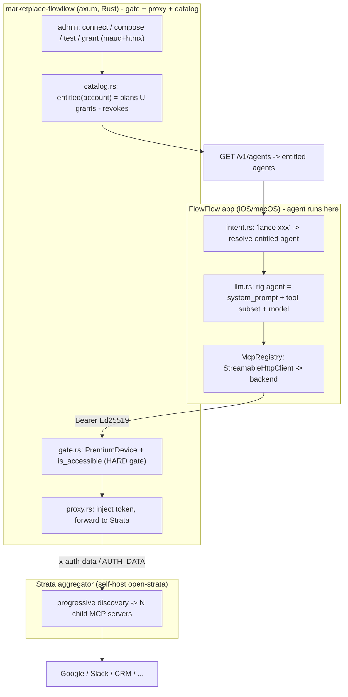
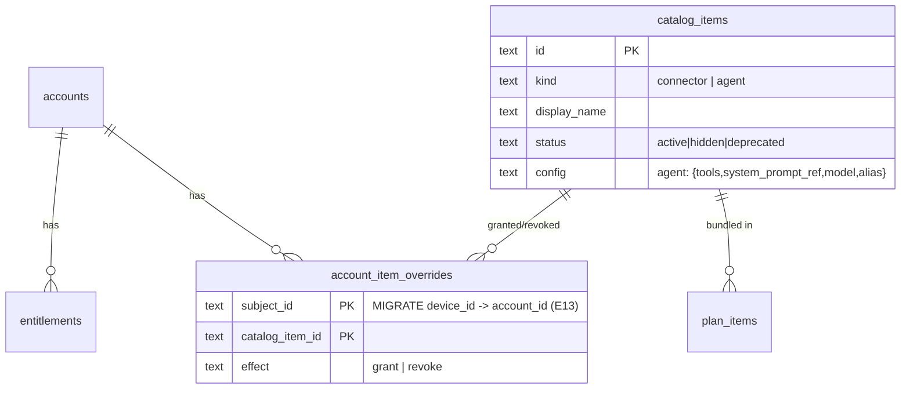
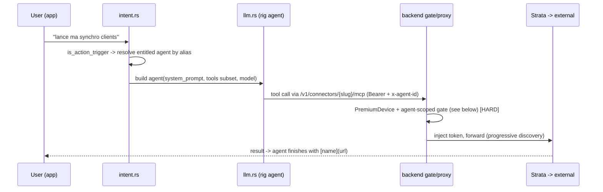
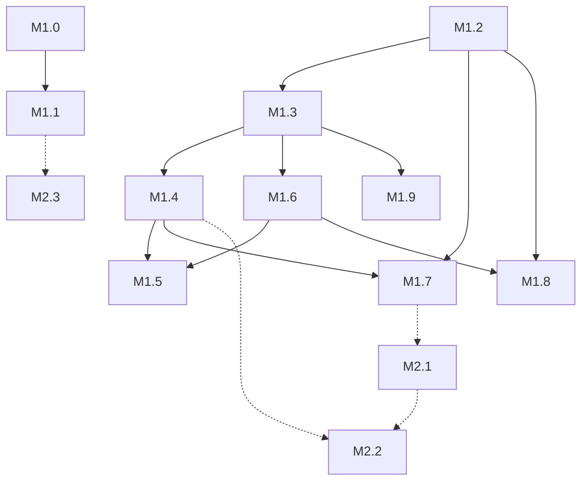

# 0010: FlowFlow Marketplace of Agents

## 1. Summary

FlowFlow needs a way for the owner (admin) to curate AI agents - named, tested,
toggleable rig-core toolsets - and grant them to specific user accounts, which
then activate on-device through "lance xxx" voice/text triggers. The
entitlement layer for this already exists, half-built and dormant, in RFC 0009
§12 (a `catalog_items.kind = 'agent'` dimension, an `account_item_overrides`
grant/revoke table, and an `entitled(account)` resolver); the per-app
`google-sheets` MCP container is the only connector wired.

This RFC promotes that dormant agent layer into the actual product surface and
resolves four forks: (1) swap the single `google-sheets` sidecar for Klavis
Strata as the aggregator - self-hosted `open-strata` first, hosted as a deferred
escape hatch; (2) defer self-serve web user login (the app already authenticates
via Ed25519; users activate agents in-app), ship a device-vouched browser
session and passkey admin login in Phase 2; (3) reuse §12's
`plan_items` + `account_item_overrides` + `entitled()` model as the grant
mechanism, flipping overrides to account-keyed; (4) build the admin
connect/compose/test/grant flow as a Rust `maud + htmx` surface in the backend,
retiring the rejected TanStack premium-toggle console.

Impact: it turns FlowFlow from a notes app with one CRM connector into a
distribution channel for vetted agents, monetizable B2B (admin-granted, no
Apple IAP). Phase 1 ships agent-grant + Strata + on-device activation behind the
existing premium gate; nothing reaches an account before the admin has tested it
working. No PII is introduced; the device cluster stays the root of identity.

## 2. Context / Codebase

Backend repo is `marketplace-flowflow` (100% Rust, axum, sqlx, single SQLite
file, deployed on Dokploy at api.flowflow.be). The on-device app is `flowflow`
(Dioxus, rig-core). The two halves below are the substrate this RFC builds on,
not greenfield.

### Affected modules - backend (`marketplace-flowflow`)

- `src/db.rs`: versioned migration runner (V1-V4). Already defines
  `catalog_items`, `plan_items`, `account_item_overrides` in the V1 baseline
  (db.rs:113-134); seeds one connector row `id='google'` + `plan_items
  ('premium','google')` (db.rs:238-271). `devices.premium` column dropped at V4.
- `src/gate.rs`: `is_premium` (gate.rs:63-80) is the single
  pubkey -> account -> active-entitlement seam; `AdminSession` extractor
  (gate.rs:91-126) = cookie `admin_session` + `x-csrf-token`.
- `src/catalog.rs`: `active_plans` (->`["premium"]` iff premium),
  `entitled_ids` = plan bundles UNION grants EXCEPT revokes,
  `is_accessible(subject, slug, kind)` already filters by `kind` ('connector' |
  'agent'). No agent kind is seeded; `account_item_overrides` has no writer and
  is still device-keyed.
- `src/proxy.rs`: `proxy_to` (proxy.rs:39) is a raw `reqwest` HTTP forwarder
  (NOT an rmcp/rig client). Re-checks `is_accessible`, fetches a fresh Google
  token, POSTs to `http://sheets:5000/mcp` injecting header `x-auth-data` =
  base64-JSON `{access_token}` (proxy.rs:103-118).
- `src/admin.rs`: login (ADMIN_TOKEN -> session cookie + csrf + `admin_audit`),
  grant/revoke entitlement by `account_id` XOR `device_pubkey`. `admin_sessions`
  + CSRF + audit are implemented (RFC 0009 finding #10 partially closed - the
  static token survives only as the bootstrap login secret).
- `src/oauth.rs`: OAuth2 + PKCE broker; tokens envelope-encrypted in
  `connector_tokens` keyed `(device_id, provider)` - per device, not per account.
- `compose.yml`: services `backend`, `admin` (TanStack), `sheets`
  (`ghcr.io/klavis-ai/google-sheets-mcp-server`, internal-only). `admin` + `db`
  on `dokploy-network` + `internal`.

### Affected modules - on-device (`flowflow`)

- `src/services/intent.rs`: zero-LLM trigger heuristics. `is_action_trigger`
  (leading verb in lance/lancer/run/launch/go) routes a message to the action
  path; `is_actionable` gates the per-note "run" button.
- `src/services/rag.rs`: `run_action` (rag.rs:547-564) bypasses RAG retrieval,
  calls `prompt_agent_with_tools(ai, NOTE_ACTION_PROMPT, question, tx)`.
- `src/services/llm.rs`: `prompt_with_agent` (llm.rs:219-280) builds a rig agent
  (OpenAI/Anthropic), registers 3 local notes tools, and
  `.rmcp_tools(reg.tools(), reg.peer())` when a backend MCP registry connects
  non-empty (llm.rs:242, 268). `.max_turns(4)`.
- `src/services/mcp/mod.rs`: `McpRegistry::connect` opens a
  `StreamableHttpClientTransport` to `backend.mcp_url()` (`{base}/v1/mcp`) with
  `auth_header(session)`, `list_tools`, holds the `ServerSink`.
- `src/services/backend/mod.rs`: `BackendClient`; account-cluster methods
  (`invite`/`join`/`account`/`leave`, mod.rs:431-479) already coded; DTOs
  `Account`, `MemberDevice`.
- `src/services/sync/peers.rs`: Noise+PSK pairing; `PairingPayload` is the
  carrier the `join_token` rides on (RFC 0009 §6ter.1).

### Prior art

- **RFC 0008** (Accepted): MCP connectors + backend OAuth broker. Pivoted
  2026-06-19 to a thin Rust premium gate in front of a self-hosted Klavis
  `open-strata` aggregator. Defines Ed25519 device auth, the `/v1/connectors`
  routes, and the `x-auth-data` injection contract.
- **RFC 0009** (Review): accounts (device cluster, max 3, no PII), entitlements
  (premium boolean via `entitlements` rows), admin API, and **§12 catalog** -
  the dormant agent/connector marketplace model this RFC activates. Inherits
  open finding #10 (AdminAuth hardening) and OQ-pivot-1 (account merge).
- There is no RFC 0003; the "note -> action" trigger is the live `intent.rs`
  feature, its backend half belonging to RFC 0008.

### Execution flows touched

- **Grant**: admin -> `account_item_overrides`/`plan_items` -> `entitled(account)`
  -> on-device agent list.
- **Activate**: note/chat "lance xxx" -> `is_action_trigger` -> resolve entitled
  agent -> `prompt_with_agent` -> rig agent (subset of MCP tools via Strata).
- **Tool call (hard gate)**: agent tool -> device Bearer ->
  `/v1/connectors/{slug}/mcp` -> `PremiumDevice` + `is_accessible` -> Strata ->
  child MCP server -> external API.

## 3. Problem & Motivation

**Current state.** FlowFlow is a notes app with exactly one external connector
(Google Sheets) reachable only by premium accounts. "Premium" is a single
boolean: an account either has everything or nothing. The admin surface built in
RFC 0009 Q1.5 (TanStack) does one thing - flip that boolean - and was rejected
by the owner as the wrong product ("personne ne va utiliser ca, meme pas moi").
The agent/catalog model that would make it a real platform exists in §12 but is
dormant: no agent rows, no writer, no on-device consumption.

**Pain.** The owner wants to sell/offer FlowFlow B2B as a curated set of agents
("connect your CRM and say 'lance ma synchro clients'"), including bespoke agents
built for a single client. Today there is no way to (a) compose an agent from
connector tools, (b) test it before exposing it, (c) grant it to one account and
not another, or (d) add a second connector without standing up a new sidecar
container per app. Every one of these is a hard blocker to the actual business.

**Why now.** RFC 0009 just landed the entitlement plumbing and the device-cluster
account; RFC 0008 landed the connector broker. The catalog tables are already on
disk. Klavis shipped Strata (one MCP endpoint aggregating ~100 apps with
progressive tool discovery), which removes the per-app-container tax that made a
multi-connector marketplace impractical. The pieces are finally all present; the
gap is composition, curation, and per-account granting.

**Signals.** Zero agents in the catalog. One connector. One all-or-nothing flag.
A rejected admin console. A standing per-app-container architecture that does not
scale past one or two apps.

## 4. Goals / Non-Goals

### Goals

1. The admin can connect MCP tools through a single aggregator (Strata),
   **compose** an agent (named toolset + system prompt + model), **test** it end
   to end, and only then **grant** it to chosen accounts (curated catalog or
   bespoke-per-client).
2. A granted user activates an agent in the FlowFlow iOS/macOS app via a
   "lance xxx" trigger, with no web login required for v1.
3. Entitlement moves from a premium boolean to "which agents/connectors are
   active for this account", reusing §12's `plan_items` + overrides +
   `entitled()` resolver (account-keyed).
4. Adding a second app is a catalog + Strata-registration change, not a new
   container per app.
5. Hard authorization is enforced at the connector seam (server-side), so the
   on-device agent toggle can be UX-only without becoming a security hole.
6. Nothing is granted before the admin has seen it work (the test gate is a
   product invariant, not a nicety).

### Non-Goals

1. **No payment.** No Apple IAP, no Stripe in v1; access is admin-granted
   (offered free or sold on devis). Confirmed direction (no-IAP B2B).
2. **No open LLM / no user-authored agents.** Users do not compose agents; the
   catalog is curated by the admin only.
3. **No server-side agent execution in the user runtime path.** The user's
   agent runs on-device (§12 Non-Goal); the backend resolves entitlement and
   proxies tool calls only. The one carve-out is the admin **test** run
   (§6.8): there is no user device in an admin test, so the backend hosts a
   rig agent for that admin-only path. This does not touch the user path.
4. **No PII identity system.** No email/password account; the device cluster
   (Ed25519, RFC 0009 §6ter) stays the root of identity. No reintroduction of
   Better Auth / Postgres.
5. **No self-serve web user portal in Phase 1** (deferred to Phase 2).
6. **No account-merge resolution** (OQ-pivot-1 stays open; out of scope here).

## 5. Alternatives Considered

This RFC carries four orthogonal decisions. Each is laid out as competing
alternatives; the chosen option is justified in section 9.

### Decision 1 - Connector aggregation layer

**Status quo (A0): one Klavis container per app.** Today `sheets` =
`google-sheets-mcp-server`. Add Slack => add a `slack` container, a compose
service, a proxy route.
- Pros: already working; full token custody in the backend (envelope-encrypted
  `connector_tokens`, `x-auth-data` injection); zero new dependency.
- Cons: O(apps) containers and routes; the rig agent sees every app's full tool
  list (no progressive discovery); does not scale to a marketplace.
- Cost: linear ops cost per app. Reversibility: high.

**A1 - Strata self-host (`open-strata`).** One Python sidecar aggregates the
child MCP servers (including the existing `ghcr.io/klavis-ai/*` containers);
exposes ~5 progressive-discovery tools (`discover_server_actions`,
`get_action_details`, `execute_action`, ...). Backend proxy retargets from
`sheets:5000` to the Strata endpoint.
- Pros: one MCP endpoint, many apps; small stable tool surface for the rig agent;
  free; token custody can stay in the backend (per-request injection) pending a
  spike; minimal proxy change.
- Cons: open-strata is Python (a non-Rust sidecar - but isolated, like `sheets`
  today); still one container per child app behind the router (the win is the
  endpoint + discovery, not zero containers). **The load-bearing unknown** (not a
  detail): if open-strata only accepts a static `AUTH_DATA` env per child rather
  than forwarding the backend's per-request token, FlowFlow's per-device token
  model (`connector_tokens` keyed per device, refreshed per call) collapses to
  one shared credential behind the sidecar - a multi-tenant isolation break, not
  a cosmetic config choice. M1.0 must verify per-device isolation, not merely
  "auth forwards".
- Cost: one spike + one compose change. Reversibility: high (fall back to A0).

**A2 - Strata hosted (`api.klavis.ai`).** `POST .../strata/create` per user
returns one `strataServerUrl`; Klavis hosts OAuth, stores provider tokens keyed
by `userId`. ~100 integrations, no infra.
- Pros: zero infra; Klavis owns OAuth/refresh; widest integration breadth; clean
  per-user isolation.
- Cons: a third party holds user OAuth tokens (privacy/DPA delta vs today's
  in-house envelope encryption); breaks the RFC 0008 backend OAuth broker;
  paid (~$99/mo Pro for 100 users / 10k calls, third-party figures, confirm);
  needs an `account_id -> userId` mapping.
- Cost: integration + commercial agreement. Reversibility: medium (token custody
  moved out).

### Decision 2 - User identity / web login

**B0 - Defer web user login (app is the account).** Users authenticate via the
existing Ed25519 device session; they see and activate granted agents in-app.
Web stays admin-only.
- Pros: zero new identity surface; no PII; matches §6ter; users get the actual
  value (in-app "lance xxx") immediately.
- Cons: a user cannot self-manage (connect their own OAuth, browse catalog) from
  a browser; the admin must drive grants.

**B1 - Device-vouched browser session (Phase 2).** The app shows a code/QR; the
web binds a browser session to the `account_id` via a short-lived device-signed
token (same shape as `join_token`). No email, no password - the device vouches
for the browser.
- Pros: reconciles with §6ter (device = root of trust, no PII); cleanly replaces
  the raw ADMIN_TOKEN paste with a real credential for the admin too; enables a
  user portal without an account system.
- Cons: more build; a browser session lifecycle to manage; needs the app present
  to bootstrap.

**B2 - Full email/password (or OAuth-social) accounts.** A conventional web
account system.
- Pros: familiar; works without the app.
- Cons: reintroduces PII + the dropped Better Auth/Postgres stack; contradicts
  §6ter and the 100%-Rust pivot; large scope. Rejected.

### Decision 3 - Grant model

**C0 - Keep the premium boolean.** Everything stays all-or-nothing.
- Pros: nothing to build. Cons: cannot grant agent X but not agent Y; cannot do
  bespoke-per-client. Fails the core requirement.

**C1 - Activate §12 (`plan_items` + `account_item_overrides` + `entitled()`),
account-keyed.** `entitled(account)` = plan bundles UNION per-account grants
EXCEPT revokes; agents are `catalog_items` rows of `kind='agent'`.
- Pros: schema already on disk; resolver + `is_accessible(subject, slug, kind)`
  already kind-aware; supports both curated plans and bespoke single-account
  grants; revoke precedence already specified (E14).
- Cons: `account_item_overrides` is device-keyed today - needs the E13
  migration to `account_id`; needs a writer + agent seed; on-device enforcement
  is soft (see Decision implied below).
- Cost: a migration + an admin writer + a resolver endpoint. Reversibility: high.

**C2 - A new bespoke agent-grant table.** Ignore §12, design fresh.
- Pros: clean slate. Cons: duplicates an existing, already-reviewed model;
  throws away §12 design + the E14 precedence work. Rejected as waste.

### Decision 4 - Admin surface

**D0 - Keep the TanStack/shadcn console (Q1.5).** Extend the existing
`admin/` app to compose/test/grant agents.
- Pros: already built + deployed (admin.flowflow.be); rich interactivity for a
  live agent-test console (streaming tool calls).
- Cons: a separate JS app (contradicts the locked 100%-Rust-now pivot); separate
  container + build; the unstyled-assets prod bug; owner distaste for the result.

**D1 - Rust `maud + htmx` admin in the backend.** Server-rendered admin lives in
the axum service; htmx + SSE for the live test console.
- Pros: 100% Rust; one container, one language; no JS build, no CORS, sessions
  first-party natively; aligns with the pivot.
- Cons: weaker for heavily interactive UI than React; the test-console streaming
  is doable (SSE) but more manual; means retiring/replacing the existing
  TanStack admin.

### Implied decision - Agent execution location (carried, not re-opened)

On-device (client-trusted, the current `llm.rs`/`McpRegistry` model) vs
server-side. §12 already fixed this as on-device (Non-Goal: no server-side agent
execution). Kept. Its security consequence (soft on-device gate, hard connector
gate) is the spine of section 6's security model, not a new fork.

## 6. Proposed Design

### 6.1 Architecture overview

The split: **the agent executes on-device**; **authorization is enforced
server-side at the connector seam.** The on-device agent list is a UX
convenience populated from `entitled(account)`; it is never trusted for authz.

### 6.2 An "agent", concretely

An agent is a `catalog_items` row, `kind='agent'`, whose `config` JSON is
`{ tools: [<connector-slug-or-tool-name>...], system_prompt_ref, model, alias? }`
(the §12 agent config shape). At activation the app materializes it into a rig
agent: `prompt_with_agent` builds the agent with `system_prompt_ref`'s text, the
chosen `model`, and only the MCP tools whose slugs are in `tools` (a subset of
`McpRegistry::tools()`), plus the local notes tools. "lance xxx" resolves `xxx`
to an entitled agent by name/`alias`. No new agent runtime - this is config the
existing `llm.rs` path consumes.

`alias` is **required, unique per account, and exact-match** (lowercased,
trimmed). "lance \<alias\>" resolves `alias` against the entitled-agent list;
**no match falls through to the generic `run_action` (`NOTE_ACTION_PROMPT`)**,
never an error and never a different account's agent. This makes resolution
deterministic and keeps OQ2 to the cosmetic question of fuzzy aliasing only.

### 6.3 Modules / files affected

| Layer | File | Change |
|-------|------|--------|
| backend | `compose.yml` | replace/augment `sheets` with a `strata` service; child apps behind it |
| backend | `src/proxy.rs` | retarget `mcp_url` to Strata; keep/verify token injection |
| backend | `src/db.rs` | migrate `account_item_overrides.subject_id` device->account (E13); seed agent rows |
| backend | `src/catalog.rs` | `entitled(account)` for `kind='agent'`; `GET /v1/agents` data |
| backend | `src/admin.rs` | catalog CRUD for agents; per-account override writer; connect/compose/test/grant handlers |
| backend | `src/admin_ui.rs` (new) | maud templates + htmx routes for the admin surface (Decision D1) |
| backend | `src/lib.rs` | register `/v1/agents`, admin agent routes |
| app | `src/services/backend/mod.rs` | `agents(db)` -> `GET /v1/agents` -> `Vec<Agent>` |
| app | `src/services/intent.rs` | resolve "lance \<name\>" to an entitled agent |
| app | `src/services/llm.rs` | build agent from a catalog row (prompt + tool subset + model) |
| app | `src/services/rag.rs` | `run_action` selects the resolved agent, not a fixed prompt |
| app | `src/ui/chat/actions.rs` | offer only entitled agents; show grant state |

### 6.4 Data model (delta)

The catalog tables already exist (db.rs:113-134). The delta:

Migration V5 (forward-only PK rebuild, NOT reversible): rebuild
`account_item_overrides` keyed `(account_id, catalog_item_id)`. Backfill maps
each device-keyed row to `devices.account_id`. Two correctness rules the
migration code must encode, because mapping up to 3 devices onto one account can
collide on the new PK: (1) **collision dedup = revoke-wins** (if any contributing
device row is `effect='revoke'`, the merged row is `revoke`, matching the
`entitled()` revoke-precedence in E14); (2) **rows with NULL `account_id` are
dropped** (an unclustered device has no account to carry the override). Today the
table is empty, so the backfill is a no-op - but the code ships correct for
future data, and the empty state is what makes V5 safe to apply now. Rollback
after cutover is lossy (the device->account collapse cannot be inverted), so V5
is forward-only; the safety net is the empty starting table, not reversibility.
Seed the first agent rows once composed/tested. No change to `accounts`,
`entitlements`, `devices`, `connector_tokens`.

### 6.5 API contracts

| Method | Path | Auth | Purpose |
|--------|------|------|---------|
| GET | `/v1/agents` | device Bearer | the account's active agents, **server-filtered to entitled rows only** |
| POST | `/v1/connectors/{slug}/mcp` | device Bearer + `PremiumDevice` + **agent-scoped** check (§6.6) | **hard-gated** tool proxy via Strata; requires an `x-agent-id` header naming an entitled agent whose `config.tools` contains the called tool |
| GET/POST | `/v1/admin/catalog` | AdminSession + csrf | list/upsert agent + connector items (SSRF allowlist, secrets-as-env-name only) |
| POST | `/v1/admin/entitlements` | AdminSession + csrf | per-account override `{account_id, catalog_item_id, effect}` |
| POST | `/v1/admin/agents/test` | AdminSession + csrf | **server-side** test run (§6.8) of a composed agent against a sample, SSE tool-call stream; must pass before grant |
| POST | `/v1/admin/plan-items` | AdminSession + csrf | bundle agents into a plan |

Breaking-change note: the per-slug `/v1/connectors/{slug}/mcp` supersedes the
fixed `/v1/mcp` alias from RFC 0008; keep the alias for >=1 release (carried from
0008 P-plan). The `x-agent-id` requirement is additive on the new per-slug route;
the legacy `/v1/mcp` alias keeps the old per-connector check for its deprecation
window only.

### 6.6 Activation flow

**The agent-scoped gate (closes the per-connector vs per-agent gap).** A bare
`is_accessible(account, slug, 'connector')` would mean: grant *any* agent that
uses connector `google`, and the account can then call `google` for *any*
purpose, since the seam only sees that the connector is entitled. So the seam
instead resolves the agent edge server-side. On each tool call the device sends
`x-agent-id`; the backend asserts, in one transaction: (1) the account is
entitled to that agent (`is_accessible(account, agent_id, 'agent')`), and (2)
the called tool/connector is in that agent's `config.tools`. The reachable
surface for an account is therefore exactly the union of `config.tools` across
its entitled agents - not "every tool of any entitled connector". A tampered
client can still call any tool an entitled agent legitimately declares (that is
the grant), but cannot reach a connector that no entitled agent exposes.
`x-agent-id` is not a capability secret - it is validated against the account's
entitlements every call, so spoofing it only ever names an agent the account
already holds.

### 6.7 Cross-cutting

- **Auth**: device leg = Ed25519 Bearer session (unchanged). Admin leg =
  `admin_sessions` cookie + csrf (implemented); bootstrap login secret hardened
  in Phase 2 (passkey).
- **Entitlement**: one resolver (`entitled(account)`), reused by `/v1/agents`
  (show) and the connector proxy (enforce). The two must never diverge - same
  function, like RFC 0009's `GET /v1/account` reusing `is_premium`.
- **Compat**: premium boolean still works (an account with the `premium` plan
  gets that plan's bundled items); the new model is strictly additive.
- **Observability**: every admin compose/test/grant appends to `admin_audit`.
- **Flags**: agent rows ship `status='hidden'` until tested, then flip to
  `active` - the test gate is enforced by status, not honor system.

### 6.8 Where the admin test runs (resolving the on-device vs server-side tension)

Goal 6 ("nothing granted untested") needs the admin to actually run the agent,
but an admin test has no user device in the loop. The user path stays on-device
(Non-Goal 3); the **admin test is the single carve-out** and executes
**server-side**: `POST /v1/admin/agents/test` builds a rig agent in the backend
(same `config.tools` -> Strata MCP subset, same `system_prompt_ref`, same
model), runs it once against an admin-supplied sample input, and streams the
tool-call trace back over SSE. This means the backend gains a narrow rig-core
execution path used only by admin-authenticated test calls - never by user
traffic. Provider keys for the test agent come from backend env (the admin's own
keys), not from any user. Flipping `hidden -> active` is allowed only after a
test run returns success; `status` is the enforced gate.

Alternative if a full server-side run is unwanted: define "test" as a
**reachability + dry-discovery** check (connector authorizes, Strata
`discover_server_actions` + a single `get_action_details` succeed for each tool)
rather than a full multi-turn agent run. This avoids a server-side LLM runtime
but tests less. Recommended: the full server-side run (it is what "tested
working" means to the owner); reachability-only is the fallback if the
server-side runtime is judged too heavy. Tracked as OQ7.

### 6.9 Security model

- **Bespoke-agent cross-tenant isolation.** A bespoke agent composed for client A
  carries A's `system_prompt_ref` and tool/host config. `GET /v1/agents` is
  server-filtered to the calling account's entitled rows (never the full
  catalog), so a bespoke row is invisible to any account it was not granted to.
  Bespoke rows are flagged single-account at the catalog level; the admin grant
  UI warns before bundling a bespoke agent into a shared plan. A misgrant is the
  only leak path, and it is an explicit admin action, audited.
- **SSRF.** Agent/connector `config` can name hosts the proxy will dial. Two
  enforcement points, not one: the host allowlist is checked at catalog **write**
  time (reject off-allowlist) AND at proxy **dial** time (the proxy never trusts
  a stored URL blindly). Secrets are stored as env-var NAMES only
  (`^[A-Z][A-Z0-9_]*$`, RFC 0009 E6), never values. The Strata endpoint is a
  fixed internal address, not catalog-driven.
- **Admin auth.** `admin_sessions` cookie + `x-csrf-token` + `admin_audit` are
  live. The residual exposure is the bootstrap login: a static `ADMIN_TOKEN`
  paste survives Phase 1, and this console is now the monetization control plane.
  Phase-1 mitigation (M1.2 hardening): short session TTL, IP-bind the admin
  session, rotate `ADMIN_TOKEN`. Phase-2 (M2.1) replaces the paste with a
  passkey/device-vouched login. Catalog-write (SSRF target injection) must stay
  behind the hardened `AdminSession`, never the raw token.
- **Token handling under Strata.** Self-host (A1) keeps custody in the backend
  (envelope-encrypted `connector_tokens`, `MASTER_KEY` off-DB), injected
  per-request - *conditional on OQ1 / M1.0 confirming per-device isolation*.
  Hosted (A2, deferred) moves provider-token custody to Klavis keyed by
  `userId=account_id`; it must not ship before a DPA + OQ5.

## 7. Drawbacks & Risks

### Drawbacks (inherent)

- A non-Rust sidecar (open-strata, Python) re-enters the stack - isolated like
  `sheets` today, but it is a dependency to run and patch.
- On-device agent execution means the agent *toggle* is client-trusted; security
  rests entirely on the connector seam (acceptable, see mitigation, but it is a
  real constraint - a purely-local agent with no connector tools cannot be hard-
  gated, only hidden).
- Marketplace is broad; Phase 1 deliberately ships without a user web portal,
  which some clients may expect.

### Risks

| Risk | Likelihood | Impact | Mitigation |
|------|-----------|--------|------------|
| open-strata does not forward per-request auth to children (needs static `AUTH_DATA` per child) -> **per-device token isolation lost** (shared credential, multi-tenant break) | Medium | High | **Spike M1.0 first, verifying per-device isolation not just "auth forwards"**; fallback = keep per-app containers behind the backend (per-device injection preserved) and use Strata only for the agent tool-surface, or go hosted (A2) |
| Jailbroken client invokes a non-granted agent / connector | Low | Low (bounded) | Agent-scoped seam (§6.6): every call names an entitled `x-agent-id` and the tool must be in that agent's `config.tools`; reachable surface = union of entitled agents' declared tools = exactly the grant; a connector no entitled agent exposes is unreachable |
| rig-core MCP API drift (0.36 -> 0.38 builder rename: `rmcp_tools` vs `ToolServer`) | Medium | Low | Pin the version; the on-device `McpRegistry` already works on 0.36, upgrade is opt-in |
| Hosted Strata token custody / cost if A2 is later enabled | Low (deferred) | Medium | A2 gated behind M2.3 + a DPA + confirmed pricing; not in Phase 1 |
| Admin grants an untested/broken agent | Low | Medium | `status='hidden'` until `/v1/admin/agents/test` passes; grant UI only lists `active` items |
| `x-auth-data` is FlowFlow-specific, not a Strata contract | Medium | Medium | Verified in M1.0 against the actual child image; the catalog `auth_injection` spec already abstracts the transport |

### Rollout / rollback

- Phase 1 is additive: the `premium` plan keeps working; the `/v1/mcp` alias
  stays. Rollback = stop seeding agent rows + leave overrides empty; the system
  reverts to premium-boolean behavior with no migration reversal needed (V5 is a
  table rebuild, kept reversible by retaining the old shape until cutover).
- Strata is introduced behind the proxy; rollback = retarget `mcp_url` back to
  `sheets:5000`.

### Gating metrics

- One agent composed, tested green, granted to one account, fired via "lance
  xxx" on device, with the connector seam denying the same agent to a
  non-granted account. That single end-to-end path green = Phase 1 done.

## 8. Open Questions

| # | Question | Owner | Deadline |
|---|----------|-------|----------|
| OQ1 | ~~Does open-strata forward the backend's per-request token to children?~~ **RESOLVED by spike M1.0 (2026-06-23): NO.** open-strata freezes child creds at `strata add` time (`servers.json`), reuses them on every call, and never reads inbound request headers (evidence: `mcp_client_manager.py:96-118`, `server.py:92-95`, `tools.py:246-286`; local repro: caller's per-request header never reached the child). Per-device isolation is impossible through Strata's `execute_action`. Consequence: **A1-as-auth-proxy is rejected**; see §9 amended Decision 1. | done | done |
| OQ2 | Cosmetic only (exact-match `alias` is decided, §6.2): do we also want fuzzy/aliased matching for "lance xxx"? | Mirko | post-M1.5 |
| OQ7 | Admin test execution (§6.8): full server-side rig run (carve-out of Non-Goal 3) vs reachability-only dry check? | Mirko | before M1.7 |
| OQ3 | Web user login mechanism (Phase 2): device-vouched code/QR vs passkey-per-account, reconciled with no-PII §6ter? | Mirko | Phase 2 |
| OQ4 | OQ-pivot-1 (account merge when a solo device joins a cluster) - which account holds the agent grants after a merge? | Mirko | before multi-device grants matter |
| OQ5 | Hosted Strata (A2): map `userId = account_id`? privacy/DPA acceptance before any third-party token custody? | Mirko | gates M2.3 |
| OQ6 | Does any agent need server-side execution later (long-running, scheduled), reopening the §12 on-device Non-Goal? | Mirko | post-Phase 1 |

## 9. Recommendation & Rationale

**Recommendation (confidence: high on D2/D3, medium on D1/D4).**

- **Decision 1 -> AMENDED by spike M1.0 (2026-06-23): A1-as-auth-proxy
  REJECTED.** The spike proved open-strata cannot carry a per-request token to a
  child (creds are static-at-registration; inbound headers are never forwarded),
  so routing the credentialed call through Strata would collapse per-device
  isolation into one shared token - a multi-tenant break. **Resolved design:
  split the roles.** (a) The **auth-bearing hop stays on the backend, unchanged**:
  per-app klavis containers behind FlowFlow's proxy, which keeps injecting the
  fresh per-request `x-auth-data` token per call (today's `proxy.rs`, per-device
  isolation intact). (b) **Strata self-host is used ONLY as the agent-facing
  discovery/aggregation layer** (`discover_server_actions` / `get_action_details`
  / `search_documentation`) so the on-device rig agent gets a small stable tool
  surface - it never carries credentials. M1.1 is redesigned to this split; the
  proxy is NOT retargeted to Strata. A2 (hosted, one Strata instance per user =
  native per-tenant isolation) stays the escape hatch behind M2.3 if a single
  managed aggregator is later wanted.
- **Decision 2 -> B0 now, B1 in Phase 2.** The product value (agents firing
  in-app via "lance xxx") needs zero web login; the app already authenticates via
  Ed25519. A web portal matters only when users must self-manage; build the
  device-vouched session (B1) then - it is the only login that fits no-PII §6ter
  and cleanly replaces the ADMIN_TOKEN paste. B2 is rejected (PII + dropped
  stack).
- **Decision 3 -> C1 (activate §12, account-keyed).** The schema, resolver, and
  revoke-precedence are already designed and on disk; the only real work is the
  E13 account-keying migration, a writer, and agent seeds. C2 would throw that
  away.
- **Decision 4 -> D1 (Rust maud + htmx).** Aligns with the locked 100%-Rust
  pivot, collapses to one container/language/session model, and the interactive
  test console is achievable with htmx + SSE. D0 (keep TanStack) is the honest
  runner-up: if the test console proves to need heavy client interactivity, D0
  wins - but the existing TanStack app does premium-toggle only and was rejected,
  so D1 is a rebuild either way.

| Goal | Mechanism |
|------|-----------|
| compose/test/grant agents | admin maud+htmx (D1) over catalog CRUD + `/v1/admin/agents/test` |
| activate in-app via "lance xxx" | `intent.rs` resolve -> `llm.rs` build from catalog row |
| per-account, not all-or-nothing | `entitled(account)` = §12 plans U grants - revokes (C1) |
| one aggregator, not one container per app | Strata self-host (A1) behind the proxy |
| hard authz despite on-device agent | connector seam `PremiumDevice` + `is_accessible` |
| nothing granted untested | `status='hidden'` until `/v1/admin/agents/test` passes |

**Revisit if**: open-strata fails the M1.0 spike (-> A2); a client hard-requires
a self-serve web portal before Phase 2 (-> pull B1 forward); an agent needs
server-side/scheduled execution (-> reopen OQ6 / §12 Non-Goal).

## 10. Implementation Plan

Format matches RFC 0009 §10 (`ID | Title | Where | Depends on | Effort`,
effort XS/S/M/L/XL). Phase 1 = the marketplace core; Phase 2 (dashed) = portals.

### Phase 1 - marketplace core

| ID | Title | Where | Depends on | Effort |
|----|-------|-------|------------|--------|
| M1.0 | Spike: does open-strata forward the backend's **per-request** token to children (per-device isolation preserved) or only static `AUTH_DATA` env? Which header survives Strata->child? Decide injection path (OQ1) | spike only | none | S |
| M1.1 | **(redesigned per M1.0)** Strata sidecar as DISCOVERY layer only - NOT the auth proxy. Backend keeps per-app klavis containers + per-request `x-auth-data` injection (unchanged). Add a read-only adapter exposing Strata's discovery tools to the on-device agent; credentialed `execute` stays on the backend proxy | backend compose.yml, proxy.rs (discovery adapter) | M1.0 done | M |
| M1.2 | Agent catalog: admin `GET/POST /v1/admin/catalog` for `kind='agent'` config `{tools,system_prompt_ref,model,alias}`; SSRF allowlist + secret-as-env-name validation; seed first agent `status='hidden'`; **admin-auth Phase-1 hardening (short TTL, IP-bind, rotate ADMIN_TOKEN)** | backend admin.rs, catalog.rs, gate.rs, db.rs | none | M |
| M1.3 | Migration V5 (forward-only): `account_item_overrides` device->account (E13), **revoke-wins dedup + NULL-account skip**; per-account override writer `POST /v1/admin/entitlements {account_id,catalog_item_id,effect}` | backend db.rs, admin.rs, catalog.rs | M1.2 | M |
| M1.4 | `entitled(account)` for agents + `GET /v1/agents` **server-filtered to entitled rows only** | backend catalog.rs, account.rs, lib.rs | M1.3 | S |
| M1.6 | **Agent-scoped** hard gate (§6.6): `/v1/connectors/{slug}/mcp` requires `x-agent-id`, asserts `is_accessible(account, agent_id, 'agent')` AND tool in that agent's `config.tools`; dial-time host allowlist | backend proxy.rs, gate.rs, catalog.rs | M1.3 | M |
| M1.5 | On-device: fetch `/v1/agents`; build the rig agent from a catalog row (prompt + tool subset + model); send `x-agent-id` per tool call; resolve "lance \<alias\>" (exact-match, no-match -> generic `run_action`) | app backend/mod.rs, llm.rs, intent.rs, rag.rs, ui/chat/actions.rs | M1.4, M1.6 | M |
| M1.7 | Admin connect/compose/test/grant console (maud+htmx, D1): browse Strata apps, compose agent, **server-side test run (§6.8, SSE stream, must pass)**, flip `hidden->active`, grant per account | backend admin_ui.rs, admin.rs, lib.rs | M1.2, M1.4, OQ7 | L |
| M1.8 | Tests: agent catalog CRUD, `entitled` precedence (plan U grant - revoke), V5 dedup/NULL, agent-scoped seam denies a connector outside any entitled agent | backend tests/ | M1.2-M1.6 | S |
| M1.9 | Phase-1 merge guard: block a device joining an account that already holds agent grants until OQ4 reconciliation is defined (else grants double/lose on join) | backend account.rs | M1.3 | S |

### Phase 2 - portals + hardened auth (deferred)

| ID | Title | Where | Depends on | Effort |
|----|-------|-------|------------|--------|
| M2.1 | Hardened admin login: replace raw ADMIN_TOKEN paste with passkey/WebAuthn (or device-vouched session) | backend admin.rs, admin_ui.rs | M1.7 | M |
| M2.2 | User web portal: device-vouched browser session (B1, app shows code/QR -> web binds session to account_id via device-signed token); user views granted agents + connects own OAuth | backend + minimal web | M1.4, M2.1 | L |
| M2.3 | Hosted Strata escape hatch (A2): optional per-user `strataServerUrl` when integration breadth demands it; DPA + pricing gate | backend proxy.rs, oauth.rs | M1.1, OQ5 | M |

### Dependency graph

### Verification plan

- Unit: `entitled(account)` precedence (grant, revoke-wins, plan bundle);
  catalog config validation (reject secret values, off-allowlist hosts).
- Integration: M1.8 end-to-end - grant agent to account A, deny account B;
  connector seam returns 403 for B's tool call.
- Manual (device): the gating-metric path - compose+test+grant on the admin,
  "lance xxx" on the iPhone fires the agent, a non-granted device is refused.

## 11. Review Findings

Adversarial review (skeptical senior engineer, one pass). Each finding below is
either resolved in the design above or converted to a tracked open question.

- **[BLOCKER] per-AGENT entitlement never enforced, only per-CONNECTOR** -
  RESOLVED. The seam was `is_accessible(account, slug, 'connector')`, so granting
  any agent that uses `google` effectively handed the account the bare connector
  for all purposes. Fixed by the **agent-scoped gate** (§6.6): every tool call
  carries `x-agent-id`, the backend asserts the account is entitled to that agent
  AND the tool is in that agent's `config.tools`. Reachable surface = union of
  entitled agents' declared tools. M1.6 rewritten.
- **[BLOCKER] admin test console has no execution venue** - RESOLVED. Agents run
  on-device, but an admin test has no device. Fixed by §6.8: the admin test is an
  explicit **server-side** carve-out (a backend rig agent, admin-auth only),
  Non-Goal 3 reworded to "no server-side execution *in the user path*", OQ7 added
  for the full-run vs reachability-only choice, M1.7 now depends on OQ7.
- **[MAJOR] Phase 1 blocked on the unstated test-venue decision** - RESOLVED via
  the §6.8 decision + OQ7 gating M1.7.
- **[MAJOR] Strata token custody is an architectural fork, not an S spike** -
  RESOLVED. A1 cons, OQ1, and the risk row now state the real failure
  consequence: static-only `AUTH_DATA` collapses per-device isolation into a
  shared credential (multi-tenant break). M1.0 must verify per-device isolation,
  not just "auth forwards".
- **[MAJOR] `x-auth-data` is not a Strata contract** - RESOLVED. M1.0 verifies
  which header survives Strata->child; the catalog `auth_injection` field is the
  per-child source of truth, not a hardcoded header (§6.5, §6.9).
- **[MAJOR] V5 migration reversibility / PK collision / NULL handling** -
  RESOLVED. §6.4 now: forward-only (drops the false reversibility claim),
  revoke-wins dedup on device->account collision, NULL-account rows dropped.
  M1.3 updated.
- **[MAJOR] "lance xxx" resolution undefined** - RESOLVED. §6.2: `alias` is
  required, unique per account, exact-match; no-match falls through to the
  generic `run_action`. OQ2 demoted to cosmetic fuzzy-matching only.
- **[MAJOR] bespoke cross-tenant leak + SSRF under-specified** - RESOLVED. §6.9
  threat model: `/v1/agents` server-filtered to entitled rows, bespoke rows
  single-account flagged, host allowlist enforced at BOTH catalog-write and
  proxy-dial time.
- **[MINOR] ADMIN_TOKEN paste survives all of Phase 1** - PARTIALLY RESOLVED.
  M1.2 adds Phase-1 hardening (short TTL, IP-bind, rotate); the passkey
  replacement stays Phase 2 (M2.1). Documented as the residual control-plane
  exposure (§6.9).
- **[MINOR] jailbreak risk understated** - RESOLVED by the agent-scoped gate; the
  risk row re-scoped to "union of entitled agents' declared tools = exactly the
  grant".
- **[NIT] M1.5 could ship before the hard gate** - RESOLVED. M1.5 now depends on
  M1.6 in the table and the dependency graph.
- **[NIT] account-merge reachable in Phase 1** - RESOLVED. M1.9 added: block a
  device joining an account that holds agent grants until OQ4 defines
  reconciliation.

No BLOCKER remains open. The two architectural unknowns that stay open are
deliberately external (OQ1 Strata per-device isolation, OQ7 test execution
shape) and are both gated before the tasks that depend on them.

## 12. Amendment A - Agent Behavior Contract (2026-06-23)

This amendment is the authoritative delta. Where it conflicts with sections 5-10
above, this section wins. The full, living specification is the **binding
protocol** at `marketplace-flowflow/docs/protocol/` (README index + 8 files); this
section is the decision record, not a copy of it.

### 12.1 Why

Phase 1 backend shipped the thin agent config `{tools, system_prompt_ref, model,
alias}` (section 6.2). A design review with the owner established that this ships
an **uncontrollable** agent: a thin prompt over per-connector tools will create
duplicate sheets, act before reading, overwrite human data, and run destructive
tools. Two adversarial research sweeps (10 lenses: MCP/auth flow, controllable
write-agents, tool scoping, CRM-sync design, rig-core levers, agent-as-program
packaging, trigger/chain orchestration, pre-publish validation, connector-agnostic
engines) plus the owner's own "modules -> chains, n8n driven by natural language"
mental model converged on a single, well-precedented shape.

### 12.2 Decision 5 - the agent is a declarative behavior contract

An agent is a **declarative, signed, versioned behavior contract** (a manifest),
not a thin config. It is enforced in deterministic code **below the LLM** at two
seams, built bottom-up out of validated modules, and distributed like a downloaded
program. Concretely (full detail in the protocol docs):

- **Model** (protocol/01): module (one validated tool action) -> chain
  (deterministic state machine composing modules) -> behavior (one+ chains) ->
  agent (signed versioned manifest) -> package (digest + signature + status).
- **Two layers** (protocol/03, protocol/04): **Governance** = always-enforced
  per-tool policy (allowlist by TOOL not connector, bound_resource, column roles,
  read_before_write, deny_destructive, run limits); **Orchestration** = triggers ->
  chains (FSM). The full orchestration schema ships now, but v1 runs it only inside
  an explicitly user-activated run (the "+" palette / trigger words); autonomous
  background firing is DEFERRED (iOS has no persistent inbound server) and reuses
  the same schema later, so no rework.
- **Enforcement** (protocol/07): device rig `PromptHook` veto (Skip/Terminate;
  already wired as an observer in `ToolStatusHook`, flipped to a gate) AND the
  backend proxy per-tool gate at `/v1/connectors/{slug}/mcp`. The prompt is
  advisory only.
- **Connectors as data** (protocol/05): a connector is a manifest mapping its tools
  to a canonical (resource, action, risk) vocabulary. Adding a connector is data,
  never engine code. Google Sheets is the first one; the contract shape is generic
  from day one. This is the "same rigour everywhere, zero technical debt" requirement.
- **Packaging** (protocol/02): semver + content digest, admin Ed25519 signature,
  pin-not-latest on device, explicit update / rollback / revocation.

### 12.3 What it changes vs sections 5-10

- **Section 6.2** (agent config) is superseded by the manifest schema (protocol/02);
  per-connector `tools` becomes per-TOOL governed entries (protocol/03).
- **M1.5** (on-device activation): builds the rig agent from the pinned manifest and
  attaches the contract `PromptHook`, instead of a thin agent over all tools.
- **M1.6** (agent-scoped gate): extends to per-tool risk classification,
  `bound_resource`, and `tools/list` filtering (protocol/07), not just
  tool-in-config.tools.
- **M1.7** (admin console): becomes the contract authoring + validate/simulate/sign/
  publish surface (protocol/06).
- **OQ7 - RESOLVED.** The validation gate is static contract check + module dry-run +
  chain simulation (a server-side test carve-out, admin-only), not reachability-only.
  Nothing is published until it passes; `status` is the enforced gate (protocol/06).

### 12.4 New milestones (extend section 10, Phase 1)

| ID | Title | Where | Depends on |
|----|-------|-------|------------|
| M1.10 | Sheets connector manifest + canonical (resource, action, risk) mapping | backend | none |
| M1.11 | Governance contract schema + the propose->verify->commit gate | backend + app | M1.10 |
| M1.12 | Contract `PromptHook` on device (Skip/Terminate) + proxy per-tool gate | app + backend | M1.11, M1.6 |
| M1.13 | One validated atomic module end to end ("list my Sheets projects") | app + backend | M1.12 |
| M1.14 | Chain runtime (FSM) + first composed chain (find->read->act->answer) | app | M1.13 |
| M1.15 | Manifest packaging: digest + signature + pin/update/rollback/revoke | backend + app | M1.11 |
| M1.16 | Validate/simulate/sign/publish lifecycle in the admin console | backend | M1.15, M1.7 |
| M1.17 | Orchestration triggers (run-scoped) + the "+" palette + trigger words | app | M1.14, M1.15 |

Build order is bottom-up per protocol/README: a module is trusted only after it
passes in isolation; a chain only after its modules are trusted; an agent is
published only after its chains simulate clean and it is signed.

### 12.5 Status

RFC stays **Accepted**. This amendment is the authoritative delta; the protocol at
`marketplace-flowflow/docs/protocol/` is the living spec and the binding project
rules. Change the spec there; never fork behavior.
