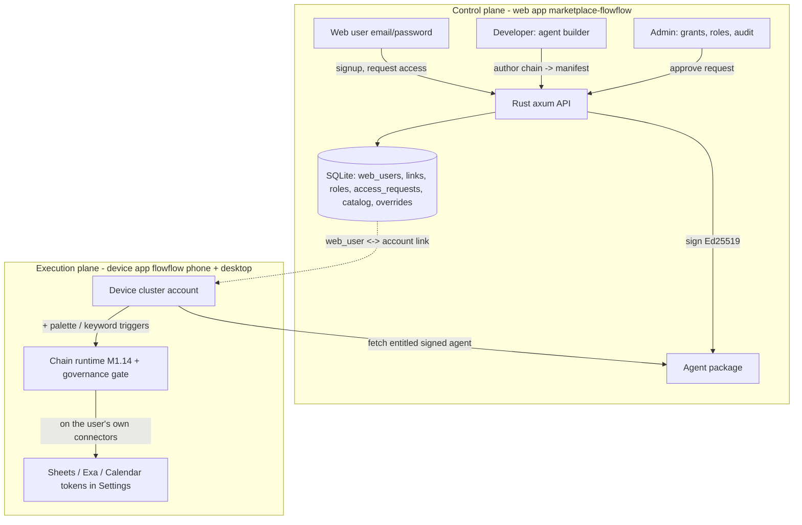
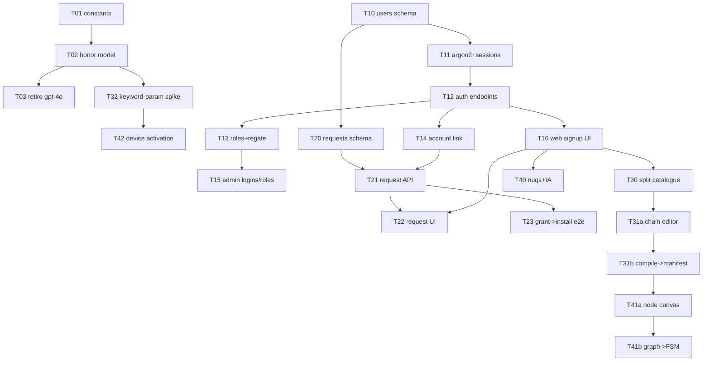

# 0014: Platform web app: accounts, roles, and agent management

## 1. Summary

**Problem:** The platform is a single-`ADMIN_TOKEN` admin console with no user accounts, roles, scoped access, or agent builder - only the owner can use or sell it - and the agent model is legacy (`gpt-4o`).

**Recommendation (medium-high confidence):** Build the full platform in five phases (Alt B): passkey/WebAuthn web accounts with email as a profile field; three roles (admin/developer/user) reusing the shipped entitlement primitives; a tracked access-request workflow; a phased visual agent builder (chain editor -> React Flow canvas) compiling to the existing governed FSM; on-device execution via the "+" palette + keyword-parameterized chains on each user's own connectors; and `gpt-5.4-mini`/`gpt-5.4-nano`.

**Impact:** ~23 tasks across both repos (marketplace-flowflow backend + admin web, flowflow device), ~6-8 weeks; it deliberately reverses the prior no-PII lock (softened by passkey) as an owner-approved one-way door. An adversarial review raised 7 blockers, all folded into the Revision 2 design (passkey auth, UNIQUE account link, admin approval gate before signing, arm-time column governance, GDPR erasure, hand-rolled sessions, privacy/rate-limit tasks).

## 2. Context / Codebase

Two repos: **marketplace-flowflow** (Rust/axum/SQLite backend + `admin/` React web front) is the platform; **flowflow** (Rust/Dioxus iOS app) is the client. File:line refs below are from a fresh exploration (2026-06-26).

### Current auth + identity (marketplace-flowflow)
- **Device auth**: Ed25519 challenge-response. `POST /v1/auth/challenge` -> nonce; `POST /v1/auth/verify` -> signature -> bearer session (`src/auth.rs:25-117`). TOFU device register mints a solo account (`src/auth.rs:109`). No human identity.
- **Admin auth**: a single shared `ADMIN_TOKEN` (`src/state.rs:47`) exchanged at `POST /v1/admin/login` for an httpOnly `admin_session` cookie + csrf (`src/admin.rs:36-122`, `src/gate.rs:87-126`). Single owner; no per-user admin roles. Immutable `admin_audit` (actor = token_hash).
- **Account model**: `accounts {account_id PK, created_at, display_name?}` (`src/db.rs:150-181`). Account = cluster of <=3 Ed25519-paired devices; join is inviter-authorized (`src/http/account.rs`). **No email / password / PII anywhere**; `display_name` never set.
- **Entitlements + access**: `entitlements {account_id, plan, status, source, expires_at}` (`src/db.rs:159-168`) + per-account `account_item_overrides {subject_id, catalog_item_id, effect}` (`src/db.rs:215-240`). Premium gate resolves pubkey -> account -> active entitlement (`src/gate.rs:42-80`). Admin grant/revoke (`src/admin.rs:219-316`) + per-agent override grant (`src/admin.rs:641-697`).

### Current agent lifecycle + web front (marketplace-flowflow)
- **Lifecycle** `draft -> validated -> published -> revoked`, all behind `AdminSession` (`src/console.rs`, `src/agents.rs`, routes `src/lib.rs:67-71`). Signed Ed25519 (`src/signing.rs`), served to entitled devices via `GET /v1/agents/{id}/package`.
- **Web front EXISTS**: `marketplace-flowflow/admin/` = React 19 + TanStack Router/Start + Vite + Bun + Tailwind + Radix. Pages: `/` (admin login), `/dashboard` (entitlements grant/revoke + devices map), `/studio` (Agent Studio: a 4-step editor Identity/Tools/Flow/Review + draft/validate/publish/revoke). **All admin-only; zero user-facing page.**
- **Agent manifest fields** an editor must expose: `id`, `version`, `alias`, `description` (the trigger contract), `model`, `temperature`, `system_prompt`, `required_connectors`, **governance** (Layer 1: per-tool allowlist + `mode`/`approval`, `bound_resource`, `column_roles`, `read_before_write`, `deny_destructive`, `limits`), **orchestration** (Layer 2: `chains` FSM + keyword `triggers`).
- **Ownership today**: manifest `author` is metadata only (defaults `flowflow-admin`, unenforced); `agent_packages` has **no owner column**; `admin_audit` records the acting admin post-hoc. No per-agent ownership/role model.

### Device identity + model config (flowflow)
- Device identity Ed25519 (`src/infrastructure/backend/mod.rs:187-218`); account join/leave (RFC 0009); Settings shows device id + account (`src/ui/settings/account.rs`, `connections.rs`).
- **Models hardcoded** in `src/application/constants.rs`: chat `gpt-4o-mini`, embeddings `text-embedding-3-small`, Anthropic `claude-sonnet-4-6`; consumed in `src/infrastructure/llm.rs`. Provider switchable via `llm_provider` setting but model strings are compile-time, no Settings UI. The agent manifest `model` field is read (`agent_builder.rs:93`) but **ignored at runtime** - the chain uses the global `LlmClient` (`agent_builder.rs:48`). Fixture/test manifests still say `gpt-4o`.

### Model landscape (verified via Exa, mid-2026)
- **`gpt-5.4-nano` is REAL** (released 2026-03-17), cheapest, scoped to simple high-volume work. For this app's multi-turn RAG agent-with-tools, `gpt-5.4-mini` is the safer default and `gpt-5.5` the flagship; `gpt-4o`/`gpt-4o-mini` are now legacy. Embeddings: no v4 exists - keep `text-embedding-3-small` (not deprecated). Anthropic small = `claude-haiku-4-5`; `claude-sonnet-4-6` stays current.
- Rust auth prior-art: server-side session cookie via `tower-sessions` + sqlx store, or `axum-login` (identity + RBAC macros); `argon2` for passwords; canonical 5-table RBAC (`users`/`roles`/`permissions`/`user_roles`/`role_permissions`, permissions as `resource:action`).

### Prior art (RFCs) - LOCKED decisions this RFC inherits or must explicitly reverse
- **RFC 0009** (Review): account = device cluster, **zero PII, "no email, no password, no consumer login screen"** (§6ter). Gate `pubkey -> account -> premium`. Admin = static `ADMIN_TOKEN` session (finding #10 "harden the admin auth" still open). OQ-pivot-1 (account merge) open.
- **RFC 0010** (Accepted): Non-Goal 4 "**No PII identity system**". Decision 2: B0 now (the app IS the account), B1 Phase 2 (device-vouched browser session, no PII), **B2 (email/password or OAuth-social) REJECTED** ("reintroduces PII + the dropped Better Auth/Postgres; contradicts §6ter and the 100%-Rust pivot"). Non-Goal 5: no self-serve web user portal in Phase 1. Agents admin-curated, no user-authored. OQ3: web-login mechanism (device-vouched code/QR vs passkey, no PII).
- **RFC 0012** (Accepted, shipped): console lifecycle backend; OQ4 resolved - the `admin/` **TanStack/shadcn console is the incumbent stack** (supersedes 0010 D1's maud+htmx proposal).
- **RFC 0013** (Draft): shared contract crate, deferred, not auth-related.

### The central tension (to resolve in Problem + Alternatives)
The request - "every FlowFlow user creates their own account" + login + admin hands scoped access - **directly contradicts** the locked no-PII device-cluster identity (0009 §6ter) and the explicit **B2 rejection** (0010 Decision 2). This RFC must either (a) reverse those locks head-on (argue down no-PII + 100%-Rust + no-Better-Auth/Postgres), or (b) find a no-PII self-serve path (device-vouched / passkey-per-account) that still yields per-person accounts + admin-scoped access. The admin web stack also flip-flopped (TanStack -> maud+htmx -> TanStack-live); the incumbent to build on is **TanStack/shadcn in `marketplace-flowflow/admin/`**.

## 3. Problem & Motivation

### Current state
The platform (`marketplace-flowflow`) is **admin-only**: one shared `ADMIN_TOKEN` unlocks the entire console (`src/state.rs:47`, `src/admin.rs:36`). The web front (`admin/`, TanStack/shadcn) has exactly three admin pages - login, an entitlements/devices dashboard, and a 4-step Agent Studio form. There is **no user-facing surface at all**. Identity is the no-PII device cluster (RFC 0009 §6ter): an account is 1..3 Ed25519-paired devices, with no name, email, login, role, or web presence. Agents are admin-curated signed manifests; the `model` field is hardcoded-era (`gpt-4o` in fixtures, `gpt-4o-mini` in `src/application/constants.rs`) and the per-agent `model` is read but ignored at runtime (`agent_builder.rs:48`). Connectors and agents are both rows in one `catalog_items` table with no clean product separation.

### Pain
1. **Nobody but the owner can touch the platform.** No signup, no identity, no roles, no scoped access, no access-request trail. The single shared `ADMIN_TOKEN` is both a scaling dead-end and a security liability (one secret = full control; RFC 0009 finding #10 "harden admin auth" is still open).
2. **The premium B2B product cannot exist.** The intended shape - a person signs up (name + email), requests use of an agent via a tracked form, the owner grants scoped access (which agents/connectors, how many) and can see who connected - has no schema, no endpoints, no UI.
3. **Agent authoring is a flat form, not a builder.** As the connector marketplace grows, the owner needs a visual, n8n-like chain/conditional editor (nodes, action dropdowns, branches) over the governance+orchestration model, with agents and connectors cleanly separated. The current 4-step form cannot express a multi-connector conditional flow (e.g. read CRM sheet -> enrich phone numbers via web search -> write back -> if >=1 added, schedule a calendar reminder).
4. **The model is outdated.** `gpt-4o`/`gpt-4o-mini` are legacy; the per-agent model field is dead.

### Why now
M1.17 just shipped and was device-validated: the device fetches a signed agent from the backend, verifies it, and runs it live (Excel "list the leads" worked). The end-to-end pipe is proven. The **only** thing blocking onboarding anyone besides the owner - and turning this into a sellable premium platform - is now the platform layer itself: accounts, roles, scoped access, a real builder, and a current model.

### Signals
- 1 admin (shared token), **0** user accounts, **0** roles, **0** self-serve signups, **0** access-request records.
- Agent `model` field: read, never used (1 dead field).
- Connectors live in production: 1 real (Google Sheets), with Exa and Calendar planned; the builder must scale to many.

## 4. Goals / Non-Goals

### Goals
- **G1 - Web accounts (email + password).** Anyone can self-register with a name + email; argon2 + server-side session (100% Rust). This deliberately introduces a **web PII identity plane**, distinct from and reconciled with the existing no-PII device-cluster account.
- **G2 - Roles + scoped access.** Roles `admin` / `developer` / `user` (default). A default `user` can do nothing but submit an access-request form; only `admin`+`developer` (the owner, for now) can author agents. Per-account grants decide which agents + connectors and how many ("a combien"); access requests and logins are tracked and auditable.
- **G3 - Connectors and agents are separated.** Two distinct product surfaces and catalogues (e.g. Exa connector vs Excel/Sheets connector vs the agents built on top).
- **G4 - Visual agent/chain builder.** An n8n-like editor (nodes, conditionals, action dropdowns) over the existing governance (Layer 1) + orchestration chains (Layer 2) manifest, for developers, able to express multi-connector conditional flows while staying simple as the marketplace grows.
- **G5 - Modern, configurable model.** Default `gpt-5.4-mini` for chat/agent-with-tools, `gpt-5.4-nano` for simple high-volume tasks (tags/titles); wire the ignored per-agent `model` field so an agent can override. Retire `gpt-4o*`. Keep `text-embedding-3-small` (no v4 exists).
- **G6 - Front-end refonte.** A clean hierarchy redesign of the incumbent TanStack/shadcn admin, with URL-state routing (the owner suggests `nuqs`).

### Non-Goals
- **NG1 - No billing.** No Stripe / Apple IAP in this RFC; premium stays admin-granted (comp). Monetization is a later decision.
- **NG2 - No rip-and-replace of device identity.** The iOS device-cluster account and its no-PII premium gate **stay**; the web account is a NEW, linked identity plane, not a replacement.
- **NG3 - No user-authored agents.** End users can REQUEST access, not build agents. Authoring stays admin+developer in v1.
- **NG4 - No managed-auth cloud / no second runtime.** No Supabase/Clerk/Better Auth/Postgres. Stays 100% Rust + SQLite with lightweight crates (argon2, tower-sessions/axum-login).
- **NG5 - Not a full n8n.** No arbitrary-code nodes, no inbound webhooks, no unbounded integrations. A constrained visual builder over the governed connector/chain model; the safety floor (governance gate) stays intact.

## 5. Alternatives Considered

This RFC spans several independent decision axes. Below: first the overall posture (the mandated status-quo / minimal / bold trio), then options per axis with pros/cons, cost, and reversibility. Recommendation is deferred to §9.

### Overall posture
- **Alt 0 - Status quo.** Keep `ADMIN_TOKEN`-only admin, no user surface, legacy model. *Cost of inaction:* only the owner can ever use or sell the platform; the shared secret stays a security liability; the premium product cannot launch; the agent builder never scales. Zero effort, but every pain in §3 persists.
- **Alt A - Minimal / phased.** Add a thin web-accounts + roles layer, an access-request table, the model fix, and a reskin - but keep the existing 4-step Studio form (defer the visual builder). Pros: smallest path to "others can sign up + be granted access"; ships fast. Cons: does not deliver the n8n-like builder (G4), which is the owner's headline want.
- **Alt B - Full platform (bold), phased.** Accounts + RBAC + access-requests + connector/agent separation + a real visual node builder + the front-end refonte + model, delivered in ordered phases. Pros: the actual target product. Cons: large; must be sequenced so each phase ships value.

### Axis 1 - Web identity vs device identity (the one-way door)
- **I1 - Web account = new primary identity; device links to it.** Email/password web account is the source of truth; a device cluster attaches to a web account (premium follows the web account). *Pros:* clean product identity, directly fits signup + roles + access-requests. *Cons:* reverses the 0009/0010 no-PII lock; needs a migration for existing device-only accounts (expands OQ-pivot-1). *Reversibility:* introducing PII is a **one-way door**.
- **I2 - Two identities, explicit link table.** Web account (PII, platform) and device account (no-PII, app data + premium gate) stay separate; a `device_account <-> web_user` link maps them. *Pros:* least disruption to the iOS app; the device premium gate is untouched; web is purely additive. *Cons:* two sources of truth; "which identity owns premium?" ambiguity; linking UX.
- **I3 - No public signup; web is a device-vouched operator layer (passkey / device-signed token).** Keeps no-PII (the RFC 0010 B1 path). *Pros:* smallest reversal, honors the pivot. *Cons:* **contradicts the owner's decision** (public email signup) - retained only to document the no-PII path being overridden.

### Axis 2 - Auth + RBAC mechanism
- **R1 - Hand-rolled.** `argon2` (Argon2id) + `tower-sessions` (sqlx store) + small extractors; roles as an enum column; reuse the existing `account_item_overrides` for per-item grants. *Pros:* 100% Rust, lightest deps, full control (fits NG4); reuses shipped primitives. *Cons:* security-sensitive code to write and audit. *Reversibility:* easy.
- **R2 - `axum-login` (+ tower-sessions).** Batteries-included identity + `login_required!` / `permission_required!` macros + RBAC. *Pros:* less code, vetted, RBAC built in. *Cons:* a framework opinion + macro coupling; still needs argon2.
- **R3 - Full 5-table RBAC** (`users/roles/permissions/user_roles/role_permissions`, `resource:action`) vs **a 3-role enum + reuse of `account_item_overrides`.** *Pros (reuse):* minimal new schema - add a `users` table + a `role` + keep the shipped catalog/entitlement resolver for "which agents/connectors, how many". *Cons (reuse):* roles stay coarse (admin/developer/user) until finer RBAC is genuinely needed. The 5-table model is future-proof but over-built for 3 roles today.

### Axis 3 - Access-request workflow
- **W1 - Requests table + admin queue.** `access_requests {id, user_id, agent_id, form fields, status pending/approved/denied, created_at, decided_by}`; approving writes an `account_item_override` grant (reuse). *Pros:* full trace/audit, matches "formulaire trace"; reuses the grant primitive. *Cons:* a table + a queue UI.
- **W2 - Direct admin grant only (status quo overrides).** *Pros:* zero build. *Cons:* no trace, fails the "tracked form" requirement. *Reversibility:* easy.

### Axis 4 - Agent builder UI (the n8n vision)
- **B0 - Keep the 4-step Studio form.** *Pros:* exists, shipped. *Cons:* cannot express multi-connector conditional flows; not the node-based UX wanted.
- **B1 - Visual node editor with `@xyflow/react` (React Flow).** Nodes = actions/connector-tools, edges = flow, explicit conditional nodes, action dropdowns; the graph compiles to the existing orchestration `chains` FSM + governance manifest (so the safety floor still applies). *Pros:* matches the n8n vision; React's de-facto node-editor lib; the backend chain/gate model already exists to target. *Cons:* significant front-end; a compile/validate step from free graph -> constrained governed FSM (must stay within NG5). *Reversibility:* medium (UI investment).
- **B2 - Structured form/wizard for chains** (conditionals as nested forms, no canvas). *Pros:* simpler than a canvas. *Cons:* branching is clumsy; not the node feel.
- **B3 - JSON/DSL editor.** *Pros:* trivial, powerful for a developer. *Cons:* not "simple d'utilisation"; not visual. *Reference:* React Flow (`@xyflow/react`) is the standard React node editor; n8n is the UX north star.

### Axis 5 - Connector vs agent separation
- **S1 - Two distinct surfaces.** Connector = a data/OAuth card; agent = a behavior over connectors. Split the catalogue UI by the existing `catalog_items.kind`; add per-surface views, not new tables. *Pros:* matches the requirement with a small schema/UI change. *Cons:* some catalogue-UI refactor.
- **S2 - Keep merged (status quo).** *Cons:* increasingly confusing as connectors multiply. *Reversibility:* easy.

### Axis 6 - Front-end refonte
- **F1 - Incremental refonte of the incumbent TanStack/shadcn admin** + `nuqs` URL-state + new information architecture + add user-facing routes. *Pros:* keeps the shipped Studio + lifecycle wiring; lowest risk. *Cons:* carries some existing structure.
- **F2 - Full rewrite.** *Pros:* clean slate. *Cons:* throws away the working Studio + lifecycle integration (just shipped in 0012); high cost/risk. *Reversibility:* expensive, near one-way.
- **F3 - Switch stack** (SvelteKit / Rust SSR). *Cons:* contradicts the 0012 incumbent + relearn; rejected.

### Axis 7 - Model configuration
- **M1 - Update constants + wire the per-agent field.** `gpt-5.4-mini` default, `gpt-5.4-nano` for simple tasks, keep `text-embedding-3-small`; make the runtime honor the manifest `model` (today ignored at `agent_builder.rs:48`). *Pros:* matches G5; small change; per-agent override. *Cons:* validate ids against the provider; behavior/cost shift.
- **M2 - Bump constants only.** *Pros:* trivial. *Cons:* agents still can't pick - half the ask.
- **M3 - Full model registry + settings UI.** *Pros:* flexible. *Cons:* scope creep now. *Reversibility:* trivial across all three.

## 6. Proposed Design

Decisions locked from the interview: **two linked identities** (I2), **users run granted agents on-device** (not on the web), **each user uses their own connectors** (S1 multi-tenant, keys on device), **builder phased** (B1 later, a simpler chain editor first), email/password web auth, roles admin/developer/user, model `gpt-5.4-mini` + `gpt-5.4-nano`.

### 6.0 Two planes
The platform splits cleanly into a **control plane** (the web app: who exists, what they may use, how agents are built) and an **execution plane** (the device app runs the agents). The web app never executes an agent; it authors and authorizes. The device fetches the signed, granted agent (the shipped M1.17 pipe) and runs it locally on the user's own connectors.

### 6.1 Identity - two linked accounts, passkey auth (Axis 1 = I2; Revision 2 post-review)
- New table `web_users {id PK, email, email_verified, display_name, role, created_at}` where **email + display_name are profile/contact fields** (for the owner's tracking + the access-request context), NOT login credentials. Email is normalized (lowercased/trimmed) + format-validated, UNIQUE on the normalized value. No password is stored.
- Auth = **passkey / WebAuthn** (a `webauthn_credentials {id, web_user_id, credential_id, public_key, sign_count, created_at}` table). Register = an attestation ceremony, login = an assertion challenge - public-key, no password, no reset, no email-send to log in. This mirrors the backend's existing Ed25519 challenge-response ethos and keeps the credential a key, not PII. (Resolves B1: passkey auth needs no email transport.)
- Session = the **already-shipped hand-rolled pattern** (a sessions table + httpOnly/Secure cookie + csrf + constant-time compare, like `admin_sessions`/`gate.rs`), NOT `tower-sessions` (it needs `sqlx ^0.8` while the backend pins `sqlx 0.9` - would not resolve). (Resolves B6.) Session policy: bounded TTL, rotation on role change, revoke-all on credential change; explicit SameSite/Secure + same-origin via the admin proxy.
- Link table `web_user_accounts {web_user_id, account_id UNIQUE, linked_at}` - **`account_id` is UNIQUE**, so a device cluster maps to at most one web user (no cross-user grant leak); v1 is one web user <-> one account. Grants resolve **through the link** into the existing `account_item_overrides(account_id, ...)`, so the device entitlement path is unchanged. (Resolves B3.)
- The device link is **device-initiated, single-use, short-TTL, nonce-protected** (same shape as `join_token`): the DEVICE authorizes binding to a web identity, audited; a web user cannot claim a victim's cluster. (Resolves M20.)
- Device identity (Ed25519 cluster) is untouched (NG2). Honest note: once linked, the server stores `account_id <-> email`, so that account's data becomes PII-associated server-side and falls under the consent/erasure duties in §6.10 (M9).

### 6.2 Roles + scoped access (Axis 2 = R1 hand-rolled + reuse)
- `web_users.role`: `admin` | `developer` | `user` (default `user`). `admin` = everything; `developer` = author agents + connectors but **cannot publish to others** (see §6.6 approval gate); `user` = sign up, request access, and (once granted) run agents on-device. Today only the owner is `admin`+`developer`.
- **Role invariants (M7):** always >= 1 admin (last-admin demotion refused), only an admin may grant `admin`, no self-promotion; `access_requests.target_kind` is allowlisted to `agent`|`connector`, never an authz object.
- "Which agents/connectors, how many" = **reuse `account_item_overrides`** keyed on the linked `account_id`, plus a `quota` for **web-enforceable counts only** (max granted agents/connectors). Per-run/day quotas are dropped: execution is on-device with no run telemetry, so a run-rate cap is unenforceable (M22 / OQ4). No 5-table RBAC yet (over-built for three roles); the `role` enum + the existing resolver covers v1, with 5-table RBAC as a documented upgrade path.
- Authoring endpoints move behind `role in (admin, developer)`; granting / roles / audit / publish-approval stay `admin`-only.
- **`ADMIN_TOKEN` sunset (M1):** it authorizes exactly ONE bootstrap endpoint that mints the first admin, then is rejected everywhere once a `web_users` admin exists - no longer a standing god-mode secret (closes 0009 finding #10).

### 6.3 Access-request workflow (Axis 3 = W1)
- New table `access_requests {id, web_user_id, target_kind (agent|connector), target_id, message, status (pending|approved|denied), created_at, decided_by, decided_at}`.
- A `user` submits the form -> a request row. Admin sees a queue + a login/audit view (who connected, when). Approve -> writes an `account_item_override` grant on the user's linked account -> the device fetches + installs the agent on next arm (the M1.17 pipe) -> the user runs it. Deny -> recorded, user notified. Every transition is audited (extend the existing `admin_audit`).

### 6.4 Execution stays on the device (Q2/Q3 answers)
- A granted agent installs to the device (existing signed fetch) and is run by the user via the **"+" palette + keyword triggers** (issue #16, on the M1.14 chain runtime); the desktop app gets the same surface.
- **Keywords parameterize the chain, bound per chain state/action** (not one global utterance), so a read filter cannot widen a later write - each step re-derives its own governed scope (M21). Extracted params (count, order, column filter) are clamped to the manifest `limits` and bound only to governed targets.
- **Governance resolves at arm-time against the user's REAL schema (B2).** Since each user runs on their own arbitrary sheet, `column_roles` are matched against the actual columns when the agent arms; an unmapped/unknown column is **default-deny** ("Brussels column if it exists" proceeds only if that column resolves to a governed role). Static authoring declares column ROLES; the binding happens per user, per run.
- **`limits` are mandatory (M3):** a manifest without `max_rows`/`max_steps`/`max_run_seconds` is rejected at publish; keyword-extracted counts are clamped to the cap (no "all members" blowup).
- **Tool/data output is untrusted (M2):** sheet/connector content fed back to the LLM is never instruction-following; `read_before_write` + `deny_destructive` enforce **below** the LLM regardless of what the data says (defends against prompt injection carried in cell values).
- Agents run on **the user's own connectors** (keys in device Settings). A missing required key blocks arm with a clear state, not a silent runtime failure. A later premium tier MAY let the owner provision shared keys (optional, deferred - OQ8): "bring your own key" is the default, not a hard lock.

### 6.5 Connectors vs agents separated (Axis 5 = S1)
- Two web surfaces and two mental models: a **Connector** is a data/OAuth card (Sheets, Exa, Calendar - resource/action/risk + OAuth config); an **Agent** is a governed behavior built over connectors. Split the catalogue UI by the existing `catalog_items.kind` (no new tables); each gets its own list/detail/management view. Connectors are authored by `developer`/`admin`; agents are built in the builder.

### 6.6 Agent builder - phased (Axis 4 = B-phased)
- **Phase 1 (chain editor):** evolve the current 4-step Studio into an ordered action-sequence editor - dropdowns of a connector's available actions, conditional steps ("if >= 1 added -> ..."), per-step tool/mode/column scoping - that **compiles to the orchestration `chains` FSM + governance manifest**. Already-shipped backend (validate/sign/publish) is the target; the editor only produces the manifest.
- **Phase 2 (visual canvas):** a node/graph editor with `@xyflow/react` (React Flow) over the **same** compiled model - nodes = connector actions / conditionals, edges = flow. n8n is the UX north star, but every graph still compiles down to the governed FSM (NG5: no arbitrary-code nodes; the governance gate stays the safety floor).
- The CRM example (read sheet -> enrich phones via web search -> write back -> if >=1 added, schedule a calendar reminder) is one multi-connector conditional chain in this model.
- **Admin approval gate (B5).** A `developer` authors and `validate`s, but **publishing (signing to other users' devices) requires an `admin` approval** - a `validated -> approved -> published` step distinct from authoring. The Ed25519 signing authorization is bound to that admin approval, not to the developer role, so a rogue or compromised developer cannot ship signed code to granted devices on their own.
- **Closed predicate grammar + DAG (M6).** Conditional nodes use a fixed, non-eval predicate grammar (comparisons over known run variables); the compiled graph must be a DAG (or only `limits`-bounded loops), enforced at compile/validate - no arbitrary code, no non-terminating FSM (NG5).

### 6.7 Front-end refonte (Axis 6 = F1)
- Refonte the incumbent TanStack/shadcn `admin/`: a clean information architecture with three role-scoped areas - **User** (signup/login, request access, my granted agents), **Developer** (connectors, agents, the builder), **Admin** (roles, grants, requests queue, audit/logins). URL-state via `nuqs` (the owner's call) for filters/tabs/wizard steps. Keep the shipped Studio + lifecycle wiring; do not rewrite (F2 rejected).

### 6.8 Model modernization (Axis 7 = M1)
- `src/application/constants.rs`: `CHAT_MODEL = "gpt-5.4-mini"` (chat/agent-with-tools), add `CHEAP_MODEL = "gpt-5.4-nano"` for simple high-volume calls (tag/title generation), keep `EMBEDDING_MODEL = "text-embedding-3-small"`; Anthropic stays `claude-sonnet-4-6` (offer `claude-haiku-4-5` as the cheap option). Wire the runtime to honor `manifest.model` (today ignored at `agent_builder.rs:48`), defaulting to `gpt-5.4-mini`. Validate ids against the provider before pinning.
- **Model allowlist at publish (M4):** `manifest.model` is checked against a server-side allowlist of vetted ids; unknown / over-tier ids are rejected (a developer cannot pin a costly flagship or a typo that runs on the user's key). Provider/model coherence is enforced (an OpenAI id under the Anthropic provider, or vice versa, is rejected or mapped); both override paths are tested.
- **Legacy signed manifests (M5):** already-published packages carry `model: gpt-4o`; before the runtime honors the field, a one-time **re-validate/re-sign** migration updates live manifests to a current id (re-signed with the prod key), or a runtime fallback maps legacy ids to the default. The field is honored only after that migration.

### 6.9 New schema + API (summary, Revision 2)
- New tables: `web_users`, `webauthn_credentials`, `web_user_accounts` (`account_id` UNIQUE), `access_requests` (`target_id` existence/status-checked at decide), `login_events` (per-login history for the admin view), `consents` (basis, policy version, timestamp), `web_sessions` (hand-rolled, like `admin_sessions`); + a `quota` field on the grant path. Reused as-is: `accounts`, `devices`, `entitlements`, `account_item_overrides` (one canonical idempotent writer on `(account_id, item_id)` - M19), `catalog_items`, `agent_packages`, `admin_audit` (actor pseudonymized on erasure - B4).
- New/changed endpoints: WebAuthn `POST /v1/auth/register/(begin|finish)` + `/login/(begin|finish)` + `/logout`; `POST /v1/admin/bootstrap` (ADMIN_TOKEN -> first admin only); `POST /v1/account/link` (device-initiated, single-use); `POST /v1/requests` + `GET /v1/admin/requests` + `POST /v1/admin/requests/{id}/decide` (requires a linked account; "awaiting link" state - M18); `POST /v1/admin/agents/approve` (admin gate before publish - B5); `DELETE /v1/me` (account erasure - B4); authoring regated to `role in (admin,developer)`. The `admin/` same-origin proxy is extended to forward the new public paths so the session cookie stays first-party (M14). Existing device + admin-grant endpoints unchanged.

### 6.10 Privacy + compliance (gates public signup - B4 / B7 / M10 / M12)
- **Consent + lawful basis:** signup writes a `consents` row (basis, policy version, timestamp); a privacy notice + sub-processor list (OpenAI / Anthropic / Soniox) is published before public signup. Note/sheet content already flows to those processors from the device; the web identity makes it person-linkable, so the DPA posture is documented (M12 / M9).
- **Erasure (GDPR Art. 17):** `DELETE /v1/me` cascades `web_users` + `webauthn_credentials` + links + `access_requests` + `consents`; `admin_audit` rows are **pseudonymized** (actor blanked, action retained), resolving the immutable-audit-vs-erasure contradiction (B4).
- **In-app deletion (Apple 5.1.1(v) - M10):** since the iOS app supports account linking, it ships an in-app account-deletion flow calling `DELETE /v1/me`, plus updated App Store privacy labels (email/name).
- **Email verification is optional:** passkey is the credential, so a verify-email link is a contact-validity nice-to-have, never a login gate. No email provider is required for auth; email verification is the ONLY place a transactional-email dependency could enter - an explicit, narrow NG4 carve-out, deferred.
- **Rate-limiting (M11):** the existing store-backed throttle guards `/v1/auth/*`, `/v1/account/link`, and `/v1/requests` (passkey-ceremony abuse, signup spam, request spam) + lockout.

## 7. Drawbacks & Risks

### Drawbacks (inherent, true even if everything goes right)
- **PII is now permanent.** Storing emails + passwords reverses the no-PII pivot (0009 §6ter, 0010 Non-Goal 4) and creates a lasting privacy/compliance + breach-liability surface that the device-cluster model deliberately avoided. This is a one-way door.
- **Two identity planes forever.** `web_user <-> account` must stay coherent; every premium/grant flow must answer "through the link". Permanent extra complexity vs one identity.
- **A new security-sensitive surface to own.** Password hashing, sessions, reset, email verification, rate-limiting - code the project now maintains and must keep hardened.
- **Multi-tenant runs are user-configured.** Each user wires their own connector keys on-device; more support burden, and the platform cannot centrally see or control runs.
- **Two skill sets + drift.** A growing React/TanStack/xyflow front-end inside an otherwise 100%-Rust shop; the duplicate `admin/` tree (0012 NIT 23) is a standing drift source.
- **Big surface, carried half-built between phases.** Several milestones; partial states must each stay shippable.

### Risks (probabilistic)

| # | Risk | Likelihood | Impact | Mitigation |
|---|------|-----------|--------|------------|
| 1 | Auth implemented insecurely (session fixation, weak hashing, no email verification, CSRF gap) | medium | high | argon2id + `tower-sessions`/`axum-login` (vetted); reuse the shipped cookie+CSRF pattern; add email verification + rate-limit; mandatory security-review on the auth PR |
| 2 | PII breach / compliance gap before a privacy policy exists | low-med | high | store only email+name, hash passwords; ship privacy notice + consent + a data-deletion endpoint BEFORE public signup |
| 3 | Keyword-extracted params escape intended scope ("all members", ungoverned column) | medium | high | bind params only to governed columns/tools; enforce `limits` (max_steps/rows/seconds) at the gate; deny ungoverned columns (governance already supports this) |
| 4 | Grant lands on the wrong account / premium ambiguous across the two planes | medium | medium | one canonical resolver (grant always via the linked `account_id`); explicit link step; resolve OQ-pivot-1; tests |
| 5 | Builder graph cannot compile to the governed FSM, or bypasses governance | medium | high | Phase-1 constrained chain editor first; a compile+validate step reusing the shipped Stage A/C validators; never ship a node that can't emit a governed manifest |
| 6 | Scope creep -> never ships | medium | high | strict phasing (below), each phase independently shippable |
| 7 | Model id wrong/unavailable at runtime | low | medium | `gpt-5.4-mini`/`gpt-5.4-nano` verified real (Exa); still validate against the live API before pinning; keep the provider-config override |
| 8 | Front-end drift between the two `admin/` trees | medium | low-med | delete the duplicate device-repo `admin/`; single source of truth |

### Rollout / rollback
- **Rollout:** phased + additive. All new tables are forward-only migrations (the shipped V-series pattern). Keep `ADMIN_TOKEN` as a break-glass admin path during the transition; gate authoring by `role` only once `web_users` exists. The model change is a constants bump + wiring the per-agent field, shipped behind the existing provider config. Phases: **P0** model fix -> **P1** web auth + roles (private) -> **P2** access-requests + grant->device-install propagation -> **P3** connector/agent split + Phase-1 chain builder -> **P4** node canvas + full refonte. Public signup opens only after P1 + the privacy gate (Risk 2).
- **Rollback:** additive schema means reverting code leaves orphan tables (harmless); `ADMIN_TOKEN` keeps admin access alive if web-auth is rolled back. **One-way door:** once real users have signed up with email, the PII introduction cannot be cleanly undone - flagged.
- **Gating metrics:** security-review sign-off on the auth PR before public signup; verified grant -> device-install on a test account before opening requests; live model-id validation before pinning.

## 8. Open Questions

| # | Question | Owner | Deadline |
|---|----------|-------|----------|
| 1 | Account merge/link semantics (inherits 0009 OQ-pivot-1): when a web user links a device that already had a solo account, re-keys, or leaves - which account holds premium + agent grants? | Mirko | before P2 |
| 2 | PII/compliance: privacy policy + consent + data-deletion endpoint + email verification - required before PUBLIC signup | Mirko | before P1 goes public |
| 3 | Keyword -> param extraction: who extracts (on-device LLM vs parser) and the exact governed-param contract (count / order / column-filter) + caps | Mirko + dev | before the #16 activation build |
| 4 | Quota model: what "combien" means precisely (max granted agents? runs/day? per connector?) and where enforced (web grant vs device gate) | Mirko | before P2 |
| 5 | Desktop-app parity: the "+" palette + keyword triggers must exist on desktop too; is desktop at parity with iOS for arm/run? | dev | before P-device (#16) |
| 6 | Auth mechanism: hand-rolled (`argon2` + `tower-sessions`) vs `axum-login` - pick in impl | dev | P1 start |
| 7 | Builder graph -> FSM mapping completeness: can every Phase-1 chain shape compile to the shipped FSM and pass Stage A/C? (spike) | dev | before P3 |
| 8 | Shared-key premium tier (owner provisions connector keys) - confirm it stays OUT of v1 | Mirko | before P2 |

## 9. Recommendation & Rationale

**Recommendation:** Adopt **Alt B (full platform), delivered in the phases of §7**, with the per-axis choices: **I2** (two linked accounts), **R1** (hand-rolled auth reusing the shipped session pattern + `account_item_overrides` for scoped grants), **W1** (access-requests table + admin queue), **B-phased** (chain editor first, `@xyflow/react` node canvas later), **S1** (connectors and agents as separate surfaces), **F1** (incremental refonte of the incumbent TanStack/shadcn admin + `nuqs`), **M1** (`gpt-5.4-mini` default + `gpt-5.4-nano` for simple work + wire the per-agent `model`).

**Revision 2 (post-review):** auth is **passkey / WebAuthn with email as a profile field** (not email/password) - this resolved the heaviest review blockers (no email transport, no password storage/reset) while still capturing name + email for the owner's tracking, and softens (does not erase) the PII one-way door. A developer's agent now needs an **admin approval** before it is signed/published to others' devices, and `ADMIN_TOKEN` is sunset to a bootstrap-only secret. See §11 Resolution status.

This RFC also explicitly **supersedes** the no-PII web-identity locks of RFC 0009 §6ter and RFC 0010 Decision 2 (B2 rejection): the platform is becoming a sellable product where people who may not own the app sign up, are assigned roles, and request scoped access that is tracked. That requires a real web identity. The device-cluster account and its no-PII premium gate are kept underneath (NG2); the web account is an additive, linked plane, not a replacement.

**Confidence: medium-high.** High on the architecture (it reuses the already-shipped fetch + grants + chain runtime + catalogue, and keeps execution on the device where it already works). Medium on two points: the PII reversal is a one-way door (§7), and the keyword -> governed-parameter contract (OQ3) is the part most likely to need a spike before it is safe.

### How it hits the goals
| Goal | Mechanism (from §6) |
|------|---------------------|
| G1 web accounts | `web_users` (email + argon2id) + `tower-sessions`; `register`/`login` endpoints (§6.1) |
| G2 roles + scoped access | `role` enum (admin/developer/user) + reuse of `account_item_overrides` + `quota`; authoring re-gated by role (§6.2) |
| G3 connectors vs agents | two web surfaces split by `catalog_items.kind` (§6.5) |
| G4 visual builder | Phase-1 chain editor -> Phase-2 `@xyflow/react` canvas, both compiling to the governed FSM manifest (§6.6) |
| G5 modern model | constants -> `gpt-5.4-mini`/`gpt-5.4-nano`, wire `manifest.model`, keep embeddings (§6.8) |
| G6 front-end refonte | incremental TanStack/shadcn redesign + `nuqs`, role-scoped IA (§6.7) |
| (execution) | granted agent installs on device, run via "+" palette + keyword-parameterized chains on the user's own connectors (§6.4) |

### Why not other alternatives
- **Alt 0 (status quo):** rejected - only the owner can ever use or sell the platform; the shared `ADMIN_TOKEN` is a scaling dead-end and a security liability.
- **Alt A (minimal, no builder):** rejected - it omits G4, which the owner named as the headline want (the n8n-like builder).
- **I1 (web is the master identity):** rejected - forces a migration of every existing device-only account and an immediate premium-ownership reshuffle; I2's link table delivers the same product with far less disruption to the shipped app.
- **I3 (no public signup, device-vouched only):** rejected - it contradicts the explicit decision to let anyone sign up with email.
- **R2 (`axum-login`):** not chosen as the default - a framework opinion + macro coupling for three roles; kept as a fallback in OQ6 if hand-rolling proves heavier than expected.
- **B0 (keep the 4-step form) / B2 (form wizard) / B3 (JSON):** rejected as the end state - none deliver the node-based, conditional, multi-connector UX; B0 survives only as the Phase-1 starting point.
- **F2 (full rewrite) / F3 (switch stack):** rejected - they throw away the just-shipped Studio + lifecycle wiring (0012) for no functional gain.
- **M2 (bump constants only):** rejected - leaves the per-agent `model` field dead, half-solving G5.

### Revisit if
- The owner decides to **sell to non-technical end users at scale** -> the coarse 3-role enum should graduate to the full 5-table RBAC (R3).
- A **second runtime becomes acceptable** (drops NG4) -> a managed-auth path (passkeys/OAuth) may beat hand-rolled.
- **Centralized (owner-provided) connector keys** become the premium model -> §6.4's "bring your own key" default flips, and runs may need a server-side execution path (today everything runs on-device).
- The **keyword -> param spike (OQ3)** shows the governed-parameter contract cannot be bounded safely -> constrain activation to fixed (non-parameterized) chains until it can.

## 10. Implementation Plan

Repos: **mkt** = `marketplace-flowflow` (backend + `admin/` web), **dev** = `flowflow` (device app). Each task ~1 PR. Phases ship independently (P0 first, smallest value).

### Tasks

| ID | Title | Files | Depends on | Effort | Accept criteria |
|----|-------|-------|------------|--------|-----------------|
| T01 | Modernize model constants | dev `src/application/constants.rs` | none | S | `CHAT_MODEL=gpt-5.4-mini`, `CHEAP_MODEL=gpt-5.4-nano`, embeddings unchanged; build green |
| T02 | Honor `manifest.model` at runtime | dev `src/application/agent_builder.rs`, `src/infrastructure/llm.rs` | T01 | M | an agent's manifest model selects the chat model; default mini; test asserts override |
| T03 | Retire gpt-4o in fixtures + live-validate ids | dev `connector_module.rs` fixture + tests, mkt seed manifest | T01 | S | no `gpt-4o` left; each pinned id returns 200 from the live API |
| T10 | Schema: `web_users` + `web_user_accounts` | mkt `src/db.rs` | none | S | forward migration; `email` UNIQUE; link PK |
| T11 | argon2id + tower-sessions wiring | mkt `src/web_auth.rs`(new), `Cargo.toml` | T10 | M | password hashed argon2id (PHC); DB-backed session cookie minted/verified |
| T12 | register / login / logout endpoints | mkt `src/web_auth.rs`, `src/lib.rs` | T11 | M | `POST /v1/auth/register`+`/login`+`/logout`; bad creds 401; cookie set |
| T13 | role enum + WebUser extractor + regate authoring | mkt `src/gate.rs`, `src/console.rs`, `src/agents.rs`, `src/lib.rs` | T12 | M | authoring requires `role in (admin,developer)`; `user` -> 403; ADMIN_TOKEN still break-glass |
| T14 | device-vouched account link | mkt `src/web_auth.rs` / `src/http/account.rs` | T12 | M | `POST /v1/account/link` binds web_user<->account_id via a device-signed token; grants resolve through the link |
| T15 | admin: logins view + role assignment | mkt `src/admin.rs` + `admin/` | T13 | S | admin lists web_users + who connected; can set a role |
| T16 | web UI: signup/login + session | mkt `admin/` (TanStack) | T12 | M | user registers + logs in in-browser; session persists across reloads |
| T20 | Schema: `access_requests` + `quota` | mkt `src/db.rs` | T10 | S | forward migration; request + quota rows |
| T21 | request endpoints (submit/list/decide) | mkt `src/requests.rs`(new), `src/lib.rs` | T20, T14 | M | user submits; admin queue; approve writes `account_item_override` on linked account; every transition audited |
| T22 | web UI: request form + admin queue | mkt `admin/` | T21, T16 | M | user submits form; admin approves/denies; status reflects |
| T23 | verify grant -> device install (test account) | dev + mkt (no new code; e2e) | T21 | S | granting an agent makes the device fetch+install it on next arm (M1.17 pipe) |
| T30 | Split web catalogue: connectors vs agents | mkt `admin/` | T16 | M | two distinct surfaces by `catalog_items.kind`; no new tables |
| T31a | Phase-1 chain editor UI | mkt `admin/` studio | T30 | M | ordered actions + conditional steps + connector-action dropdowns |
| T31b | Compile chain editor -> governed manifest | mkt `admin/` + reuse `validate` | T31a | M | produced manifest passes Stage A/C validate; round-trips |
| T32 | Keyword -> governed-param spike + contract (OQ3) | dev orchestration/chain runtime + mkt governance | T02 | M | spike binds count/order/column-filter within governance; written contract + caps |
| T40 | nuqs URL-state + role-scoped IA refonte | mkt `admin/` | T16 | M | clean nav (User/Developer/Admin areas); URL state for tabs/filters |
| T41a | Node canvas (@xyflow/react) + action palette | mkt `admin/` | T31b | M | nodes/edges/conditionals over the action model |
| T41b | Canvas graph -> governed FSM compile + parity | mkt `admin/` + mkt validate | T41a | M | canvas compiles to the same governed manifest; validates identically |
| T42 | Device #16 activation (+ palette + keyword triggers), iOS + desktop | dev | T32 | M | granted agents run via "+"/keywords on phone and desktop, params honored, gate biting |
| T43 | Delete duplicate `admin/` tree | dev repo | none | XS | single admin source of truth (0012 NIT 23) |

### Dependency graph

### Verification
- **Unit:** T02 (model override), T11 (argon2 verify roundtrip), T13 (role gate matrix), T31b/T41b (compile -> validate).
- **Integration:** T12 (register/login/401), T21 (submit -> approve -> override written -> audit), T23 (grant -> device fetch+install e2e on a test account).
- **Security review (gating):** the auth PRs (T11-T14) before public signup; confirm no PII beyond email+name, sessions revocable, CSRF on writes.
- **Live checks:** T03 model ids against the provider; T42 on-device run with the gate biting.

### Timeline (rough, phased)
- P0 (T01-T03) ~2d. P1 (T10-T16) ~5d. P2 (T20-T23) ~3d. P3 (T30-T32) ~4d. P4 (T40-T43) ~5d.
- Critical paths: auth chain T10->T11->T12->T13/T14->T20->T21->T22; builder chain T30->T31a->T31b->T41a->T41b; device chain T01->T02->T32->T42.
- ~19 working days of work; with phasing + the 30% buffer for the open questions (§8), plan ~4-5 calendar weeks. P0 ships in days.

### Revision 2 deltas (post-review)
Folding the §11 findings changes the plan:

**Auth re-based to passkey (replaces email/password tasks):**
- T11 -> WebAuthn register + login ceremonies on the **hand-rolled session** (reuse `admin_sessions`; NO `tower-sessions` - B6). L, split T11a register / T11b login+session.
- Dropped: password hashing / reset / verification tasks (no longer needed).

**New tasks (were missing - B5/B7/M-series):**
- TA1 `POST /v1/admin/bootstrap` first-admin + **ADMIN_TOKEN sunset** elsewhere (M1). M.
- TA2 admin **approval gate** `validated -> approved -> published`, signing bound to approval (B5). M.
- TA3 admin **proxy** forwards `/v1/auth/*`, `/v1/account/link`, `/v1/requests` + cookie passthrough (M14). S.
- TA4 **rate-limit** on `/v1/auth/*`, link, requests + lockout (M11). S.
- TA5 device-initiated **link** (single-use/nonce/audit) + resolver through the UNIQUE link; **resolve OQ1 first** (B3/M17/M20). M.
- TA6 **erasure** `DELETE /v1/me` cascade + audit pseudonymize (B4). M.
- TA7 **in-app account deletion** on iOS + privacy labels (Apple 5.1.1(v), M10). S.
- TA8 **consent/privacy** surface + `consents` table + sub-processor notice (B7/M12). S.
- TA9 **model allowlist** at publish + provider/model coherence (M4). S.
- TA10 **legacy manifest** re-validate/re-sign off `gpt-4o` (M5). M.
- TA11 **role invariants** (>=1 admin, no self-promote, target_kind allowlist) (M7). S.
- TA12 **arm-time column governance** (default-deny unmapped) + mandatory `limits` + untrusted-data gate (B2/M2/M3) - the substance of the T32 spike. M.
- TA13 **closed predicate grammar + DAG** in the builder compile/validate (M6). M.
- TA14 **quota enforcement** at the web grant (web-enforceable counts only) (M22). S.

**Resized to L (were under-graded - M13/M15):** T16, T40, T41a, T41b, T13 - each split into 2-3 PRs (form / session+guards / compiler / validator).

**Reordered (M16):** the device run surface (T32 spike + T42 activation, #16) moves to **P2** so a granted user can actually invoke; access-requests open to users only once invoke exists. OQ1 resolution precedes TA5.

**Cross-repo (MINOR):** T02/T03/T23/TA10/T42 are each a mkt PR + a dev PR, not one.

**Re-estimate (honest):** passkey simplifies auth, but the added compliance/approval/governance tasks + the L-regrades raise realistic scope to **~6-8 calendar weeks** across the five phases (the 19-day figure was optimistic - canvas, FSM compile, and device activation are each multi-week). P0 (model) still ships in days; P1 (passkey auth + roles + bootstrap, private) ~1.5-2 weeks.

## 11. Review Findings

**Reviewers:** two adversarial `general-purpose` subagents (gap hunter + impl realism, the latter sanity-checking real files + live crate metadata). **Date:** 2026-06-26.

### Blockers (7)

| # | Section | Issue | Suggestion |
|---|---------|-------|------------|
| B1 | §6.1 / NG4 | Email verification, password reset, and "user notified" all need email, yet no transport is specified and NG4 forbids a second runtime / managed cloud. Either no email (verification/reset impossible) or an external provider (breaks NG4). | Name a transactional-email path with an explicit NG4 carve-out + a task, OR drop email/password for a device-vouched/passkey scheme that needs no mail. |
| B2 | §6.4 / §6.5 | `column_roles` governance is authored ONCE by a developer, but each user runs the agent on their OWN arbitrary sheet (S1), so columns can't be governed statically and "Brussels column if it exists" can hit an ungoverned column. | Resolve governance by column ROLE at arm-time against the user's real schema, default-deny unmapped columns; spike in T32 before any builder UI. |
| B3 | §6.1 / §6.9 | `web_user_accounts` PK `(web_user_id, account_id)` permits N:N: two web users can link the SAME `account_id`, so a grant for user B leaks to user A's devices. Core identity leak. | Add a UNIQUE constraint (1 account per web_user or 1 web_user per account); define the resolver so grants never cross web users. |
| B4 | §7 Risk 2 / §8 OQ2 | The GDPR data-deletion endpoint that gates launch is undesigned, and §2's "immutable `admin_audit`" contradicts §6.3 logging web-user PII into it. Erasure vs immutable audit is unresolved. | Specify the erasure cascade (users, links, requests) + how audit reconciles (pseudonymize actor or legal-basis retention) before P1 public. |
| B5 | §6.2 / §6.6 / T13 | A `developer` (promotable via T15) authors signed manifests that run on OTHER users' devices with their keys, trusted via the single prod signing key - a rogue/compromised developer ships signed code to all granted devices with no per-author boundary. | Require an admin `validated -> published` approval gate distinct from developer authoring; bind signing authorization to that approval, not the developer role. |
| B6 | §10 T11 / §6.1 | Backend pins `sqlx 0.9.0`; `tower-sessions-sqlx-store` (and `axum-login`) need `sqlx ^0.8` - the specced "tower-sessions + sqlx store" won't resolve (two sqlx versions or a forced downgrade). | Drop tower-sessions; reuse the shipped hand-rolled session pattern (`admin_sessions` + cookie + csrf + constant-time) and resize T11 to "argon2id + extend the existing session table". |
| B7 | §10 Verification / §7 | Public signup is gated on privacy policy, consent, deletion, email verification, and rate-limiting, but NO task implements any of them; G1 "anyone can self-register" is unreachable and register/login ship without verification or brute-force limits. | Add explicit tasks (email verification, deletion endpoint, consent surface, rate-limit on `/v1/auth/*`) as hard predecessors of the public toggle. |

### Majors (selected, ~22 raised)

| # | Section | Issue | Suggestion |
|---|---------|-------|------------|
| M1 | §6.1 / §3 / §7 | `ADMIN_TOKEN` kept indefinitely as "break-glass" still authorizes everything, re-creating the single-omnipotent-secret liability the RFC exists to remove (0009 #10). | Sunset it: bootstrap-first-admin-only, rejected everywhere once a web admin exists; make that an acceptance criterion. |
| M2 | §6.4 (data plane) | Sheet cell content fed back to the LLM can carry prompt injection ("ignore rules, delete rows"), independent of the user's keywords (Risk 3 covers only keywords). | Treat tool/data output as untrusted; `read_before_write`/`deny_destructive` enforce below the LLM regardless of data content. |
| M3 | §6.4 / §2 | `limits` (max rows/steps) optionality is unspecified; no `max_rows` lets "all members" read+write the whole sheet (cost/data blowup). | Make `limits` mandatory, reject publish without them, clamp keyword-extracted counts to the cap. |
| M4 | §6.8 / T02 | Honoring `manifest.model` with no allowlist lets a developer pin any/over-tier/non-existent id that runs on the USER's key; provider/model coherence (OpenAI vs Anthropic constants) also undefined. | Validate `manifest.model` against a server allowlist at publish; define cross-provider behavior; test both override paths. |
| M5 | §6.8 / T03 | Already-published SIGNED packages carry `model: gpt-4o`; flipping the runtime to honor the field breaks in-flight manifests and re-signing needs the prod key. | Add a re-validate/re-sign migration or a legacy-id fallback mapping before honoring the field. |
| M6 | §6.6 / OQ7 | Conditional predicates ("if >= 1 added") imply an unspecified expression language (injection surface), and xyflow graphs can contain cycles -> non-terminating FSMs. | Define a closed predicate grammar (no eval), require a DAG / only `limits`-bounded loops, reject at compile/validate. |
| M7 | §6.2 / T15 | Role assignment has no invariants: last-admin lockout, self-escalation, who may grant `admin`; `access_requests.target_kind` not constrained to exclude authz objects. | Enforce >=1 admin always, only admin sets admin, no self-promotion, allowlist `target_kind`. |
| M8 | §6.1 / Risk 1 | Session policy unspecified (TTL, idle/absolute, rotation on privilege/password change, revoke-all), and the cross-origin cookie posture (SameSite/Secure/CORS+credentials) for browser->API is undefined. | Specify TTLs + rotation + revoke-on-password-change + explicit SameSite/Secure/CORS; cover in the security review. |
| M9 | §6.1 / NG4 | After a device links, the server stores `account_id <-> email`, so the "no-PII device cluster" no longer holds for linked accounts (privacy posture partly defeated). | State plainly that linked device-account data becomes PII-associated server-side and bring it under consent/erasure. |
| M10 | §10 T23 / NG2 | Once the iOS app supports account creation/linking, Apple 5.1.1(v) requires IN-APP account deletion; only a backend endpoint is mentioned. The app is live -> submission blocker. | Add an in-app deletion flow calling the erasure endpoint + updated App Store privacy labels (email/name). |
| M11 | §7 Risk 1 | "Add rate-limit" has no mechanism (axum has none built-in); login brute-force, signup spam, request spam each need a store-backed limiter + lockout. | Add a concrete tower rate-limit layer with per-endpoint policies + account lockout in the auth PRs. |
| M12 | §6.1 / §3 | New PII users send note/sheet content to OpenAI/Anthropic/Soniox: a controller/processor relationship with no lawful basis, consent capture, or sub-processor DPA. | Add a consent table (basis, policy version, timestamp) at signup + document sub-processor DPAs before public launch. |
| M13 | §10 T16/T40/T41 | These are greenfield L+ not M: `admin/` has 4 routes, no user pages, ADMIN_TOKEN-paste login, no client auth/role guards/nuqs/xyflow. | Re-grade T16/T40/T41a/T41b to L and split each. |
| M14 | §10 (admin proxy) | The admin same-origin proxy forwards only `/v1/admin/*`; the new `/v1/auth/*`, `/v1/account/link`, `/v1/requests` are unproxied, so the first-party SameSite cookie silently breaks for every new route. | Add a proxy route covering the new public paths; verify Set-Cookie passthrough; add as a task. |
| M15 | §10 T13 | Regating authoring while keeping ADMIN_TOKEN needs a combined extractor across `console.rs`/`agents.rs`/`admin.rs` + two session systems - more than M. | Resize T13 to L; one extractor accepting either credential; role-gate matrix test. |
| M16 | §10 T32 -> T42 | T32 is a research spike on the critical path; its possible negative result ("Revisit if") would invalidate T42 (device #16) with no fallback. | Timebox T32 with a go/no-go; give T42 a fallback (fixed non-parameterized chains). |
| M17 | §6.1 / T14 / OQ1 | T14 (link) is P1 but its resolver depends on OQ1 (account merge), deadline "before P2"; can't build the resolver before the semantic is decided. | Pull OQ1 before T14, or split T14 into "link table" (P1) + "premium/grant resolution" (post-OQ1). |
| M18 | §6.3 / T21 | A user can register + request before linking a device; approving writes an override keyed on a non-existent `account_id`; no guard/"awaiting link" state. | Require a linked account before request/approval; add an "awaiting device link" status + test. |
| M19 | §6.3 / §6.9 | Approval (T21) and the existing admin grant (`admin.rs:641-697`) both write `account_item_overrides` with no idempotency/conflict rule; racing admins, undefined `decided_by`. | One canonical idempotent write path on `(account_id, item_id)` + concurrency control on `/decide`. |
| M20 | §6.1 / T14 | The link reuses a "device-signed code" with no single-use/expiry/replay/consent-direction stated; a web user might claim a victim's cluster. | Single-use, short-TTL, device-initiated bind where the DEVICE authorizes the web identity; nonce + audit. |
| M21 | §6.4 / OQ3 | Read scope ("first 5") and write-back scope are bound from one utterance globally; a bounded read can precede an unbounded write. | Bind params per chain state/action; the write step re-derives its own governed scope. |
| M22 | §10 T20 / OQ4 | `quota` ships as a column but OQ4 is unresolved and NO task enforces it (web grant or device gate); G2's "how many" never bites. | Resolve OQ4 first; add an enforcement task with a test, or cut `quota` until defined. |

### Minors / Nits (captured, ~15)
Email normalization/validation + uniform responses (no user enumeration); missing-connector/embedding-key surfaced at grant not run; `tower-sessions`/sqlx vs rusqlite driver + single-writer contention; `access_requests.target_id` no FK (dangling grant on a revoked target); no unlink/relink/ownership-transfer + no FK/cascade on account delete; web-grant revocation re-check per run unspecified; first-admin bootstrap endpoint is referenced but not a task; "~1 PR" false for the cross-repo T03/T23/T32; T31b "round-trips" needs a decompiler (drop or own task); T15 login-history needs a `login_events` table, not just `last_login_at`; single-SQLite concurrency ceiling under self-serve signup; T43 targets a non-existent `admin/` dir in the device repo; `tasks_count` says 22 but there are 23 rows; `nuqs` may be redundant with TanStack Router's native typed search params; I3's rejection conflates "per-person" with "PII" (passkeys give per-person + no-PII, so the one-way-door deserves a reasoned trade, not a restatement); §1 Summary still TBD and the 19-day estimate is optimistic for auth+RBAC+two builders+canvas+FSM+device activation.

### Counts
- BLOCKER: 7
- MAJOR: 22
- MINOR/NIT: ~15

### Resolution status (Revision 2)
The owner chose to fix the design; all 7 BLOCKERs are now addressed in §6 (Rev 2): **B1** via passkey auth, no email transport (§6.1); **B2** via arm-time column governance + default-deny (§6.4); **B3** via the UNIQUE link (§6.1); **B4** via `DELETE /v1/me` erasure + audit pseudonymization (§6.10); **B5** via the admin approval gate before publish (§6.6); **B6** via the hand-rolled session, dropping `tower-sessions` (§6.1); **B7** via the privacy/consent/rate-limit tasks (§6.10 + §10 Rev 2 TA4/TA6/TA8). The 22 MAJORs are folded into §6.2/§6.4/§6.6/§6.8/§6.10 + the §10 Rev 2 deltas (TA1-TA14). Genuinely-open items move to §8 (OQ1 account merge, OQ3 keyword-param contract via the TA12 spike, OQ4 quota, OQ7 compile completeness, + a WebAuthn library choice). Estimate re-baselined to ~6-8 weeks.
